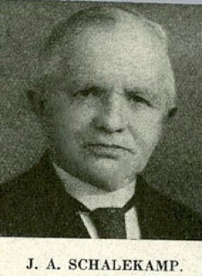

# schalekamp-meisjesschool

> Bron: helenaveenvantoen.nl

### Dominee Schalekamp vertelt over de Meisjesschool.

Een grief voor mij was het onderwijs in Helenaveen.

't Onderwijs op de openbare school was ook geheel op roomsche leest geschoeid. Ook was er een nonnenschool, waar al de meisjes gingen, ook de protestantsche. In de openbare school was geen enkel meisje.

Toen ik in Helenaveen kwam, had ik drie schoolgaande kinderen: een jongen, en twee meisjes.

„Nooit zal ik het toestaan, dat mijn meisjes bij de nonnen ter school gaan," zeide ik op beslisten toon, toen mevrouw v.d. Blocquerij de vrouw van den directeur der Mij „Helenaveen" mij dit verteld had.

„Och mijnheer," was 't antwoord, „doe uw meisjes maar gerust op de openbare school, u zult ze er spoedig genoeg afhalen, en ze bij de nonnen laten gaan."

lk kon dit eerst niet gelooven, maar ik moest het maar al te spoedig ondervinden. 't Was voor die kinderen niet om uit te houden.

lk vond het vreeselijk, vooral toen onze kleine meid, onder de tafel eens een kruisje zat te maken.

Niet minder ook, toen een onzer meisjes eens thuis kwam, en vertelde, dat zij op school ook had moeten lezen:

„Al wie den Paus niet als hoofd der kerk erkennen, zijn ketters en scheurmakers."

lk ging naar den directeur, en beklaagde mij er over. Deze zou er den pastoor eens over spreken, want dit vond hij toch ook wel wat heel erg. De pastoor vertelde later den directeur, dat hij den zusters eens 'n geducht standje daarvoor gegeven had, en 't nu wel niet meer gebeuren zou. Nu, ik vermoed dat dat „standje" wel met 'n glimlach op 't gelaat zal gegeven zijn. Althans, enkele weken later, vertelde hetzelfde dochtertje, aan wie ik gezegd had, als de zuster weer zoo iets wilde laten lezen, zij dan gerust zeggen mocht: „Neen zuster, dat behoef ik niet te lezen," dat haar weer iets dergelijks was voorgelegd om hardop te lezen. Hoe jong ze ook nog maar was, had zij toch al eene afspraak gemaakt met de andere protestantsche meisjes, om dit niet te doen. Toen nu de zuster haar 't boek voorgelegd had, met aanwijzing welk gedeelte zij lezen moest, zei ons meisje: „Neen zuster, dat behoef ik niet te lezen."

De anders bleeke zuster werd 'n oogenblik vuurrood en keek haar nijdig aan, doch zeide meteen:

„Nu, die volgt dan maar!" „Neen zuster," was 't antwoord, „ik ook niet." „Die volgt!" „Ik ook niet zuster."

Jullie schijnt 'n afspraak gemaakt te hebben, nou, voor uit dan maar," en de protestantsche meisjes werden overgeslagen.

JvW
