# scholen

> Bron: helenaveenvantoen.nl

### Het onderwijs in Helenaveen

Het lager onderwijs in Helenaveen kende een moeizame start in 1861

Nadat Jan van de Griendt cum suis in 1853 610 hectare Peelgrond van de gemeente hadden gekocht om daar hun kolonie te stichten, stelde het Deurnese gemeentebestuur zich op het standpunt dat zij dan zelf ook maar het onderwijs moesten regelen. Had Van de Griendt immers niet beloofd dat Deurne nimmer enige last van Helenaveen zou hebben en dat hij in al de behoeften van het gehucht (en hieronder werd ook de verzorging van het onderwijs verstaan) zou voorzien? Met de vervening en ontginning groeide in de loop der jaren ook het aantal gezinnen met kinderen in Helenaveen en werd de roep om onderwijs steeds luider. In 1859 waren er in Helenaveen 11 van steen gebouwde woningen en circa 45 zogenaamde keten of hutten, die slechts met stro of riet omgeven en gedekt waren. In 1859 deed Van de Griendt zelf bij het gemeentebestuur van Deurne een poging om met de gemeente samen in Helenaveen lager onderwijs te verzorgen. Hij stelt zelfs voor om, in ruil voor doortrekking van een kanaal, de kosten voor het onderwijs geheel voor zijn rekening te nemen. Het gemeentebestuur ging daar echter niet op in. Ook de ouders richtten een verzoek aan de gemeente om voor hun kinderen een school te stichten. De gemeenteraad bleef van mening dat Van de Griendt daar voor moest zorgen.

Op 24 november 1860 werd in de raadsvergadering een brief van Gedeputeerde Staten over het lager onderwijs in Helenaveen behandeld. Die instantie drong namelijk aan op de stichting van een school in Helenaveen en schoof de bezwaren terzijde, die de raad daartegen in overweging had gegeven. Een van die bezwaren was dat men alleen een school wilde bouwen op gemeentegrond en dat Van de Griendt niet genegen was om daartoe grond te verkopen. Gedeputeerde Staten eiste dat men onverwijld met de directeur in onderhandeling moest treden en dat de gemeente moest zorgen dat men in dat gehucht niet verstoken bleef van lager onderwijs. Na enige discussie in de raad werd er wederom een brief opgesteld voor de Gedeputeerde Staten. Hierin schreef men dat men wel met de Maatschappij ging praten, maar dat die had gesteld dat de gemeente nooit de lasten van onderwijs zou dragen.

De eerst school van Helenaveen aan de Gelderse straat

Het door de Maatschappij beschikbaar gestelde gebouw was maar een tijdelijke oplossing. Het stond op de hoek van de huidige Geldersestraat en de Jan Deckersstraat. Aan de overzijde van de Geldersestraat was de scheepstimmerwerf.

In de raadsvergadering van 5 januari 1861 werd meegedeeld dat Gedeputeerde Staten van Noord-Brabant de gemeente Deurne verplichtte het aantal lagere scholen van twee (in Deurne en in Liessel) naar drie te verhogen en in Helenaveen een school te stichten ingevolge de wet op het Lager Onderwijs. Voorlopig wilde Van de Griendt daartoe een gebouw in gebruik geven.

De gemeente moest dus wel en plaatste een advertentie in het Algemeen Handelsblad:

HULP-ONDERWIJZERS GEVRAAGD.1°. Een HULP-ONDERWIJZER, in de Openbare School te Deurne, bekend met de beginselen der Fransche Taal. Meerdere Kundigheden zullen tot aanbeveling strekken.2°. Een HULP-ONDERWIJZER, om aan het Hoofd te staan der Openbare School in de Buurtschap Helena-Veen, Gemeente Deurne. Salaris naar bekwaamheden. Informatiën bij het Gemeentebestuur te Deurne, bij Helmond. Brieven franco. (3916).

Hoe minimaal wilde men het hebben; een hulponderwijzer als hoofd der school. Schoolmeester Clement D'Haene uit Den Bosch werd met een jaarsalaris van 225 gulden de eerste onderwijzer in Helenaveen. Hij had wel vrije woning en tuin en een veranderlijk inkomen dat gelijkstond met de zuivere opbrengst van de geheven schoolgelden. Het schoolgeld was per kind 25 cent per maand. Gingen twee kinderen uit één gezin naar school dan werd dat 20 cent en bij drie of meer kinderen 15 cent per kind. Bezocht men tevens de avondschool dan werd het 30 cent per maand.

Gemakkelijk zal het voor hem niet geweest zijn. Toen hij anderhalf na zijn aantreden enkele weken verlof wilde nemen en een jonge collega voor hem zou waarnemen, zag hij daar toch maar van af omdat hij meende dat hij met dergelijke troep onbeschaafde kinderen, waar tegenwoordig mijn school uit bestaat, niet uit zal kunnen!

Op 15 juli 1861 had hij 54 kinderen, 28 jongens en 26 meisjes, in zijn klas. Ter vergelijking, in Liessel had de meester toen maar 26 leerlingen. Vijf van die jongens bezochten in Helenaveen tevens de avondschool en er waren 21 leerlingen die alleen maar de avondschool bezochten.De eerste onderwijzer D'Haene stond twintig jaar voor de klas in Helenaveen. Maar hij kreeg een alcoholprobleem en toen hij in 1881 zo maar enkele weken niet op school verscheen, werd hij in augustus van dat jaar oneervol door het gemeentebestuur ontslagen.

Zijn opvolger per 1 november 1881 werd meester Van de Kerkhoff, die daarvoor in de openbare school van Deurne voor de klas gestaan had. Daar had hij al eens bewezen dat hij de lijftucht niet schuwde en een leerling zodanig hard had aangepakt dat die niet meer op eigen voeten naar huis kon. Voordat hij werd aangenomen moest hij met twee andere kandidaten, W.A. Schreurs uit Sevenum en J.J. Trijbels uit Elsloo, een vergelijkend examen afleggen, waarvoor hij glansrijk slaagde. Dat examen vond plaats in de school in Helenaveen in het bijzijn van burgemeester en wethouders en de districts- en arrondissements-schoolopzieners. Zijn jaarsalaris was 700 gulden met vrije woning en tuin en 1/6 deel de schoolgelden.

Vanaf 1 januari 1888 was Antonius Smeets, komend vanuit Meijel, als hulponderwijzer aan de school verbonden. Hij was in de kost bij gemeenteopzichter Johannes Hermans en later bij de Helenaveense landbouwer Jan Aarts. In oktober 1890 vertrok hij naar Nederweert.

J. van den Man was de opvolger van Smeets.

Johannes Franciscus Wouters was, tot zijn vertrek in 1894 naar de openbare lagere school in Deurne, enige tijd onderwijzer in Helenaveen.

In december 1894 werd Peter Hubert Wuts benoemd als opvolger van Wouters. Op 1 mei 1902 vertrok hij naar zijn geboorteplaats Melick.

Het eerste schoolhuis tevens woonhuis van Meester de Haene achter het timmerhuis van de scheepswerf

Maar er werd door de Maatschappij druk uitgeoefend op de gemeente om in een goed schoolgebouw te voorzien. Op 18 augustus 1862 deelde die mee dat de gemeenteraad niet genegen was op de gronden der Maatschappij Helenaveen te bouwen en dat, in geval men zou moeten gaan bouwen, dan bij preferentie op gemeente-eigendom. De raad wilde weten welke subsidie de Maatschappij van de gemeente zou verlangen als die zelf een schoolgebouw en onderwijzerswoning wilde bouwen. Van de Griendt deed een voorstel voor het stichten van een nieuwe school en onderwijzerswoning dat op 16 oktober 1862 door de raad in overweging werd genomen, maar het was haar als niet aannemelijk voorgekomen.

Er kwamen in het voorjaar van 1863 vanuit de inwoners van Helenaveen klachten bij de gemeente en bij de schoolinspecteur dat het bestaande gebouw van 38 m² te klein en te laag was. Volgens de gemeente was een van de oorzaken daarvan dat D'Haene iedereen op zijn school toeliet, tot wel 58 leerlingen toe, ongeacht leeftijd of woonplaats, immers hoe meer kinderen hoe meer inkomsten. De gemeente vond dat voortaan alleen met een gemeentelijke verordening buitendorpse kinderen mochten worden toegelaten. Volgens de gemeente zouden er dan zo'n 35 kinderen overblijven en volgens schoolmeester konden er 42 leerlingen behoorlijk en ruim worden geplaatst. De gemeente vond dus dat een nieuw schoolgebouw nog niet nodig was en probeerde de Helenaveners af te schepen.

In juli 1863 dienden diverse personen uit Helenaveen bij de provincie een verzoek in om de gemeente op te dragen ten spoedigste een school en een onderwijzerswoning te bouwen. Ze schreven dat de huidige school veel te laag was en nadelig voor de gezondheid van zowel de kinderen als de onderwijzer. De ondertekenaars waren H. Janssens, J. Thomassen, M. Zwanenberg, M. Knapen, L. van der Ven, F. Verheijen, H. Verhoeven, J. Verhees, J. Verheijen, H. Boerkamps, J. Hendriks, L. Bouten, L. van den Bogaard, J. van Gestel, H. Kelderhuis, P. Ketelaars, G. Pijnenburg, H. Houts, C. Kemper, F. Blatter, A. de Laar, H. Kartner en J. Deckers. Het verzoek werd in de raadsvergadering van 4 augustus 1863 afgewezen.

Op 5 augustus 1863 kwam de schoolopziener met een rapport. De school, met een lengte van 7,85 m, een breedte van 4,95 m en een hoogte van 2.60 meter, had acht schrijftafels met aan elke tafel zeven leerlingen waardoor de onderwijzer zich onmogelijk naar behoren kon bewegen. Alleen in de voorgevel op het westen was een deur tussen twee betrekkelijk kleine ramen waardoor luchtverversing onmogelijk was. De schoolopziener schreef: Toen ik het in februari jl. binnentrad walmde mij daaruit eene lucht tegen, die naar mijn bescheiden oordeel niet anders dan zeer nadeelig op de gezondheid van den onderwijzer en der leerlingen kan werken; ik telde daarin toen dan ook niet minder dan 58 kinderen; de lucht echter was er niet meer dan in andere scholen bedorven toen ik deze school den 21 julij jl. bezoekte (sic) en daarin slechts 32 kinderen aantrof. Toch durfde de schoolopziener het gebouw niet af te keuren, te meer omdat zo'n afkeuring het gemeentebestuur, dat voor het Helenaveen niet al grote sympathie schijnt te gevoelen, toch niet op andere gedachten zou brengen. Hij wilde dat het laatste woord daarover gesproken zou worden door de schoolinspecteur. Die keurde alsnog het gebouw af.

In december 1863 trof Provinciale Staten in de Deurnese begroting geen post aan voor de bouw van een nieuwe school in Helenaveen en sprak daarop de gemeente aan. Die vond dat de school in Helenaveen volkomen aan de behoefte voldeed en dat die bij toename van de bevolking wel vergroot moest worden. Toch ging de gemeente overstag. In 1864 kreeg ze een aanbod van de Maatschappij om een bouwterrein voor schoolgebouw en onderwijzerswoning kosteloos af te staan. Ook kreeg de gemeente vrije vaart door de Helenavaart voor de aanvoer van de bouwmaterialen en 20 % van de bouwkosten werden door de Maatschappij bijgedragen. In juni van dat jaar was men al volop bezig met het uitgraven van het moeras voor de bouwplek en was een gedeelte van de stenen aangekocht. Op dat moment ging de gemeente er nog van uit dat de grond door de Maatschappij aan de gemeente geschonken zou worden, maar daarvan was nog niets op papier gezet. Dit blijkt uit een brief van 30 juni 1864 aan de Maatschappij: Onder de voorwaarden, waarop de schenking zal plaats hebben zouden wij gaarne opgenomen zien, dat alle ingezetenen dezer gemeente den vrijen heen- en weergang over de wegen in het Helenaveen zullen hebben, welke wegen zoodanig moeten blijven bestaan of worden aangelegd dat ieder ingezetene van zijne woning de school over die wegen kan bereiken. Het werd overigens geen schenking, de gemeente mocht slechts het vruchtgebruik hebben.

Op 12 augustus 1864 schreef de gemeente aan Gedeputeerde Staten dat het moeras al was afgegraven en men bezig was de bouwplaats, gelegen naar de plek waar de kerk en de pastorie zouden komen, met zand aan te vullen. De verwachting was dat het nieuwe schoolgebouw begin 1865 klaar zou zijn en in gebruik kon worden genomen. Vier dagen later zou de raad zich moeten uitspreken over de "schenking", lees het vruchtgebruik van de grond krijgen, en de bouw. Niet alle raadsleden wilden in eerste instantie instemmen met het plan. Bedacht moet worden dat ook juist in die tijd Deurne grond wilde aankopen van de gemeente Meijel voor het te graven Kanaal van Deurne en de verhouding tussen de gemeente en de Maatschappij mede daardoor zeer gespannen was. Uiteindelijk kwam de school er en kregen de kinderen van de 321 Helenaveners hun onderwijs in een lokaal dat voldeed aan de eisen van die tijd. En de tuin van de schoolmeester werd op kosten van de gemeente aangelegd.

In zomervakantie van 1871 werd door de gemeente zowel de school als het woonhuis van meester D'Haene op diens verzoek aan de buitenkant geverfd.

In 1875 deed de gemeente nog een poging om de grond van de school, de onderwijzerswoning en de openbare begraafplaats te verwerven. De Maatschappij wilde de betreffende gronden wel afstaan, maar slechts zo lang die de bestemming openbare school respectievelijk begraafplaats hadden. Er werd een vruchtgebruikovereenkomst tussen beide partijen gemaakt.

Bij een bezoek van de schoolcommissie uit de gemeenteraad in oktober 1875 aan de school in Helenaveen bleek dat de school onvoldoende ruimte had om haar turf droog te kunnen opbergen. Dat vond de commissie onacceptabel. Een oplossing was gauw gevonden. meester D'Haene maakte een tekening van een te bouwen schuurtje en voor 253,50 gulden naam Schellings de bouw daarvan aan.

Toen Jan van de Griendt in 1876 met het pamflet Wat zal er worden van de Noordbrabant-Limburgsche Peel? een poging ondernam om Helenaveen met Neerkant en Liessel van Deurne af te scheiden kwam uiteraard ook de hele schoolkwestie weer aan bod.

In maart 1881 kreeg de districtsschoolopziener klachten van Helenaveners dat er werkelijk nog al iets op het gedrag en het onderwijs van dien onderwijzer valt aan te merken en daarom de gemeenteraad adviseerde om meester D'Haene een maand te schorsen. Drankmisbruik was daarbij in het spel en blijkbaar was hij onverbeterlijk want in augustus van dat jaar werd hij oneervol ontslagen.

Met het vertrek van D'Haene wilde de Maatschappij het onderwijs in Helenaveen naar een hoger plan trekken en stelde na overleg met de schoolopziener voor om ook wiskunde en tekenen op het lesrooster te zetten. Daarbij hoorde dan ook een verhoging van het jaarsalaris van 700 naar 1000 gulden en de Maatschappij was bereid om die 300 gulden terug te betalen aan de gemeente. De gemeenteraad nam het voorstel niet aan. De school telde toen ongeveer 50 leerlingen.

Met de onderwijswet van 1878 moest op school ook het vak nuttige handwerken voor meisjes op het rooster gezet worden. Voor ieder van de drie openbare scholen in de gemeente werd daartoe bij raadsbesluit van 20 oktober 1881 een bedrag van 150 gulden jaarlijks voor het salaris van de aan te stellen handwerkjuffen uitgetrokken. Later werd dit bij Koninklijk Besluit aangepast tot 60 gulden per jaar. Voor de school in Helenaveen stelden zich de volgende dames kandidaat: M.A. van Heesch, de vrouw van meester Van de Kerkhoff die ook benoemd werd, Johanna van Breda, de vrouw van Martinus van Zon, Geesje van Tol, de dochter van postbode Johannes Jacobus van Tol, Johanna Maria Kohlen, de dochter van Pieter Kohlen en Lamberdina van Maren, de dochter van Gerardus van Maren.

De katholieke meisjesschool en de bewaarschool.

Het kerkbestuur liep in 1883 met plannen rond om een katholieke meisjesschool te stichten. Het zag daarbij als bijkomend voordeel dat dan aan de meisjes van 12 tot 16 jaar in de wintermaanden cursussen in breien, handwerken, naaien en verstukken (het herstellen van kapotte kleding) konden worden gegeven. Dat hield in dat het leerlingenaantal aan de openbare school met ongeveer de helft zou verminderen. Tot dan toe werden leerlingen van buiten de gemeentegrens, met name uit Grashoek, op de openbare school geweigerd. Vanaf 1 januari 1900, toen de nieuwe openbare school in gebruik genomen was, waren zij weer welkom in Helenaveen, uiteraard op voorwaarde dat er ook financieel aan de kosten werd bijgedragen.

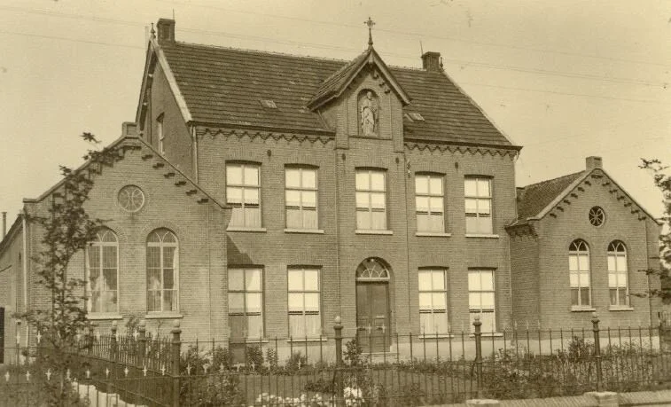

Pp 3 november 1883 openden de zusters Franciscanessen een bewaarschool voor kinderen van beiderlei kunne. Deze school was tevens opengesteld voor niet-katholieken omdat dit een voorwaarde was voor een jaarlijkse gemeentesubsidie van 175 gulden. Toen in 1887 ook de katholieke meisjesschool in Helenaveen van start ging, kostte dat de openbare school meteen 47 leerlingen. Blijkbaar deerde het de openbare school weinig want door de aanwas van de Helenaveense jeugd moest in dat jaar ook een hulponderwijzer voor de openbare school worden aangetrokken. Overigens gingen ook niet-katholieke meisjes naar deze school, zelfs de dochters van Dominee Schalekamp. (Lees hier zijn verhaal)

De Openbare School 1899

Vanaf 1885 kwam bouw van de school in Helenaveen in beeld. In mei 1886 werden de kosten daarvoor geraamd op circa 500 gulden. In 1887 werd zowel de school als de onderwijzerswoning verbouwd. Het werk werd aangenomen door P. van de Mortel voor 2.250 gulden. Rond de eeuwwisseling kwam er een nieuwe openbare school in Helenaveen, gebouwd door de aannemers H. Moerenberg en J. Smulders uit Oisterwijk voor 8.900 gulden. Op 9 september 1899 legde burgemeester Klaas Laan de eerste steen. Met de komst van de nieuwe school bleef de oude school toch nog enige tijd in gebruik en wel als repetitielokaal voor zangvereniging Wilhelmina.

In juli 1898 werd het onderwijs tijdelijk gestaakt omdat mazelen was geconstateerd bij de kinderen van Van de Kerkhoff, bij wie ook de hulponderwijzer inwoonde.

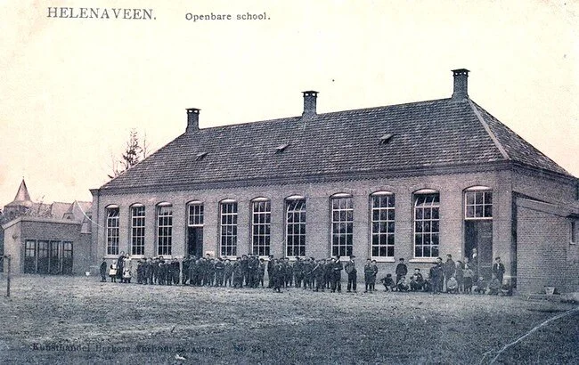

De school in het dorp (nu Gemeenschapshuis de Gouden Helm)

De school deed van 1899 tot 1914 dienst als openbare lagere school. Na de verhuizing van de leerlingen naar de nieuwe school aan de overkant van de weg deed het gebouw dienst als parochiehuis. Na de tweede wereldoorlog werd het ingericht als noodkerk. In 1968 werd ‘de oude school’ afgebroken en vervangen door gemeenschapshuis de Gouden Helm

De Nieuwe Openbare school 1915

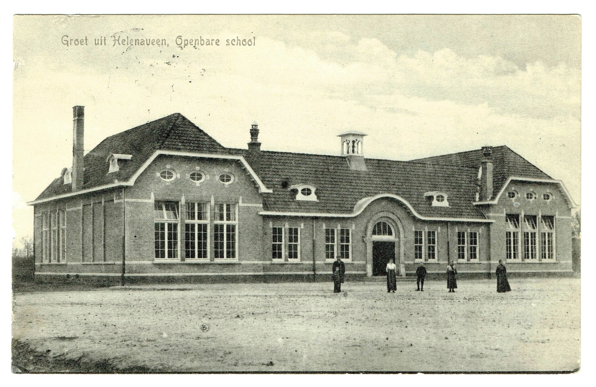

De nieuwe openbare school

De in 1914-1915 gebouwde nieuwe school werd ontworpen door de Deurnese architect Cor Roffelsen.

Op 16 februari 1922 werd Van de Kerkhoff opgevolgd door meester Theelen.

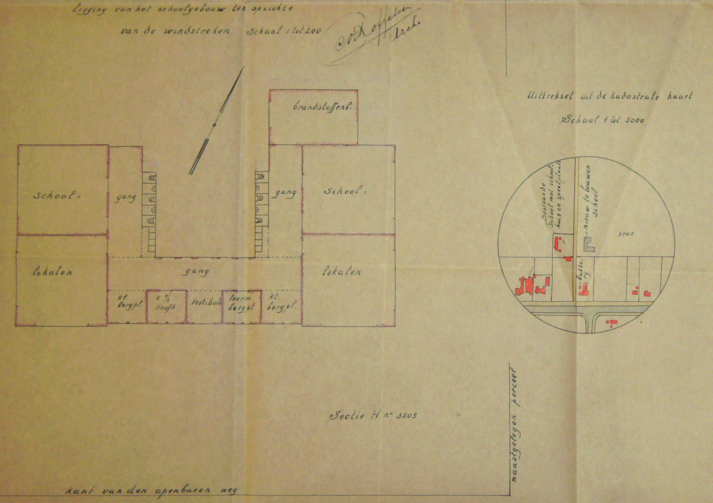

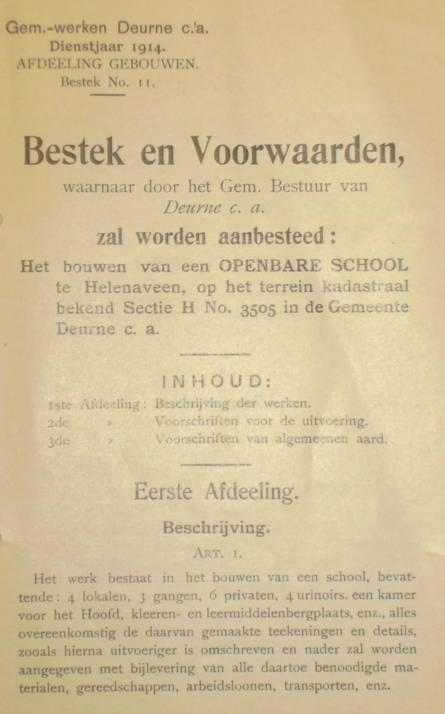

De Katholieke meisjes school 1945 in Mariaveen

De Katholieke meisjesschool bij het klooster werd bij de bevrijding verwoest en moest verhuizen naar Mariaveen.

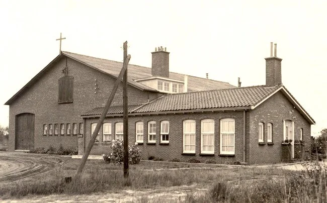

De Katholieke meisjesschool en de kleuterschool in Mariaveen

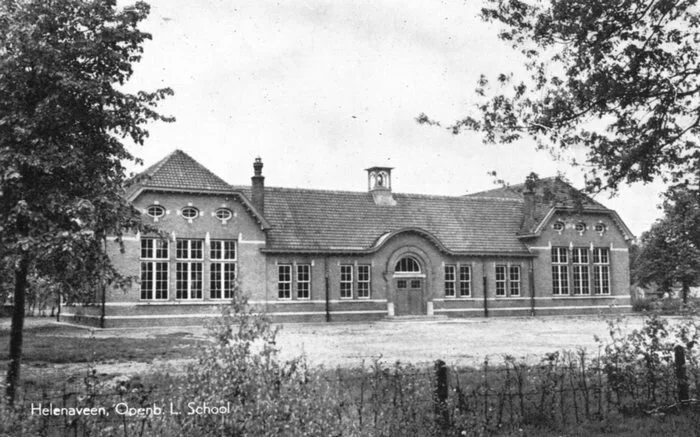

De openbare school na de oorlog.

Tot na de oorlog had helenaveen dus een katholieke meisjesschool naast de openbare school.

Deze toestand hield op toen de Katholieke school een gemengde school werd voor katholieke jongens en meisjes..Deze gemengde katholieke school trok in de ‘nieuwe school’ met drie lokalen. De meisjesschool in Mariaveen werd verlatenEén lokaal (links voor) en de ruimte links naast de deur bleef in gebruik als openbare school (nu in de volksmond ook wel Protestantse school genoemd). Na het overlijden van meester Theelen werd de heer Voskuyl benoemd als hoofd van de openbare school. Deze werd opgevolgd door Meester van der Made. Van der Made gaf les aan de hoogste vier klassen. Engelina Geris-van Woezik had de eerste twee klassen onder haar hoede.

De openbare school was eigenlijk maar net groot genoeg voor twee leerkrachten, daarom werden uit Neerkant drie jongens geronseld om in Helenaveen naar school te gaan (Harrie Geris, Gerard Trines en Henk Naus). Op die manier kon de uit de Neerkant afkomstige juffrouw Geris haar baan behouden.

De Katholieke gemengde school stond onder leiding van Zr Genesia.

In 1961 werd er een nieuwe openbare school gebouwd naast de Protestantse kerk.

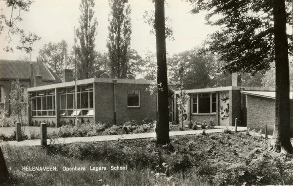

De Openbare lagere school Zonnedauw aan de Soemeersingel in Helenaveen bestond onder die naam van 1970 tot aan het einde van het openbare lager onderwijs in Helenaveen in 1982. De school werd gebouwd omdat er niet meer genoeg ruimte was in de ‘nieuwe school’, die dus vanaf vanaf 1970 “helemaal Katholiek” was. Een aantal protestantse families wilde per sé het openbaar onderwijs behouden voor Helenaveen en heeft zo afgedwongen dat de Zonnedauw gebouwd werd. Uiteindelijk werd het aantal leerlingen te klein en is de openbare school alsnog verdwenen.

Het plastiek op de school werd gemaakt door de Deurnese kunstenaar Frans Jacobs, een kunstenaar die lang in Deurne gewerkt/gewoond heeft. Veel van zijn keramische werk - en dit dus ook - heeft hij uitgevoerd in Delft bij de Porceleyne Fles.

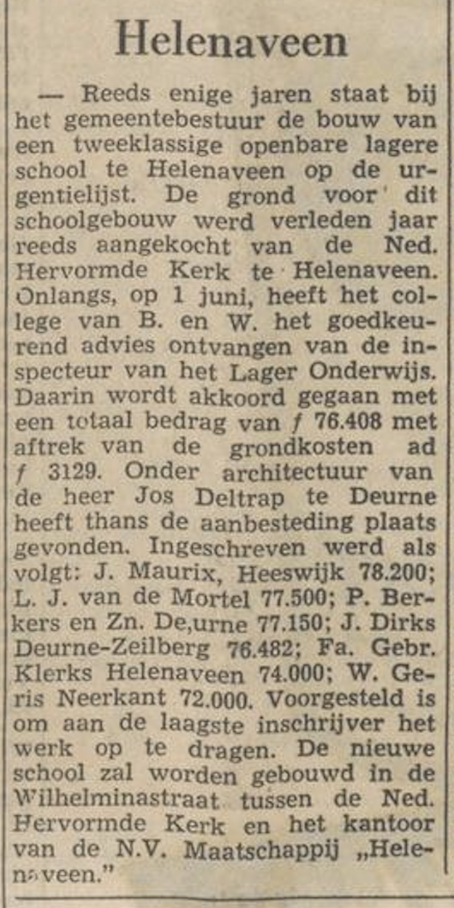

Dagblad voor Noord-Limburg. 22-06-1960

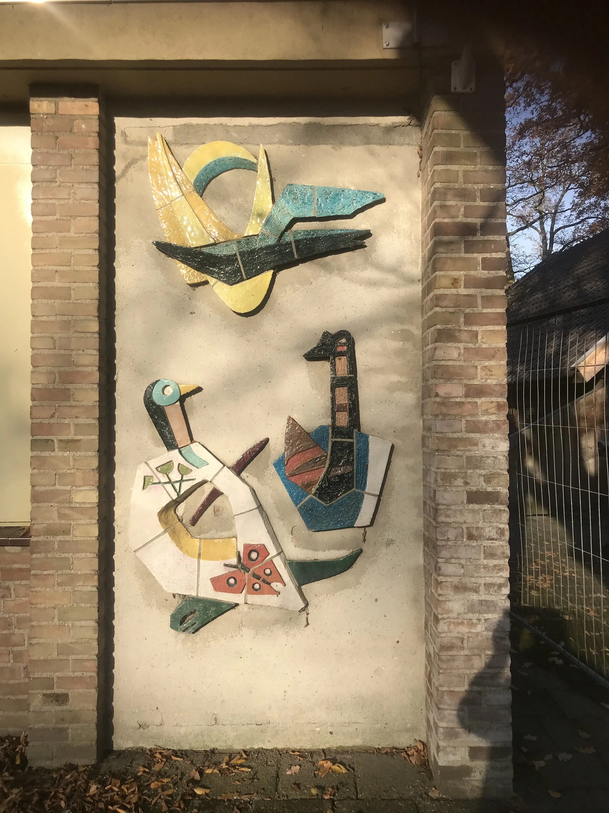

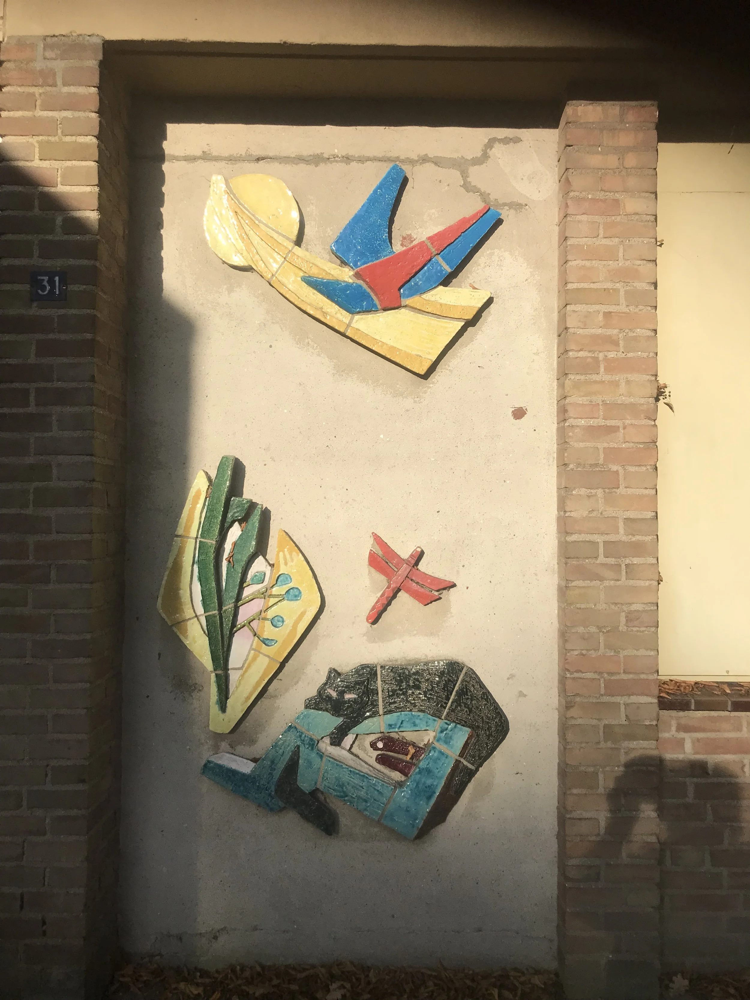

De bewaarschool na de oorlog

De oude school bleef nog lang in gebruik als noodkerk en later parochiehuis. Maar het gebouw herbergde ook de bewaarschool tot er een nieuwe kleuterschool gebouwd werd. Op de kleuterschool zaten katholieke jongens en meisjes bij elkaar.

Het parochiehuis (de oude school) met daarin de bewaarschool

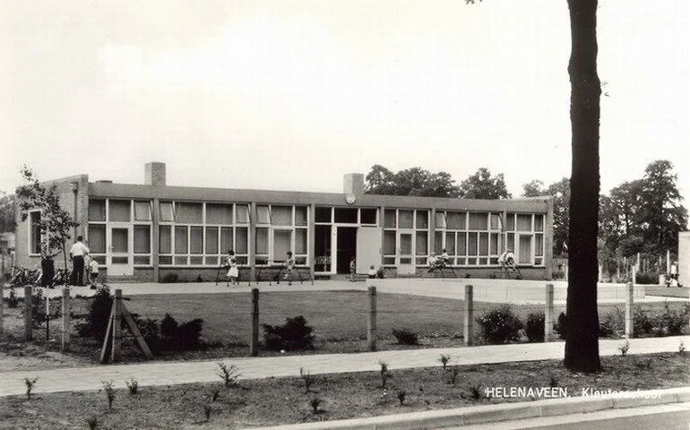

De nieuwe kleuterschool naast de school

In 1982 werd de openbare school opgeheven en gingen de protestanten naar de katholieke school.

Nog weer later is de oude brandweerkazerne bij de school getrokken en kon ook de kleuterschool in de school trekken, De fraaie Kleuterschool werd weer afgebroken.

Vanaf toen heette de School van Helenaveen: Basisschool de Peelparel.

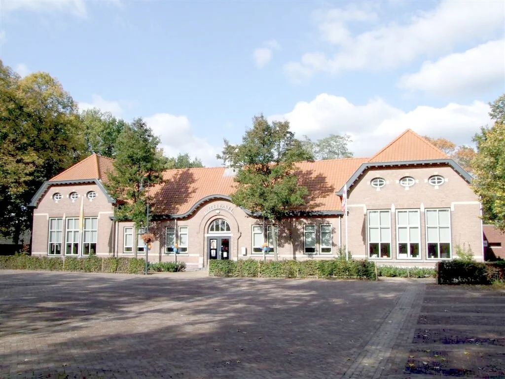

Basisschool De Peelparel

De Protestanse zondagsschool (1905)

De zondagsschool rechts van de kerk was bedoeld voor het Protestantse godsdienstonderwijs. Ze werd gebouwd in 1905 voor 2000 gulden. Hiervan was 1800 gulden subsidie van de Gemeente Deurne. De subsidie werd verleend op voorwaarde dat de school gebouwd zou worden door Deurnese vaklieden.

De Zondagsschool is gebouwd op aandringen van godsdienstleraar Schalekamp, die het tot dan moest doen met een lokaal van 3 bij 4 meter, waarschijnlijk in het gebouwtje achter de pastorie. Hij heeft het gereedkomen niet mogen meemaken. omdat hij plaats moest maken voor een ‘echte dominee’: Broer de Jong

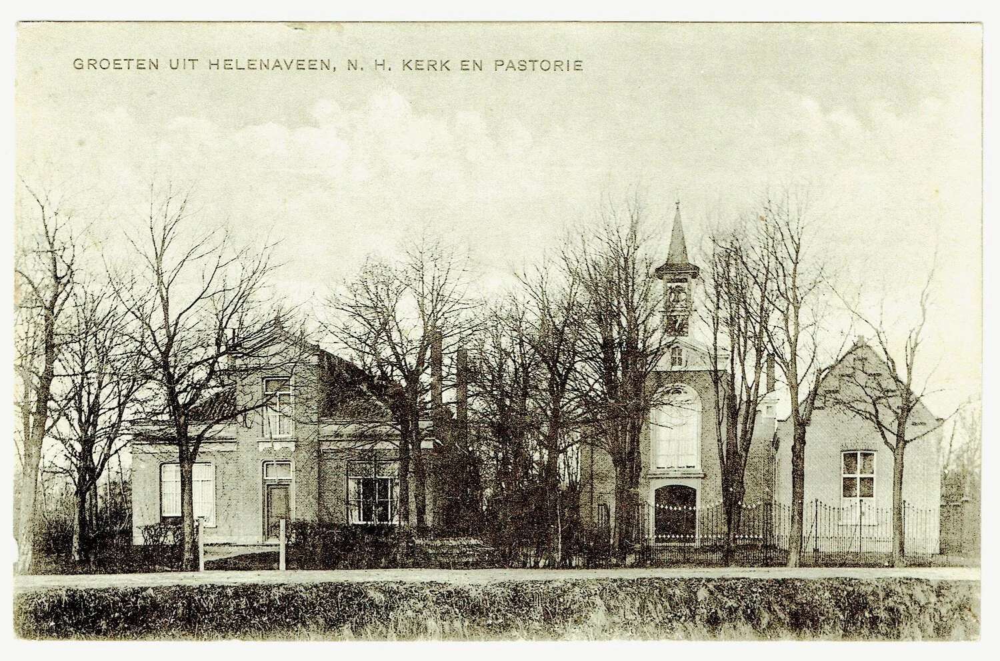

Helemaal rechts de zondagschool (ook wel: Jeugdgebouw)

jvw dec2022Bron: Deurne Wiki
