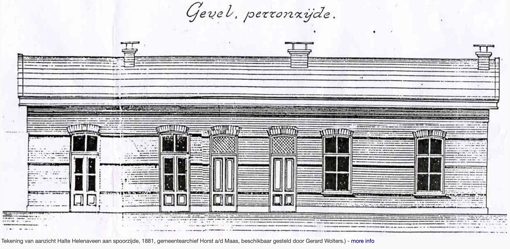
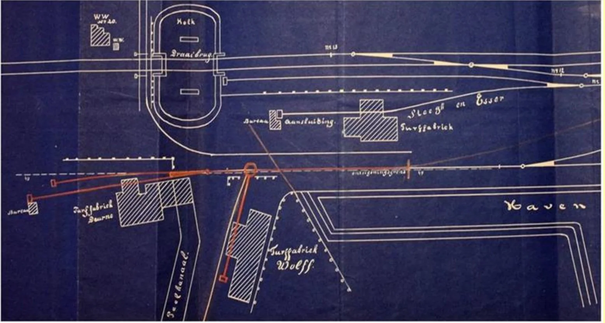

# station-helenaveen

> Bron: helenaveenvantoen.nl

### de GEschiedenis van Station Helenaveen

Halte Helenaveen 1868

In 1868 wordt op verzoek van het Bestuur van de Maatschappij tot Ontginning en Verveening van de Peel genaamd Helena-Veen en van het Gemeentebestuur van Horst overgegaan tot het maken van een proefhalte ter hoogte van het Helena-Veen. Nu ontstaat de mogelijkheid voor Maatschappij Helenaveen om de turf niet alleen via het water (Helenavaart-Noordervaart-Zuid Willemsvaart) maar ook per spoor af te voeren. Het eerste station lag op Deurnes grondgebied

Station Helenaveen 1881

Nog voordat Griendtsveen in 1885 ontstond werd in 1881 het definitieve stationsgebouw opgetrokken en kwam er een tweede spoor bij. In de jaren daarna werden er loodsen bijgebouwd en ook twee turfstrooiselfabrieken, waaronder Turfstrooiselfabriek van Steegh & Esser, in 1895 opgekocht door de gemeente Deurne en Liessel. Het nieuw station ligt op Limburgs gebied.

In 1902 wordt het hoofdgebouw gewijzigd. Aan de goederenbergplaats wordt een aanbouw gemaakt, waarin kolenbergplaats, lampisterie en retirade een onderdak krijgen. Het hoofdgebouw wordt gewijzigd en uitgebreid met een nieuwe chefswoning, terwijl de oude chefswoning wordt verbouwd tot dienstlokalen.

In 1881 worden op station Helenaveen 11 Eerste Klasse enkele reizen verkocht, 72 Tweede Klasse enkele reizen en 1299 Derde Klasse enkele reizen. Aan retour biljetten worden verkocht: Eerste Klas biljet, 60 Tweede Klasse biljetten en 1241 Derde Klasse biljetten. In totaal dus 2684 biljetten. In totaal worden vanuit Helenaveen verzonden 957 tonnen vracht-, bestel- en ijlgoederen. In dit jaar arriveren in het station Helenaveen in totaal 2749 reizigers, terwijl 352 ton vrachtgoed aankwam.

Voor 1902 zijn de cijfers bepaald indrukwekkend, speciaal voor het goederenvervoer. In dat jaar worden er 7282 kaartjes verkocht en arriveren er 6362 reizigers. Aan bestel-, ijl- en vrachtgoederen worden er vanuit Helenaveen 126.981 ton verzonden. Dat is 126 duizend ton meer dan in 1881! In 1902 arriveren er in Helenaveen 4400 ton aan goederen.

De turf komt inmiddels niet alleen van Maatschappij Helenaveen. Er zijn ondertussen ook meerdere veenderijen actief, waaronder de gemeente Deurne en Maatschappij Griendtsveen, die bij station Helenveen een turfstrooisel fabriek heeft gebouwd.

Op 15 mei 1938 wordt het station gesloten voor reizigersvervoer. Op 10 juni 1940 wordt het nogmaals geopend voor reizigers, maar dit zou niet lang standhouden. Op 19 augustus 1940 wordt de reizigersdienst weer gesloten. Nu voorgoed. Vanaf dat ogenblik worden er alleen nog goederen vervoerd. OP het einde van de oorlog wordt het gebouw opgeblazen omdat het in het schootsveld van Duits geschut stond.

Halte Helenaveen op een ansicht uit 1904

Beschrijving van de sporenHet stationsgebouw lag bij km 22.788 ten zuiden van de spoorweg. Het gebouw stond wat verder naar achteren, zodat tussen de hoofdsporen (spoor 1 en 2) en het gebouw nog twee sporen (3 en 4)lagen van 450 m lang. De smalle koolasperrons waren toegankelijk via een overpad bij het gebouw. Dat voor de richting oost langs spoor 1 lag zuidelijk van de hoofdsporen, van het gebouw uit gezien rechts, dat voor de richting west, spoor 2, lag tussen de beide hoofdsporen, van het gebouw uit gezien links. Ten oosten van het gebouw lagen nog twee opstelsporen 4 en 5 van 150 m lang, aan de westzijde nog twee kopsporen van 100 m. Uit spoor 4 dat pal voor het gebouw langsliep en dat op de foto te zien is, ontstond aan de oostzijde een spooraansluiting naar de Maatschappij Griendtsveen met een kort omloopspoor ter plaatse van een laadinstallatie. Het kopspoor liep door tot km 21.775, zodat je dan ruim een km van het station af stond. Deze aansluiting is rond 1960 opgebroken. Aan de westzijde gaf een wissel toegang tot spoor 6 dat leidde naar de Turfstrooiselfabriek van de gemeente Deurne. Voor die fabriek kon een te beladen trein alleen binnenkomen uit de richting Eindhoven. Vertrek was mogelijk in beide richtingen. Er zijn nooit seinen geplaatst langs de zijsporen; de wissels in de hoofdsporen waren beveiligd met afstandsseinen. Rond 1956 werd de beveiliging geautomatiseerd en werd Helenaveen een spooraansluiting aan de vrije baan met de elektrische grendels 54 A/B. Er waren toen nog twee korte sporen. Voor WO II lagen er 14 wissels en twee engelse wissels.

Halte Helenaveen met een mooi overzicht van sporen en perrons.

Station Helenaveen (1920)

Station Helenaveen (1930)

Detail van een kaart uit 1902

Bovenin loopt ongeveer horizontaal de spoorlijn Eindhoven-Venlo, met een draaibrug over de Kolk en rechts een deel van het emplacement van station Helenaveen. Linksonder de hier besproken gemeentelijke Turfstrooiselfabriek. Het Kanaal van Deurne (hier ten onrechte Peelkanaal genoemd) eindigt er overdekt en is nog niet verbonden met de Kolk. In 1904 is dat wel het geval en loopt de spooraansluiting via een ophaalbrug. De via een draaischijf aangesloten turfstrooiselfabriek van Wolff & Co uit 1883 ligt nog net op grondgebied van Deurne. Ze zal in 1905 sluiten. Steegh en Esser zijn net over de gemeentegrens een nieuwe turfstrooiselfabriek begonnen, maar die is tussen 1909 en 1916 ook verdwenen. Alle drie genoemde turfstrooiselfabrieken hebben een inpandige spooraansluiting.

JvW 23 -12-2022Bronnen Website van stationsweb met info over de NS-stations in Helenaveen en Deurne Deurnewikihttp://www.industriespoor.nl/
