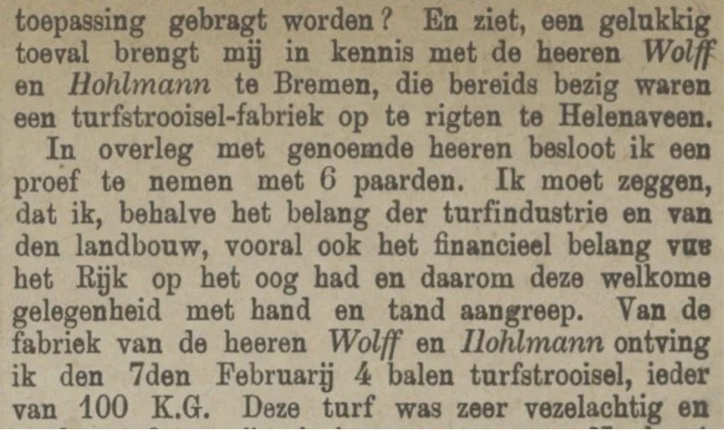
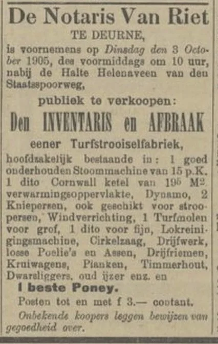
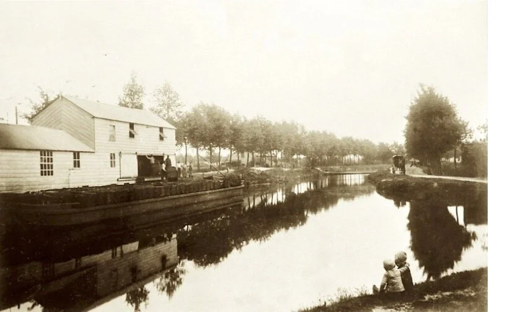
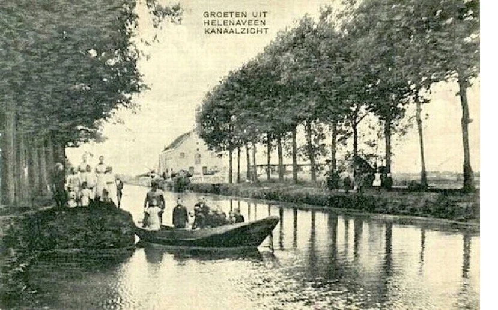
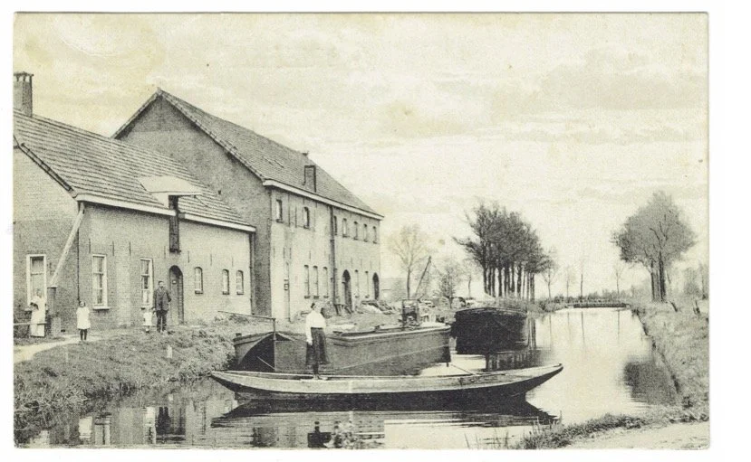
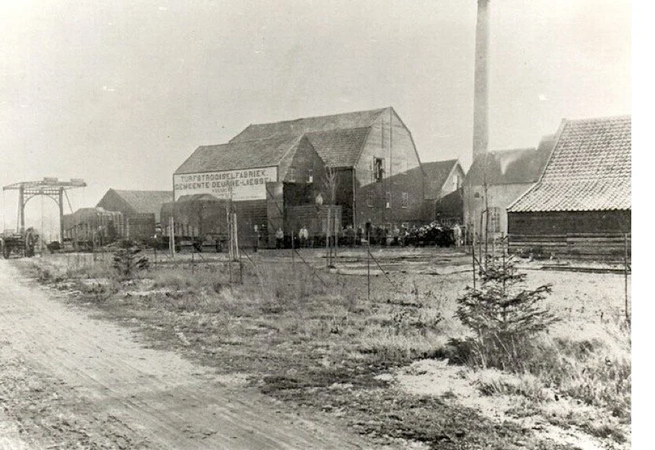
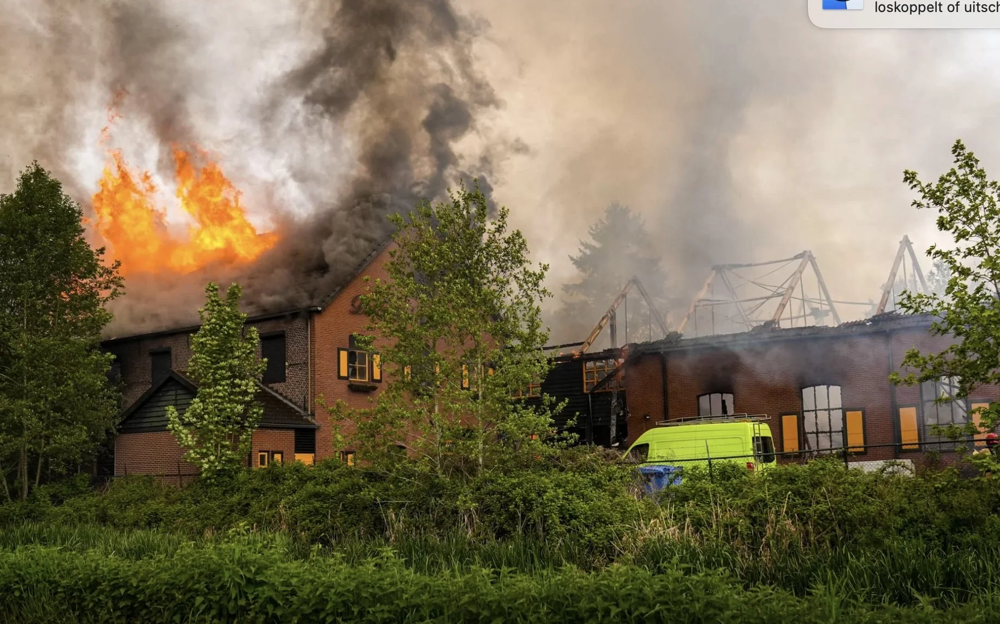

# turfstrooiselfabriek

> Bron: helenaveenvantoen.nl

## De Turfstrooiselfabriek van Helenaveen

Het verhaal van de Helenaveen begint in 1853, toen de gebroeders Nicolaas en Jan van de Griendt 610 hectare veengrond aankochten in de Heitrakse Peel bij Deurne. Om deze uitgestrekte veengebieden te ontginnen, lieten ze de Helenavaart graven en stichtten ze het dorp Helenaveen.De bedoeling was om de gronden, na de turfwinning, om te zetten in vruchtbare landbouw- en tuinbouwgrond. Dit model van grondontginning en hergebruik vormde de kern van de Maatschappij Helenaveen, waarmee de gebroeders Van de Griendt niet alleen turf, maar ook toekomst bouwden.

De vervening was een flinke onderneming. Het veen in deze regio bestond grofweg uit twee lagen: de onderste, zwarte turf, en daarboven een laag grauwveen. Zwarte turf, donker van kleur, was zwaar, vast en had een hoge verbrandingswaarde. Dit maakte het ideaal voor het stoken van steenovens, zoals die in de steenfabriek van Kerkdriel, waarin Jan van de Griendt een belang had.

turfstekers 1908

De bovenste laag, het grauwveen, ook wel bonkveen of vale turf genoemd, was veel lichter en minder geschikt als brandstof. Het brandde snel op zonder veel warmte te produceren, waardoor het minder waardevol was voor de industrie. Boeren uit de omgeving gebruikten deze vale turf soms wel om hun kachels te stoken, maar de turfstrooiselindustrie, die later dit grauwveen tot waarde zou brengen, moest nog uitgevonden worden.

In de eerste 30 jaar van de veenderij richtte de Maatschappij Helenaveen zich volledig op het winnen van zwartveen voor brandstof. Het grauwveen werd toen simpelweg ‘teruggebonkt’ – teruggegooid en niet benut. Pas later zou men ontdekken hoe waardevol dit lichte, vezelige materiaal kon zijn als strooisel voor stallen en andere toepassingen.

### Bonkverplichting in de Veenontginning

In Noord-Nederland waren turfmaatschappijen in de 19e eeuw verplicht om de bovenste 40 tot 50 centimeter van de veengrond te bewaren, de zogenaamde bonkaarde. Deze maatregel, vastgelegd in een wet van 13 juni 1895, moest ervoor zorgen dat de zandbodem na de vervening voldoende water kon vasthouden voor landbouw. Zonder deze bonkaarde zou de arme zandgrond te droog zijn voor een goede gewasgroei. Door deze grond later te vermengen met mest, zoals stadsdrek, dierlijke mest of later kunstmest, ontstond een redelijk vruchtbare landbouwgrond, bekend als dalgrond.

Toen na 1882 in Zuid-Nederland de turfstrooiselproductie op gang kwam, veranderde dit proces. Voor turfstrooisel was juist de bovenste laag, de zogenaamde bolster, een uitstekende grondstof. In plaatsen als Helenaveen werd daarom niet meer de volle 40 tot 50 centimeter teruggebonkt, maar slechts de bovenste 15 centimeter van de wortelvoerende bodem.

Deze praktijk is nog steeds zichtbaar in Helenaveen. Aan het begin van het dorp, rond de Kervelweg, is de grond rijk aan organische stoffen en vruchtbaar. Maar voorbij de bocht bij de protestantse kerk wordt de bodem steeds armer en zandiger, een stille getuige van de intensieve turfwinning van weleer.

De Brabantse en Limburgse Peel maakte zo vrijwel alle bolster geschikt voor turfstrooiselproductie. Deze industrie groeide zo sterk dat rond 1900 het goederenstation in Griendtsveen, waar enkel turfstrooisel werd verladen, tot een van de grootste goederenstations van Europa werd gerekend.

Station Helenaveen (in het latere Griendtsveen)

### Ontstaan van de Turfstrooiselfabricage

De ontwikkeling van turfstrooisel begon met experimenten van de Duitse ondernemers Wolff en Hollmann uit Bremen. Zij onderzochten de mogelijkheden om grauwveen, ook wel bonkveen genoemd, te gebruiken voor de productie van papier en turfstrooisel. Voor hun proeven richtten zij een testfabriek in Gifhorn in.

Jozef van de Griendt, die betrokken was bij de vervening in Helenaveen, bezocht deze proeffabriek. Geïnspireerd door wat hij daar zag, stelde hij voor om “eene dergelijke fabriek van turfstrooisel op te rigten te Helenaveen.” Dit idee legde de basis voor wat later een belangrijke industrie zou worden in de Peel.

Een stukje uit de Provinciale Drentsche en Asser courant van 21-03-1882 over Wolff en Hohlmann

### De Eerste Turfstrooiselfabriek van Nederland

In 1881 werd in Helenaveen de eerste turfstrooiselfabriek van Nederland gebouwd. Dit imposante bouwwerk was de eerste van zijn soort en maakte de grootschalige productie van turfstrooisel mogelijk.

Het productieproces was relatief eenvoudig, maar efficiënt. De grauwe turf werd via een lopende band onder een overkapping naar de machines in de fabriek gebracht. Hier werd de turf eerst grof vermalen met een zogenaamde wolf, ook wel duivelsmolen genoemd, totdat hij door een grove zeef kon. Vervolgens werd het materiaal naar een tweede wolf geleid voor fijnere maling. Het zo ontstane turfmolm werd daarna geperst tot grote rechthoekige balen van ongeveer 150 kilogram, stevig samengehouden met houten latten en ijzerdraad.

Dit machinale verpakken maakte het mogelijk om de balen efficiënt per schip en trein te vervoeren. Zo vond het turfstrooisel zijn weg naar de grote steden, waar het werd gebruikt als strooisel in de stallen van duizenden paarden die de paardentrams aandreven. Ook cavalerie-eenheden van het leger en andere grote paardenhouders bleken een ideale afzetmarkt. Turfstrooisel had namelijk een hoog absorberend vermogen, waardoor het veel beter vocht en geuren kon binden dan gewoon stro. Dit maakte het niet alleen populair als stalstrooisel, maar ook als basis voor reukloze toiletten.

Het werd dan ook geprezen als “verreweg verkieslijker dan stroo” – een innovatie die de industrie in de Peel een flinke impuls gaf.

De turf werd naar de fabriek aangevoerd met aken en schepen via de Fabriekswijk, een zijkanaal van de Helenavaart. In 1901 telt Helenaveen 950 inwoners. Er zijn 36 mannen, 5 vrouwen, 6 jongens en 3 meisjes in dienst bij de turfstrooiselfabricage.

### De inrichting van de Fabriek.

Er zijn (tot nu toe) geen gegevens over de inrichting van de fabriek gevonden.

Jozef van de Griendt heeft het strooisel maken afgekeken van Wolff, dus de inrichting van de fabriek in Helenaveen zal geleken hebben op de fabriek van van Fedor Wolff & Co. in Griendtsveen (1882-1905)

Er waren daar volgens onderstaande advertentie: Een 15 PK stoommachine met een stoomketel Een dynamo voor stroomopwekking (verlichting) Een lucht afzuiging Een Wolf voor grof breken Een Wolf voor fijnmalen Een lokreinigingsmachine Een lattenzaagmachine Twee persen

Advertentie betreffende de afbraak van de Fabriek van Fedor Wolff in Griendtsveen (Halte Helenaveen)

Aanvoer van de turf naar de fabriek

Cliché van Mij. Helenaveen

### 1884 de houten turfstrooiselfabriek brandt af

De turfstrooiselfabriek werd op 7 juni 1884 door brand getroffen.Bij de brand werd een schade van 4000 gulden aan gebouwen, 8000 gulden aan machines en 2000 gulden aan roerende goederen toegebracht. Het gebouw en de machines waren verzekerd. De oorzaak van de brand was onbekend. Er raakten geen personen gewond bij de brand. De fabriek werd aangedreven door een mobile stoommachine, een zgn locomobile.

Voorbeeld van een locomobiel

### De Herbouw van de Turfstrooiselfabriek in 1884

Na de brand werd de turfstrooiselfabriek in Helenaveen meteen herbouwd, dit keer in steen. Het nieuwe gebouw, een rechthoekige fabriek van twee verdiepingen met een drievoudig eiken hangwerk in de kap, was nog datzelfde jaar weer in bedrijf.

De fabriek was grootschalig opgezet en moest haar afzet vooral in het buitenland zoeken. Met name Engeland bleek een aantrekkelijke markt. De fabriek beschikte over een eigen stoommachine en elektriciteitsopwekking, waarvan alleen de directeurswoning, Villa GenA, buiten de fabriek profiteerde. Het dorp Helenaveen zelf kreeg pas in 1939 aansluiting op het elektriciteitsnet.

In het eerste jaar na de heropening werd al 562.000 ton grauwveen verwerkt. Toch leidde dit niet tot blijvende stabiliteit. In 1884 werd directeur Jozef van de Griendt, samen met zijn broer Eduard, ontslagen bij de Maatschappij Helenaveen. De broers richtten zich vervolgens op een nieuw project en stichtten in 1885 het nabijgelegen dorp Griendtsveen, waar ze hun eigen turfstrooiselactiviteiten voortzetten.

### De Drijvende Fabriek

Al heel vroeg (1882?) kende Helenaveen ook een drijvende turfstrooiselfabriek, een mobiele installatie die zich door de kanalen van het veengebied kon verplaatsen. Een plek waar deze drijvende fabriek vaak lag, is nog te herkennen aan een lichte verbreding van de Helenavaart, tegenover de Fabriekswijk

De drijvende turfstrooiselfabriek op haar plaats voor de fabriekswijk

De fabriek in 1915 een paar jaar na de stillegging

Een turfschip aangelegd voor de smederij van de fabriek

### Turfvezels of lok

In 1899 bezocht Mr. A.E.J. baron Van Voorst tot Voorst als Commissaris van de Koningin Helenaveen. Dit is een gedeelte van zijn verslag:

Op uitnoodiging van Commissarissen van de Maatschappij Helenaveen, ging ik met die Heeren den 7 Augustus 1899 naar Helenaveen, alwaar zij mij het bedrijf der Maatschappij tot in bijzonderheden lieten zien. Aan de halte Helenaveen ontvangen door den directeur, Van de Blocquerie, reden we langs de Helenavaart naar het dorpje van dien naam. Onderweg stegen we uit om eene drijvende fabriek van turfstrooisel, die in volle werking was, te zien; we namen ook de groote vaste fabriek, die tijdelijk stilgezet was, in oogenschouw. Aan die groote fabriek viel vooral in het oog de machine, met welke men de vezels zuivert en schoonmaakt, om daardoor den grondstof te verkrijgen voor het vervaardigen van allerlei stoffen (zijde, wol enz.)

Het lijkt erop dat al in 1899 de grote fabriek minder gebruikt werd en men naar een andere bestemming zocht. De baron heeft het hier over een machine om turflok te bewerken.

Onder turfvezel of turflok verstaat men vezels van de wollegrasplant die vaak in hoogveen aanwezig zijn. In de 19e eeuw werden er experimenten uitgevoerd om turfvezel te benutten voor de productie van textiel en ontstonden er fabrieken die het product verwerkten.

Lokvezels

De lok bevindt zich in het veen als grote vaste en taaie vezelvlokken. De turfgravers hadden er een grote hekel aan omdat er met de stikker en de oplegger bijna niet doorheen te komen was. Bij het zeven van het strooisel kwamen de vezels als zeefrest ter beschikking. Het was dus een bijproduct.De lok werd geleverd aan de te Weert gevestigde Société Moris & Cie., waarvan G. Béraud eigenaar was. Deze ontwikkelde het product Béraudine, een textielproduct dat naast turfvezel ook wol bevatte. De stof is nooit een succes geworden. Het bleek dat het in de regen heel veel water opnam waardoor het zwaar werd. Bovendien verzwakte de stof daardoor ook.

De turfvezel werd ook benut voor het vullen van hoofdkussens en matrassen, terwijl ook de Maatschappij Helenaveen dit product won en het Maastrichtse bedrijf Brion, Pate & Burke, de opvolger van Bérauds bedrijf van grondstof voorzag, waaruit satinette werd vervaardigd, dat voor 50% uit turfvezel bestond.

De fabriek met twee turfschepen en een werkboot

### Andere turfstrooiselfabrikanten

De eerste succesvolle turfstrooiselfabriek in Nederland startte in 1882 en was eigendom van de Maatschappij Helenaveen. Deze produceerde tot 1912.

Door het succes van de fabriek volgden nog vele andere fabrieken.

Alleen al bij station Helenaveen (het latere Griendtsveen) stonden er drie:

Maatschappij Griendtsveen, 1885-1944

Fedor Wolff & Co, 1882-1905

Steegh & Esser, 1886-1896; De fabriek van Steegh & Esser kwam in in 1896 in bezit van de gemeente Deurne die produceerde tot 1944 Ook in Asten en Horst-America verschenen fabrieken.

Asten, 1896-1912; 1954-1960

Horst-America 1897-1942

Het rangeer terrein in Griendtsveen met de drie turfstrooiselfabrieken

De fabriek van Deurne in Griendtsveen

### Artikel uit de Limburger Koerier van 29-08-1893

· De turfstrooiselfabriek.

Het oorspronkelijke doel, waarmede de Maatschappij Helenaveen optrad, was het in cultuur brengen van woeste gronden. Dat doel is nooit uit het oog verloren, integendeel, wij zullen later zien dat het een zeer groote plaats inneemt onder de werkzaamheden der kolonie, maar daarnaast heeft de turfstrooisel-fabricage in de laatste jaren een verbazende vlucht genomen. Van de 1000 bunders grond ongeveer, die door de Maatschappij bewerkt worden, zijn er 150 in cultuur gebracht, de overige moeten dienen voor de fabricage van turfstrooisel. Het hoogveen, waaruit de gronden van de Peel hoofdzakelijk bestaan, heeft als bovenste laag het zoogenaamde grauwe veen. Tot voor een jaar of acht werd die laag als waardeloos afgegraven en in kuilen geworpen, „ingebonkt" zooals men dat noemt, vandaar dat men in de buurt tal van zoogenaamde „bonken" vindt, waaruit het grauwe veen thans geleidelijk weder wordt opgegraven voor de fabricage van het turfstrooisel. Het was vroeger alleen te doen om de onder het grauwe veen gelegen sliblaag, om daarvan de zoogenaamde persturf te maken.

Die persturf wordt ook nu nog gebruikt; het is eene degelijke brandstof, die bij de verbranding in hitte niet voor steenkolen behoeft onder te doen en waarvan de groote steenfabrieken dan ook gretige afnemers zijn.

Het grauwe veen wordt thans afgestoken in groote lichtbruine turven, die gedroogd zijnde, gelijken op groote mikbrooden, met dit onderscheid dat zy aanmerkelijk lichter zijn. De groote hoopen turf, die men in en om Helenaveen ziet, zijn gevormd uit deze lichtbruine turven. Het kanalennet is hoofdzakelijk uitgebreid met het doel de groote hoeveelheden grauwveen naar de fabrieken te kunnen vervoeren.

De Maatschappij heeft haar turfstrooisel-fabricatie dermate zien uitbreiden, dat zij thans twee fabrieken ervoor in werking heeft. De eene is een vaste fabriek, de andere eene drijvende, gelegen op de Helenavaart, en kan door twee paarden gemakkelyk langs het kanaal worden voortgetrokken naar de plekken waar de grootste hoeveelheden turf zijn bijeengebracht.

Treden wij eender fabrieken binnen, ’t Zij u geraden niet bang te zijn voor een beetje stof, want natuurlijk de vermalen droge turf maakt, dat men in de fabriek als ’t ware stof eet en men, haar verlatende, die stoflaag duimen dik op de kleeren heeft en neus en ooren er hun deel van hebben erlangd. Op de bovenverdieping wordt de turf in de machine gegooid, die door stoomkracht in beweging gebracht, de stukken fijn maalt. Die fijn gemalen turf komt beneden tusschen persen, die haar persen tot groote balen, gemiddeld 150 kilo wegende. Voor die baal de pers verlaat, wordt zij omklemd door latten en dunne ijzeren handen, vervolgens bij het verlaten der pers gewogen, gemerkt- en op de schuiten geladen, die gevuld zijnde, den voorraad langs de kanalen naar de halte vervoeren, vanwaar deze verder per spoor wordt getransporteerd. Dagelijks worden eenige duizenden kilo’s turfstrooisel gemaakt en vooral dezen zomer is de vraag naar dit artikel ontzaglijk groot.

Uit Frankrijk, België, Engeland, Amerika krijgt de Maatschappij aanvraag tot levering en die vraag is zóó groot, dat aan alle bestellingen onmogelijk kan worden voldaan. Wat daar, van de reden is? De in vele landen door de langdurige droogte mislukte hooioogst. Door de weinige voorraden hooi, moet het stroo, dat anders grootendeels in de veestallen wordt gebracht om later als mest dienst te kunnen doen, thans voor een groot deel als haksel onder het veevoeder worden gemengd, zoodat voor het vee iets anders als ligging in de stallen moet dienst doen; dat andere nu is het turfstrooisel.

Maar zelfs in normale tijden geven vele veehouders aan turfstrooisel. verre de voorkeur boven stroo, omdat het strooisel zich met de faecaliën der dieren veel beter mengt tot mest, waardoor weinig verloren gaat. De mest, door turfstrooisel verkregen, is voor vele gronden beter dan die van stroo en in ’t bijzonder geschikt voor droge kleigronden. Ook de zindelijkheid en de frischheid in de stallen wordt er zeer door bevorderd!

Het turfstrooisel wordt dan ook in de stallen van tram- en rijtuigmaatschappjjen veel meer gebruikt dan stroo, maar ’t is een eigenaardig verschijnsel dat de afnemers bij ons te lande in vergelijking van die in het buitenland zeer klein in aantal zijn: in ons land schijnt men over ’t algemeen nog maar niet nuttig te kunnen vinden, wat in het buitenland zoozeer gewild is.

De stof, die bij het vermalen van het grauwe veen tot turfstrooisel blijft liggen, is ook niet geheel waardeloos. Ook die wordt tot balen geperst, waarvan evenwel bij het vervoer uit den aard der zaak veel verloren gaat. Zij wordt in den laatsten tijd veel gebruikt voor privaten, in die huizen waar geen Liernurstelsel bestaat; vooral in Duitschland wordt die stof daartoe veel gevraagd.

Te Helenaveen zelf wordt die stof in de privaten der woningen van directeur en boekhouder gebruikt, waardoor die privaten geheel reukeloos zijn. Zou er, vroegen wij ons bjj deze gelegenheid af, niet op de een of andere wijze iets op te vinden zijn, dat in die woningen te Amsterdam, die nog altijd den beerwagen voor de deur moeten zien, steeds eene hoeveelheid van die turfstrooisel-stof kon zijn, voor de vaten of emmers, waarin men de faecaliën moet opzamelen; de gezondheidstoestand van hen, die in dergelijke woningen leven, zou er zeker door bevorderd worden.

De blijvende vraag naar turfstrooisel, die natuurlijk: ‘s winters, als het vee gestald is, nog grooter is dan thans, maakt dat aan de fabrieken zomer en winter volop werk is. In dezen tijd des jaars graaft men de grootste hoeveelheden grauw veen af en stapelt die op in de nabijheid der fabrieken, opdat als straks strenge vorst het graven in de venen onmogelijk maakt voldoende hoeveelheid voorradig is en men geregeld zal kunnen doorwerken.

De ventilatie in de fabrieken der Maatschappij laat niets te wenschen over, wat evenwel niet wegneemt, dat de werklieden nog altijd veel last hebben van het stof, dat hun in neus, mond, oogen en ooren vliegt. Tot dusverre wordt door de directie te vergeefs gezocht naar een voorwerp, dat, het hoofd van den werkman bedekkende, hem tegen het stof beschermt; een masker dat beproefd is, bleek onvoldoende, daar de werklieden het daarachter te benauwd kregen, hoe licht en luchtig het ook werd gemaakt.

Beide fabrieken zijn electrisch verlicht, terwijl ze, evenals de halte Helenaveen, telephonisch met het hoofdkantoor verbonden zijn.

Er is nog een product dat bij het opgraven van het grauwveen verkregen wordt, hetwelk in den laatsten tjjd mede zjjn nut krijgt, nl. de z.g. „lok“, dat zijn de nevels, die in de turf zitten. Zij blijven in de veenderijen liggen, doch worden door een fabrikant opgezameld tot het maken van anti-septische verbanden, terwijl zij bovendien ook voor het vlechten van matten, loopers en tapijten goede diensten bewijzen.

### Het Einde van de Turfstrooiselfabricage

De turfstrooiselindustrie kreeg het al tijdens de Eerste Wereldoorlog moeilijk, toen belangrijke exportmarkten wegvielen. Daarnaast zorgde de opkomst van auto's voor een geleidelijke afname van de vraag naar stalstrooisel, omdat paarden steeds minder als transportmiddel werden gebruikt.In 1912 werd de fabriek in Helenaveen stilgelegd omdat de productie niet langer rendabel was. De vervening zelf kwam in Helenaveen al in de jaren '20 volledig tot een einde. De Maatschappij begon haar gronden toen te verpachten aan boeren en tuinders, waarmee een nieuwe fase voor het dorp begon.

Maatschappij Helenaveen gaf het gebouw daarna een nieuwe bestemming als timmerwerkplaats en als inrichting voor het verduurzamen van hout.

Na jaren van leegstand werd het pand in de jaren '70 verhuurd aan een autospuiterij en uitdeukerij. In die fase werd de fabriek ingrijpend veranderd, iets wat veel afbreuk deed aan het monumentale karakter.

### 4 mei 2025 - het definitieve einde

Met de brand die zondagochtend rond 08.15 uur uitbrak in Helenaveen is een zeldzame monumentale turfstrooiselfabriek verloren gegaan. Het pand aan de Rector Nuijtsstraat stamt grotendeels uit 1881 en werd gebouwd door de Maatschappij Helenaveen. De uitslaande brand is ontstaan in één van de loodsen en woedde urenlang.

RijksmonumentDe voormalige turfstrooiselfabriek wordt door historici gezien als een gebouw van groot belang. Het rijksmonument heeft volgens experts zowel cultuur- als architectuur-historische waarde. Het pand gaf een beeld van de sociaaleconomische ontwikkeling van de ontginning van het Peelgebied en de nederzetting Helenaveen.

Jan van Woezik, 12 mei 2025

Bronnen: - Wikipedia- Deurnewiki - Delpher- Video: Yon Urresti-Boeken en Geschriften van André Vervuurt-Uit Sphagnum geboren H.F.v.d.Griendt
