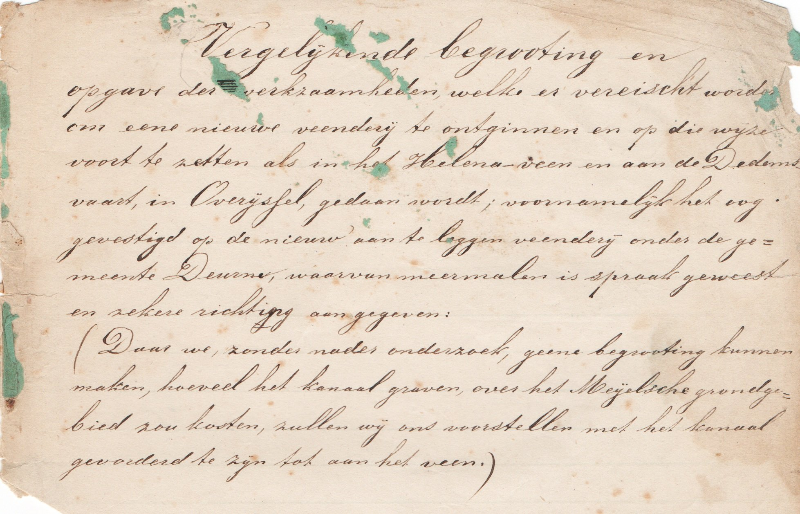
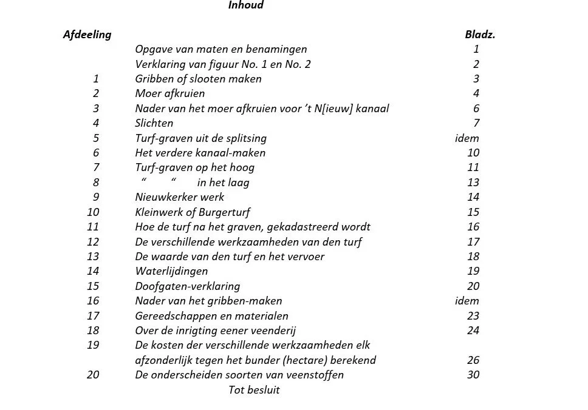
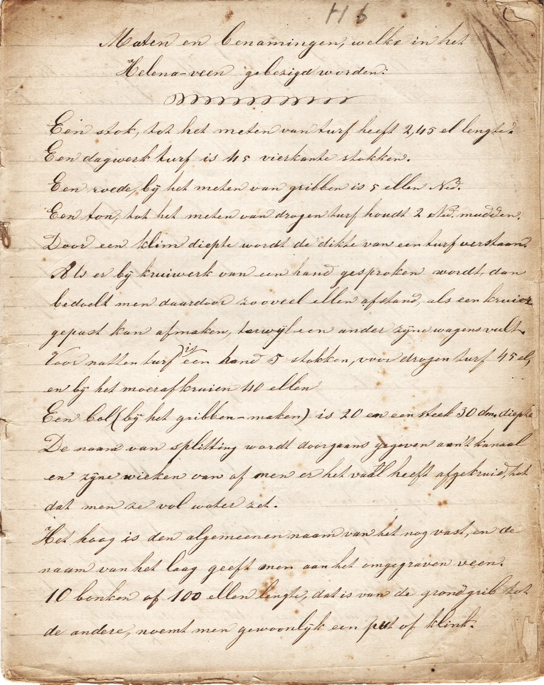
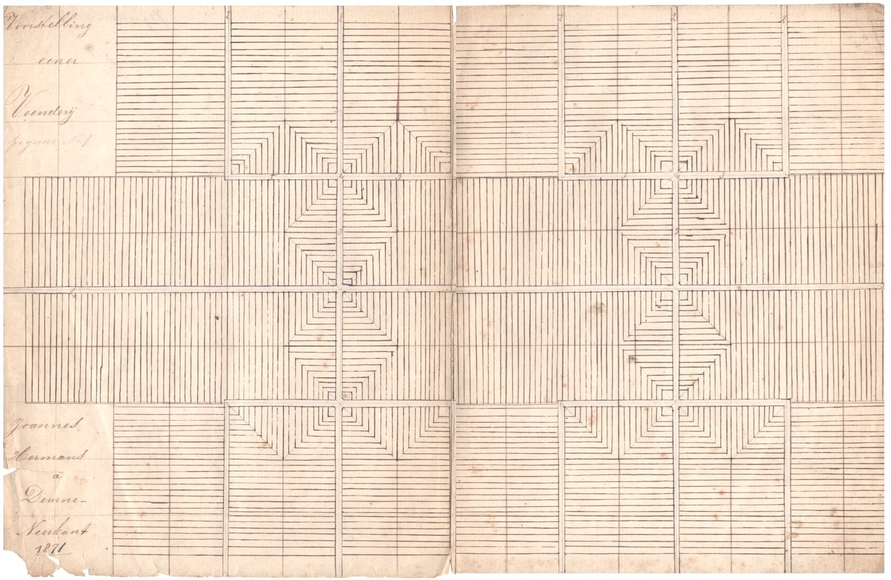

# veenbaas-jan-hermans

> Bron: helenaveenvantoen.nl

### Hoe een veenderij te maken en turf te graven volgens Joannes Hermans

Jan Hermans uit de Neerkant was voor 1875 veenbaas bij de Maatschappij Helenaveen. Later is hij veenbaas geworden bij de veenderij van de gemeente Deurne. In 1871 heeft hij uitgebreid beschreven hoe een nieuwe veenderij aan te leggen en te ontgraven. In zijn verhaal neemt hij ook allerlei informatie op over bijvoorbeeld de in een veenderij gebruikte termen, zoals dagwerk en stok, en over de maten van de turven. Die laatste waren afhankelijk van de herkomst van de turfstekers, zoals de Dedemsvaarders, de Duitsers en de Nieuwkerkers. En wat voor gereedschap gebruikten ze?

Hermans rekent alles door in geld om zo een betrouwbare begroting voor de aanleg van een nieuwe veenderij te verkrijgen. Lees hier wat Hermans in zijn schriftje schreef.

Titel van het verhaal van Jan Hermans.

Vergelijkende begrooting en opgave der werkzaamheden, welke er vereischt worden om eene nieuwe veenderij te ontginnen en op die wijze voort te zetten als in het Helena-veen en aan de Dedemsvaart, in Overijssel, gedaan wordt; voornamelijk het oog gevestigd op de nieuw aan te leggen veenderij onder de gemeente Deurne, waarvan meermalen is spraak geweest en zekere richting aangegeven:

(Daar we, zonder nader onderzoek geene begrooting kunnen maken, hoeveel het kanaal graven over het Meijelsche grondgebied zou kosten, zullen wij ons voorstellen met het kanaal gevorderd te zijn tot aan het veen.)

Bladzijde 1: Maten en benamingen, welke in het Helena-veen gebezigd worden

Maten en benamingen, welke in het Helena-veen gebezigd worden

Een stok, tot het meten van turf heeft 2,45 el lengte.

Een dagwerk turf is 45 vierkante stokken.

Een roede, bij het meten van gribben is 5 ellen Ned.

Een ton, tot het meten van drogen turf houdt 2 Ned. mudden.

Door een klim diepte wordt de dikte van een turf verstaan.

Als er bij kruiwerk van een hand gesproken wordt, dan bedoelt men daardoor zooveel ellen afstand als een kruier gepast kan afmaken, terwijl een ander zijne wagens vult.

Voor natten turf is een hand 5 stokken, voor drogen turf 45 el, en bij het moer afkruien 40 ellen.

Een bol (bij het gribben maken) is 20 en een steek 30 dm. diepte.

De naam van splitting wordt doorgaans gegeven aan ’t kanaal en zijne wieken van af men er het vaal heeft afgekruid, tot dat men ze vol water zet.

Het hoog is den algemeenen naam van het nog vast, en de naam van het laag geeft men aan het omgegraven veen.

10 bonken of 100 ellen lengte, dat is van de grondgrib tot de andere, noemt men gewoonlijk een put of klink.

Figuur No. 1: Voorstelling eener veenderij | Joannes Hermans á Deurne – Neerkant 1871.

Verklaring der figuur No. 1

[20250916|HvdL | wordt vervolgd]
