# veenbaas-jan-hermans

> Bron: helenaveenvantoen.nl

### Hoe een veenderij te maken en turf te graven volgens Joannes Hermans

Jan Hermans (1845-1897). (Foto Deurnewiki.nl)

Jan Hermans uit de Neerkant was voor 1875 veenbaas bij de Maatschappij Helenaveen. Later is hij veenbaas en directeur geworden bij de veenderij van de gemeente Deurne. In 1871 heeft hij uitgebreid beschreven hoe een nieuwe veenderij aan te leggen en te ontgraven. In zijn verhaal neemt hij ook allerlei informatie op over bijvoorbeeld de in een veenderij gebruikte termen, zoals dagwerk en stok, en over de maten van de turven. Die laatste waren afhankelijk van de herkomst van de turfstekers, zoals de Dedemsvaarders, de Duitsers en de Nieuwkerkers. En wat voor gereedschap gebruikten ze?

Hermans rekent alles door in geld om zo een betrouwbare begroting voor de aanleg van een nieuwe veenderij te verkrijgen. Lees hier wat Hermans in zijn schriftje schreef.

Titel van het verhaal van Jan Hermans.

Vergelijkende begrooting en opgave der werkzaamheden, welke er vereischt worden om eene nieuwe veenderij te ontginnen en op die wijze voort te zetten als in het Helena-veen en aan de Dedemsvaart, in Overijssel, gedaan wordt; voornamelijk het oog gevestigd op de nieuw aan te leggen veenderij onder de gemeente Deurne, waarvan meermalen is spraak geweest en zekere richting aangegeven:

(Daar we, zonder nader onderzoek geene begrooting kunnen maken, hoeveel het kanaal graven over het Meijelsche grondgebied zou kosten, zullen wij ons voorstellen met het kanaal gevorderd te zijn tot aan het veen.)

Bladzijde 1: Maten en benamingen, welke in het Helena-veen gebezigd worden

Maten en benamingen, welke in het Helena-veen gebezigd worden

Een stok, tot het meten van turf heeft 2,45 el lengte.

Een dagwerk turf is 45 vierkante stokken.

Een roede, bij het meten van gribben is 5 ellen Ned.

Een ton, tot het meten van drogen turf houdt 2 Ned. mudden.

Door een klim diepte wordt de dikte van een turf verstaan.

Als er bij kruiwerk van een hand gesproken wordt, dan bedoelt men daardoor zooveel ellen afstand als een kruier gepast kan afmaken, terwijl een ander zijne wagens vult.

Voor natten turf is een hand 5 stokken, voor drogen turf 45 el, en bij het moer afkruien 40 ellen.

Een bol (bij het gribben maken) is 20 en een steek 30 dm. diepte.

De naam van splitting wordt doorgaans gegeven aan ’t kanaal en zijne wieken van af men er het vaal heeft afgekruid, tot dat men ze vol water zet.

Het hoog is den algemeenen naam van het nog vast, en de naam van het laag geeft men aan het omgegraven veen.

10 bonken of 100 ellen lengte, dat is van de grondgrib tot de andere, noemt men gewoonlijk een put of klink.

Figuur No. 1: Voorstelling eener veenderij | Joannes Hermans á Deurne – Neerkant 1871.

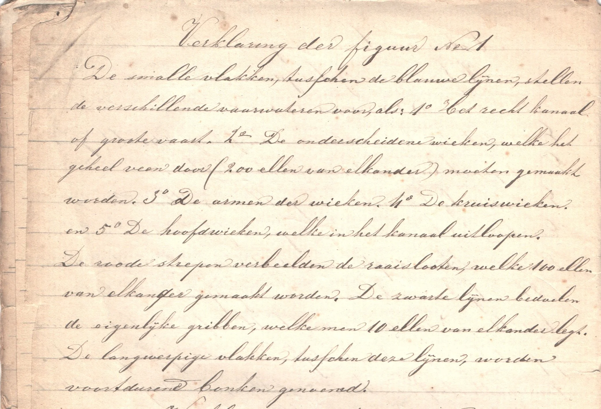

Bladzijde 2: Verklaring der figuur No. 1.

Verklaring der figuur No. 1

De smalle vlakken, tusschen de blauwe lijnen, stellen de verschillende vaarwateren voor, als: 1o Het recht kanaal of groote vaart. 2o De onderscheiden wieken, welke het geheel veen door (200 ellen van elkander) moeten gemaakt worden. 3o De armen der wieken. 4o De kruiswieken. en 5o De hoofdwieken, welke in het kanaal uitloopen.

De roode strepen verbeelden de raaislooten, welke 100 ellen van elkander gemaakt worden. De zwarte lijnen bedoelen de eigenlijke gribben, welke men 10 ellen van elkander legt. De langwerpige vlakken, tusschen deze lijnen, worden voortdurend bonken genoemd.

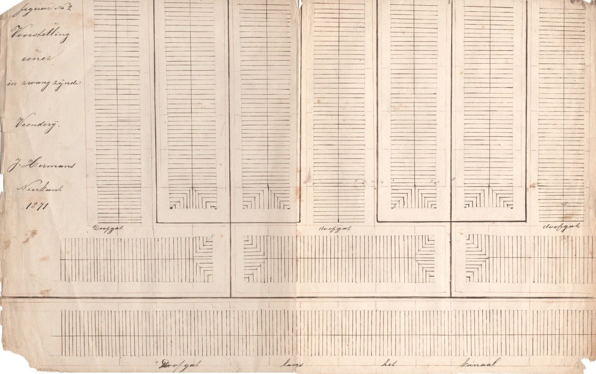

Figuur No. 2: Voorstelling eener in zwang zijnde veenderij | J. Hermans Neerkant 1871.

Bladzijde 2 : Verklaring van figuur No. 2.

Verklaring van figuur No. 2

De breede, zwarte strepen stellen, even als de blauwe op figuur No. 1, de vaarwateren voor. De korte lijnen, in den vorm van kolommen, verbeelden de gribben en de zwarte streep door hun midden vervangt de roode lijn van fig. No. 1. Door de 7 opgaande en de 2 dwars liggende kolommen wordt het hoog of vast stuk veengrond aangeduid en de andere vlakken, waarop de roode strepen liggen, bedoelen het laag of uitgegraven veld. Door de roode lijnen langs de

Bladzijde 3 : [vervolg] Verklaring van figuur No. 2.

[blz. 3] vaarwateren worden de bermslooten en door de korte roode strepen, welke aan de lange verbonden zijn worden de grondgribben voorgesteld.

Bladzijde 3: Gribben of slooten maken.

Gribben of slooten maken. 1.

Dit is het eerste werk eener veenderij en wordt op de volgende wijze aangevangen: Eerst maakt men de raaislooten, waar men voornemens is het kanaal en de wieken te maken en tegelijkertijd de andere, welke op figuur 1e door roode lijnen zijn aangeduid. Daarna maakt men de gribben, op figuur 1o en 2o door zwarte strepen voorgesteld, van welke er 10 op elk bunder vallen. Op elk bunder aan den binnen hoek eener wiek, zooals aan de hoofd- en kruiswieken, heeft men 216 en op de andere bunders, met de raaislooten mede, 220 roeden gribben. De gribben, als ook de raaislooten, worden doorgaans op 65 of 70 duim breedte aangelegd en het eerste jaar 3 bollen of 60 duim diep gemaakt. Vervolgens worden de gribben ieder jaar, of zoo het veen niet te week is, twee malen in het jaar, telkenkeer twee steken verdiept, tot dat ze op schol veen 1 el, op middelmatig veen 1½ el en op het diep veen 1¾ el diep zijn. Het gribben-maken kost eerst 15 cts per 100 ellen van uitlijnen; vervolgens van

Bladzijde 4: [vervolg] Gribben of slooten maken.

[blz. 4] de drie eerste bollen 4½ cts per roede en daarna van elke twee steken te verdiepen 70 of 80 cts per 100 ellen.

De gribben en ook de raaislooten behoeven echter niet aan hunne volle diepte te zijn, eer men met het kanaalgraven een begin maakt; het kan voldoende zijn met de raaislooten, waar men de vaarwateren maakt en de gribben, welke daar tegen aanschieten, op zekere lengt, b.v. 20 ellen, voorlopig tot één steek door de klot te maken, de rest kan men op 60 duim diepte laten liggen, tot dat de splitting is uitgegraven en de vaarwateren gemaakt zijn. Als we met het veenwerk wat nader bekend zijn, zullen wij nog eens tot het gribben-maken terug keeren, want hieraan is bijzonder veel gelegen.

Bladzijde 4: Moer-afkruien.

Moer-afkruien. 2.

Dit wordt gedaan, waar men het kanaal en wieken maakt. Eer men hiermede begint, moet men de diepte van het veen gepeild hebben om te weten, hoe breed het moer moet weggeruimd worden. Op zekere plaatsen, waar het zwart veen of klot 1,75 el en het vaal ruim 1 el diep zit, laat men het vaal-moer doorgaans, aan weerskanten van de raaisloot, 10 ellen breed wegruimen, alsdan heeft men, nadat de klot er uitgegraven is, genoegzame ruimte om den

Bladzijde 5: [vervolg] Moer-afkruien.

[blz. 5] ondergrond, dat is het zand, dat men uit den bodem graaft, te bergen en de dijken, aan weerskanten, krijgen eene matige hoogte. Op ondiepe plaatsen (scholveen) is het gemakkelijker en wel zoo voordeelig vooraf het vaal 2, 4 of 6 ellen breeder te laten wegruimen, dan later het zand op die smalle ruimte, misschien hooger dan het oppervlak van den bovengrond, te moeten ophoopen. Op dergelijke plaatsen echter zou men zich kunnen redden, al was het moer slechts 10 ellen breed weggeruimd, met bij de splitting, aan beide zijden één of twee kuilen te laten uitgraven; maar op andere plaatsen, waar de klot 2 ellen of meer en het vaal hoogstens 1 el dik zit, mag het moer niet breeder worden weggenomen dan 6, 7 of 8 ellen, want als men het vaal te breed wegneemt, is men later genoodzaakt grond bij te kruien om de dijken hoog genoeg te maken.

Het moer afkruien kost doorgaan 8 cts per kubiek el, dat is op 40 ellen ver weg te brengen; 30 ellen afstand wordt gerekend tegen 7, 20 ellen tegen 6, 10 ellen tegen 5 en 60 ellen tegen 10 cts per kub. el., gewoonelijk 15 of 20 duim dik gelijkelijk over het veld verdeeld, doch aan de bochten, hoofd- en kruiswieken is men genoodzaakt het vaal veel dikker dan 20 duim over het veld te storten; dit is niet alleen lastig later bij het turf-graven, maar het

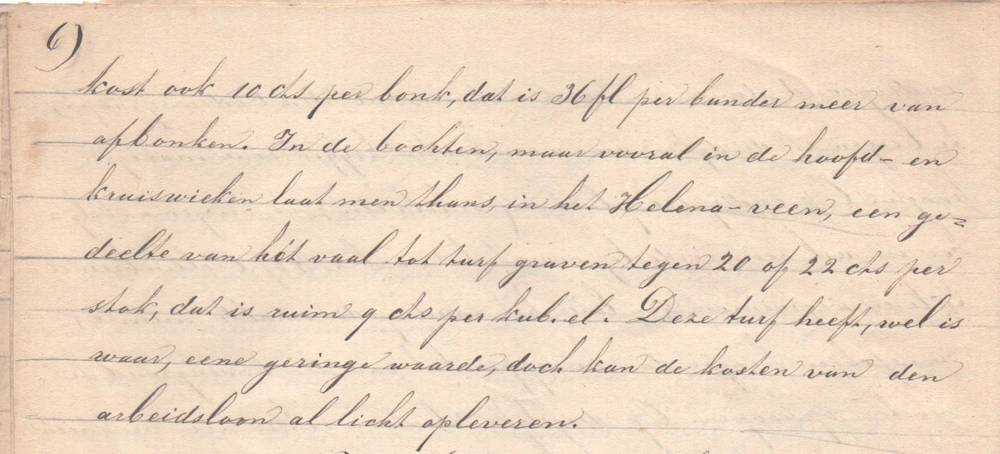

Bladzijde 6: [vervolg] Moer-afkruien.

[blz. 6] kost ook 10 cts per bank, dat is 36 fl per bunder meer van afbonken. In de bochten, maar vooral in de hoofd- en kruiswieken laat men thans, in het Helena-veen, een gedeelte van het vaal tot turf graven tegen 20 of 22 cts per stok, dat is ruim 9 cts per kub. el. Deze turf heeft, wel is waar, eene geringe waarde, doch kan de kosten van den arbeidsloon al licht opleveren.

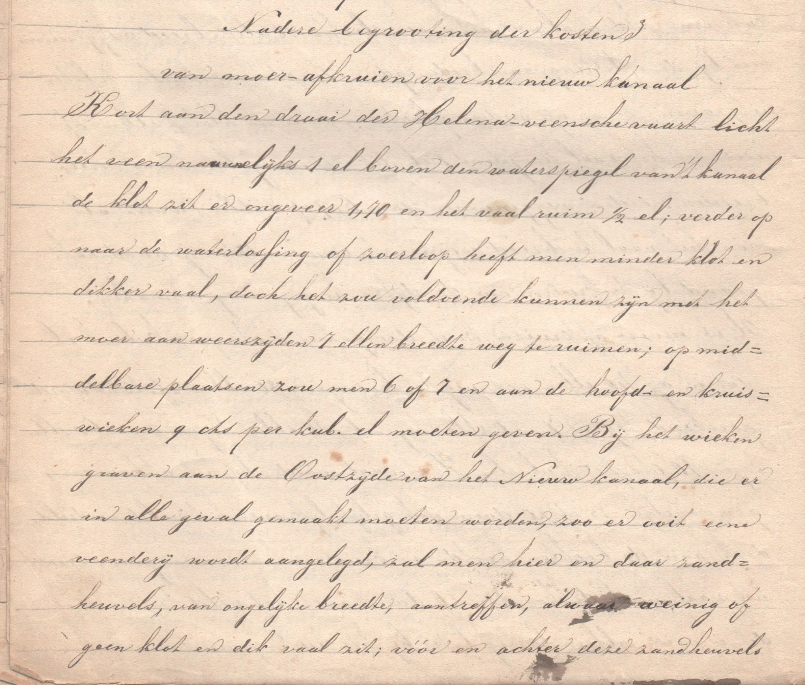

Bladzijde 6 en 7: Nadere begrooting der kosten van moer-afkruien voor het nieuw kanaal 3.

Nadere begrooting der kosten van moer-afkruien voor het nieuw kanaal 3

Kort aan den draai der Helena-veensche vaart licht het veen nauwelijks 1 el boven den waterspiegel van ’t kanaal de klot zit er ongeveer 1,70 en het vaal ruim ½ el; verder op naar de waterlossing of zoerloop heeft men minder klot en dikker vaal, doch het zou voldoende kunnen zijn met het moer aan weerszijden 7 ellen breedte weg te ruimen; op middelbare plaatsen zou men 6 of 7 en aan de hoofd- en kruiswieken 9 cts per kub. el moeten geven. Bij het wieken graven aan de Oostzijde van het Nieuw kanaal, die er in alle geval gemaakt moeten worden, zoo er ooit eene veenderij wordt aangelegd, zal men hier en daar zandheuvels, van ongelijke breedte, aantreffen, alwaar weinig of geen klot en dik vaal zit; voor en achter deze zandheuvels [blz. 7] zit de klot somtijds zeer diep en de kwaliteit van veenstof is er doorgaans het best.

Bladzijde 7: Slichten. 4.

Slichten. 4

Nadat het moer is afgekruid, moet het geslicht, dat is gelijk gemaakt en aangetrapt worden. Dit moet in het voorjaar, eer het moer te hard opdroogt, gedaan worden. Gewoonlijk geeft men van ’t slichten 10 cts per vierkante roede, dat is 10 fl het bunder; hoe dikker men het vaal gestort en dus minder veld bedekt heeft, hoe minder het slichten, op zekere lente van het kanaal, zal kosten. Gelijktijdig met het moer-afkruien moet er gezorgd worden, dat de blootgewerkte klot boven water blijft. Wanneer men vooraf de gribben één steek in de klot gemaakt heeft, zal het klot-bovenwaterhouden weinig of niets kosten.

Bladzijde 7: Turf-graven uit de splitting. 5.

Turf-graven uit de splitting. 5

Vroeger toen men, omdat men geene goede waterlossingen had, niet dieper kon laten graven dan 8 of 10 klim, liet men in het Helena-veen, even als aan de Dedemsvaart, de splittingen door Bovenlandsche ploegen 8 of 10 diep uitgraven. De Bovenlandsche ploegen bestonden destijds uit 10 man, als: 2 gravers, 1 haker, 1 karzetter, 3 kruiers en 2 bonkers, die tevens met den tienden man, de andere arbeiders op gestelde uren moesten aflossen en des noods holhaken, kruien of iets anders doen. De turf, welke de

Bladzijde 8: [vervolg] Turf-graven uit de splitting. 5.

[blz. 8] Duitschers graven is omtrent 41 duim lang, 12¼ duim breed en ruim 14½ duim dik; men heeft er van 320 onder den stok en 14400 in het dagwerk. Deze turf kostte van graven, ls de Duitschers zich met hun tien man konden behelpen, 10,55 fl; in de rechte splittingen konden zij zich redden, maar in de bochten, hoofd- en kruiswieken, waar ze somtijds 3 of 4 hakers noodig hadden, moesten er mannen, bijkruiers genaamd, aangesteld en afzonderlijk tegen een gulde per dagwerk betaald worden; op dergelijke plaatsen heb ik wel eens gezien, dat ze behalven hun eigen volk nog 7 bijkruiers tot zich hadden.

De klot, die, nadat de ploegen 8 of 10 klim hadden afgegraven, nog op den bodem bleef zitten, moest boven water gehouden en later uitgepolderd worden. Deze polderturf werd gegraven naar 19800 turven in het dagwerk. Bij het polderen groef men den klot niet breeder weg, dan het vaarwater moest worden, de walkanten, aan weerskanten, bleven op de eerste diepte liggen om later met zand en modder tot dijken aan te vullen. Ik kan niet zeggen, hoeveel de polderturf per dagwerk van graven kostte, doch ik weet wel, dat er weinig goeds, slechts stukken en brokken van te recht kwamen.

Later groeven de Bovenlanders de splittingen in een

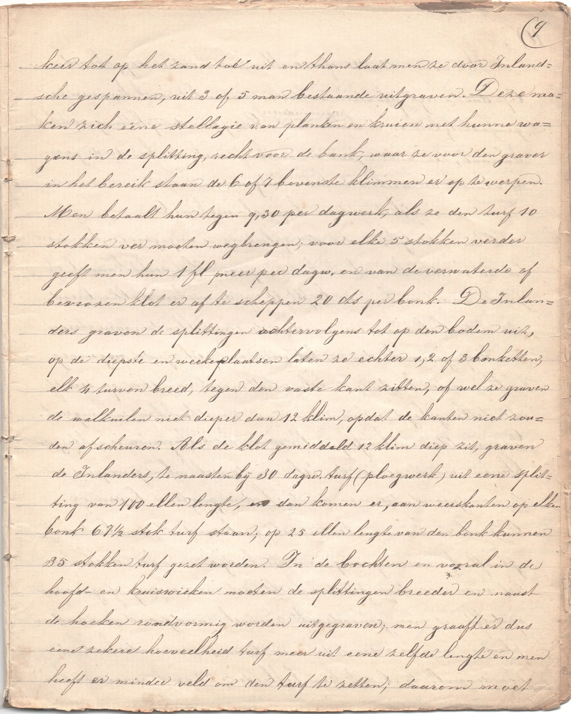

Bladzijde 9: [vervolg] Turf-graven uit de splitting. 5.

[blz. 9] keer tot op het zand toe uit en thans laat men ze door Inlandsche gespannen, uit 3 of 5 man bestaande uitgraven. Deze maken zich eene stellagie van planken en kruien met hunne wagens in de splitting, recht voor de bank, waar ze voor den graver in het bereik staan de 6 of 7 bovenste klimmen er op te werpen.

Men betaalt hun tegen 9,30 per dagwerk, als ze den turf 10 stokken ver moeten wegbrengen; voor elke 5 stokken verder geeft men hun 1 fl meer per dagw. en van de verwaterde of bevroren klot er af te scheppen 20 cts per bonk. De Inlanders graven de splittingen achtervolgens tot op den bodem uit, op de diepste en weeke plaatsen laten ze echter 1, 2 of 3 banketten, elk 4 turven breed, tegen den vaste kant zitten, of wel ze graven de walkuilen niet dieper dan 12 klim, opdat de kanten niet zouden afscheuren. Als de klot gemiddeld 12 klim diep zit, graven de Inlanders, te naasten bij 30 dagw. turf (ploegwerk) uit eene splitting van 100 ellen lengte, en dan komen er, aan weerskanten op elken bonk 67½ stok turf staan; op 25 ellen lengte van den bonk kunnen 35 stokken turf gezet worden. In de bochten en vooral in de hoofd- en kruiswieken moeten de splittingen breeder en naast de hoeken rondvormig worden uitgegraven; men graaft er dus eene zekere hoeveelheid turf meer uit eene zelfde lengte en men heeft er minder veld om den turf te zetten; daarom moet

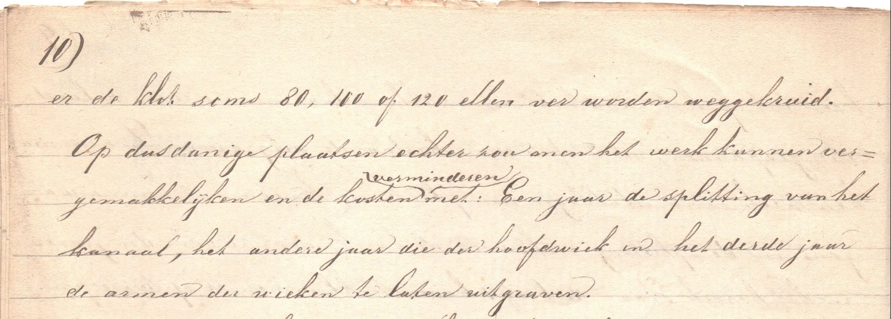

Bladzijde 10: [vervolg] Turf-graven uit de splitting. 5.

[blz. 10] er de klot soms 80, 100 of 120 ellen ver worden weggekruid.

Op dusdanige plaatsen echter zou men het werk kunnen vergemakkelijken en de kosten verminderen met: Een jaar de splitting van het kanaal, het ander jaar die der hoofdwiek in het derde jaar de armen der wieken te laten uitgraven.

Bladzijde 10: Het verdere kanaal-maken. 6.

Het verdere kanaal-maken. 6

Onmiddellijk, nadat de slitting is uitgegraven, kan men tot het verdere kanaal-maken overgaan. Het recht kanaal of groote vaart make men liefst 10 en de wieken 8 ellen breed. In het Helena-veen worden de verschillende vaarwateren zoo diep gemaakt, dat ze, het water aan peil zijnde, nagenoeg 2 ellen water houden; de telu wordt meest van één op één of iets steiler gelegd en van moer- en zandbrokken samengezet. De modder en brasserij, welke er van het turf-graven is achtergebleven, wordt achter den telu in de walkuilen geworpen en de zandgrond, die men uit den bodem graaft, er boven op. Overal, waar men, ten minste ½ el zand uit den bodem graaft, kan men genoegzaam sterke dijken maken, doch waar het veen zoo diep gezeten heeft, dat men weinig of geen zand opdelft, is men genoodzaakt zooveel zandgrond van andere plaatsen aan te voeren, dat men daarmee, inzonderheid den aardenwal, ½ el dik kan bekleeden; dit zand aanvoeren kost

Bladzijde 11: [vervolg] Het verdere kanaal-maken. 6.

[blz. 11] wel eens 16 cts per kub. el en het zand uit den bodem graven, naar het gelang der diepte, van 10 tot 16 cts per kubiek el.

Kort nadat men het vaarwater vol water heeft gezet, is het zeer goed den telu met een lijst van graszoden te voorzien. Deze graszoden steekt men verschillend van breedte, doch meestal ½ el lang; zij worden met houten pinnen zoodanig in den telu vastgemaakt, dat het water, 20 duim boven of beneden peil zijnde, altijd tegen deze graszoden, die weldra begroeien, kan aanspoelen.

Na het verrichten dezer werkzaamheden, moet er overal, waar de walkuilen geheel zijn vol geworpen, het vaal 1 stok breed worden weggeruimd; op andere plaatsen, waar de walkuilen gedeeltelijk vrij of de dijken te laag gebleven zijn, laat men zooveel vaal naar beneden werken, dat de dijken hoog genoeg en de walkuilen vol zijn. Van het vaal naar beneden werken geeft men doorgaans 2 cts en van ’t wegkruien 10 cts per kubiek el.

Bladzijde 11: Turf-graven op het hoog. 7.

Turf-graven op het hoog. 7

Nadat de splittingen uitgegraven en de vaarwateren gemaakt zijn, worden er telken jaar 2 of 3 kuilen, elk een stok breed, van het vast stuk uitgegraven. Men graaft langs de vaarwateren op en nadert alzoo met iedere kuil 2,45 verder tot de raaislooten, op figuur 1e door roode en op figuur 2e door zwarte lijnen aangeduid.

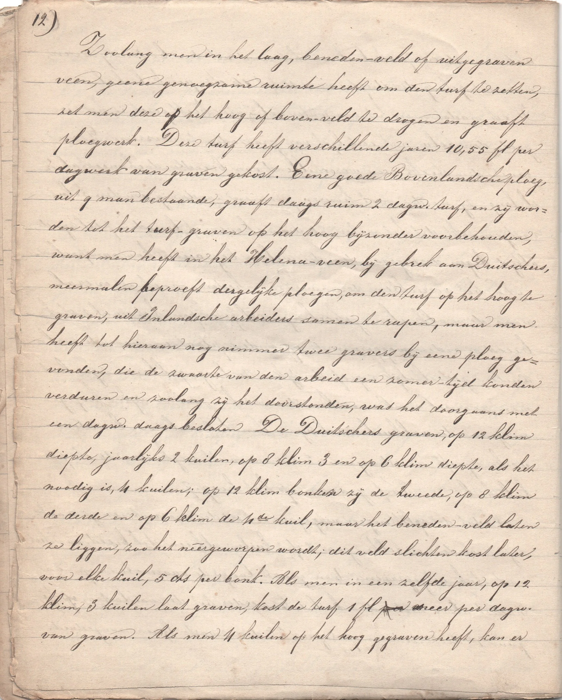

Bladzijde 12: [vervolg] Turf-graven op het hoog. 7

[blz. 12] Zoolang men in het laag, beneden-veld of uitgegraven veen, geene genoegzame ruimte heeft om den turf te zetten, zet men deze op het hoog of boven-veld te drogen en graaft ploegwerk. Deze turf heeft verschillende jaren 10,55 fl per dagwerk van graven gekost. Eene goede Bovenlandsche ploeg, uit 9 man bestaande, graaft daags ruim 2 dagen turf, en zij worden tot het turf-graven op het hoog bijzonder voorbehouden, want men heeft in het Helena-veen, bij gebrek aan Duitschers, meermalen beproeft dergelijke ploegen, om den turf op het hoog te graven, uit Inlandsche arbeiders samen te rapen, maar men heeft tot hieraan nog nimmer twee gravers bij eene ploeg gevonden, die de zwaarte van den arbeid een zomer-tijd konden verduren en zolang zij het doorstonden, was het doorgaans met een dag[werk] daags besloten. De Duitschers graven, op 12 klim diepte, jaarlijks 2 kuilen, op 8 klim 3 en op 6 klim diepte, als het noodig is, 4 kuilen; op 12 klim bonken zij de tweede, op 8 klim de derde en op 6 klim de 4de kuil, maar het beneden-veld laten ze liggen, zoo het neergeworpen wordt; dit veld slichten kost later, voor elke kuil, 5 cts per bonk. Als men in een zelfde jaar, op 12 klim, 3 kuilen laat graven, kost de turf 1 fl meer per dag[werk] van graven. Als men 4 kuilen op het hoog gegraven heeft, kan er

Bladzijde 13: [vervolg] Turf-graven op het hoog. 7

[blz. 13] eene kuil in het laag geplaatst worden; het 2de en 3de jaar dus kan men 3 kuilen en het 4de jaar 4 kuilen laten graven, zonder dat het graven meer, dan naar gewoonte, kost. Er moeten dus ten minste 6 en somtijds 8 kuilen op het hoog gezet worden; van 1 kuil, waar de klot 12 klim diep zit, graven de ploegen uit eene klink van 100 ellen of 10 bonken lengte, ongeveer 4 dag[werk] turf.

Bladzijde 13: Turf-graven in het laag. 8

Turf-graven in het laag. 8

De turf, die men op het uitgegraven veld te drogen zet, wordt algemeen groot- of waldijkerwerk genoemd; men graaft hem omtrent 43 duim lang, 13½ duim breed en ruim 15½ duim dik; men telt van dezen turf 288 onder den stok en 12960 in een dagwerk.

Deze turf wordt gegraven, zoowel door Inlandsche als Bovenlandsche gespannen, die meest uit 2 man bestaan, en kost 9,30 fl van graven. De gespan-gravers of waldijkers moeten op 12 klim diepte de tweede, op 8 klim de derde en op 6 klim de 4de kuil afbonken en overal, op welke plaats ze ook graven, 2 kuilen slichten en lichtstukken laten vallen. Het afbonken wordt gerekend tegen 50 cts per bonk, waar de klot 10 of 12 klim diep zit en tegen 60 cts, als de klot 6 of minder klim zit; aan de hoofd- en kruiswieken geeft men 60 of 70 cts per bonk. De Waldijkers graven uit elke kuil ruim 17 stokken turf, dat is: 170 stok uit eene klink. Nadat de ploegen 6 kuilen op het hoog

Bladzijde 14: [vervolg] Turf-graven in het laag. 8

[blz. 14] gegraven hebben, kunnen de waldijkers nog 15 jaren, dat is 30 kuilen in het laag graven. Een goed Bovenlandsch gespan graaft van Paaschen tot Sint Peter en Paulus (29 juli) 30 tot 34 dagwerken turf, terwijl de Inlandsche, die vroeger beginnen en later eindigen, meest beneden 25 dagen blijven.

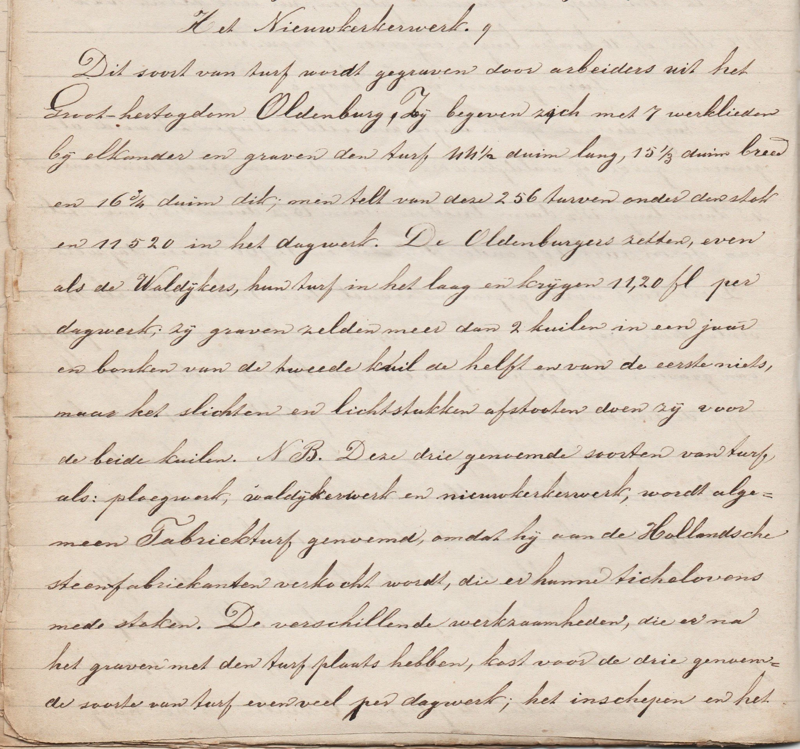

Bladzijde 14: Het Nieuwkerkerwerk. 9

Bladzijde 15: [vervolg] Het Nieuwkerkerwerk. 9

Het Nieuwkerkerwerk. 9

Dit soort van turf wordt gegraven door arbeiders uit het Groot-hertogdom Oldenburg. Zij begeven zich met 7 werklieden bij elkander en graven den turf 44½ duim lang, 151/3 duim breed en 16¾ duim dik; men telt van deze 256 turven onder den stok en 11520 in het dagwerk. De Oldenburgers zetten, even als de Waldijkers, hun turf in het laag en krijgen 11,20 fl per dagwerk; zij graven zelden meer dan 2 kuilen in een jaar en bonken van de tweede kuil de helft en van de eerste niets, maar het slichten en lichtstukken afstooten doen zij voor de beide kuilen. N.B. Deze drie genoemde soorten van turf, als: ploegwerk, waldijkerwerk en nieuwkerkerwerk, wordt algemeen Fabrieksturf genoemd, omdat hij aan de Hollandsche steenfabriekanten verkocht wordt, die er hunne tichelovens mede stoken. De verschillende werkzaamheden, die er na het graven met den turf plaats hebben, kost voor de drie genoemde soorte van turf evenveel per dagwerk; het inschepen en het [blz. 15] vervoer wordt naar de ton berekend.

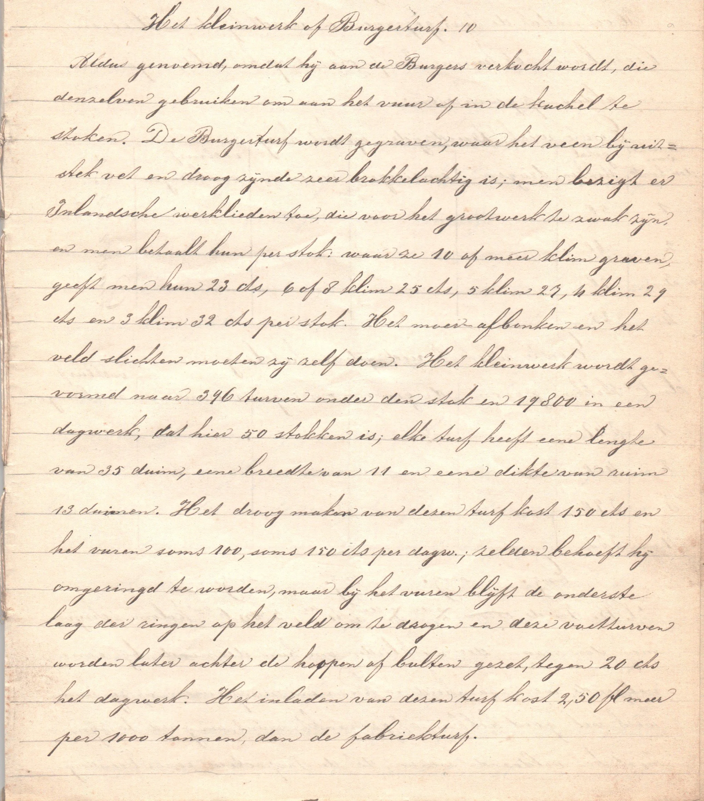

Bladzijde 15: Het kleinwerk of Burgerturf. 10

Het kleinwerk of Burgerturf. 10

Aldus genoemd, omdat hij aan de Burgers verkocht wordt, die denzelven gebruiken om aan het vuur of in de kachel te stoken. De Burgerturf wordt gegraven, waar het veen bij uitstek vet en droog zijnde zeer brokkelachtig is; men bezigt er Inlandsche werklieden toe, die voor het grootwerk zwak zijn, en men betaalt hun stok: waar ze 10 of meer klim graven, geeft men hun 23 cts, 6 of 8 klim 25 cts, 5 klim 27, 4 klim 29 cts en 3 klim 32 cts per stok. Het moer-afbonken en het veld slichten moeten zij zelf doen. Het kleinwerk wordt gevormd naar 396 turven onder den stok en 19800 in een dagwerk, dat hier 50 stokken is; elke turf heeft eene lengte van 35 duim, eene breedte van 11 en eene dikte van ruim 13 duimen. Het droog maken van dezen turf kost 150 cts en het vuren soms 100, soms 150 cts per dagw[erk].; zelden behoeft hij omringd te worden, maar bij het vuren blijft de onderste laag der ringen op het veld om te drogen en deze voetturven worden later achter de hoopen of bulten gezet, tegen 20 cts het dagwerk. Het inladen van dezen turf kost 2,50 fl meer per 1000 tonnen, dan de fabrieksturf.

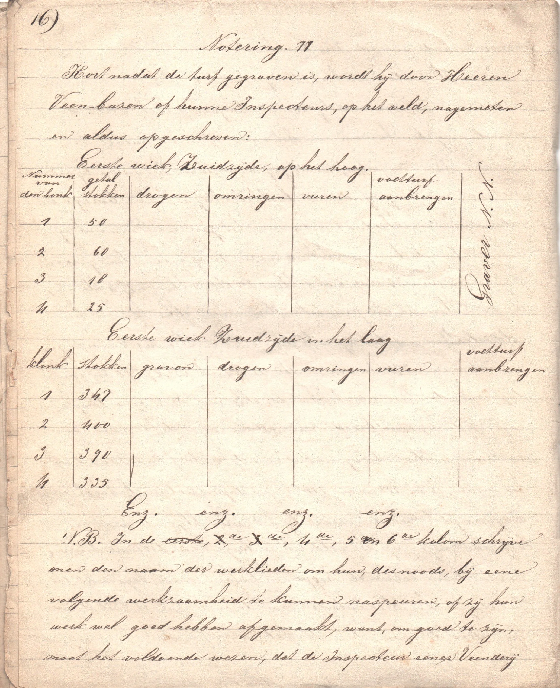

Bladzijde 16: Notering. 11 [of: Hoe de turf na het graven, gekadastreerd wordt]

Bladzijde 17: [vervolg] Notering. 11 [of: Hoe de turf na het graven, gekadastreerd wordt]

[blz. 16] Notering. 11

Kort nadat de turf gegraven is, wordt hij door Heeren Veen-bazen of hunne Inspecteurs, op het veld, nagemeten en aldus opgeschreven:

N.B. In de eerste, 2de, 3de, 4de, 5de en 6de kolom schrijve men den naam der werklieden om hun, desnoods, bij eene volgende werkzaamheid te kunnen naspeuren, of zij hun werk wel goed hebben afgemaakt, want, om goed te zijn, moet het voldoende wezen, dat de Inspecteur eener Veenderij [blz. 17] zijne werklieden alle twee of drie dagen eens komt opzoeken.

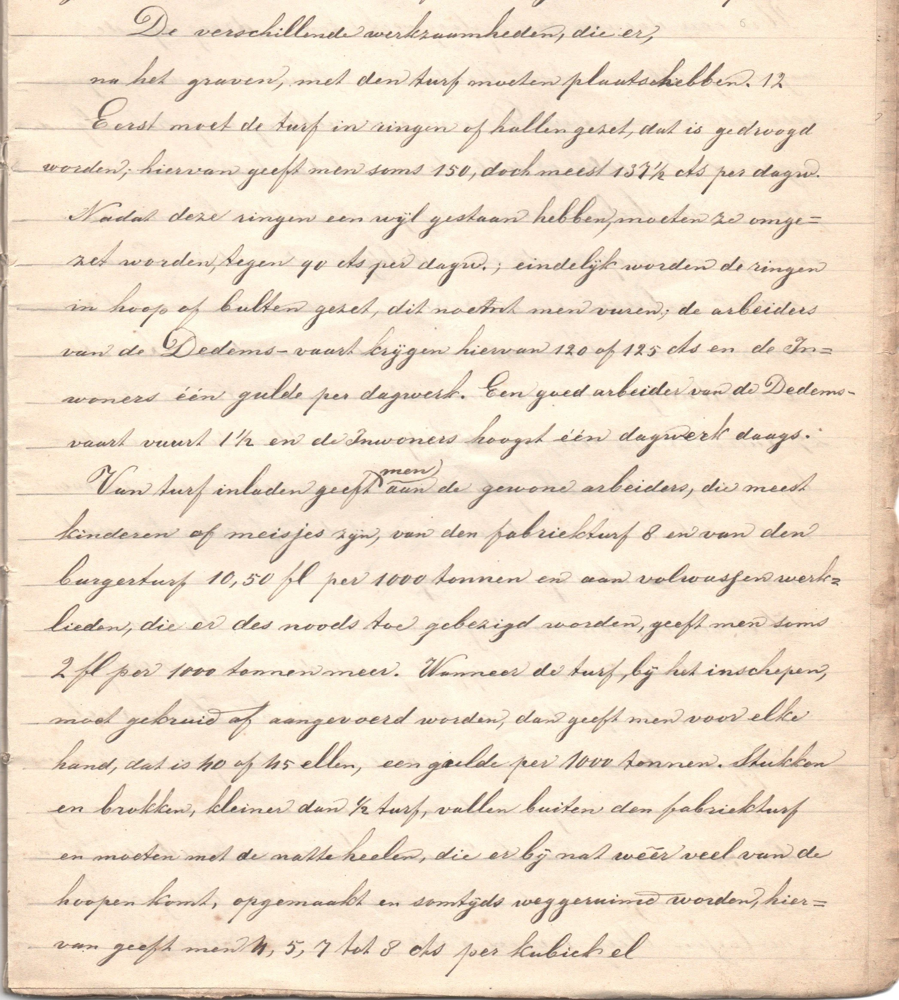

Bladzijde 17: De verschillende werkzaamheden, die er, na het graven, met den turf moeten plaats hebben. 12

De verschillende werkzaamheden, die er, na het graven, met den turf moeten plaats hebben. 12

Eerst moet de turf in ringen of hallen gezet, dat is gedroogd worden; hiervan geeft men soms 150, doch meest 137 ½ cts per dagw[erk]. Nadat deze ringen een wijl gestaan hebben, moeten ze omgezet worden, tegen 90 cts per dagw[erk]; eindelijk worden de ringen in hoop of bulten gezet, dit noemt men vuren; de arbeiders van de Dedems-vaart krijgen hiervan 120 of 125 cts en de Inwoners één gulde per dagwerk. Een goed arbeider van de Dedems-vaart vuurt 1 ½ en de Inwoners hoogst één dagwerk daags.

Van turf inladen geeft men aan de gewone arbeiders, die meest kinderen of meisjes zijn, van den fabrieksturf 8 en van den burgerturf 10,50 fl per 1000 tonnen en aan volwassen werklieden, die er des noods toe gebezigd worden, geeft men soms 2 fl per 1000 tonnen meer. Wanneer de turf, bij het inschepen, moet gekruid of aangevoerd worden, dan geeft men voor elke hand, dat is 40 of 45 ellen, een gulde per 1000 tonnen. Stukken en brokken, kleiner dan ½ turf, vallen buiten den fabrieksturf en moeten met de natte heelen, die er bij nat weer veel van de hoopen komt, opgemaakt en somtijds weggeruimd worden, hiervan geeft men 4, 5, 7 tot 8 cts per kubiek el.

[20251027|HvdL | wordt vervolgd]
