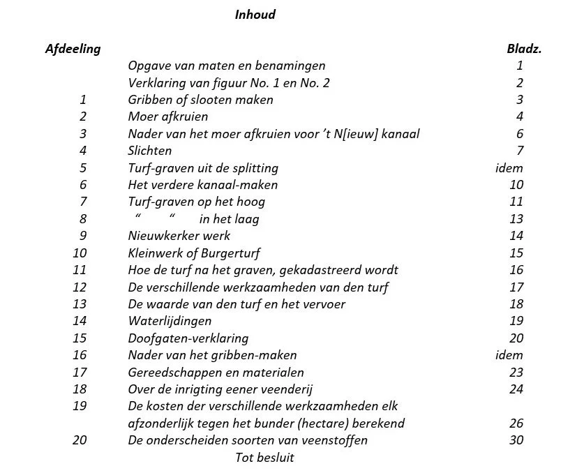
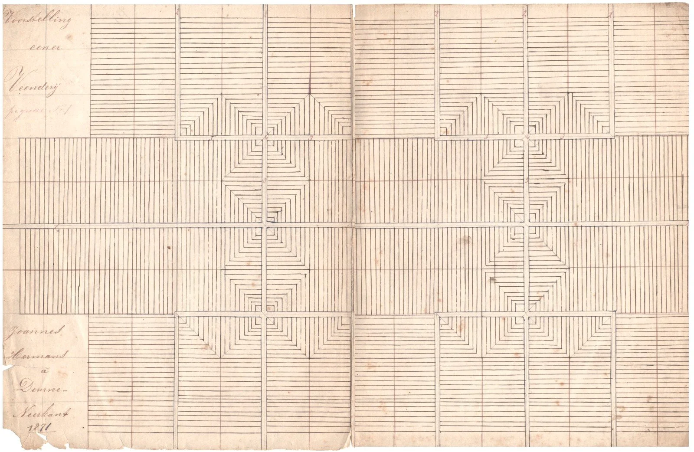
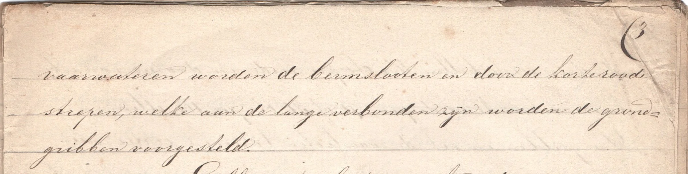
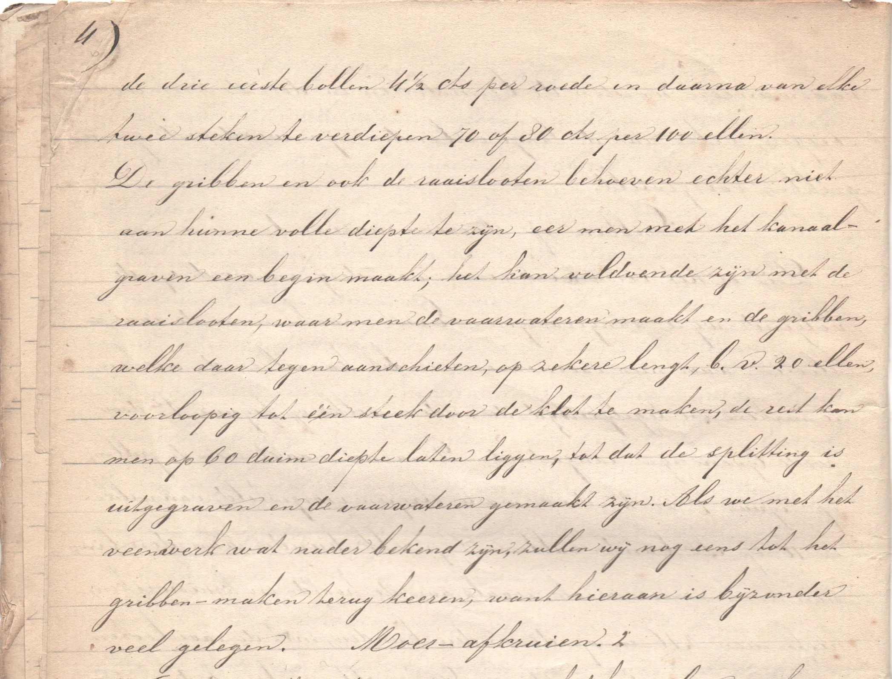

# veenbaas-jan-hermans

> Bron: helenaveenvantoen.nl

### Hoe een veenderij te maken en turf te graven volgens Joannes Hermans

Jan Hermans (1845-1897). (Foto: Deurnewiki.nl

Jan Hermans uit de Neerkant was voor 1875 veenbaas bij de Maatschappij Helenaveen. Later is hij veenbaas en directeur geworden bij de veenderij van de gemeente Deurne. In 1871 heeft hij uitgebreid beschreven hoe een nieuwe veenderij aan te leggen en te ontgraven. In zijn verhaal neemt hij ook allerlei informatie op over bijvoorbeeld de in een veenderij gebruikte termen, zoals dagwerk en stok, en over de maten van de turven. Die laatste waren afhankelijk van de herkomst van de turfstekers, zoals de Dedemsvaarders, de Duitsers en de Nieuwkerkers. En wat voor gereedschap gebruikten ze?

Hermans rekent alles door in geld om zo een betrouwbare begroting voor de aanleg van een nieuwe veenderij te verkrijgen. Lees hier wat Hermans in zijn schriftje schreef.

Titel van het verhaal van Jan Hermans.

Vergelijkende begrooting en opgave der werkzaamheden, welke er vereischt worden om eene nieuwe veenderij te ontginnen en op die wijze voort te zetten als in het Helena-veen en aan de Dedemsvaart, in Overijssel, gedaan wordt; voornamelijk het oog gevestigd op de nieuw aan te leggen veenderij onder de gemeente Deurne, waarvan meermalen is spraak geweest en zekere richting aangegeven:

(Daar we, zonder nader onderzoek geene begrooting kunnen maken, hoeveel het kanaal graven over het Meijelsche grondgebied zou kosten, zullen wij ons voorstellen met het kanaal gevorderd te zijn tot aan het veen.)

Bladzijde 1: Maten en benamingen, welke in het Helena-veen gebezigd worden

Maten en benamingen, welke in het Helena-veen gebezigd worden

Een stok, tot het meten van turf heeft 2,45 el lengte.

Een dagwerk turf is 45 vierkante stokken.

Een roede, bij het meten van gribben is 5 ellen Ned.

Een ton, tot het meten van drogen turf houdt 2 Ned. mudden.

Door een klim diepte wordt de dikte van een turf verstaan.

Als er bij kruiwerk van een hand gesproken wordt, dan bedoelt men daardoor zooveel ellen afstand als een kruier gepast kan afmaken, terwijl een ander zijne wagens vult.

Voor natten turf is een hand 5 stokken, voor drogen turf 45 el, en bij het moer afkruien 40 ellen.

Een bol (bij het gribben maken) is 20 en een steek 30 dm. diepte.

De naam van splitting wordt doorgaans gegeven aan ’t kanaal en zijne wieken van af men er het vaal heeft afgekruid, tot dat men ze vol water zet.

Het hoog is den algemeenen naam van het nog vast, en de naam van het laag geeft men aan het omgegraven veen.

10 bonken of 100 ellen lengte, dat is van de grondgrib tot de andere, noemt men gewoonlijk een put of klink.

Figuur No. 1: Voorstelling eener veenderij | Joannes Hermans á Deurne – Neerkant 1871.

Bladzijde 2: Verklaring der figuur No. 1.

Verklaring der figuur No. 1

De smalle vlakken, tusschen de blauwe lijnen, stellen de verschillende vaarwateren voor, als: 1o Het recht kanaal of groote vaart. 2o De onderscheiden wieken, welke het geheel veen door (200 ellen van elkander) moeten gemaakt worden. 3o De armen der wieken. 4o De kruiswieken. en 5o De hoofdwieken, welke in het kanaal uitloopen.

De roode strepen verbeelden de raaislooten, welke 100 ellen van elkander gemaakt worden. De zwarte lijnen bedoelen de eigenlijke gribben, welke men 10 ellen van elkander legt. De langwerpige vlakken, tusschen deze lijnen, worden voortdurend bonken genoemd.

Figuur No. 2: Voorstelling eener in zwang zijnde veenderij | J. Hermans Neerkant 1871.

Bladzijde 2 : Verklaring van figuur No. 2.

Verklaring van figuur No. 2

De breede, zwarte strepen stellen, even als de blauwe op figuur No. 1, de vaarwateren voor. De korte lijnen, in den vorm van kolommen, verbeelden de gribben en de zwarte streep door hun midden vervangt de roode lijn van fig. No. 1. Door de 7 opgaande en de 2 dwars liggende kolommen wordt het hoog of vast stuk veengrond aangeduid en de andere vlakken, waarop de roode strepen liggen, bedoelen het laag of uitgegraven veld. Door de roode lijnen langs de

Bladzijde 3 : [vervolg] Verklaring van figuur No. 2.

[blz. 3] vaarwateren worden de bermslooten en door de korte roode strepen, welke aan de lange verbonden zijn worden de grondgribben voorgesteld.

Bladzijde 3: Gribben of slooten maken.

Gribben of slooten maken. 1.

Dit is het eerste werk eener veenderij en wordt op de volgende wijze aangevangen: Eerst maakt men de raaislooten, waar men voornemens is het kanaal en de wieken te maken en tegelijkertijd de andere, welke op figuur 1e door roode lijnen zijn aangeduid. Daarna maakt men de gribben, op figuur 1o en 2o door zwarte strepen voorgesteld, van welke er 10 op elk bunder vallen. Op elk bunder aan den binnen hoek eener wiek, zooals aan de hoofd- en kruiswieken, heeft men 216 en op de andere bunders, met de raaislooten mede, 220 roeden gribben. De gribben, als ook de raaislooten, worden doorgaans op 65 of 70 duim breedte aangelegd en het eerste jaar 3 bollen of 60 duim diep gemaakt. Vervolgens worden de gribben ieder jaar, of zoo het veen niet te week is, twee malen in het jaar, telkenkeer twee steken verdiept, tot dat ze op schol veen 1 el, op middelmatig veen 1½ el en op het diep veen 1¾ el diep zijn. Het gribben-maken kost eerst 15 cts per 100 ellen van uitlijnen; vervolgens van

Bladzijde 4: [vervolg] Gribben of slooten maken.

[blz. 4] de drie eerste bollen 4½ cts per roode en daarna van elke twee steken te verdiepen 70 of 80 cts per 100 ellen.

De gribben en ook de raaislooten behoeven echter niet aan hunne volle diepte te zijn, eer men met het kanaalgraven een begin maakt; het kan voldoende zijn met de raaislooten, waar men de vaarwateren maakt en de gribben, welke daar tegen aanschieten, op zekere lengt, b.v. 20 ellen, voorlopig tot één steek door de klot te maken, de rest kan men op 60 duim diepte laten liggen, tot dat de splitting is uitgegraven en de vaarwateren gemaakt zijn. Als we met het veenwerk wat nader bekend zijn, zullen wij nog eens tot het gribben-maken terug keeren, want hieraan is bijzonder veel gelegen.

Bladzijde 4: Moer-afkruien.

Moer-afkruien. 2.

Dit wordt gedaan, waar men het kanaal en wieken maakt. Eer men hiermede begint, moet men de diepte van het veen gepeild hebben om te weten, hoe breed het moer moet weggeruimd worden. Op zekere plaatsen, waar het zwart veen of klot 1,75 el en het vaal ruim 1 el diep zit, laat men het vaal-moer doorgaans, aan weerskanten van de raaisloot, 10 ellen breed wegruimen, alsdan heeft men, nadat de klot er uitgegraven is, genoegzame ruimte om den

Bladzijde 5: [vervolg] Moer-afkruien.

[blz. 5] ondergrond, dat is het zand, dat men uit den bodem graaft, te bergen en de dijken, aan weerskanten, krijgen eene matige hoogte. Op ondiepe plaatsen (scholveen) is het gemakkelijker en wel zoo voordeelig vooraf het vaal 2, 4 of 6 ellen breeder te laten wegruimen, dan later het zand op die smalle ruimte, misschien hooger dan het oppervlak van den bovengrond, te moeten ophoopen. Op dergelijke plaatsen echter zou men zich kunnen redden, al was het moer slechts 10 ellen breed weggeruimd, met bij de splitting, aan beide zijden één of twee kuilen te laten uitgraven; maar op andere plaatsen, waar de klot 2 ellen of meer en het vaal hoogstens 1 el dik zit, mag het moer niet breeder worden weggenomen dan 6, 7 of 8 ellen, want als men het vaal te breed wegneemt, is men later genoodzaakt grond bij te kruien om de dijken hoog genoeg te maken.

Het moer afkruien kost doorgaan 8 cts per kubiek el, dat is op 40 ellen ver weg te brengen; 30 ellen afstand wordt gerekend tegen 7, 20 ellen tegen 6, 10 ellen tegen 5 en 60 ellen tegen 10 cts per kub. el., gewoonelijk 15 of 20 duim dik gelijkelijk over het veld verdeeld, doch aan de bochten, hoofd- en kruiswieken is men genoodzaakt het vaal veel dikker dan 20 duim over het veld te storten; dit is niet alleen lastig later bij het turf-graven, maar het

Bladzijde 6: [vervolg] Moer-afkruien.

[blz. 6] kost ook 10 cts per bank, dat is 36 fl per bunder meer van afbonken. In de bochten, maar vooral in de hoofd- en kruiswieken laat men thans, in het Helena-veen, een gedeelte van het vaal tot turf graven tegen 20 of 22 cts per stok, dat is ruim 9 cts per kub. el. Deze turf heeft, wel is waar, eene geringe waarde, doch kan de kosten van den arbeidsloon al licht opleveren.

Nadere begrooting der kosten van moer-afkruien voor het nieuw kanaal 3

[20250923|HvdL | wordt vervolgd]
