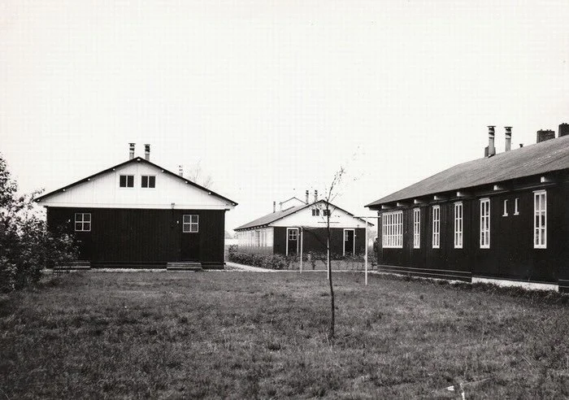
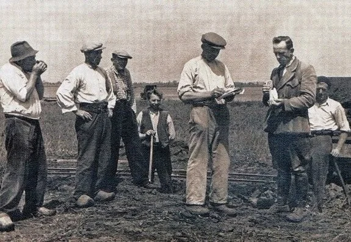
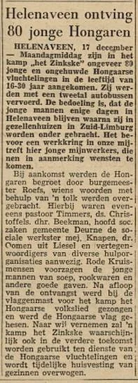
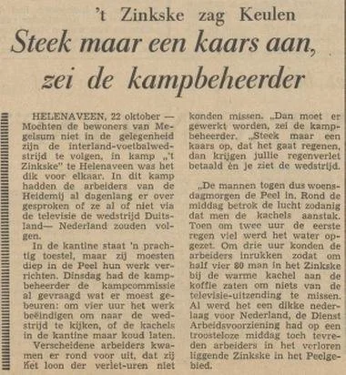
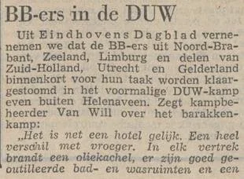
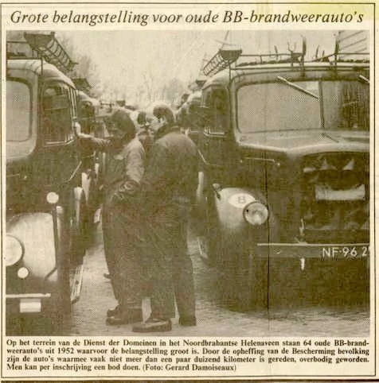

# zinkske-ss-kamp

> Bron: helenaveenvantoen.nl

## een veelbewogen geschiedenis

### Werkkamp het Zinkske

Nadat de vervening op het Zinkske was gestopt, werd In 1937 in opdracht van de gemeente Deurne gewerkt aan ontginning van de woeste grond tot landbouwgrond, Dat gebeurde in het kader van de werkverschaffing.

Veel werkelozen werden in de gemeente Deurne op het platteland aan het werk gezet. Vanuit de steden werden die werkelozen naar kampementen in Deurne overgebracht om er vervolgens een week door te moeten brengen en land te ontginnen tot landbouwgrond. Alleen zaterdagavond en zondag konden zij thuis zijn. Werkelozen die weigerden of zij die het werk niet konden volhouden kregen geen steun en waren aangewezen op de armenzorg.

Werkverschaffing in Deurne (bron deurnewiki)

Bij een ontginning van een uitgeveend gebied werden kipkarren gebruikt bij het aanleggen van wegen, het graven van sloten en het dempen van turfvaarten en zijkanalen. De lading werd dus steeds op andere plaatsen gelost. Dat ging relatief makkelijk door het kippen van de V-vormige kipbak.

De kipkarren op het Kerkplein zijn een herinnering aan de ontginningen na het vervenen. Ze zijn dus niet gebruikt voor het graven van turf,

in 1939 werd de rijksdienst voor de werkverruiming opgericht die de organisatie van het werk overnam van de gemeente en in 1940 het kamp op het Zinkske bouwde,

De Rijksdienst voor de Werkverruiming bouwde Kamp Zinkske

### De nedelandse SS neemt het kamp in de oorlog over.

Rost van Tonningen richtte met instemming van Reichskommissar A. Seyss-Inquart, de Nederlandse Oost-Compagnie (NOC) op.

Op uitnodiging van het Berlijnse Ostministerium ondernam Rost met een aantal NSB'ers in juni een reis naar Ostland, de voormalige Baltische landen, en in september naar de Oekraïne, waar hij op hoog niveau besprekingen voerde over de "inzet van Nederlandse pioniers in het Oosten". De NOC moest Nederlandse kolonisten uitzenden naar de gebieden die door de Duitsers op de Sovjet-Unie veroverd waren.

In 1943 werd het kamp op het Zinkske in gebruik genomen als scholingskamp voor de Nederlandse Oost-Compagnie N.V., waar opleidingen werden verzorgd voor SS-frontarbeiders, boeren en tuinders voor een uitzending naar het oosten.

Uiteindelijk vertrokken daadwerkelijk ongeveer tweehonderd gegadigden. Wel lukte het om zo’n 4.500 SS-Frontarbeiders in te zetten om wegen en verdedigingswerken aan te leggen in het bezette gebied.

Misschien wilden ze in Litauen een nieuw Helenaveen stichten.

Mannen van de NOC vertrekken naar het oosten

### De overval op het SS kamp

Toon Kortooms vertelt in zijn boek de zwarte plak over een overval op het SS kamp in Helenaveen. Het is echter een geromantiseerd verhaal waarin de mensen van de Zwarte Plak centraal gezet zijn.

Omslag van het boek van Toon Kortooms

De echte geschiedenis van de overval door het Helenaveense verzet staat hieronder.Dit verhaal over een gewaagde overval op het SS kamp is geschreven door Jan B.F. Versteegen, Opperwachtmeester der rijkspolitie. Gestationeerd te Helenaveen tijdens de bezetting. Hij was inwonend bij de familie Ulens aan de Geldersestraat.

Het onderstaande relaas is een onderdeel van het Oorlogsdagboek van Jan Verstegen die tijdens de Kerkrazzzia met de Helenaveense mannen naar Duitsland is gedeporteerd.

Oorlogsdagboek van Jan Verstegen September 1944.

De Peel is ook in deze tijd uit zijn evenwicht. Het anders zo rustige dorpje Helenaveen (ook genaamd ‘de Oude Peel’), gelegen aan de rand van de Peel, in een uithoek van Brabant en grenzende aan ons mooie Limburg, is in onrust. Helenaveen, waar sinds jaren nijvere tuinders en boeren hun bedrijf uitoefenen, waar de turf nog wordt gestoken door een enkeling met zijn speciale turfschop.

Waar juist in deze tijd de boeren en tuinders hun zelfgestoken en gedroogde turf met de klotkar naar huis brengen om er in de komende winter van te stoken. Deze kalme bevolking is in onzekerheid. Zal ook nu weer de Peel, onze eigen Peel, het slagveld worden? De toekomst zal dit moeten bevestigen. (De Peel vooral zal een zware tol voor de algehele vrijheid moeten betalen.)

Helenaveen is de standplaats, mij door mijn superieuren aangewezen, waar ik mijn diensten in het algemeen belang en tot handhaving van wetten zal hebben te verrichten. Het plaatsje telt circa 1000 zielen en in deze tijd hebben er enkele honderden onderduikers een onderkomen gevonden. Joden, saboteurs en jongens die niet in Duitsland willen gaan werken. Iedere goede vaderlander wordt er geholpen.

Aan sabotage plegen, wat mijn plicht als goed vaderlander is, kan ik in Helenaveen werkelijk weinig doen. Op ander plaatsen en vooral tijdens mijn detachering aan de grens was er bijna dagelijks gelegenheid de Duitse bevelen te dwarsbomen. Doch vandaag, ‘Dolle Dinsdag’, kan ik hopelijk ook in Helenaveen iets meer materieels voor ons land doen. Op het ‘Zinkske’ is een kamp van de Nederlandse Oostcompagnie gevestigd. Hier worden officieel boerenjongens opgeleid om in Rusland te gaan werken. In werkelijkheid is het een opleidingskamp voor Nederlandse SS-ers. Hoe vaak heb ik ze ’s morgensvroeg niet zien marcheren, gewapend met geweren. Meerdere malen heb ik ze zien oefenen met machinegeweren en droeg de leiding van het kamp niet het zó gehate SS-uniform!! Ik was te weten gekomen dat vele – zo niet alle aspirant SS-ers – in de afgelopen nacht hals over kop het kamp hadden verlaten. Ik wilde daar meer van weten en besprak dit met mijn goede vriend, de veldwachter Toon Joosten. Toon was in Helenaveen zowat de vervangend burgemeester. Hij was kuikenbroeder, nam de lichtmeters op, inde gelden, hield toezicht op de hondenbelasting en nog veel meer; daarbij was hij nog onbezoldigd gemeenteveldwachter. Ik wilde – als het lukte – de in het kamp aanwezige wapens zien te bemachtigen en, zoals ik van te voren al wist, Toon deed overal aan mee.

Omstreeks 10 uur op deze beroemde dinsdag fietsten we samen naar het kamp. Na wat geschreeuw en geroep van mij, werd het toegangshek voor ons geopend en verzocht ik toelating tot de kampcommandant. Nadat de poort weer zorgvuldig achter ons was gesloten, werden we toegelaten tot een officier van de SS, die wel de commandant zal zijn geweest. Ik deelde hem mede dat ik was gekomen in opdracht van de burgemeester. Deze had van een generaal van de Wehrmacht opdracht gekregen in Helenaveen kwartier te maken voor een 1000-tal militairen, die elk moment in Helenaveen hun stellingen konden betrekken. De scholen in Helenaveen waren hiervoor ongeschikt en te klein. Daar de opdracht luidde dat er voldoende ruimte moest zijn voor de legering van de soldaten, was ik hier, omdat het kamp de enigste plaats met voldoende ruimte was. Ik kreeg ten antwoord dat hij niets met de Wehrmacht te maken had en dat de generaal maar bij hem moest komen. Ik hield me echter aan mijn opdracht en na veel gepraat liet hij doorschemeren dat het kamp praktisch verlaten was en dat hij een officier naar Venlo had gestuurd voor nadere instructies. Als die officier om 2 uur niet terug was zou hij zelf met de anderen ook vertrekken. Ik vroeg hem wat ik dan moest doen wanneer de soldaten kwamen als hij weg was en zei hem dat hij mij de sleutels van het kamp wel kon geven. Hij vroeg toen waar ik woonde en zegde toe de sleutels bij zijn vertrek te zullen brengen. Het mij gestelde doel bleek zelfs beter te lopen dan ik kon verwachten. Met een, van zijn kant, vriendelijke handdruk namen we afscheid, nadat we elk nog een kilo suiker meekregen. De gehele middag zat ik in spanning of de sleutel van het kamp zou worden gebracht. Om 4 uur hield ik het niet langer uit en fietste naar Toon Joosten. Samen gingen we weer op stap. In de nabijheid van het kamp vleiden wij ons in de ruige Peel en observeerden door een verrekijker de bewegingen in het kamp. Toen we bemerkten dat er voorbereidingen werden getroffen om het kamp te verlaten, fietsten we weer naar de weg om de sleutels in ontvangst te nemen. Toen we weer bij het kamp kwamen werd dit juist door de officier afgesloten. Ik stapte van mijn fiets en vroeg hem om de sleutels. Hij gaf ze me echter niet omdat hij de volgende dag terug kwam. Als de Wehrmacht kwam, zei hij, zeg dan namens mij dat het toegangshek door hen kan worden opengebroken. Ik heb de slaapzalen en de wasgelegenheid niet afgesloten, dus daar kunnen ze dan in. Dit was voor ons wel een tegenslag maar we wisten al weer iets meer.

Nadat de SS-ers vertrokken waren in de richting Venlo, fietsten we samen nog een uurtje rond en hielden alles goed in de gaten. Omdat er geen onraad te bespeuren viel, deden wij zoals de Wehrmacht was toegestaan en braken rond 6 uur het toegangshek van het kamp open. Onze verkenningstocht kon beginnen. Al gauw bleek dat de slaapzalen niet afgesloten waren. Het was er een grote rommel en uit alles bleek dat de toekomstige helden nogal haast hadden gehad om weg te komen. Er was in die slaapzalen alleen achtergebleven kleding en uitrusting, trommels, doosjes, schoenen en enkele bajonetten.

Bij onze verdere inspectietocht bleken alle deuren en ramen goed te zijn gesloten. Echter niet goed genoeg voor ons. Met een gevonden bajonet werd een raamluik opengebroken en sneuvelde er al gauw een ruit. Ik klom naar binnen, gevolgd door Toon. Alle bureaus en kamers werden door ons doorzocht, doch we vonden niet wat we zochten. Hoewel we al verschillende deuren hadden geforceerd, waren er nog enkele die we niet open konden krijgen. In een hal ontdekte ik echter een sleutelbord met meer dan 100 sleutels. Koortsachtig werd sleutel voor sleutel geprobeerd op de nog gesloten deuren. Regelmatig moesten we daarbij de omgeving observeren om niet onverhoeds met de tegenpartij geconfronteerd te worden. Eindelijk had ik een kast geopend en vond daarin 2 geweren en een hoeveelheid munitie. In een andere kast vonden we 20 pistolen en een grote voorraad munitie en toen we tenslotte een deur in de kelder hadden versplinterd kregen we de beschikking over meer dan 50 geweren en enkele machinegeweren benevens een flinke hoeveelheid munitie. We waren dik tevreden.

Het was intussen al schemerdonker geworden en hoewel het kamp niet direct in de bewoonde omgeving lag, zullen we wel zoveel lawaai gemaakt hebben dat er al gauw iemand lucht kreeg van onze inbraak. Rond 9 uur bespeurde ik dat tenminste twee personen van de weg naar het kamp kwamen geslopen. Wij hielden ons doodstil en met het geladen pistool in de vuist lieten we ze dichterbij komen. Gelukkig droegen ze geen uniform en toen ik naar de ingang liep, gedekt door Toon, bleken het 2 bekende verzetsmannen te zijn: Jan Klerks en Kees Crommentuijn. Nadat ze van onze vondst hadden gehoord was er al gauw een verdwenen om hulp te halen. Nu we met meerdere waren werden er twee met een geladen nieuw pistool op wacht gezet. Ik bracht voor alle zekerheid nog een machinegeweer in stelling om op onverhoopte verrassingen voorbereid te zijn. Tegen middernacht besloten we de wapens weg te brengen. Hiervoor werden ingeschakeld de gebroeders Van der Zwaan, die het dichtst bij het kamp woonden. Met hun handkar werd de helft van de wapens naar Liessel gebracht, alwaar ze door de plaatselijke verzetsbeweging met grote dank werden aanvaard. De andere helft van de wapens werd naar Helenaveen vervoerd en opgeslagen op de vliering van een aan de rand van het dorp staand PNEM-huisje. Alleen Toon had hiervan de sleutels en dus waren ze daar wel veilig. Tevens werden daarin opgeslagen een tiental radio’s die we en passant meenamen.Het was 4 uur in de nacht toen Toon en ik elk ons bed opzochten.6 septemberAfwisselend hebben Toon Joosten en ik het kamp en de toegangsweg geobserveerd. Wij hielden rekening met de terugkomst van de SS en hun eventuele reactie op de kraak in hun kamp. Rond de middag zagen wij de kampcommandant naar het kamp rijden. Het zal wel de moeite waard zijn geweest om zijn gezicht te zien toen hij ontdekte wat er in het kamp was gebeurd. We waren niet zo brutaal om een praatje met hem te gaan maken. Zaak was het te verhinderen dat hij zijn ontdekking aan anderen kon mededelen. De telefoon in het kamp hadden wij bij ons ‘bezoek’ buiten werking gesteld, evenals de stroomtoevoer.

De verzetsgroep van Liessel had op zich genomen de naar het kamp terugkerende SS-ers uit de weg te ruimen. Door ons werd deze groep in kennis gesteld van de terugkeer van de commandant. Rond 5 uur ’s middags zagen we dat hij het kamp weer verliet en de verzetsgroep werd door een afgesproken sein op de hoogte gebracht. Door een misverstand of door een andere omstandigheid gebeurde er echter niets en de commandant keerde rustig naar Venlo terug. Toon en ik waren woedend. Wie weet wat er nu ging gebeuren. Het werd daarom voor ons beiden tijd goed uit te kijken en onder te duiken. Die nacht sliepen we niet in ons eigen bed. We vonden onderdak bij Manus Sonnemans, wiens woning wat afgelegen stond en naar alle kanten uitwijkmogelijkheden bood. Het bed op de opkamer was prima, doch van slapen met een geladen pistool onder het kussen kwam niet veel. Verschillende onderduikers werden nog gewaarschuwd, dat rekening moest worden gehouden met een razzia van de Duitsers. 7 septemberWat we gevreesd hadden, razzia of represailles van de Duitsers in de afgelopen nacht, was niet gebeurd. Voorlopig borg ik mijn uniform maar op. In een overall zou ik niet zo opvallen indien de SS eens terug mocht komen. Een pistool droegen we steeds bij ons.

De kampcommandant of andere SS-ers vandaag niet gezien. Ik vermoed dat hij van het gebeurde geen melding heeft durven maken omdat hij zelf zijn post had verlaten of in de chaos van terugtrekkende troepen hadden ze geen tijd voor zo’n kleinigheid. Op verschillende plaatsen vielen vandaag slachtoffers onder de woede der Duitsers. In Griendtsveen zijn vanavond twee leden van de verzetsgroep, die een trein hadden laten ontsporen, door de Duitsers doodgeschoten.8 septemberIn Liessel is vanmiddag een lid van de verzetsgroep, die in het bezit was van een pistool afkomstig uit het kamp op ’t Zinkske, op straat neergeschoten. Mijn collega’s te Liessel en Neerkant moeten hierna ook onderduiken. 9 septemberSteeds meer Duitsers trekken door de Peel terug op Venlo. Sommigen zijn van hun onderdeel afgeraakt, anderen zijn gedeserteerd en proberen zo vlug mogelijk naar hun Heimat terug te keren.

Er is bij ons geen enkele fiets of wat daar nog op lijkt veilig.

In de late avond dragen wij de wapens, die in het PNEM-huisje waren verborgen, over aan de verzetsgroep van Sevenum. Toon en ik nemen elk een radio in tijdelijk gebruik en de rest gaat ook naar de verzetsgroep. Zelf houd ik nog enkele pistolen en een partij patronen.

Het vervolg van het dagboek, over zijn lotgevallen als dwangarbeider van de kerkrazzia vindt u hier.

### Na de oorlog DUW-kamp

Na de oorlog werd het kamp in gebruik genomen als rijkskamp, namelijk van de Rijksdienst van de Uitvoering Werken (Dienst Uitvoering Werken), die er al een grote boerderij bezat.

De Dienst Uitvoering Werken (DUW) was een overheidsinstantie, die in 1944 ter regulering van de onvrijwillige werkloosheid door het Militair Gezag in Nederland werd opgericht.

Rond 1948/1949 verkocht de gemeente Deurne boerderij, schuur, erf aan de Staat (Sociale Zaken). De oude barakken of wat daar nog van over was werden vervangen. De werkzaamheden op het al "gezuiverde" terrein moesten echter worden gestaakt toen er toch weer landmijnen werden aangetroffen.

Inrichting

Een DUW-kamp bestond vaak uit twee woonbarakken met ieder zes wooneenheden voor acht personen. Het was dus geschikt voor bewoning door 96 personen. Een wooneenheid bestond uit een ruimte met acht stapelbedden voorzien van strozakken. Aansluitend was een woonkamer met eettafel en stoelen. De gehele ruimte moest verwarmd worden met één kachel. Er was een klein aanrecht in de eetkamer. Beide vertrekken hadden een oppervlakte van achttien vierkante meter. Verder was er meestal een toiletgebouw, een waslokaal, een magazijn en een pompgebouw voor de eigen watervoorziening op het terrein.

Beheerder

Een kamp werd gerund door een beheerder die tevens kok was, de zo genoemde kok/beheerder. In Helenaveen was dat de Hr. Boeije

DUW-arbeiders in de Peel

Toon Verhees, opzichter bij DUW.

DUW in de Peel, bezoek van de opzichter

### Vanaf 1956 Dienst arbeidsvoorziening

Nadat er enige tijd geen arbeiders woonden, vermoedelijk vanwege de opheffing van de Dienst Uitvoering Werken (DUW) in 1954 werd het kamp in januari 1956 weer bevolkt door arbeiders voor de verdere ontginning van de Peel. De daar gevestigde arbeiders zorgden een enkele keer voor de verstoring van de openbare orde.

De nieuwe Limburger 30-01-1956

### Hongaarse vluchtelingen

In november 1956 werd er plek gecreëerd voor de huisvesting van 144 Hongaarse vluchtelingen in het kamp.

Dagblad voor Noord-Limburg 18-12-1956

### Heidemij Opnieuw arbeidskamp

Later werd het kamp opnieuw door arbeiders van de Heidemij bewoond, een situatie die na afsluiting van de ontginning tussen 1960 en 1962 beëindigd werd.

In het kamp stond een televisie-relaisstation voor West-Duitsland, waardoor er een uitstekende tv-ontvangst was. Televisie was toen nog een grote bijzonderheid.

Gazet van Limburg 21-04-1953

Dagblad voor noord Limburg 23-10 1959

### Internationaal werkkamp voor studenten

In juli 1962 werd het kamp herbestemd tot internationaal werkkamp voor studenten.

Algemeen Handelsblad 18-07-1962

### Oefenkamp Bescherming Bevolking

Eind 1963 kreeg het opnieuw een andere bestemming, namelijk als oefenkamp voor de Bescherming Bevolking (BB).

Algemeen Dagblad 12-10-1965

De waarheid 14-10-1965

Later werden ook de grote loodsen gebouwd met daarin materiaal voor de BB-organisatie, o.a. vrachtwagens, brandweerauto’s, inrichting noodhospitalen, stralingsmeetapparatuur, enz enz.

Harrie van Will werd in 1964 benoemd tot beheerder, kok en kantinebeheerder van het oefenkamp Zuid in Helenaveen. Als zodanig ging hij in 1970 met pensioen, verhuisde naar Liessel, maar bleef om nog wat omhanden te hebben samen met zijn echtgenote de kantine van dit kamp beheren.

Harrie van Will, de laatste beheerder van het Kamp

In januari 1984 vond er op het terrein een verkoop van goederen van de BB plaats vanwege de opheffing van de Bescherming Bevolking.

NRC Handelsblad 10-01-1984

JvW 20 januari 2025Bonnen: Deurne Wiki, Wikipedia, Dagboek opperwachtmeester Versteegen.
