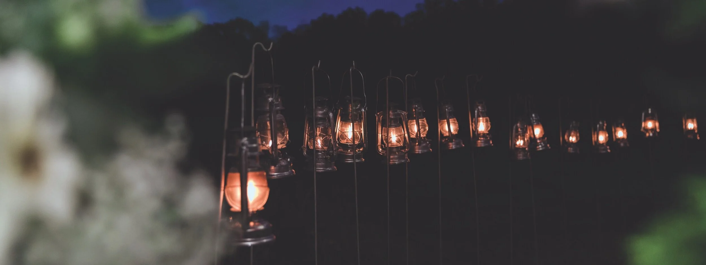

# ansichtkaartren

> Bron: helenaveenvantoen.nl

# herdenkingsweekend

## 22, 23 & 24 november 2019

Herdenking Kerkrazzia 2019

# vrijdag

### Opening Herdenkingsweekend 2019

Ophalen van het bevrijdingsvuur door Jeugdwerk

vrij 22 november, 18:00 uur

Aankomst bevrijdingsvuur in Helenaveen &ontsteken bij oorlogsmonument

vrij 22 november, 19:00 uurtoegang gratisPlein aan Oude Peelstraat, Helenaveen

### Boekpresentatie: Helenaveen bezet en bevrijd

Door werkgroep Helenaveen Bezet en Bevrijd vrij 22 november, 20:00 uur (de bestelde boeken zijn vanaf 21:00 uur op te halen)toegang gratisDorpscentrum De Gouden Helm, Helenaveen

### Tentoonstelling

Oorlogsmaterialen en schilderijen Renatusvrij 22 november, 20:00 uurtoegang gratisDorpscentrum De Gouden Helm, Helenaveen

# zaterdag

### Tentoonstelling

met zang Golden Oldiesza 23 november, vanaf 10:00 uurtoegang gratisDorpscentrum De Gouden Helm, Helenaveen

### Fietstochten: Death Valley & De Peel bevrijd

za 23 november, vanaf 10:00 uurop eigen gelegenheid, route gratisstart De Peelbascule, Helenaveen

### Uitwisseling: In gesprek met oorlogsoverlevenden

za 23 november, 10:15 — 11:00 uur, 11:00 — 11:45 uur, 13:15 — 14:00 uurdeelname gratis, ter plekke meldenDorpscentrum De Gouden Helm, Helenaveen

### Film: De bevrijding van Zuidoost Brabant en de Peel

Door Rob Smitza 23 november, 15:00 uur€ 5 p.p. incl. 2x koffie/theeRooms Katholieke kerk, Helenaveen

### Lezing: De hel van Watenstedt

Door Heidi Geven, samen met Duitse gasten uit Hildesheimza 23 november, 19:30 uur€ 5 p.p. incl. 2x koffie/theeDorpscentrum De Gouden Helm, Helenaveen

# ZONDAG

### Oecumenische Kerkdienst

Met Duitse gasten uit Hildesheim en de burgemeester van Deurnezo 24 november, 10:00 uurRooms Katholieke kerk gevolgd door koffie in Dorpscentrum De Gouden Helm, Helenaveen

### Tentoonstelling

met zang Golden Oldieszo 24 november, vanaf 10:00 uurtoegang gratisDorpscentrum De Gouden Helm, Helenaveen

### Fietstochten: Death Valley & De Peel bevrijd

za 23 november, vanaf 10:00 uurop eigen gelegenheid, route gratisstart voor Dorpscentrum De Gouden Helm, Helenaveen

### Uitwisseling: In gesprek met oorlogsoverlevenden

zo 24 november, 11:15 — 12:00 uur, 12:15 — 13:00 uur, 13:15 — 14:00 uurdeelname gratis, ter plekke meldenDorpscentrum De Gouden Helm, Helenaveen

### Voorstelling: Laurens in de oorlog

Door ’t Peels Toneel, Muziekvereniging Wilona, Show- en dansgroep Take-Off en BS de Peelparelzo 24 november, 14:30 – 15:30 uur€ 5 p.p. incl. 2x koffie/theeDorpscentrum De Gouden Helm, Helenaveen

### Voorstelling: Laurens in de oorlog

Door ’t Peels Toneel, Muziekvereniging Wilona, Show- en dansgroep Take-Off en BS de Peelparelzo 24 november, 17:00 – 18:00 uur€ 5 p.p. incl. 2x koffie/theeDorpscentrum De Gouden Helm, Helenaveen

### Afsluiting Herdenkingsweekend

zo 24 november, 18:30 uurDorpscentrum De Gouden Helm en Plein Oude Peelstraat, Helenaveen
