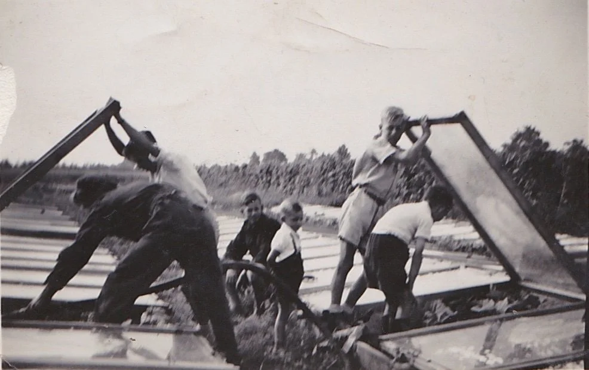
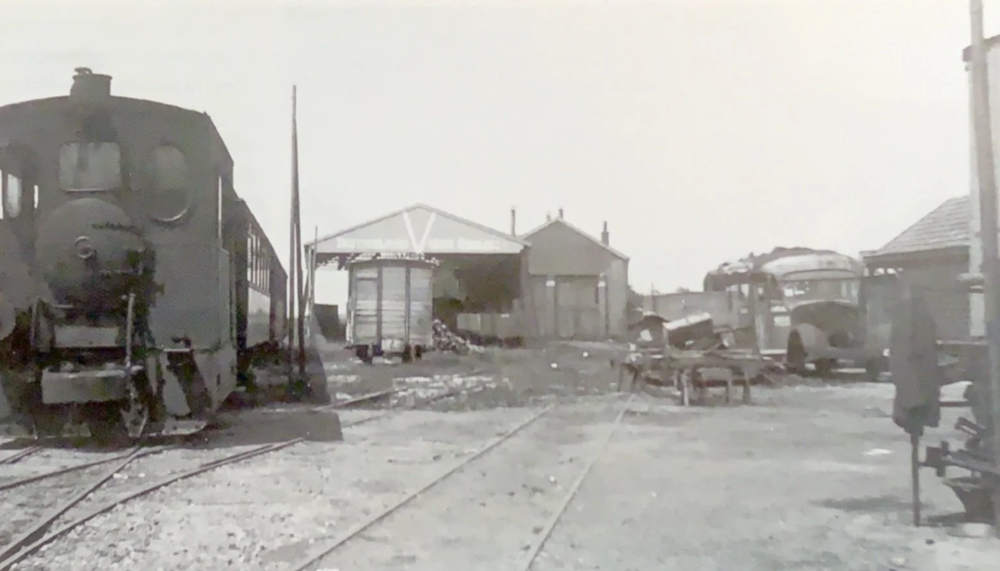
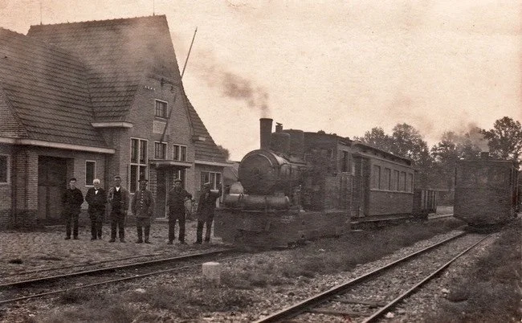
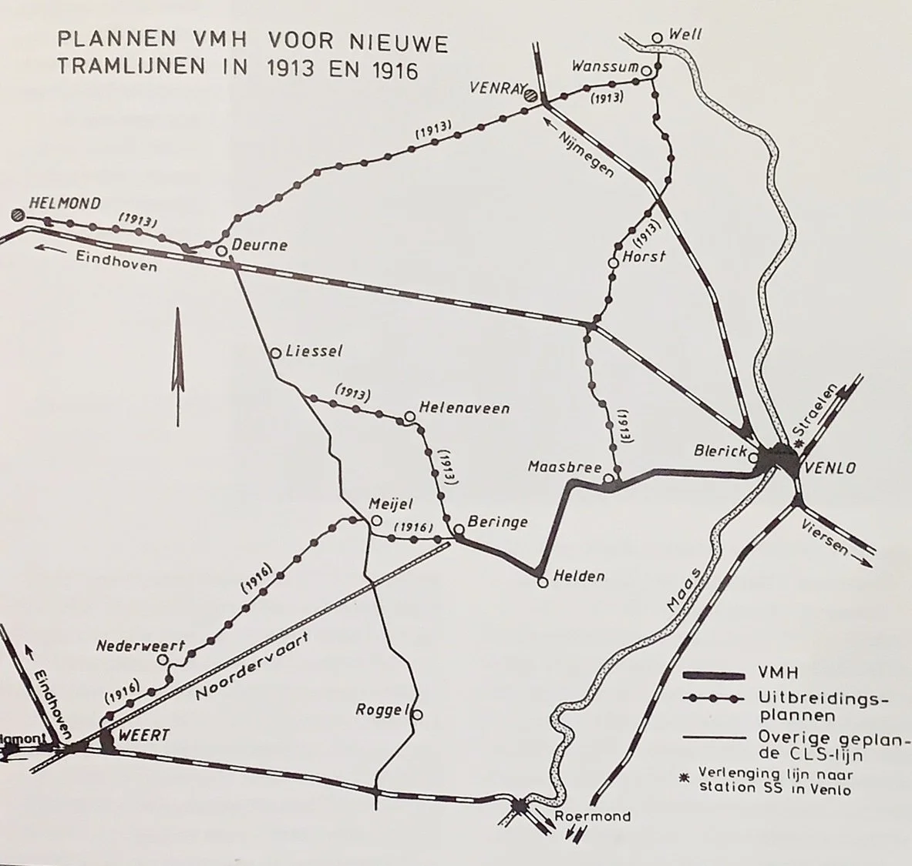

# beringse-tram

> Bron: helenaveenvantoen.nl

### Afzet van groenten naar Venlo per stoomtramverbinding

De tuinbouw in Helenaveen

Het begon allemaal met een ommuurde proeftuin aan de Huidige Helenastraat. Nadat de Maatschappij eenmaal besloten had met de zgn Westlandse tuinbouw verder te gaan nodigde zij families uit het Rijnland uit om in Helenaveen hun geluk te beproeven.

Verscheidene tuinders, zoals de families Bakker, Van der Zwaan, Veldhuijzen en Van der Werf, uit de Rijnstreek (Ter Aar en omstreken) kwamen op uitnodiging van de Maatschappij Helenaveen naar de Peel. Primair doel van deze werving was de teelt van augurken en bonen, Later kwamen daarbij aardbeien en bloemkool. Deze producten moesten natuurlijk afgezet worden. De coöperatieve tuinbouwvereniging Helenaveen werd in 1903 opgericht door 23 Helenaveners.

Op 14 oktober 1908 werd vanuit de coöperatieve gedachte de Venlose Veiling Vereeniging opgericht.. De oprichters achtten de bemiddeling van opkopers niet in het belang van de kleine tuinders. De in manden en zakken aanvgevoerde groenten werden aanvankelijk in het openbaar verkocht. In 1909 kwam hieraan een einde, toen de Venlose Veiling Vereeniging in gebruik werd genomen. Naast de Venlose Veilingvereeniging opereerde vanaf 1915 de Coöperatieve Veilingvereeniging Venlo (CVV). De oprichters van deze veiling, tuinders van omliggende dorpen, waren van oordeel dat de bestaande Veilingvereniging te veel opkwam voor de Venlose tuinders. Naast groente en fruit veilde men ook eieren. In 1946 fuseerden beide veilingen, maar in 1958 werd de fusie weer ongedaan gemaakt. De Venlosche Veilingvereeniging ging hierna alleen verder onder de naam Venlose Groente Veiling (VGV). In 1990 besloten beide veilingen wederom tot een fusie en werd verder samengewerkt onder de naam Zuid-Oost-Nederlandse Veiling, afgekort ZON.

Water geven onder platglas (meloenen?) bij de familie Schonewille Op de achtergrond staakbonen.

In de beginjaren was het vervoer van de groenten vanuit Helenaveen problematisch, maar gelukkig was er de Helenavaart. De tuinders hadden de beschikking over een tuinboot. Daarmee konden de groenten vervoerd worden naar spoorstation ‘Helenaveen’ of naar het tramstation van Beringe via de Noordervaart. In Beringe werden de groenten overgeladen op de Stoomtram naar Venlo.

Hannes Joosten zei daar het volgende over::

De Stoomtram verbinding Beringe Venlo. ( VMH: Venlo-Maasbree-Helden)

In 1905 werd een plan opgesteld voor een tramverbinding Venlo-Maasbree-Helden-Meyel-Deurne. De Raad van de Gemeente Deurne besloot tot deelneming voor 150.000 gulden deelnemen. Kort daarna werd door dezelfde raad het plan echter alsnog afgekeurd. Er bleef daarom niets anders over dan de aanleg van de lijn Venlo Beringe. In 1910 werd het spoor aangelegd en in gebruik genomen. Hiermee werden de Helenaveense tuinders dus zwaar benadeeld. Vervoer van groenten naar Venlo bleef moeilijk gaan. De slechte verhouding tussen Deurne en de Maatschappij Helenaveen heeft zeker meegeholpen aan dit links laten liggen van Helenaveen.

De tram bij het eindstation in Beringen (1942)

De lijn Deurne Roermond (LTM: Limburgse Tramweg Maatschappij)

Kort daarna, in 1907 presteerde de Gemeente Deurne het namelijk wel om een concessie aan te vragen voor de lijn Deurne-Roermond. Deze lijn is er wel gekomen maar liet Helenaveen letterlijk en figuurlijk links liggen. Overigens was deze lijn voor niemand interessant omdat er van oudsher heel weinig verkeer was met Roermond. Deurne heeft zeer veel geld gestoken in dit ambitieuze project. Burgemeester Laan van de gemeente Deurne was vice voorzitter van het oprichtingscomité. Heel vrijgevig heeft de Gemeente Deurne de helft van het benodigde kapitaal verschaft (195.000 gulden van de benodigde 380.000 gulden) dat de gezamenlijke gemeenten moesten opbrengen (Roermond legde slechts 100.000 gulden in.) In totaal heeft de lijn uiteindelijk bijna een miljoen gulden gekostIn de volksmond werd de lijn “Leeg Tot Meijel” genoemd, wat al aangeeft welk een kapitale blunder is gemaakt door Deurne.

De dichtst bijzijnde halte voor Helenaveen heette ‘Halte De Oude Peel’ en lag aan het einde van de Kanaalstraat.

De tram bij het tramstation van Deurne

In 1916 werd het traject Roermond- Meijel geopend en in 1921 het laatste stuk Meijel-Deurne. Tien jaar later in 1931 werd het tracject Deurne-Meijel al weer gesloten. De totale aanleg van dit baanvak inclusief een brug, gebouwen etc had in totaal 465.044,70 gulden gekost.

Uitbreiding van de lijn over HelenaveenSteeds was er ook het plan om de lijn Beringe-Meijel Langs de Noordervaart aan te leggen en zo de lijnen VMH en de LTM. te verbinden.Dit was echter zeer duur ondermeer doordat twee bruggen aangelegd moesten worden over de Helenavaart en het Deurnes kanaal. Men heeft nog getracht om Deurne of Helenaveen hun kanaal te laten opheffen en het overblijvende gezamenlijk te gebruiken, maar daar waren beide partijen niet toe te bewegen. Daarvoor waren de oude wonden tussen beide partijen nog te diep.

Op verzoek van de inwoners van Helenaveen is toen ook nog opnieuw geprobeerd om de lijn door te trekken over Helenaveen. In hun verzoek werden ze ondersteund door de Maatschappij Helenaveen.. Ook dit plan was ten ene male ten dode opgeschreven omdat Deurne het niet zag zitten.

Uitbreiding tranlijn VMH naar Helenaveen

Helenaveen kon fluiten naar zijn verbinding met Venlo, men moest het blijven doen met de halte in Beringe. Deze heeft dienst gedaan tot 1944. Bij de bevrijding was toen zoveel schade aangericht dat het niet meer doenlijk was de lijn te herstellen. De groenten werden nu met vrachtwagens naar de veiling gebracht.

2 dec 2022 JvW

Bron: Trams in Midden en Zuid Limburg 1888-1950Door Johan Blok, Cor Campagne, Sjef Janssenen Deurnewiki
