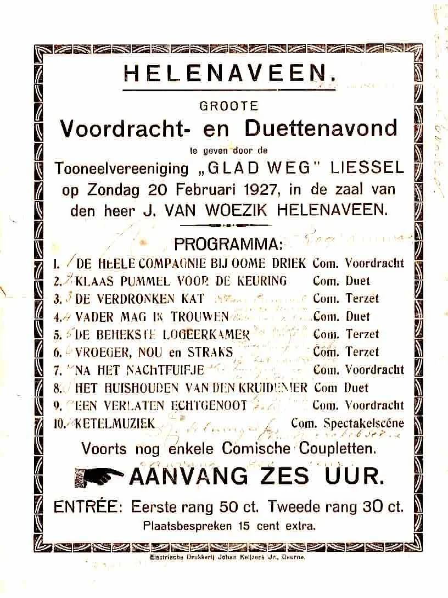
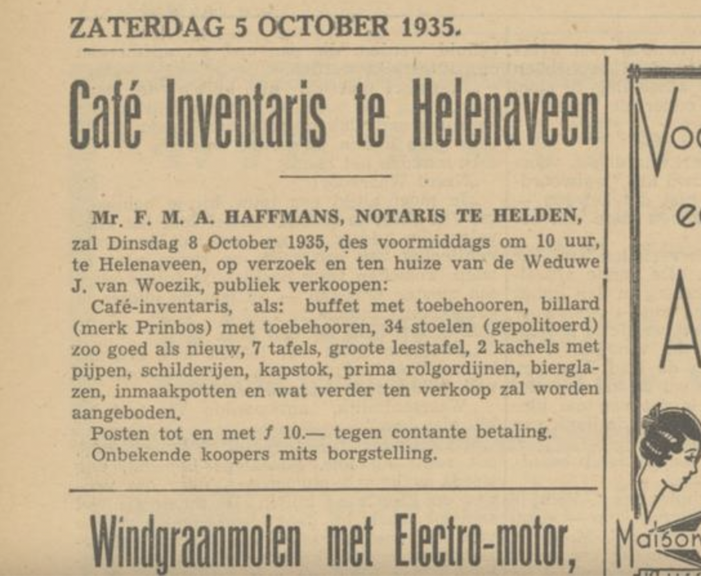

# caf-van-woezik

> Bron: helenaveenvantoen.nl

Worst gestolen bij Café van Woezik

16-1-1883 inv.nr. 459 vonnis 82 Antonie van de Ven, arbeider, geboren 15-9-1859 te Heeswijk en wonend te Helenaveen. Zoon van Embertus van de Ven, timmerman, en Catharina van Gogh.

Aanklacht: Hij wordt aangeklaagd omdat hij op 16-1-1883 te Helenaveen in de keuken van de herberg van Albertus van Woesik, waar hij inwoonde, ten nadele van die herbergier enige worsten heeft gestolen. De herbergier heeft gezien dat gedaagde, toen hij uit de keuken in de herbergkamer kwam, een gedroogde worst, die met andere worsten in de keuken had gehangen, op de grond liet vallen, opraapte en onder zijn jas stak. Hij heeft gedaagde verzocht de worst terug te geven, maar deze is met de worst vertrokken. Later miste hij zes worsten. Eerst hingen er twaalf. De dochter van de herbergier verklaart dat zij hem die dag op zijn verzoek een glas bier heeft getapt en dat, toen hij binnenkwam, nog alle worsten aan de zolder hingen. Zij heeft, na de vermissing van de worsten, de gedaagde betast en daarbij bevonden dat de gedaagde een worst onder zijn jas had. Zij heeft geprobeerd hem die worst af te nemen, maar de gedaagde heeft haar van zich afgestoten. Later heeft de gedaagde vier ruiten ingegooid.

Uitspraak: 45 dagen gevangenisstraf, een geldboete van 25 gulden en betaling van de proceskosten.

Johannes van Woezik was een zoon van de tabaksplanter Aalbert van Woesik (1826-1896) en Cornelia Janssen (1831-1881). Zijn vader werd geboren in Deest en zijn moeder in Leeuwen.Hij huwde op 14 november 1896 te Deurne met Dorothea Hendriks, (Meijel 2 mei 1870 - Helenaveen 15 juni 1952), dochter van de landbouwer Peter Hendriks (1838-1906) en Dorothea Verhorstert (1851-1924). Haar vader was afkomstig van Maasbree en haar moeder van Helden.

De handboogschutterij Oefening en Uitspanning te Helenaveen werd in 1871 opgericht.Het eerste concours van Oefening en Uitspanning werd georganiseerd op 19 augustus 1872, waarbij handboogschutterij St. Sebastiaan uit Asten een prachtige medaille veroverde. Het clubhuis en doeltent was aanvankelijk bij Adriaan Deelen (1834-1892), later achtereenvolgens café Van Oers en Johannes van Woezik (1863-1932).

Café van Woezik had ook een beugelbaan.

Het beugelen wordt gespeeld op een baan met lemen ondergrond en een afmeting van circa 10 x 5 meter. Een ijzeren ring, de beugel, staat op circa 7 meter van de startlijn van de baan. De bedoeling van het spel is om de bal van ruim 4 kg met een houten sleger door de beugel te slaan.

Er zijn twee teams van twee spelers. Elke speler speelt met eigen bal en samen met zijn teamgenoot om de beurt tegen de tegenpartij. Punten worden gescoord door de bal door de ring te spelen of de bal van de tegenstander aan de korte kant, het verst van de beugel, uit de baan te spelen. Beide levert twee punten op. Wie het eerste een totaalscore van 30 punten heeft behaald is de winnaar.

