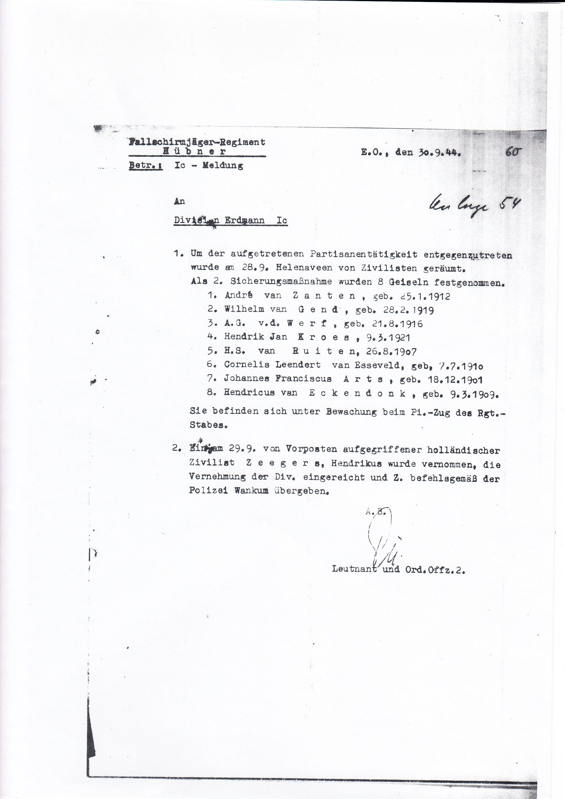
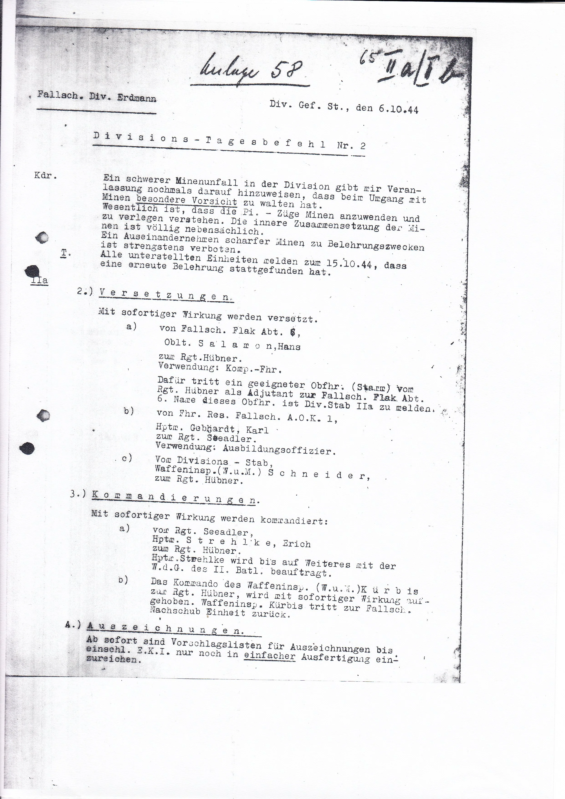
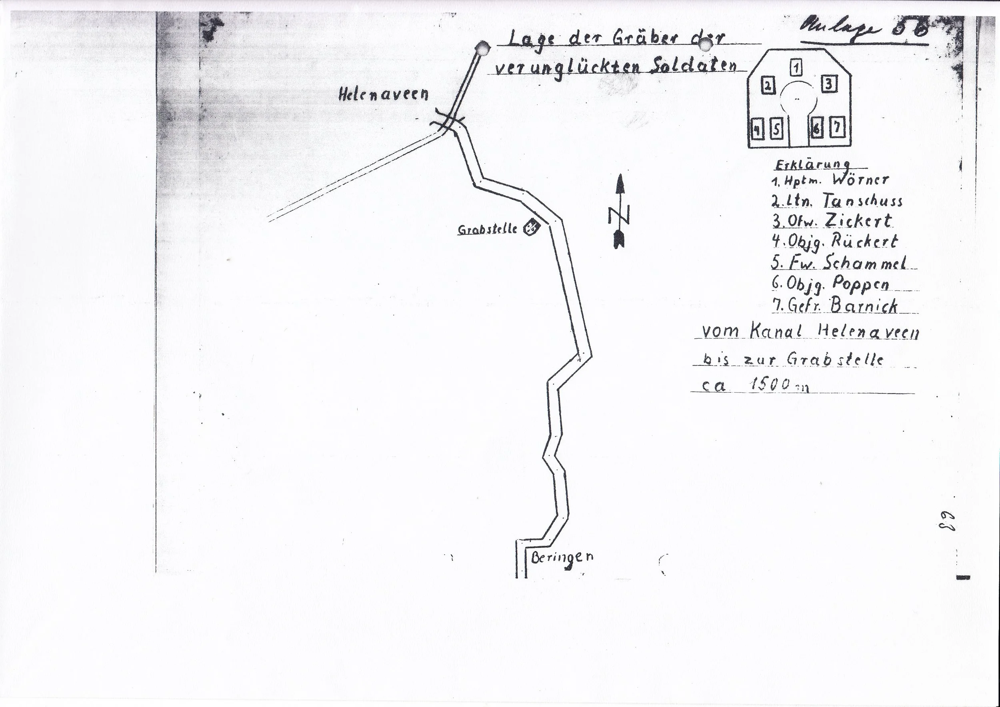

# de-aanslag

> Bron: helenaveenvantoen.nl

### De aanslag, een “partisanenaktion” in Helenaveen

In de nacht van 27 op 28 september 1944 is er door iemand op de Duitsers geschoten. De Duitsers, die natuurlijk tot het uiterste gespannen waren omdat de vijand al genaderd was tot het Deurnes kanaal, reageerden furieus met twee maatregelen:

Er werden meteen 8 gijzelaars gevangen genomen en er werd gedreigd dat ze doodgeschoten zouden worden bij een volgende partisanen actie.

De hele civiele bevolking werd uit Helenaveen gedreven. Het zuidelijke deel richting Grashoek en het noordelijk deel moest naar het kamp in Mariaveen

Behalve de oorspronkelijke acht werden ook nog onderduiker Sjors van Biene en Gerrit Brouwer opgepakt.

Uiteindelijk zijn dus 10 mannen gevangen gezet in een schuur van de familie Kluijtmans net over de brug naar Grashoek. Het huis en de schuur waren al eerder gevorderd door de Duitsers. Directeur van Schelven van de Mij. Helenaveen heeft tevergeefs geprobeerd de mensen vrij te krijgen. Ook ging men niet in op zijn aanbod om zelf de plaats van de gijzelaars in te nemen.

In het gevorderde huis van de familie Kluijtmans waren in de dagen daarna Duitsers bezig met mijnen die ter verdediging gelegd moesten worden. Hierbij is per ongeluk een zware mijn afgegaan bij het bestuderen van het inwendige ervan. Door de explosie kwamen alle aanwezige Duitse militairen om het leven, ook Hauptmann Wörner. Dit was het geluk van de gegijzelden, want de bevelhebber Heinrich Wörner van het 11de Bataljon Fallschirmjäger had korte tijd daarvoor in Kinrooi ook al 5 gijzelaars laten executeren.Van het woonhuis was ook niet veel meer over. (Het is na de oorlog opnieuw opgebouwd.)

De enige van de groep Duitsers die het overleefde was de wachtpost die de schuur met de gijzelaars bewaakte.

Door dit alles raakte het gijzelaarsverhaal op de achtergrond. Uiteindelijk zijn ze tijdens de op zondag 8 oktober bij de Kerkrazzia allemaal meegenomen naar Duitsland.

De mannen in Kamp Mariaveen waren enkele dagen na de ontruiming van Helenaveen een gemakkelijke prooi voor de Duitsers tijdens diezelfde Kerkrazzia.Van degenen die naar Limburg waren geëvacueerd ontkwamen er veel meer aan de tewerkstelling in Duitsland.

Na de oorlog werd door sommigen gefluisterd dat Kees Crommentuijn (lid van de ondergrondse) geschoten zou hebben. Of dit waar was, is zeer twijfelachtig. Minstens zo waarschijnlijk is het, dat de gewonde Duitser door een kogel van zijn kameraden is geraakt en dat men dit zo niet heeft durven melden en de schuld aan de “Partizanen” heeft gegeven. Dit laatste is ook op te maken uit het verslag van directeur van Schelven hieronder.Kort na de oorlog verongelukte tuinbouwonderwijzer Kees met zijn motor nadat hij in Neerkant les had gegeven. Meteen werd toen gezegd dat dit ongeluk wel een wraakactie zou zijn voor de aanslag die zoveel leed in Helenaveen heeft veroorzaakt. De politie heeft zelfs de motor onderzocht, maar hierbij bleek al snel dat de oorzaak een gebroken distributieketting was waardoor de motor plotseling blokkeerde. Het was dus gewoon een noodlottig ongeluk. Voor zijn vele verdiensten als verzetsman tijdens Tweede Wereldoorlog werd hem op 4 mei 1983 postuum het Verzetsherdenkingskruis toegekend.

Deurnewiki : Kees Crommentuijn

Bron: verhaal over Broeder Leonard

………………………………..Vanaf september 1944 komt de oorlog gruwelijk Helenaveen binnen. Op 23 september betrekken de Duitsers stellingen in Helenaveen. Bij het huis van de dominee plaatsen ze zwaar geschut. Twee dagen later trekken honderden Duitse soldaten langs de Helenavaart naar Griendtsveen. De meesten te voet, anderen op de fiets en een dikzak op de motor. Een tot dan ongezien oorlogsgebeuren. Drie geweldige knallen veroorzaken op 27 september in het kamp een paniekstemming. Moeders duiken met hun kinderen luid gillend onder de tafels. Een geïmproviseerd cabaretprogramma in de eetzaal verdrijft de grootste angst, zodat men durft te gaan slapen.

Toen vanuit het dorp tijdens die nacht geschoten was op de uitkijktoren die bij het huis van veldwachter Joosten stond, liet de Duitse commandant het dorp ontruimen. Veel gezinnen vinden onderdak in het kamp van de paters in de Mariapeel. Op 28 september 1944 trekken ze daar naar toe. Uit de omgeving waren hen al bewoners voorgegaan toen de Duitsers dicht bij hun woningen stelling namen.………………………………..Vrijdag 6 oktober trekt pater Leo naar de Grashoek om te pogen broeder Leonard vrij te krijgen. De commandant kan hij niet spreken, want die is kort ervoor met zijn motor vertrokken. Hij moet het doen met de luitenant. Beleefd staat deze de pater te woord, maar kan niets zelf beslissen en is van mening dat tot de gegijzelden geen geestelijke hoort. Na wat heen en weer getelefoneer, blijkt dat broeder Leonard wel aanwezig is. Zelf had hij de Duitsers niet gemeld dat hij een kloosterbroeder is en door de overall die hij aanhad was hij ook niet als zodanig opgemerkt. Dit brengt echter geen positieve wending. De broeder komt niet vrij en pater Leo mag hem ook niet zien. Wat mag, is hem tijdens de komende dagen een pakje brengen.………………………………..

Bron: verslag Directeur van Schelven

………………………………..Sept. 28. Zooals later werd medegedeeld zou in de afgeloopen nacht op leden der Deutsche Wehrmacht door partisanen geschoten zijn, waarbij een officier tijdens verblijf op de brandtoren in het berkenbosch achter het kantoor aan de hand gewond zou zijn. Zulks is hoogst onwaarschijnlijk omdat de ondergrondsche actie sinds 14 dagen was stilgelegd. Overigens is in diezelfde nacht volgens mededeeling van den hoofdonderwijzer Theelen door kennelijk benevelde soldaten bij Café van Horen met een mitrailleur in alle richtingen gevuurd en was trouwens steeds het schieten met handvuurwapens in elke nacht te verneemen uit alle richtingen.

In ieder geval werd het bovenstaande aangegrepen als voorwendsel om de algeheele evacuatie van Helenaveen vóór 15 uur om 11 uur te gelasten en intusschen 10 gijzelaars te neemen, die werden gebracht in de afgesloten wagenschuur bij de boerderij van de N.S.B.-er Syl Kluytmans, gelegen bij de zgn. Koningsbrug in de weg Helenaveen-Helden. Onder de gijzelaars bevond zich onder meer een broeder uit het kamp der Paters, die in civiel in het dorp verkeerde voor het doen van inkoopen, voorts G. Brouwer van Hoeve "de Zwijger", de tuinder L. van Esseveldt, den tuinderszoon van der Werff, den onderduiker "Sjors", enz.

Bij terugkeer uit Ysselstein heb ik getracht mij met den betrokken commandant, die zijn commandopost had gevestigd in de tuinderswoning H.137 van A. van der Werff, in verbinding te stellen doch werd door plunderende onderofficier en soldaten onder bedreiging van schieten het dorp uitgeweezen.

Intusschen was de bevolking der huizen Noord van Sevenumsche weg en Kanaalstraat (weg naar Liessel) tot Soemeerbrug getrokken in de kampen I en II Mariaveen en de huizen ten Noorden van de Soemeerbrug, en die der huizen Zuid van genoemde wegen in de woningen van de Grashoek. Overal heeft men de evacués met grote welwillendheid een onderdak verschaft. De evacuatie zelf geschiedde met kruigwagens en handkarren, omdat alle paarden en wagens practisch weggehaald waren door de soldaten.

Velen brachten nog een koe, een varken, een geit mede. De heer en mevrouw Maassen trokken naar kamp I, ik zelf vond een onderdak bij J. Crommentuijn, H.97.

Sept. 30. Teneinde eenige orde te scheppen in de samenleving in kampen en nog bewoonde huizen belast men mij met de zending onder toekenning van de aanspraaktitel "burgemeester". In de Grashoek treedt als leiding gevend op de marechaussée J. Verstegen uit Helenaveen. Herhaaldelijk wordt mijn tusschenkomst ingeroepen om bevelen voor verdere evacuatie van de W. van het kanaal gelegen huizen ongedaan te maken, om toestemming tot melken te verkrijgen, om nog goederen uit het dorp te halen, enz. enz. Voor de gijzelaars valt niets te bereiken en het aanbod om den "burgemeester" te ruilen tegen de 10 genomen personen wordt niet aanvaard. De verzorging der gijzelaars geschiedt door magen en vrienden, uitsluitend vrouwen, die zelfs gelegenheid vinden met hen te praten. Intusschen heeft het leeghalen der verlaten huizen geregelde voortgang en zelf begraven spullen worden door de troepen ontdekt. De brandkasten in de R.K. Pastorie en kantoor der Mij. worden opgeblazen, waarbij in beide gebouwen gedeelten van gevels naar buiten storten.………………………………..

Onderstaande Duitse documenten komen uit het archief van Hugo Levels en Eric Munnicks (auteurs van “Waar blijven de bevrijders?”)

- Bericht over de maatregelen na de aanslag- Bericht over het mijnongeval bij Kluijtmans, waarbij gewaarschuwd wordt zich niet te bekommeren om het binnenwerk van een mijn- Kaartje met de veldgraven van de omgekomen Duitsers tijdens het mijnongeval bij Kluijtmans

4 april 2024 Jan van Woezik
