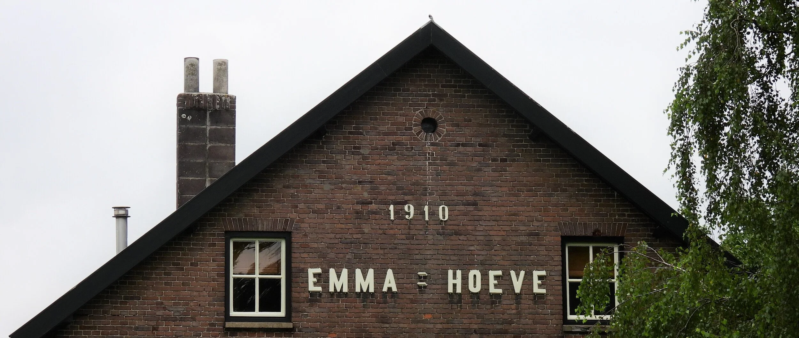
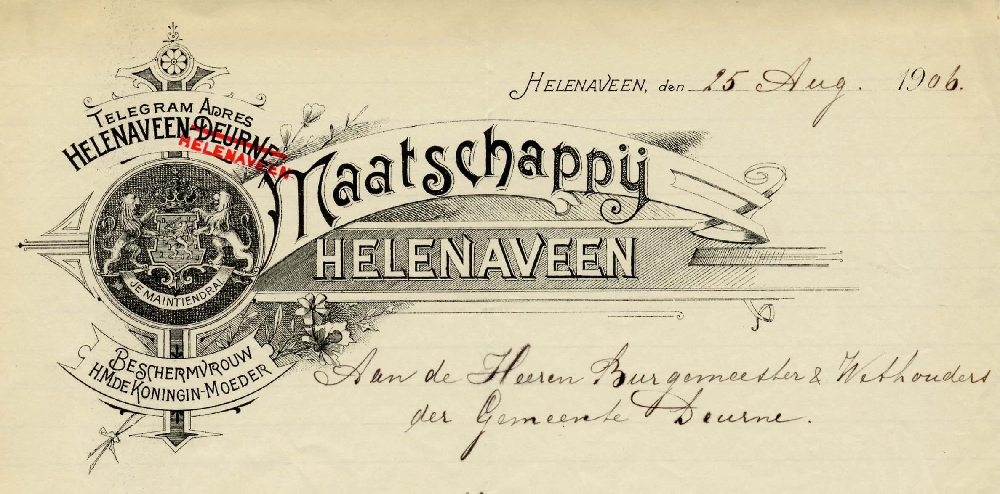
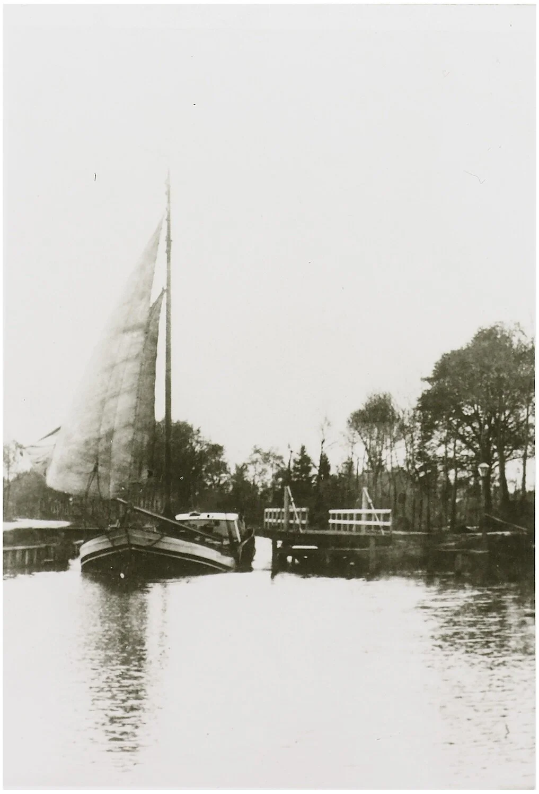
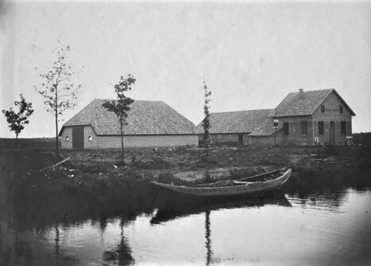
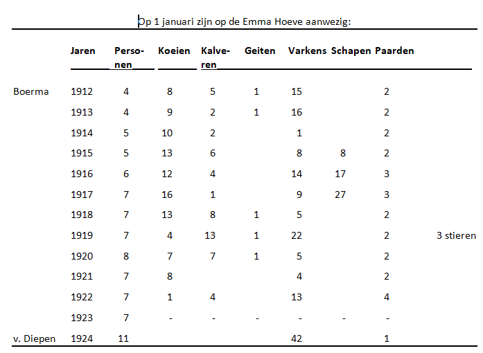
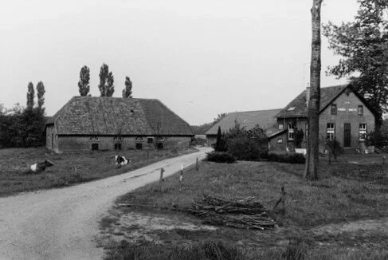

# de-emmahoeve

> Bron: helenaveenvantoen.nl

## Emma-Hoeve 1910

In 1910 komen er twee koningshoeven bij, ook genoemd naar vrouwelijke leden van het Koninklijk Huis. Een daarvan is de Emma-Hoeve. Als koningin was Wilhelmina niet beschermvrouwe van de Mij Helenaveen, zoals haar vader koning Willem III beschermheer was. Het briefhoofd van de Maatschappij maakt duidelijk wie na Willem III de beschermvrouwe was: de Koningin-Moeder Emma.

Briefhoofd van de Maatschappij Helenaveen uit 1906. N.B. Let op de doorhaling van Deurne in het telegramadres. Archief Mij. Helenaveen.

Naar Emma, de tweede echtgenote van Willem III, wordt de tweede koningshoeve in Helenaveen genoemd. Net als de Wilhelmina-Hoeve een kop-rompboerderij, nu met een ‘waterhoofd’. De boerderij komt aan de oostkant van de Helenavaart op Brabantse grond, maar met het grootste deel van de landerijen op Limburgse grond.

Waarom was die Limburgse kant in 1910 aan de beurt voor een koningshoeve? Directeur Bos geeft het antwoord in zijn verslag over de Ontginning der gronden tusschen de 1e en 5e Horster wijken met de voorplaatsen.

Deze ontginning werd in 1908 begonnen om zeer spoedig mogelijk onder Horst een ontginning te hebben van eenigen omvang. Volgens de verveningsconcessie moet per jaar een gelijk aantal H.A. dalgrond in cultuur gebracht worden, als er gronden ontveend zijn. In 1911 moet de vernieuwing der concessie worden aangevraagd, en wijl aan de concessie voorwaarden niet is voldaan, deze spoed met ontginning.

Uit het verslag blijkt dat het geen gemakkelijke ontginning was:

- De ontwatering van deze terreinen geschiedt door een duiker onder de Helenavaart door naar de Soeloop en Aa.

- Bij de Helenavaart ligt de zandondergrond + 2 m onder kanaalpeil, de ondergrond rijst in oostelijke richting. Ongeveer op 700 meter evenwijdig aan de Helenavaart loopt een zandweg welke plaatselijk tot + 50 cm boven kanaalpeil ligt. Daarna zakt de ondergrond gedeeltelijk weder + 100 [cm] onder kanaalpeil.

- De vergraving van het zwartveen was hier zeer ongelijk. Overal waren ruggen en veenbanken achter gebleven, en tegen de grens van Griendsveen was een blok zwartveen van + 0.75.00 ha hetgeen nog vergraven moest worden.

- De waterlossingen lagen niet In het midden der plaatsen doch liepen willekeurig door de veenputten en waren te ondiep om het water voldoende af te voeren.

- Het kienhout was bij het bonken mede ingebonkt.

- Gedeeltelijk was er in de terreinen grauwe bonken gegraven voor turfstrooisel.

- De dallen waren in zeer verwaarloosden toestand gedeeltelijk met houtgewas sterk doorgroeit. De lagere terreinen stonden onder water of waren zeer drassig.

Het eerste werk was hier de waterlossingen recht door het midden der plaatsen aanleggen, waardoor de gronden droog kwamen te liggen.De oude vuursteden der turfbulten werden zooveel mogelijk verwijderd, de veenruggen uitgegraven en waar kienhout bloot kwam er uitgehaald.(Er is echter kienhout achter gebleven wat niet gevonden werd; ook is plaatselijk 1 tot 4 klem zwartveen in den ondergrond.) Voor bezanding werd het zand uit den zandrug genomen en er is een gedeelte aangevlet van den zandrug van de 7e Brabantsche wijk.

Na de aanmaak werden de gronden bemest met kalk, Rotterdamsche straatmest (behalve vier kampen met Brusselsche paardenmest) en kunstmest. De meeste kampen werden de eerste twee jaar met aardappelen bebouwd.

Een turfschip van de Mij. Helenaveen. Collectie Mij. Helenaveen.

In 1909 werd per eigen schip turfstrooisel geleverd naar Brussel en van daar als retourvracht turfstrooiselpaardenmest medegebracht. Zoo werden twee ladingen betrokken. Met deze paardenmest werden bemest de eerste vier kampen noor[d]kant 3e Wijk. Elke kamp is + 1 ha en ontving alzoo 100 m3 p.mest. De aangrenzende kampen aan de Zuidzijde 4e Wijk werden op gelijke wijze bemest met Rotterdamsche straatmest. Op alle acht kampen was de verbouw aardappelen, de oogst van de kampen met paardenmest leverde + 60 à 65% op van de opbrengst bemest met Rotterdamsche straatmest.

In 1910 was de opbrengst aan de noordkant 3e Wijk wederom minder dan aan de zuidkant Wijk 4. en waar dit geweten werd aan de bemesting ontving de noordkant 3e Wijk in 1911 per kamp 25 m3 Rotterdamse straatmest.

De eerste kamp noordkant Wijk 2. en de eerste kamp zuidkant Wijk 3. zijn direct aangelegd op weiland. De dal werd geëgaliseerd en bezand ter dikte van 7 cm met de vleugelegge doorgewerkt, bemest en direct zonder dekvrucht gras en klaver ingezaaid. Zoo nu en dan is deze weid[e] in de eerste jaren gerold met een zware rol van ruim 1000 Ko per strekkende meter. Deze weide heeft steeds goed gras en hooi gegeven, is echter ongelijk bezakt, hetgeen nadeelig is.

De Emma-Hoeve aan de oostkant van de Helenavaart in 1910. Collectie Mij. Helenaveen.

In 1910 is voor de zuidelijke gronden van deze ontginning een hoeve gebouwd: “Emma Hoeve”.

Hoewel er verschillende gegadigden kwamen, geen wenschte te huren.

De eerste twee pachtperioden 1910-1923

Aan de aandeelhouders van de NV Mij Helenaveen meldt Bos: De groote moeilijkheid blijft echter nog steeds om voor de landbouwbedrijven werkelijk goede pachters te vinden, de menschen die zich aanmelden, blijken in den regel bij nader onderzoek niet geschikt te zijn. Boeren van elders met eenig kapitaal, zien tegen het wonen in deze streek op; zoodra er echter eenige bedrijven verhuurd zijn, zal dit bezwaar weggenomen zijn. Mede is nog een tijdelijk bezwaar, dat er in verhouding nog te weinig weiland is.

En wat doet de directeur? In zijn verslag over de ontginning is te lezen: Om als voorbeeld te strekken hoe veenkoloniale gronden bebouwd moeten worden werd ik zelf in 1911 pachter.

Op 1 december 1910 huurt directeur Bos van de eigen Maatschappij de Emma-Hoeve voor 6 jaar, groot ruim 37 ha.:

- met landerijen op het grondgebied in de gemeente Horst (L): ca. 32,5 ha;

- met landerijen op het grondgebied in de gemeente Deurne (NB): ca. 4,5 ha;

- het bouwland per ontblote zomerschoof;

- het weiland per 1 november 1910;

- de boerderij per 15 februari 1911;

- op 1 november 1910 is ruim 19 ha. (o.a. alle Deurnese grond) in cultuur gebracht;

- de huurprijs voor cultuurland bedraagt de eerste 3 jaren 45 gld/ha/jr en 4e t.m. 6e jaar 50 gld/ha/jr;

- van de woeste grond zal de Mij Helenaveen elk jaar 4 ha ontginnen;

- de pachter mag een ander op hoeve laten wonen en boeren.

Als bedrijfsleider en onderpachter werd op dit bedrijf gezet J. Boerma uit Nieuweroord bij Hoogeveen, een zoon van een Drentsche veenkoloniale boer. Boerma ontving bedrijfskapitaal waarop 4% interest zou worden betaald en jaarlijks een gedeelte afgelost. Na aflossing ging Boerma over als pachter en was de overwinst voor hem. Het bizonder droge jaar 1911 was voor deze nieuwe gronden zeer nadeelig, de oogst viel tegen. Van 1911 tot 1916 werd geen rente betaald van het bedrijfskapitaal, het geleden verlies van 1911 werd ingewerkt, de veestapel uitgebreid.

Mensen en dieren op de Emma-Hoeve volgens de jaartellingen op 1 januari over de periode 1912 tot en met 1924.

Het blijft aanmodderen voor Jan Reinder Boerma (*08-08-1881 te Anloo). Ook de schapen brengen geen voorspoed. Bos: In 1917 hield hij op met schapen houden daar er door een vreemden hond eenige schapen waren doodgebeten. Ik kon hem niet meer bewegen verder nog schapen te houden. In 1918 wordt een belangrijk gedeelte van het bedrijfskapitaal terugbetaald. Ik heb hoop dat Boerma spoedig door zijn schuld heen is.

Na twee pachtperioden vertrekt Boerma met vrouw en kinderen - alle vijf geboren in Helenaveen – op 27 april 1923 naar Westerbork, de geboorteplaats van mevrouw Boerma-Hummel en waar het echtpaar in 1911 vandaan kwam om de Emma Hoeve te gaan beboeren.

Pachter Nicolaas van Diepen 1923-1925

In 1923 pacht Nicolaas van Diepen (*25-04-1880 te Beemster in Noord-Holland) de Emma-Hoeve. Op 1 november 1923 komt hij met vrouw en negen kinderen, geboren tussen 1909 en 1920 naar Helenaveen. Van Diepen tekent op 04 oktober 1923 de pachtovereenkomst, waarin is opgenomen:

- aanvaarding van de gebouwen 8 dagen na de publieke verkoop van de inventaris van de boerderij (voor of uiterlijk op 22 oktober 1923);

- de huurprijs van de cultuurgrond (ruim 24 ha) bedraagt 75 gld/ha/jr;

- de pachter kan de Mij Helenaveen verzoeken om woeste grond te ontginnen.

Net als Boerma gaat het Van Diepen ook niet voor de wind. Op 12 november 1924

Schrijft hij een brief aan de Maatschappij “Helenaveen” te Helenaveen met als inhoud: Door mislukking van de oogst en het niet meer verleenen van hulp en bijstand van mijn familie ben ik niet meer in staat om het bedrijf zonder in de schulden te komen voort te zetten en verzoek daarom om ontbinding van het huurcontract der “Emmahoeve”.

Pachter en verpachter komen op 26 november 1924 overeen dat de pachtovereenkomst van 4 oktober 1923 wordt ontbonden onder de volgende bepalingen:

- de landerijen per direct;

- de gebouwen uiterlijk op 1 maart 1925;

- enkel de pachtprijs over het eerste jaar hoeft betaald te worden.

Op 10 januari 1925 vertrekt het gezin Van Diepen naar Schermerhorn.

De Emma-Hoeve wordt hierna enkele maanden bewoond door Gerrit J. Brouwer (*27-02-1872 te Polsbroek in Utrecht). Op 19 maart 1925 arriveert hij vanuit zijn geboorteplaats in Helenaveen op de Emma-Hoeve. Vandaar verhuist hij naar Hoeve De Zwijger.

Pachter Arie Kool 1926-1932

De nieuwe pachter van de Emma-Hoeve betrekt de boerderij met zijn gezin op 12 maart 1926. Het is Arie Kool (*16-05-1893 te Benschop Utrecht). Het gezin heeft dan drie kinderen, geboren tussen 1921 en 1924. In 1928 wordt op de boerderij dochter Neeltje geboren. In de pachtovereenkomst van 11 november 1925 is opgenomen:

- de huurprijs van de cultuurgrond (ruim 24 ha) bedraagt 100 gld/ha/jr (=f. 2472,05 per jaar);

- de pachter kan de Mij Helenaveen verzoeken om woeste grond te ontginnen. Kool vertrekt na één pachtperiode op 16 april 1932 naar Hilvarenbeek. De Emma-Hoeve wordt daarna een kaasboerderij.

Adressen Emma-Hoeve

De adressen van de Emma-Hoeve in de periode 1919-1939 zijn respectievelijk Helenaveen D102b, H99, H98 en H89. Door hernummering als gevolg van nieuwe huizen wijzigt een huis regelmatig van nummer. Nu is het Kaasweg 2.

De Emma-Hoeve in 1990 aan Kaasweg 2 te Helenaveen. Collectie gemeente Deurne,

[HetHelenaveenvanToen|HvdL|20210711]
