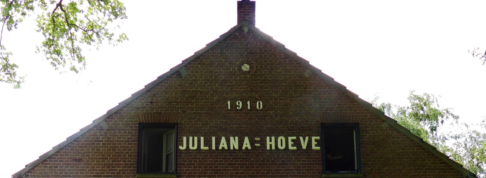
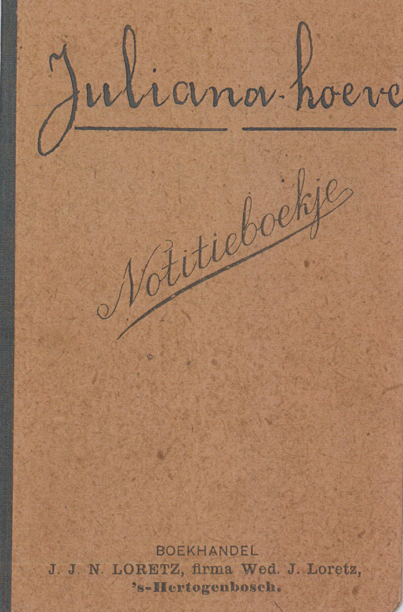
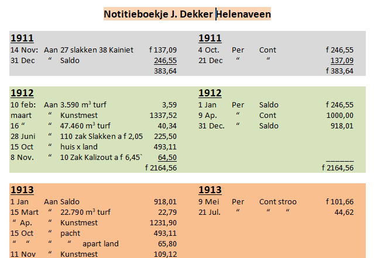
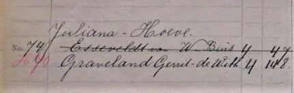
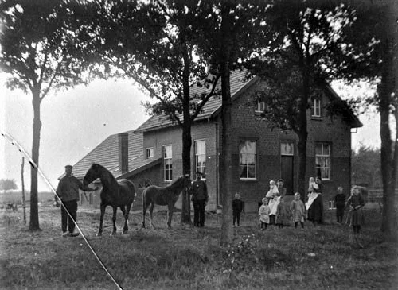
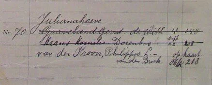
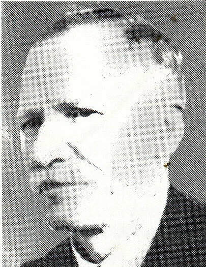
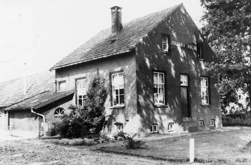

# de-juliana-hoeve

> Bron: helenaveenvantoen.nl

## De Juliana-hoeve

In 1910 bouwt de Maatschappij twee koningshoeven. De Juliana-Hoeve is bijna het evenbeeld van de in hetzelfde jaar gebouwde Emma Hoeve. Het duurt nog tot in 1911 voordat deze hofstede geheel klaar is en het lukt directeur Bos om er meteen een pachter voor te vinden.

Adressen van de Juliana-Hoeve tussen 1810 en heden: D 65 (1912) > H74 > H 70 > Boven 41 > Soemeersingel 107 (heden).

Pachter Johannes Dekker

Johannes Dekker (*20-09-1871 te Haarlemmermeer, † 23-01-1950 te Deurne) uit Noord-Holland was de eerste pachter. Hij pachtte de hoeve voor 493 gulden en 11 cent per jaar. Ook hij kan rekenen op een renteloos voorschot van het Fonds Koning Willem III. Johannes is getrouwd met Geertruida Stokman (*12-08-1877 te Haarlemmerliede en Spaarnwoude, † 05-11-1922 te Helenaveen). Hun drie oudste zonen en twee dochters zijn in Heemstede geboren tussen 1903 en 1911. Op de hoeve ziet hun jongste zoon in 1920 het levenslicht. Als kroonprinses Juliana op 7 januari 1937 met Bernhard trouwt maken de overgebleven Dekkers dat niet mee in Helenaveen. Precies 10 maanden eerder zijn vader en de jongste zoon Gerard (*12-02-1920 te Helenaveen) naar Helmond vertrokken. Maar daarvoor hadden ze de Juliana-Hoeve al verlaten en is het gezin verhuisd naar H 25. Wanneer dat precies is gebeurd, is nog een vraag.

In het archief van de Maatschappij Helenaveen wordt het notitieboekje van Johannes Dekker bewaard.

En wat heeft pachter Dekker daarin genoteerd?

De bemesting van de gronden van de Juliana-Hoeve is in november 1911 begonnen. Het is de vraag of Johannes Dekker toen al aan het werk was op de boerderij of dat directeur Bos dat nog heeft laten uitvoeren en het notitieboekje is begonnen. In het bevolkingsregister van Deurne staat dat Dekker én zijn gezin op 6 februari 1912 vanuit Heemstede in Helenaveen zijn komen wonen en dat sluit mooi aan met de eerste notitie in 1912; de levering door de Maatschappij van 3.590 m3 turf om de rest van de winter warm door te komen.

Pachter Willem van Esseveldt tot 1929

De volgende pachter is waarschijnlijk Willem van Esseveldt (* 04-11-1889 te Rhenen). Hij is op 23 februari 1918 in Deurne en Liessel getrouwd met Elisabeth Buis (* 22-01-1893 te Deurne en Liessel). Als tuinier is Willem op 20 oktober 1910 vanuit Rhenen (Utrecht) in Helenaveen komen wonen op het adres D 65, later H 74 en H 70, het adres van de Juliana-Hoeve. Na zijn huwelijk staat hij in het bevolkingsregister van Deurne op die adressen ingeschreven met zijn vrouw en hun kinderen Helena (* 03-01-1919), Aalbert (* 17-04-1920) en Geert Johan (* 19-04-1928). Op 9 februari 1929 vertrekt het gezin Van Esseveldt naar Horst (Limburg).

De Juliana-Hoeve met twee gezinnen, ca. 1928. Foto: collectie Mij. Helenaveen (glasnegatief).

Pachter Gerrit Graveland 1928-1935

Waarschijnlijk staat het gezin Van Esseveldt op de foto, samen met het gezin van Gerrit Graveland bij de wisseling van de pacht in 1928-1929. Op 24 april 1928 komt Gerrit Graveland (* 26-06-1880 te Stolwijk Z-H) naar Helenaveen op het adres H 74 (later H 70). Gerrit is op 30 mei 1912 te Lexmond getrouwd met Cornelia de With. Hun acht kinderen zijn geboren tussen 1912 en 1926. Willem is landbouwer en kaasventer. Van de Juliana-Hoeve verhuist het gezin naar de Vlierdenseweg in Deurne.

Pachter Kornelis Krans 1935-1938

Kornelis Krans. (www.oorlogsgravenstichting.nl)

De nieuwe pachter in 1935 is Kornelis Krans (* 30-03-1887 te Kropswolde gemeente Hoogezand). Hij is op 4 maart 1909 te Sappemeer getrouwd met Jeikina Delina Dorenbos (* 13-02-1885 te Achterdiep gemeente Sappemeer). Hun zoon Gerrit wordt op 15 juni 1909 geboren te Kalkwijk gemeente Hoogezand. Daarna woont het gezin in Slochteren, waar zoon Jan op 18 september 1912 ter wereld komt. Op driejarige leeftijd overlijdt hij ook daar op 22 maart 1916. Kornelis, Jeikina en Gerrit verhuizen op 24 april 1935 vanuit Leende (Noord-Brabant) naar de Juliana-Hoeve (H 70). Ze verblijven daar maar een kleine drie jaar, want op 1 april 1938 gaan ze in Helden (Limburg) wonen op ‘Bovensbosch’ 1. Kornelis zit in de Tweede Wereldoorlog in het verzet (Landelijke Organisatie voor Hulp aan Onderduikers / L.O. Helden). Hij is 2 maart 1944 te Helmond overleden. Bij de Oorlogsgravenstichting is hij als oorlogsslachtoffer opgenomen in het register van oorlogsslachtoffers. Kornelis ligt begraven op de protestantse begraafplaats van Helenaveen, graf nummer 144.

Pachter Philippus Laurentius van der Kroon 1938-….

Na Krans wordt de Juliana-Hoeve bewoond door Philippus Laurentius van der Kroon (* 06-03-1904 te Vinkeveen) en zijn gezin. Philippus komt op 18 maart 1938 vanuit Beugen naar Helenaveen (H 70). Zijn vrouw Maria Petronella van den Broek (* 11-07-1911 te Mill en St. Hubert) volgt vier dagen later vanuit de Jodenpeel in Bakel. Op 19 februari van dat jaar zijn ze in Bakel getrouwd. De Juliana-Hoeve is de geboorteplaats van hun kinderen Debora Maria Theresia (* 27-12-1938) en Maria Josepha (* 21-03-1940).

De Juliana-Hoeve in 1990. Foto: collectie gemeente Deurne.

[HetHelenaveenvanToen|HvdL|20210725]
