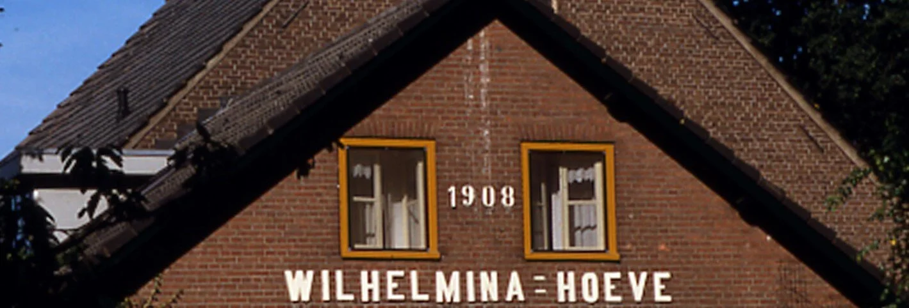
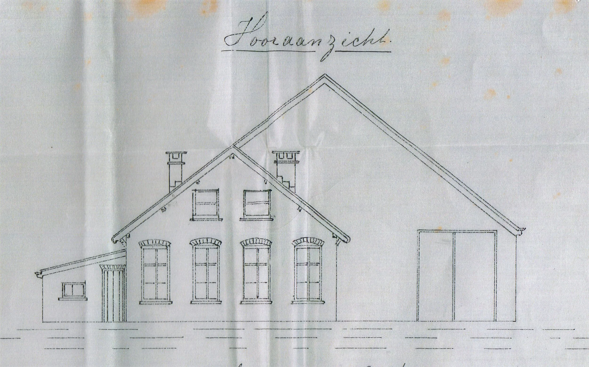
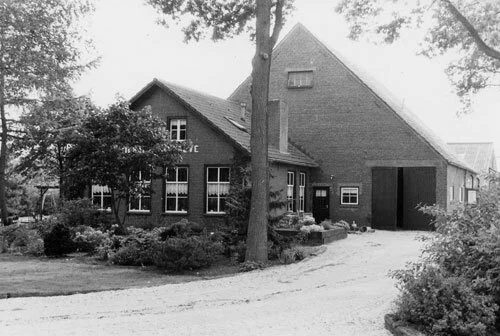
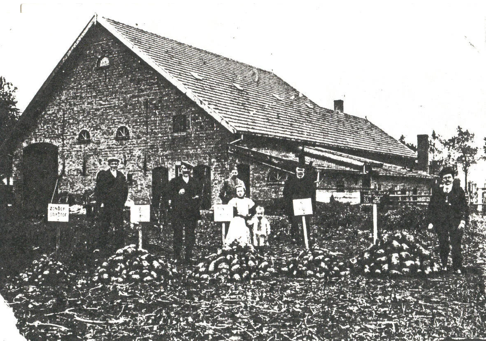
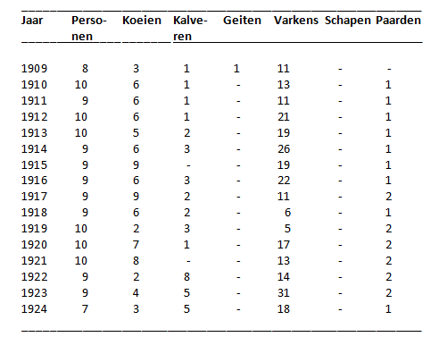
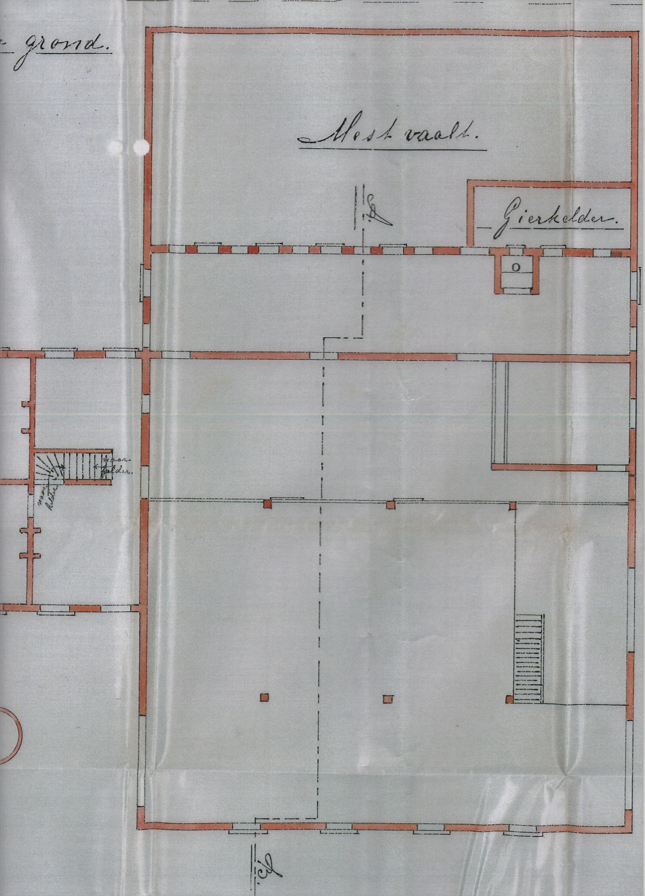
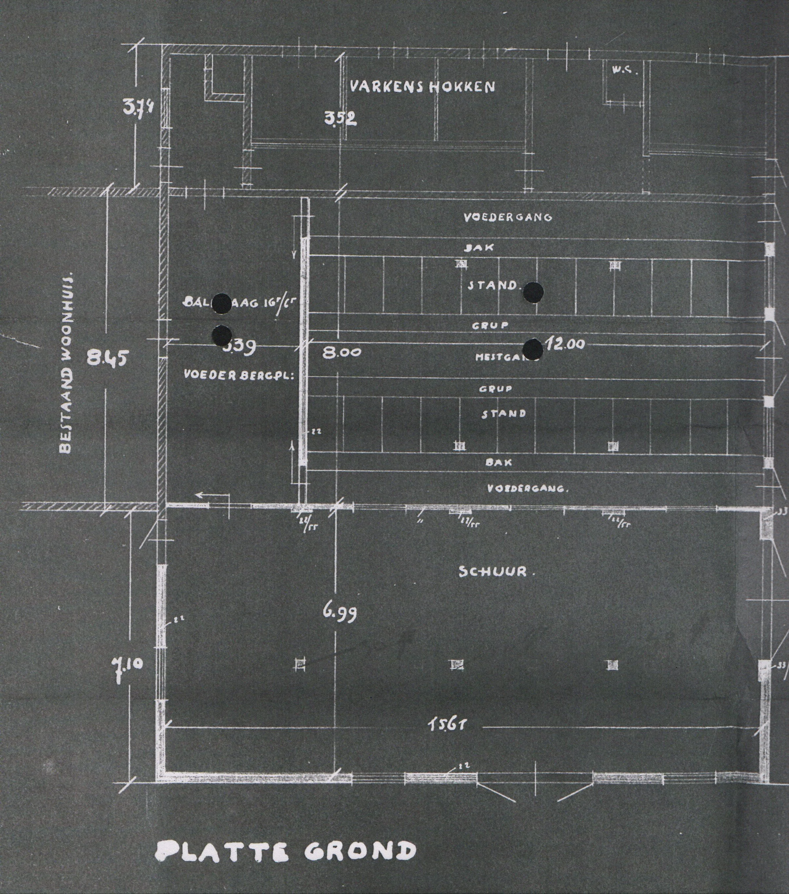

# de-koningshoeven

> Bron: helenaveenvantoen.nl

## WILHELMINA-HOEVE 1908

In het jaar dat de eerste koningshoeve wordt gebouwd is Wilhelmina koningin. De eerst hofstede, die Adriaan Bos als directeur van de Maatschappij Helenaveen laat bouwen, krijgt dan ook de naam Wilhelmina-Hoeve.

Op 9 april 1908 vraagt Bos namens de Mij. Helenaveen vergunning aan voor het bouwen van een “Hofstede” op een perceel aan de kanaalweg, kadastraal Sectie H 3035. De hoeve zal gebouwd worden door A. van Breda, opzichter bij de Mij. Helenaveen. De gemeente Deurne stuurt de aanvraag terug, omdat de formulieren en tekeningen niet ondertekend zijn en ze nog enkele vragen heeft. Op 17 april gaat de aanvraag weer richting gemeente en op 25 april verleent het college van B&W de bouwvergunning. Op 1 oktober 1908 deelt Bos aan B&W mee dat “van ’t woonhuis der nieuwgebouwde hofstede op ’t perceel Sectie H. No. 3035 bezuiden de 1e Brabantsche Hoofdwijk de buitenmuren tot volle hoogte zijn opgetrokken en ’t behoorlijk onder dak is gebracht”.

De in 1908 gebouwde Wilhelmina-Hoeve met de brug in de huidige Soemeersingel over de 1e Brabantse Wijk.

In het jaarverslag over 1909 schrijft directeur Bos: De in 1908 gebouwde groote boerderij werd verpacht aan een onzer kleine pachters. Dat is Hannes van Mullekom, rechts op de foto. Hannes is in 1863 geboren en in 1872 met zijn ouders en broers en zussen vanuit Appeltern in Helenaveen komen wonen.

Vooraanzicht van de Wilhelmina-Hoeve op de bouwtekening, 1908. Archief Mij. Helenaveen.

In 1908 tekende de architect het vooraanzicht van de Wilhelmina Hoeve zo. Er zijn verschillen tussen het plan en de uitvoering, maar dat is voor de Mij. Helenaveen niets bijzonders. Was een ronding getekend, maar had men toevallig een recht kozijn, dan plaatste men dat. Vergelijk maar eens met het vooraanzicht op de foto hieronder uit 1990.

Het vooraanzicht van de Wilhelmina-Hoeve in 1990. Foto-collectie gemeente Deurne | MIP-project.

In het archief van de Mij Helenaveen bij het Regionaal Historisch Centrum Eindhoven (RHCe) bevindt zich een verslag, opgemaakt door directeur Bos over de ontginningen door de Mij. Helenaveen. Dit begint met:

Ontginning der gronden aan de Ie Brabantsche wijk Zuid en Novia Kant

Met deze ontginning werd een begin gemaakt in 1904.

In 1905 werden twee HA. gelegen aan de Oostkant arm 1e wijk met compost bemest en zoo bemest voor twee jaar verhuurd voor f 100.- per HA en per jaar.

In 1906 waren ontgonnen 4 kampen aan de Zuidkant en 3 kampen aan de Noordkant der 1e Br[abantse]. Wijk.

Ter verkrijging van zand had men zeer diepe slooten gegraven met stijle wanden, deze slooten kalfden sterk in, zoodat deze werkwijze niet verhaald werd.

Tegen de veldraai waren eenige diepe zandgaten gemaakt, welke niet binnen geslecht waren en waarvoor later bonkaarde moest worden aangevoerd.

De kampen, welke in 1906 hier door de Mij. zelf bebouwd werden waren bemest met Rotterdamsche straatmest, kainiet, slakkenmeel en kalk, doch een stikstof mest was niet gegeven,

zoodat het gewas treurige resultaten gaf.

Wat bemesting voor resultaat heeft toont een foto uit 1910 genomen achter de Wilhelmina-Hoeve.

Bemestingsproef suikerbieten achter de Wilhelmina-Hoeve in 1910. Foto-collectie gemeente Deurne.

Op de bordjes van links naar rechts: Zonder stikstof – Zonder PhosforZwzn – Zonder kalk – Zonder kali. De grond die de grootste suikerbieten rechts opleverde was wél bemest met deze kunstmeststoffen. V.l.n.r. op de foto: Hendrik van Mullekom – Hannes van Mullekom, de hoofdbewoner van de Wilhelmina-Hoeve – zijn vrouw Martha Schaper – haar vader Bernardus Schaper - Toon Strijbosch, de kunstmestvertegenwoordiger uit Neerkant. In het midden staan de kinderen van Hannes en Martha: Marie en Leo van Mullekom.

Het verslag van Bos over de ontginning bij de 1e Brabantse Wijk gaat verder met:

Van 1906/8 is hier de ontginning afgewerkt, de landerijen ontvingen 100 tot 200 M3 Rotterdamsche straatmest per HA. en een voorraad bemesting van kali & Phosphor.

In 1908 werd hier een hoeve gebouwd, “Wilhelmina-Hoeve”.

De boerderij is groot H.A. Verpacht werd voor f 45 per jaar en per H.A.

In [ ] is een afzonderlijke paardenstal met karschop gebouwd [en] de ruimte der oude paardenstal is bij de koestal getrokken.

De volgende fouten zijn aan het gebouw:

I de kelder ligt op het Zuiden.

II de koestal is te donker.

III de varkenshokken konden grooter zijn

IV de mestfvaalt heeft last van grondwater

Als pachter kwam hierop J. van Mullekom. Hij ontving f 1000.- renteloos voorschot van het “Konings Fonds”. voor aankoop mest nam hij in de eerste jaren geld op bij de Mij. Hij loste het voorschot af en behoefde niet meer geholpen te worden met tijdelijke voorschotten.

Mensen en dieren op de Wilhelmina-Hoeve volgens de jaartellingen op 1 januari over de periode 1909 tot en met 1924.

Hoe zag de stalindeling er in 1908 uit; en in 1935?

Plattegrond van de stal van de Wilhelmina-Hoeve in 1908. Archief Mij. Helenaveen.

Plattegrond van de stal van de Wilhelmina-Hoeve in 1935. Archief Mij. Helenaveen.

In 1935 wordt de schuur deels herbouwd op de fundering uit 1908. De lichte lijnen geven de nieuwe situatie weer.

Met de Wilhelmina-Hoeve had een ander boerderijtype zijn intrede gedaan in Helenaveen. De Maatschappij en directeur Bos hadden hun hofstede, de eerste. [HetHelenaveenvanToen|HvdL|20210626]
