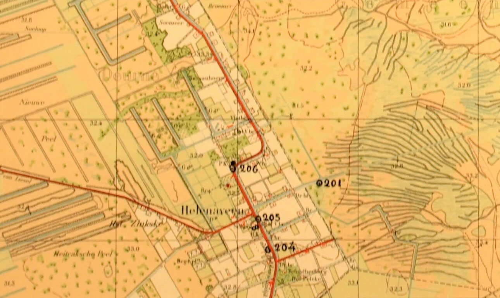
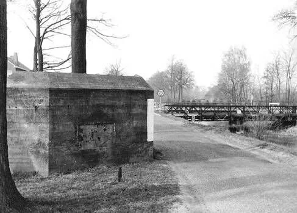
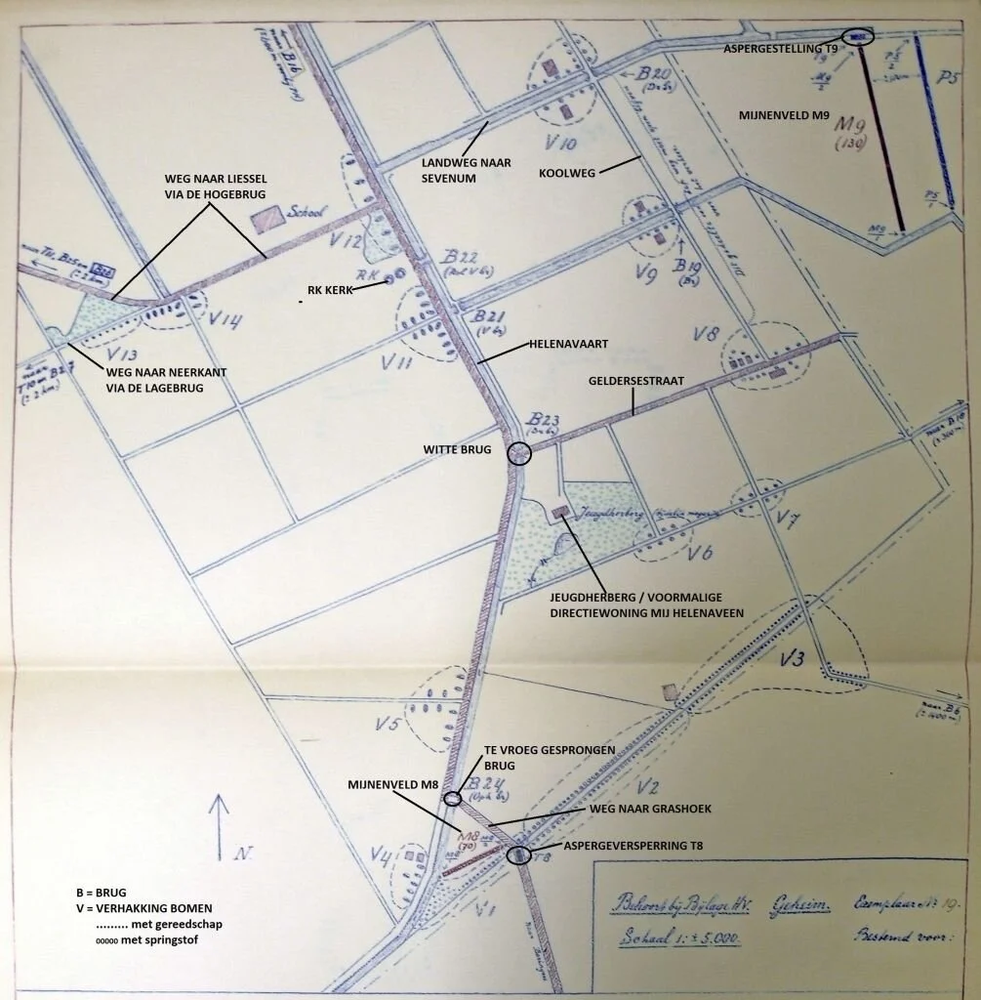
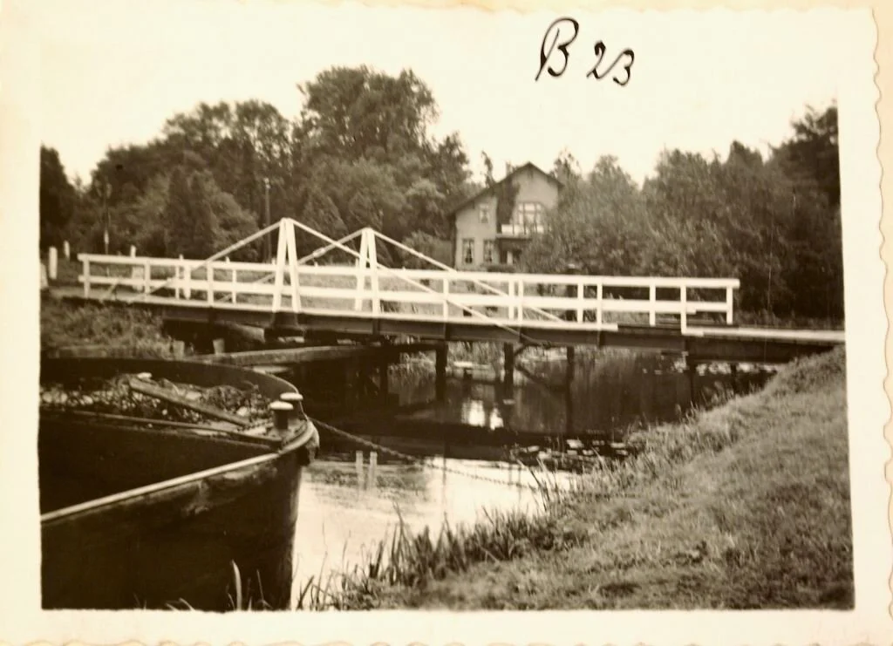
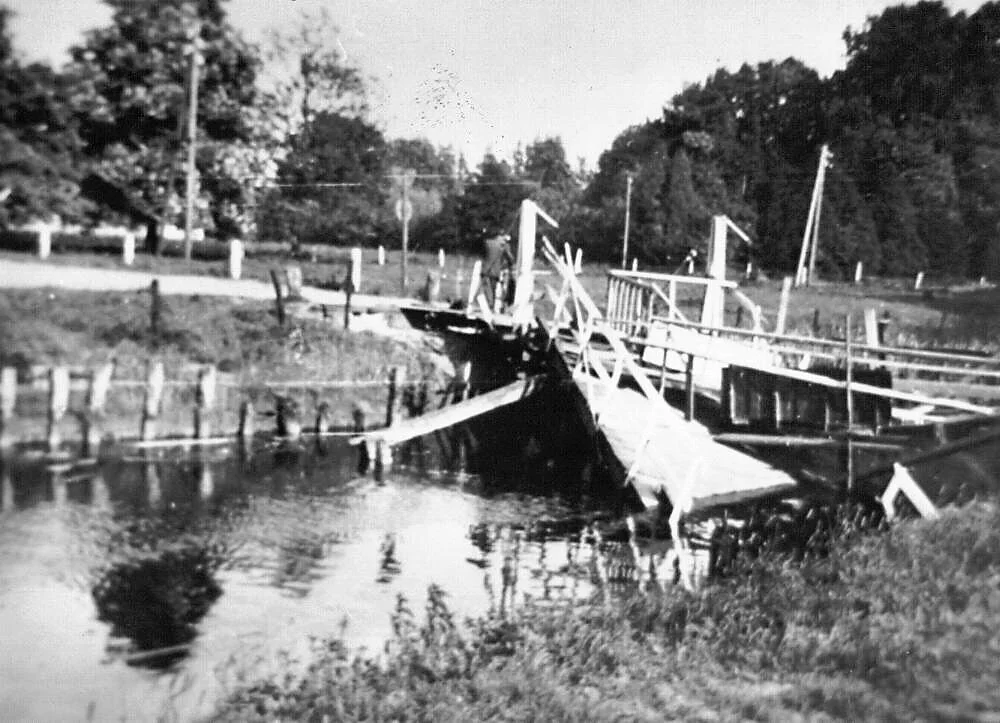
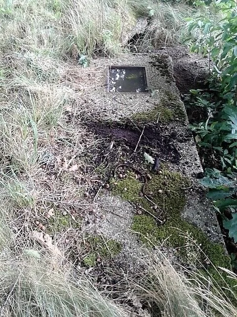
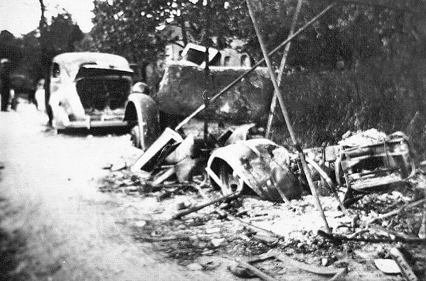
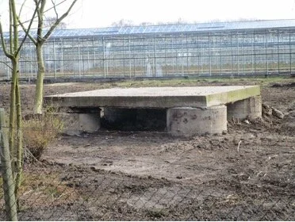
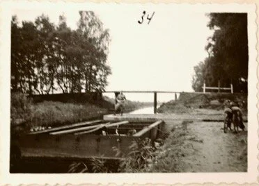

# de-peel-onder-vuur

> Bron: helenaveenvantoen.nl

### De Duitsers vallen Helenaveen binnen.

De verdediging in HelenaveenHelenaveen was als onderdeel van de Peel-Raamstelling goed voorzien van verdedigingswerken. Allereerst zorgde het moeras van de Mariapeel samen met de Helenavaart voor een ondoordringbare strook voor de vijandelijke troepen.

De geplande kazematten 201, 204, 205 en 206 in Helenaveen. (Kaart: Nationaal Archief)

Zwakke punten vormden de toegangswegen vanuit Sevenum en Grashoek. Soldaten van het 30ste Regiment Infanterie bemanden de kazematten in Helenaveen. Drie daarvan staan aan de westelijke kant van de vaart tussen de protestantse kerk en de Geldersestraat (nrs. 204, 205 en 206 op kaartje).Kazemat 201 is geprojecteerd aan de oostkant aan de landweg naar Sevenum. Iets verderop is op de weg een vechtwagenhindernis (T9) in de vorm van een aspergeversperring aangebracht.

Bij de brug over de Helenavaart in de weg naar Grashoek en Beringe staat, ook aan de oostkant van de vaart, kazemat 202. Het geschut is gericht op de aangebrachte aspergeversperring (T8) op de weg. Vanuit kazemat 203, iets ten zuiden van die brug westelijk van het turfkanaal, kan ondersteuning verleend worden. Het zijn allemaal kazematten van het S-type oftewel stekelvarkens; de kleinste kazemat voorzien van licht geschut. Ze worden bijgestaan door de 6cm-kanonnen van de batterij van kapitein De Vries. Eén is gericht op de landweg naar Sevenum, het andere op de kunstweg naar Grashoek.

De nu niet meer aanwezige kazemat nr. 205 aan de Helenastraat.

Hindernissen in en om Helenaveen. (Kaart: Nationaal Archief)

Om de vijandelijke troepen de doorgang door de Peel te bemoeilijken, zullen op het juiste moment de vele bruggen opgeblazen worden. In 1935 is hiervoor een plan gemaakt, maar daarin zijn met name de bruggen bij de samenkomst van het Kanaal van Deurne en de Helenavaart aan de spoorlijn niet opgenomen. Daar zal het vernielen dan ook niet vlekkeloos verlopen.

Bomen vormen een andere, extra hindernis. De Maatschappij Helenaveen heeft als eigenaar van de wegen en lanen overal daarlangs bomen geplant. Bij kruisingen en splitsingen moeten die door de Nederlandse soldaten worden omgehakt of op een aantal punten neergehaald worden met dynamiet, zoals bij het begin van de weg naar Liessel. De bomen mogen niet op de Koolweg tussen de Sevenumseweg en de Geldersestraat neerkomen. Dat weggedeelte dient open te blijven voor het verkeer. Wachtmeester Van ’t Schip meldt voor het verdedigingsvak zuidelijk van Helenaveen: Om 9.00 uur zijn de asperges in den weg geplaatst en de boomen gesprongen. De takken werden echter niet voldoende verwijderd, wat later een groot nadeel bleek, omdat ’t zicht op den weg niet vrij was.

Prikkeldraadafrasteringen en twee mijnenvelden completeren de voorverdediging in Helenaveen. Het ene mijnenveld (M9) met 130 mijnen is aangelegd op Limburgs grondgebied tegen de weg naar Sevenum bij kazemat 201. Het andere (M8) telt 70 mijnen op de drietip aan de Helenavaart bij de weg naar Grashoek.

De Witte brug (B23) over de Helenavaart bij de Geldersestraat intact in 1935 (boven) en gesprongen op 10 mei 1940 (onder). (Foto’s: collectie Nationaal Archief en meester Theelen)

De hoofdverdediging achter het Kanaal van DeurneMocht de vijand door de verdedigingslinie in Helenaveen breken, dan wacht hem even verder de hoofdverdedigingslinie van de Nederlanders achter het Kanaal van Deurne. Ook daar heeft De Vries twee kanonnen geplaatst en wel bij de Hogebrug en bij de Lagebrug. Bij de Hogebrug zijn tussen twee ‘stekelvarkens’ (nrs. 211 en 212) twee zwaardere kazematten van het type G gebouwd (nrs. 213 en 214). Deze hebben een gietstalen koepel met zwaar vuur. Zo’n G-kazemat staat ook zuidelijk van de Lagebrug en verdedigt vanaf het Kanaal van Deurne tevens de Helenavaart. Tussen de Lagebrug en de Hogebrug zijn nog vier S-kazematten in de Peel-Raamstelling opgenomen. Voordat de vijand de bruggen zal bereiken, komt hij eerst aspergeversperringen tegen.

Duitse bommenwerpers boven de PeelOp 10 mei 1940 was in de Peel-Raamstelling de alarmtoestand al enkele dagen van kracht. De stellingen zijn volledig bezet. Een derde van de manschappen mag rusten of slapen. De rest moet waakzaam zijn. Door de sterkte van de stelling is het moreel van de Nederlandse soldaten groot en de troepen gaan voor ‘standhouden tot het uiterste’. Vaak is te horen: laat ze maar komen. En ze kwamen.

Kapitein De Vries meldt in zijn verslag: Juist was in den nacht van 9 op 10 mei 1940 een proefalarm gelast, naar ik meen om 3.00 uur. Nauwelijks had dit zijn beslag gekregen, of de lucht werd overstelpt met motorgeronk. Toen het licht werd, kon ik door mijn kijker duidelijk Duitsche vliegtuigen v.n.l. bommenwerpers onderscheiden. Ze kwamen bij tientallen over ons heen op een hoogte van naar schatting 2000 m. We beseften, dat dit grensoverschrijding was en de oorlog was uitgebroken. Even later kwam dan ook de telefoon melden dat Duitsche troepen de grens hadden overschreden en zich gereedmaakten de Maas over te trekken.

Van de kant van de Maas werd dof gedreun vernomen. Behoudens het geronk der ontelbare in westelijke richting vliegende vliegtuigen, bleef verder alles kalm en rustig. Ik maakte een ronde langs alle stukken, teneinde de gevechtsvaardigheid nogmaals grondig te toetsen. Inmiddels had de Genie in Helenaveen haar vernielingsopdrachten uitgevoerd. De verbinding over Hooge- en Lage Brug met Helenaveen bleef voorlopig wel bestaan.

De Vries had al wel vanuit Helenaveen alle paarden en wagens achter het Kanaal van Deurne laten brengen.

Restant van de aspergeversperring voor de Hogebrug. (Foto: Ad Kersten)

Achtergelaten en vernielde voertuigen. Foto: meester Theelen.

Majoor De Kloet (III 30 RI), verantwoordelijk voor de verdediging van Helenaveen Griendtsveen, heeft zijn commandopost in een boomgaard van een boerderij in Liessel. Omdat het ’s morgens op de grond rustig bleef, gaat de majoor om 11.00 uur op inspectie uit. Met de fiets eerst naar Griendtsveen. Hij bemerkt, dat meerdere soldaten de situatie niet ernstig nemen. Ze staan voor hun kazemat naar de overvliegende Duitsers te kijken. De Kloet laat zijn autoriteit gelden door de bemanning van de kazemat op zo’n anderhalve kilometer noordelijk van het Kanaal van Deurne op te dragen te schieten op de eigen mensen als die voor hun kazematten staan. Eerst in het kanaalwater en een halve minuut later op de kanaaldijk. Korte tijd later laat hij nog eens zien dat hij kordaat en recht in de leer is. Hij treft in Griendtsveen twee militaire artsen die zonder andere manschappen het door de Duitsers bereikte Horst waren ontvlucht. De Kloet vindt dat ze hun troepen niet hadden mogen achterlaten en dat ze terug moeten om gewonden te verzorgen. Hij dreigt hen zelfs met de kogel. ’s Avonds trekt de majoor nog per auto naar Helenaveen. Hij geeft opdracht om op de weg naar Grashoek een post te plaatsen. Die moet de zich terugtrekkende soldaten van de Maaslinie opvangen en indelen bij de verdediging van Helenaveen. Op de weg terug naar zijn commandopost gaat hij via de Hogebrug en hoort daar dat alles nog rustig is.

Auto’s in brandDe Vries beschrijft de terugtocht van de soldaten van de Maaslinie. Op dien dag heb ik geen begrip van den tijd gehad. Naar ik meen was het + 12.00 uur, dat de resten van 2 G.B. [Grens-Bataljon] welk Bataljon vóór ons aan de Maas lag, in wanorde in Helenaveen aankwamen. Van de 1100 man zijn er ongeveer 100 in Helenaveen aangekomen. Hun auto’s moesten zij aan den overkant der Helenavaart in de steek laten. Een deel ervan, onder andere een wagen met munitie werd in brand gestoken, wat tot voortdurende explosies leidde. Granaten van het pantserafweergeschut ontploften met luiden knal en vlogen over onze dekkingen heen.

Ja, er was iets misgegaan. De genie had de bruggen in Helenaveen pas moeten laten springen, als de zich terugtrekkende soldaten van de Maaslinie de vaart waren gepasseerd. Hun wagens, wapens en munitie hadden nog van dienst kunnen zijn bij de stelling achter de Zuid-Willemsvaart en een eventuele verdere terugtocht. Genie-commandant De Wolf legt hierover in zijn dagboek vast, dat de opdracht voor de vernielingen pas gegeven is na overleg met de commandanten van het 27e en 30e Regiment Infanterie. Niettemin zijn de vernielingen te Helenaveen te vroeg uitgevoerd. Om 11.30 uur stonden op den weg Beringe-Helenaveen 11 automobielen van Maasbataljons, die niet verder konden door het afsluiten van den weg met asperges en het vernielen van bruggen.

Bij Griendtsveen was het tegenovergestelde gebeurd. De Wolf schrijft: De brug over het kanaal van Deurne bij Griendtsveen is door de Politietroepen geheel onvoldoende vernield, zoodat op 11 mei een vijandelijke colonne zonder bezwaar over den brug kon trekken. De slechte vernieling kan een gevolg zijn van het niet aangeven van de wijze van vernieling in het bruggenrapport van 1935, alhoewel dat ook gold voor de ernaast liggende spoorbrug. De Wolf hierover: De spoorbrug over het noordelijk uiteinde van het kanaal van Deurne, eveneens te Griendtsveen, welke brug niet op het vernielingsprogramma stond, is op verzoek der infanterie door pioniers alsnog volledig vernield.

Legervoertuig gaat ondergronds in de GrashoekDe inwoners van Helenaveen zijn geëvacueerd en dat brengt enkelen op snode plannen. De winkel van Van Horen wordt zowat leeggeroofd. De spullen die een jeugdige Helenavener steelt, worden door zijn vader op een kruiwagen weggevoerd en verstopt. De vader is een bekende van de politie en had net twee weken vastgezeten voor een diefstal. Als de politie achter de bij Van Horen gestolen spullen komt, gooit de vader ze in het water. Hij probeert tevergeefs een nieuwe gevangenisstraf te ontlopen door de goederen te willen betalen. Ook een derde Helenavener was op hetzelfde idee gekomen. Voor de rechter voert hij aan dat hij vaste klant was bij Van Horen en dat gaf hem ‘eerste rechten’. Had hij het niet gedaan, dan hadden anderen dat wel gedaan. En ook een boer uit Deurne had een en ander bij Van Horen gestolen. Uit angst had hij een deel van de spullen niet teruggebracht.

De enkele jaren geleden zichtbaar gemaakte betonplaat op putringen aan de weg naar Sevenum, waarop een 6cm-kanon van de batterij van kapitein De Vries in 1940 was opgesteld. (Foto: H. van de Laarschot)

Een inwoner van Grashoek maakt het nog bonter. Het was hem gelukt om één van de bij de Helenavaart gestrande legervoertuigen van het Maasbataljon buit te maken en te laten verdwijnen. Het ging om een vrachtwagen, niet het kleinste voertuig. Maar de politie krijgt ook hier lucht van en gaat bij de verdachte op zoek naar de vrachtauto. Na lang zoeken in mestvaalten, in den grond, in haver en maïs, kwamen motor, chassis, wielen met banden en nog enkele onderdeelen tevoorschijn. Als verdacht van diefstal heeft de politie aangehouden den zoon des huizes. Vermoedelijk is de geheele vrachtauto gedemonteerd. Niemand wist hoe de goederen in den grond en op het eigendom terecht waren gekomen. Een andere Grashoeker had de pech dat ook hij gepakt werd voor het verduisteren van twee buiten- en binnenbanden van een auto.

Duitsers bereiken HelenaveenAls op 10 mei ’s middags omstreeks 4 uur schoten worden gehoord bij de weg van Sevenum, gaat De Vries poolshoogte nemen. Een Duitsche verkenningspatrouille (wielrijders) ter sterkte van ongeveer 20 man, waarbij een motor met zijspan, was aldaar onze stelling (een infanterie-kazemat, een 6 Veld opstelling en een groepsloopgraaf) tot op 400-500 m genaderd. Door onze menschen was toen het vuur geopend, in hun zenuwachtigheid natuurlijk veel te vroeg, want men had hem dichter moeten laten naderen en dan de mitrailleur, eventueel kartetsvuur van de 6 Veld, er op moeten zetten. Twee Duitschers moeten aldaar zijn neergeschoten. Verdere gevechtshandelingen hebben zich hier niet voorgedaan.

De sergeant Schipper, Groepscommandant, bleek een zeer vastberaden man te zijn, die zijn hoofd koel hield. Ook de soldaten Suivrewaardt en Van Steen van het stuk Veld behielden volledig hun kalmte. Suivrewaardt schoot de 2 Duitschers tegen de grond en Van Steen klom in een boom, teneinde in het terrein iets van den vijand te kunnen ontdekken.

De ‘Hooge brug’ over het Kanaal van Deurne in de weg Helenaveen-Liessel tijdens de bruggeninventarisatie in 1935. Een van de soldaten poseert op de nieuwe brug, die op dat moment wordt aangelegd. (Foto: Nationaal Archief)

De Hogebrug gaat ook de lucht in’s Avonds om half 11 krijgt De Vries het commando om terug te trekken op de Zuid-Willemsvaart. De twee kanonnen in Helenaveen zijn niet meer te redden vanwege de vernielde bruggen en de vele gevelde bomen die de wegen versperren. Ik heb nog getracht de munitie der 2 stukken in veiligheid te brengen, doch de beschikbare tijd was te kort. Daarom is alle munitie met de sluitstukken en slaghamers in het water gegooid.

Om 24.00 uur waren allen zonder verliezen in veiligheid achter de hoofdweerstelling. Toen ging de Hooge brug de lucht in.

De nachtelijke terugtocht op de Zuid-Willemsvaart had een aanvang genomen. Eén kanon beveiligt de voorhoede, het andere dekt de aftocht. Een vrachtwagen zal de munitie op komen halen. Om die auto op te vangen blijven wachtmeester Loos en soldaat Van Kruining bij de Hogebrug achter. Tevergeefs. De wagen komt niet, waarop Loos en Van Kruining via Liessel en Asten naar Sluis 11 trekken. Daar worden ze op vuur van eigen troepen onthaald. Het paard werd onder Van Kruining weggeschoten.

Van Tankeren, de ordonnans van kapitein De Vries, was voor het vertrek vanaf de Hogebrug daar nog aanwezig. Tijdens de terugtocht is hij echter spoorloos. De Vries vermoedt dat hij in een huis in slaap is gevallen. Dat bevestigt de ordonnans, als hij zich een dag later bij Sluis 10 meldt. Inderdaad was hij in slaap gevallen. ’s Morgens om 7.00 uur was hij opgestaan, had niemand meer gezien, zag ook geen vijand en was op zijn dooie gemak ons achterna gefietst. Een half uur later kwam de vijand over de Hooge brug.

[vrijdag 22 februari 2019|Hans van de Laarschot|’De Peel onder vuur’, nr. 7, gepubliceerd in Weekblad voor Deurne, Peelbelang en ‘t Contact]

Hier het originele verslag van Kapitein de vries

Meer informatie over de Peel-Raam stelling
