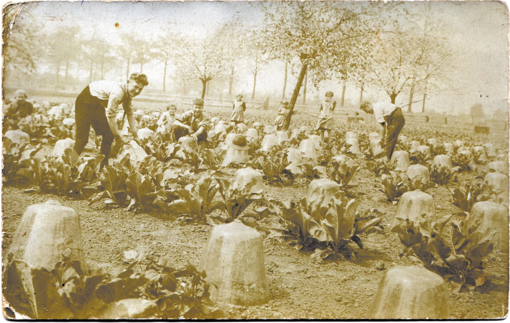
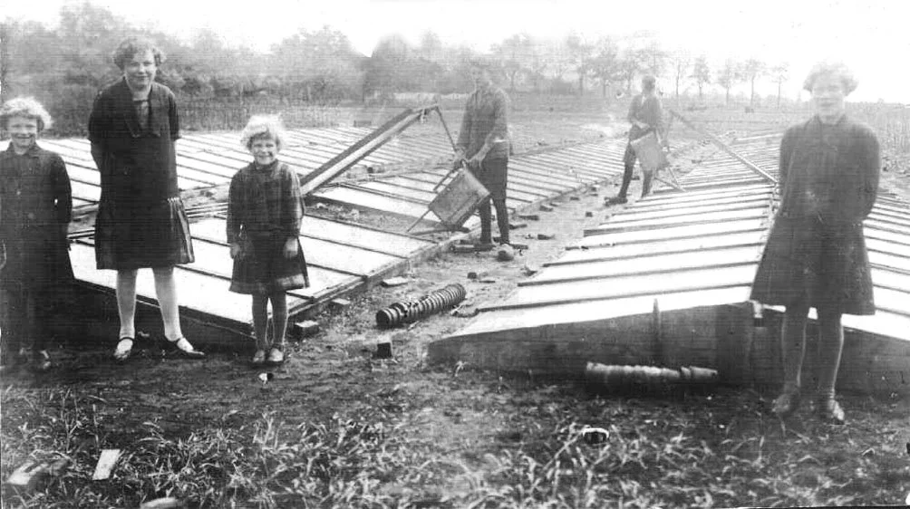
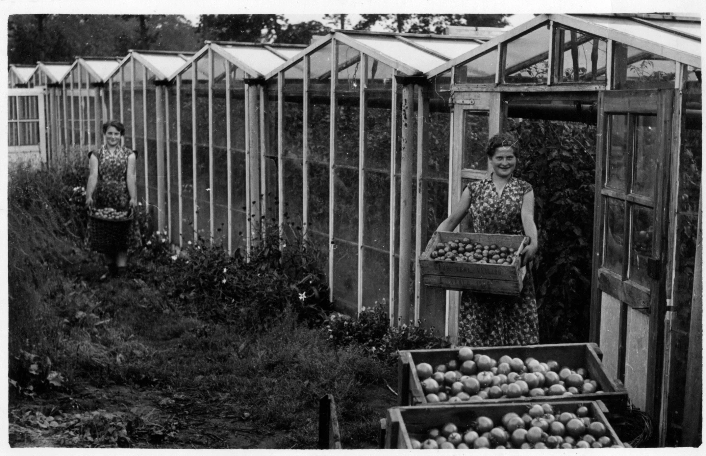
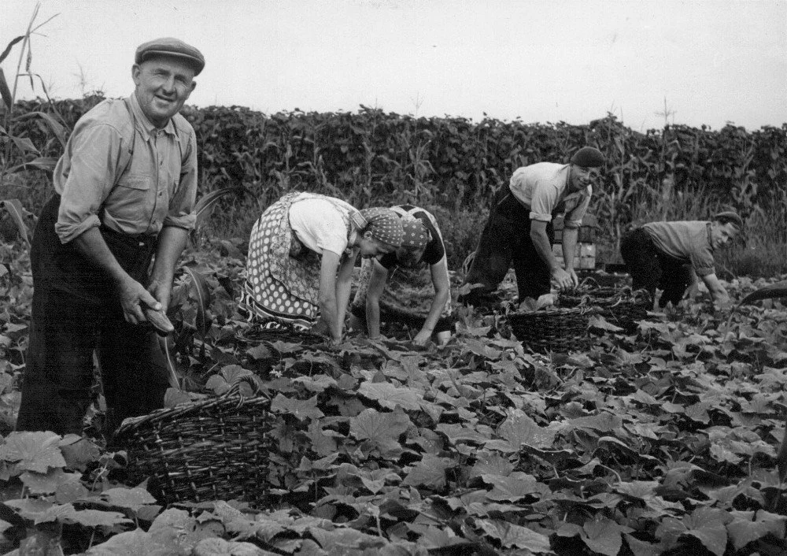
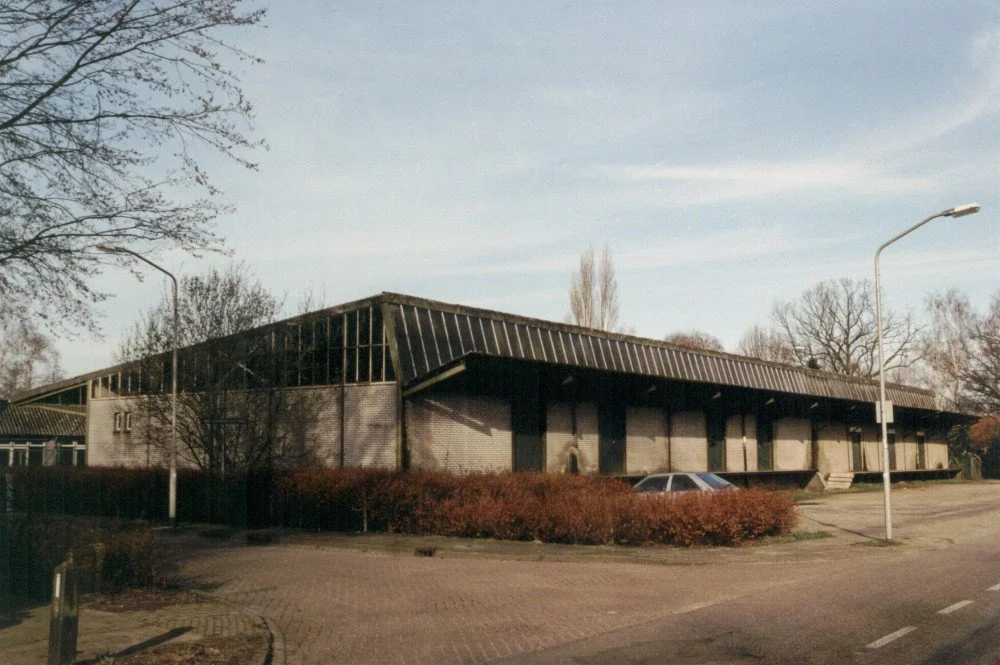
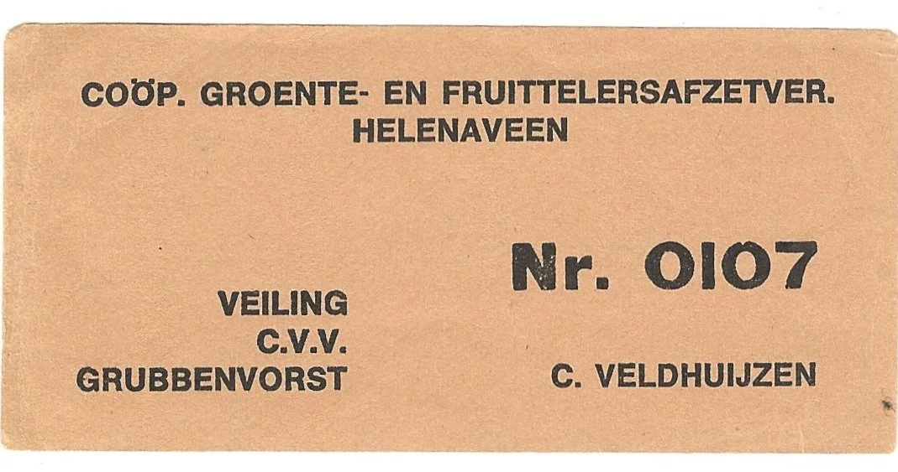
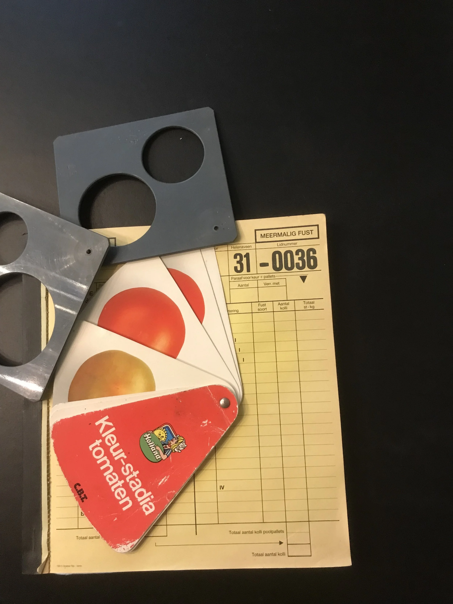

# de-tuinbouw

> Bron: helenaveenvantoen.nl

### De Tuinbouw in Helenaveen

De tuinbouw in helenaveen is ontstaan nadat het plan om grootschalig aan tabaksteelt te gaan doen mislukte.

Het begon allemaal met een ommuurde proeftuin aan de huidige Helenastraat. Nadat de Maatschappij eenmaal besloten had met de zogenaamde Westlandse tuinbouw verder te gaan nodigde zij families uit het Rijnland uit om in Helenaveen hun geluk te beproeven.

Verscheidene tuinders, zoals de families Bakker, Van der Zwaan, Veldhuijzen en Van der Werf, uit de Rijnstreek (Ter Aar en omstreken) kwamen op uitnodiging van de Maatschappij Helenaveen naar de Peel. Primair doel van deze werving was de teelt van augurken en bonen, Later kwamen daarbij aardbeien en bloemkool

‘n Klassiek plaatje: bloemkool onder glazen stolpen

Na deze pioniers volgden volgden vele families hen in het tuindersvak en Helenaveen werd een echt tuindersdorp. Langs de Helenavaart ontstonden vele (bijna huis aan huis) tuinderijen.

De coöperatieve tuinbouwvereniging Helenaveen werd in 1903 opgericht door 23 Helenaveners.

1. Jan Bakker; 2. Cornelis Veldhuizen; 3. Martinus van de Mortel; 4. Antoon Spaan; 5. Jan van Woesik; 6. Jacobus van de Bovenkamp; 7. Tjibbe de Groot; 8. Cornelis van Oijen; 9. Jan Wijnands; [10 onbreekt]; 11. Hein Bakker; 12. Piet Backer; 13. Lambert Gilissen; 14. Johannes van Tegelen; 15. Johannes van de Werf; 16. Gerard de Vries; 17. Herman van Stockum; 18. Jan Aarts; 19. Gerard Schols; [20 ontbreekt]; 21. Aart van den Hurk; 22. Johan van Tol, allen tuiniers, wonende te Helenaveen; 23. Jacob Cornelis van de Bloquerie, directeur der maatschappij Helenaveen,

Amsterdamse bakken

Wat werd er geteeld?

Aardbeien en bessen

Peulen

Prei

KoolBloemkool, spitskool (vooral jonge), spruitkool. Minder: boerenkool, rode kool

Augurken

Knolselderie (sporadisch bleekselderie)

Rabarber (Paragon)

BonenPronkers (bont) – op contract, snijbonen, prinsessen-bonen (breek- /stok), stambonen, tuinbonen, kievit-bonen (soep)

Onder platglas (Amsterdamse bakken)

Wortelen (bospeen)

Aardbeien

Pootgoed optrekken (verspenen): peulen, selderie, bonen

Meloenen

Potchrysanten (door dochters van Arie Veldhuijzen)

Riki en Marietje Bakker plukken tomaten in de eerste kas van Helenaveen: het Venloos warenhuis van vader Jan Bakker Sr.

Glastuinbouw

Sla

Andijvie

Tomaten

Komkommers

Augurken

Paprika’s

Aardbeien

Aubergines

Een probleem voor de tuinders was dat het allemaal pachtbedrijven waren. Daardoor was er geen onderpand en dus ook geen lening bij de bank mogelijk. Hierdoor was de teelt onder glas: alleen mogelijk met platglas

In 1952 maakt de maatschappij Helenaveen het mogelijk dat de tuinders het recht van opstal krijgen.

Pachtcontracten worden aangepast: bankleningen mogelijk

Venlose warenhuizen en rolkassen. Eerste kas: Jan Bakker in 1952

in 1953 volgt de bouw tuinbouwloods (uitbreiding in 1962)

Pietje Sonnemans en zijn gezin plukken augurken op de koude grond

Omzet en leden

Na tweede WO: 112 leden

1955: omzet ƒ 660.000,-

1971: 82 leden, omzet ƒ 2,5 miljoen

1984: 47 leden, omzet > ƒ 12 miljoen

Begin jaren 1990: ± 40 leden

1999: 9 bedrijven – 3 groentetelers, 6 aardbeitelers

1-1-1994: fusie met Tuinbouwvereniging Helden

Tuinbouwloods (oud en nieuw)

Kistlabel

Veilingboek Wim van Mullekom
