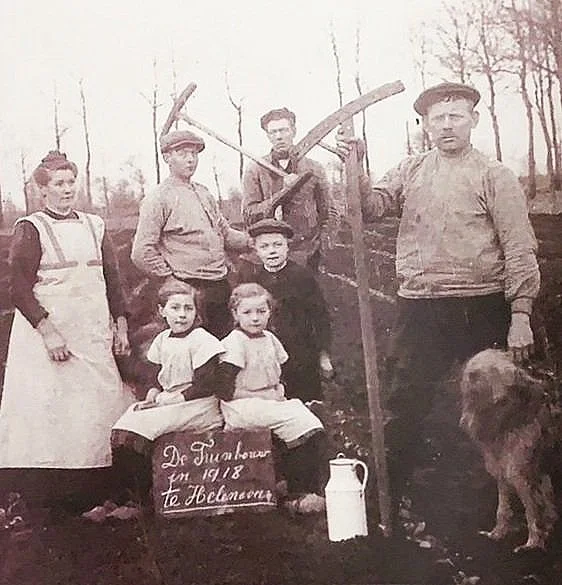
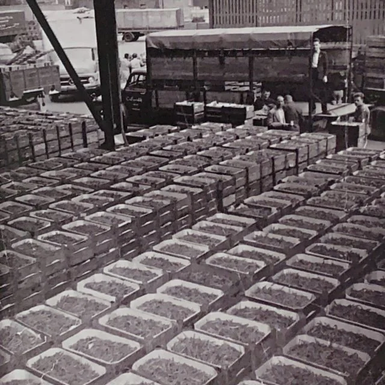
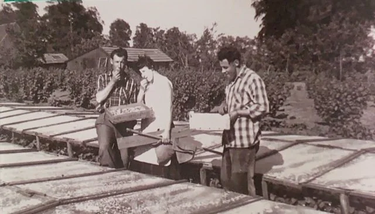
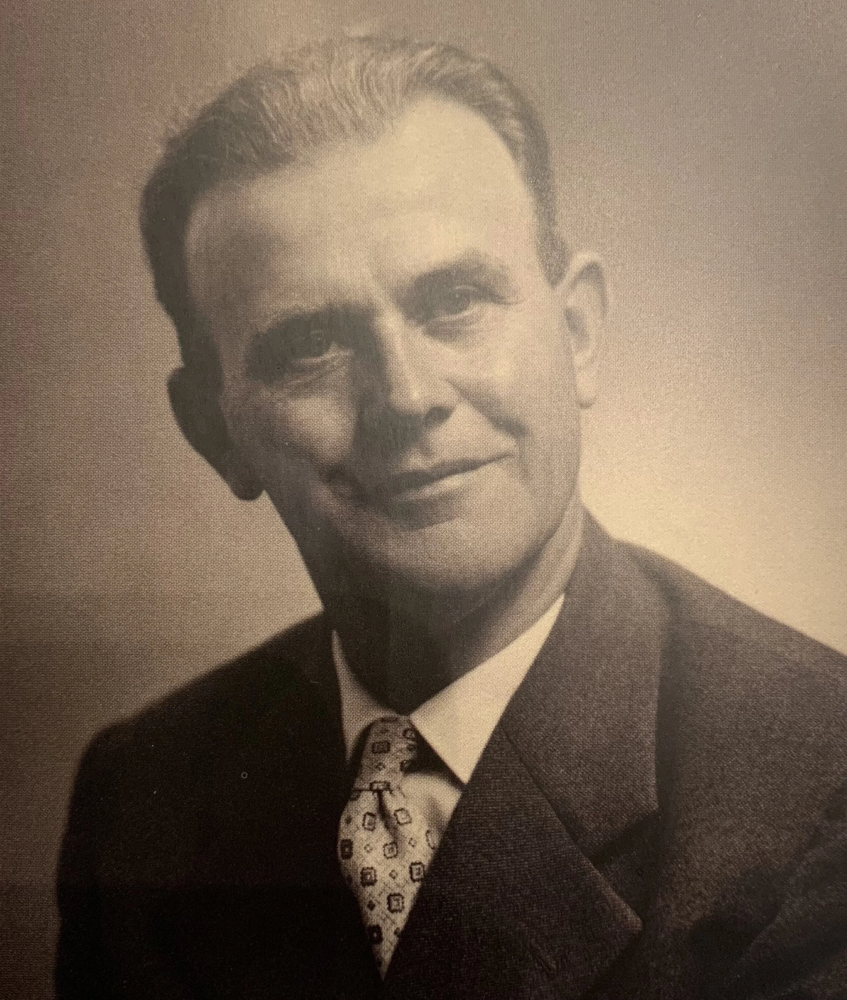
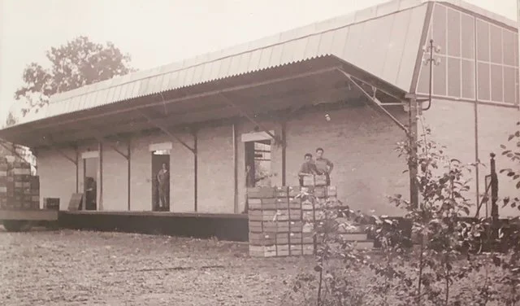
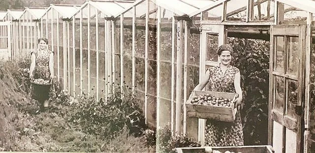
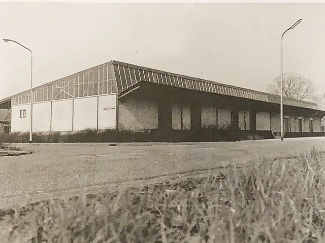

# de-tuinbouwvereniging

> Bron: helenaveenvantoen.nl

### Hoe turfstekers tuinders werden.

### De Cooperative Tuinbouwvereniging Helenaveen: 1913-1993

(overdruk uit “Helden in Tuinbouw, 100 jaar tuinbouwvereniging Helden)

Helenaveen was voor de buitenwereld een dorp van turfstekers en peelkanalen. Toch was het ook een tuindersgemeenschap met een bloeiende tuinbouwvereniging. Maar net als aan het turfsteken kwam ook daaraan een einde: het aantal tuinders nam af en in de jaren negentig kreeg de natuur voorrang. Land- en tuinbouw kwamen op slot te zitten. In 1994 fuseerde de Tuinbouwvereniging Helenaveen met die van Helden.

'Maatschappij Helenaveen': de basis voor tuinbouw

Toen de gebroeders Van de Griendt in 1853 Helenaveen stichtten als centrum van de turfwinning, was tuinbouw in het nieuwe dorp nog ver weg. Maar dat begon te veranderen vanaf het moment dat de Maatschappij Helenaveen in 1887 aan haar arbeiders stukjes grond ter beschikking stele om aardappelen en groenten voor eigen gebruik te verbouwen. Deze veengrond, eerder gebruikt om turf uit te winnen, bleek heel vruchtbaar.

De maatschappij begon eind jaren tachtig van de negentiende eeuw in Zuid-Holland tuinders te werven om in Helenaveen groenten te komen telen op de ontgonnen Peelgrond. Zo vestigden zich onder meer de families Veldhuyzen, Van der Werf, Van der Zwaan en Bakker in het dorp. In eerste instantie werd gewerkt voor de maatschappij, later begonnen de families voor zichzelf. Het in cultuur brengen van grond in Helenaveen werd destijds ook gestimuleerd door koning Willem III. Die had een fonds in het leven geroepen dat tegen gunstige voorwaarden voorschotten verstrekte aan tuinders. Het fonds maakte ook vakcursussen mogelijk.

Het turfsteken liep in de volgende decennia terug, terwijl de tuinbouw begon te groeien. In 1904, toen Helenaveen zo’n duizend inwoners telde, was 38 hectare grond in gebruik voor tuinbouwgewassen als selderij, bonen en prei. Daarmee was de tuinbouw al vroeg een sector van belang in het dorp, eerder dan in de meeste andere plaatsen in de regio.

Oprichting van de Coöperatieve Tuinbouwvereniging

Met de groei van de tuinbouw was de oprichting van een coöperatie slechts een kwestie van tijd. In 1913 was het zover en zag de Coöperatieve Tuinbouwvereniging Helenaveen het levenslicht. Het transport naar de veiling in Venlo was een van de zaken die gezamenlijk werd opgepakt. In de beginjaren gingen producten met paard en wagen over een zandweg door Grashoek naar de tram in Beringe of de treinhalte in Griendtsveen, waarna ze per spoor naar Venlo werden vervoerd.

Het transport per vrachtwagen deed nog vóór aanvang van de Tweede Wereldoorlog zijn intrede. Dat vrachtvervoer naar de veiling werd in het begin verzorgd door Henk Toonen en zou daarna decennialang afwisselend worden verzorgd door de (nog bestaande) firma's Van Esseveldt, Arts en Hoefnagels. In de laatste jaren voor de fusie werd het transportbedrijf van Wim Bakker ingeschakeld.

Cees van Esseveldt lost kisten Helenaveense bonen bij de Venloosche veiling, vooraan keurmeester Toon Vervuurt, links Cees.

Het was de tijd dat de eerste tuinders begonnen met platglas. Ze produceerden onder meer aardbeien, komkommers, bloemkool en bonen, die werden afgezet op de veiling in Venlo.

Toon Bets en Leo van Mullekom aardbeien onder platglas 1959

In 1930 waren 52 inwoners van Helenaveen tuinder, tegen nog maar 17 personen die werkzaam waren als turfsteker in De Peel, aldus een list van beroepen uit die tijd. Maar lang niet alle leden van de vereniging konden leven van de tuindersopbrengsten. Zij combineerden het tuinderschap met het runnen van een gemengd bedrijf of werkten nog als turfsteker of in een andere dienstbetrekking.

De invloed van de Maatschappij Helenaveen op het (economische) leven was groot: door hun pachtcontracten met de maatschappij konden tuinders bij voorbeeld geen lening bij de bank krijgen, omdat ze geen onderpand hadden.

Groei in de jaren vijftig Vlak na de oorlog telde de tuinbouwcoöperatie 112 leden op een honderdtal huizen in heel Helenaveen. En nog steeds bewerkten veel leden niet meer dan een groot uitgevallen moestuin om wat extra inkomsten te verkrijgen. Een centje bijverdienen was geen overbodige luxe, want in Helenaveen heerste meer. armoede dan in de omliggende dorpen.

Voorzitter van de Tuinbouwvereniging Helenaveen was vanaf 1948 tot 1975 Hannes Joosten, en van de meest invloedrijke inwoners die Helenaveen heeft gekend.

Hannes Joosten

Hij was tevens jarenlang voorzitter van de plaatselijke Boerenleenbank, voorzitter van de CVV-veiling in Venlo en wethouder (1953-1974) van de gemeente Deurne. Voor de administratie van de coöperatie was vanaf 1951 Gerrit Vermeulen verantwoordelijk. Vermeulen zou tot de fusie in 1994 administrateur en secretaris blijven.

Begin jaren vijftig kreeg de tuinbouw in Helenaveen een impuls. De coöperatie bouwde in 1953 haar eigen loods (aan de huidige Soemeersingel). Tot dan werden de producten op verschillende plaatsen verzameld en klaargemaakt voor de veiling. De jaren voorafgaand aan de bouw van de loods gebeurde dat onder het afdak van de voormalige lagere school an de Oude Peelstraat. waar ook de eerste augurken-sorteermachine stond.

De tuinbouwloods

Kassenbouw en 'recht van opstal'

De nog immer almachtige Maatschappij Helenaveen verleende in 1952 aan tuinders eindelijk het recht van opstal. Tot die tijd mochten telers - op platglas na - geen glasopstanden bouwen.

De maatschappij paste in die jaren ook de pachtcontracten aan, zodat tuinders geld konden lenen bij de Boerenleenbank. En daarmee kwam de glastuinbouw in Helenaveen letterlijk van de grond. Jan Bakker bouwde in 1952 de eerste (houten) kas van 1000 vierkante meter. Bijzonder, want er verrezen in het begin vooral kleine kassen of 'rolbakken'" (lage glasopstanden met een verschuifbare overkapping), waarin nieuwe producten als tomaten, sla, komkommer en - gedurende en aantal jaren - ook augurken werden geteeld.

Dochters van Jan bakker voor de eerste kas van Helenaveen

De omzet van de aangevoerde groenten en andere tuinbouwproducten bij de vereniging nam elk jaar toe. In 1955 bedroeg die ongeveer 660.000 gulden. In die tijd kwam de teelt van kleinfruit als bessen en aardbeien op, maar dat duurde niet lang. Kleine tuinders bleven wel nog vaak kleinere hoeveelheden aardbeien verbouwen om wat bij te verdienen.

De aspergeteelt gedijde, anders dan 'over de grens' in het Limburgse tuinbouwgebied, in Helenaveen bepaald niet; veengrond bleek er niet zo geschikt voor.

Dorpsleven rond de tuinbouwloods

Met de groei en modernisering van de bedrijven in de jaren zestig nam ook de aanvoer naar de tuinbouwloods toe. Die moest daarom in 1962 worden uitgebreid en voorzien van kantoorruimtes. Vooral op zomeravonden was het in en rond de tuinbouwloods vaak en drukte van belang; zonen en dochters van tuinders waren er, samen met personeel en scholieren, druk bezig met het sorteren van producten. De tuinbouwloods was dan het sociale middelpunt van Helenaveen. In latere jaren gebeurde het sorteren meer op de bedrijven zelf en werden in de loods alleen nog augurken centraal gesorteerd.

'Je zag elkaar niet meer zitten van de sigarenrook’

In de jaren vijftig en zestig was de overgrote meerderheid van de mannelijke gezinshoofden in Helenaveen lid van de tuinbouwvereniging. De jaarvergaderingen werden in die tijd druk bezocht.

"Die vergaderingen vonden plaats in het zaaltje van café Van Horen. Alle leden kregen bij binnenkomst twee consumptiebonnen en twee sigaren, van die bolknakken", herinnert oud-tuinder Jan Bakker zich. "Iedereen rookte in die tijd. Je ging dan zitten in een van de rijen stoelen die klaargezet waren. Daarna duurde het niet lang meer of je zag elkaar haast niet meer zitten van de sigarenrook."

Protestants en katholiek hand en hand

Met de komst van tuinders uit het hele land naar Helenaveen groeide aan het begin van de 20ste eeuw ook het aantal protestanten in het dorp. Ze hadden hun eigen kerk en een eigen school, maar in de tuinbouwcoöperatie trokken katholieken en protestanten samen op. Zonder problemen! De functie van geestelijk adviseur van de coöperatie bleef evenwel voorbehouden aan mijnheer pastoor.

Minder leden en meer omzet

In 1971 telde de tuinbouwvereniging in Helenaveen 82 leden, die samen een omzet haalden van ruim 2,5 miljoen gulden - een stijging van 18,5 procent ten opzichte van en jaar eerder. Die toename zat vooral in een stijging van het aandeel kasaugurken en aardbeien. Ook groeide de sla- en komkommerteelt en ook de andijvieteelt ging en grotere omvang aannemen. De jaaromzetten bleven stijgen, maar de daling van het aantal leden zette in. De bedrijven die overbleven werden steeds groter. In 1984 behaalden de nog resterende 47 leden samen een veilingomzet van meer dan 12 miljoen gulden, vooral met komkommers en tomaten. Twee derde van de bedrijven teelde inmiddels producten onder glas, goed voor een oppervlakte van bijna 23 hectare. Het grote areaal aan glasopstanden was het gevolg van de beperkte ruimte in en rond het dorp, maar ook van de natte ondergrond. Een dak boven de gewassen maakte dat er in elk geval geen extra water van boven bijkwam. Pas vanaf de jaren zeventig speelde de ondergrond geen rol meer, omdat telen op steenwol zijn intrede deed.

Helden komt in beeld

Begin jaren negentig werd duidelijk dat de Helenaveense tuinbouwvereniging als zelfstandige organisatie geen lang leven meer beschoren zou zijn. Het aantal leden was teruggelopen tot nauwelijks veertig, van wie nog steeds een deel alleen parttime tuinder was. Daarbij stonden de drie personeelsleden (secretaris Gerrit Vermeulen en de twee verzorgers Jan Sonnemans en Mat van Grunsven) aan de vooravond van hun pensionering en waren er problemen rondom het vervoer naar de veiling. Verkennende fusiebesprekingen met Neerkant en Deurne leverden nets op, waarna het vizier werd gericht op Helden. Jan Bakker zat destijds in het bestuur: "Het was logisch dat we eerst naar Brabant keken. Maar we hadden niks tegen Limburg, die grens hadden we al lang weggedacht. De toeleveringsbedrijven, de veiling, scholing, daarvoor waren we toch allemaal al op Limburg aangewezen.” Bovendien bleek Helden de zaken moderner en zakelijker aan te pakken dan de Brabantse buren. De provisie, de vrachtkosten en de loonkosten konden omlaag, "en dan zou je wel gek zijn als je niet fuseerde." Op 1 januari 1994 was de fusie van de tuinbouwcoöperatie Helenaveen met Helden dan ook een feit.

Natuur in plaats van tuinbouw

In het fusiebesluit speelde ook mee dat de wind uit een heel andere hoek was gaan waaien. Enkele jaren eerder had het Rijk namelijk besloten tot natuurontwikkeling in de Peel. In de nota Groene Ruimte werd gesproken over het koppelen van de Mariapeel, Deurnese Peel en de Groote Peel (bij Ospel) tot één natuurreservaat. In een straal van twee kilometer rondom de natuurgebieden zouden landbouw en (glas)tuinbouw niet meer passen. Voor veel tuinders in Helenaveen betekende dit dat er geen uitbreidingsmogelijkheden meer waren. Sommigen verhuisden noodgedwongen naar elders.

De natuurplannen werden in de jaren negentig verder uitgewerkt. De tuinbouwsector in het dorp kwam bijna helemaal op slot te zitten. Om die reden en als gevolg van de sanering in de tuinbouw zoals die ook elders plaatsvond, liep het aantal bedrijven verder terug tot de negen op de dag van vandaag; drie groente- en zes aardbeientelers.

Juist besluit

De fusie met Helden bleek een juiste beslissing. Helenaveen kwam terecht in een organisatie die zakelijk goed in elkaar stak en beschikte over en eigen uitzendbureau voor seizoenswerk.

De loods aan de Soemeersingel werd nog enkele jaren gehandhaafd voor kleinere activiteiten, stond vervolgens een tijdje leeg en werd daarna in eigen beheer gesloopt om plaats te maken voor woningen. Het einde van een tijdperk

De oude loods en links de uitbreiding

'De tuinders van de Peel’

Dion van Mullekom, tuinderszoon en huidig bestuurslid van de tuinbouwvereniging Helden, vertrok in 1994 uit Helenaveen omdat er geen ruimte was om voor zichzelf te beginnen. Hij begon een bedrijf aan de Kievit in Grashoek. "Helenaveen, dat was vroeger tuinbouw. Iedereen had met de tuinbouw te maken. Voor mensen van andere dorpen waren wij 'de tuinders van de Peel. Als kind wist je niet beter dan dat je meehielp, bij voorbeeld met papieren vellen in slakratjes leggen voor één of twee cent per velletje. Ik was ook nooit weggegaan als ze me een perceel hadden gegeven. Voor de leefbaarheid van het dorp was het ook slecht dat bedrijven moesten stoppen of verhuizen." Overal in en om het dorp werden ooit groenten geteeld, ook door mensen die er een baan bij hadden. Jan Bakker denkt met enige weemoed terug aan de tijd dat de tuinbouw bloeide in Helenaveen: "Als je intensief bezig bent geweest in de tuinbouw en je fietst nu van Helenaveen haar Griendtsveen, dan krijg je buikpijn als je een beetje gevoelig bent, hoor! Dat was vroeger allemaal agrarisch, en nou vind je daar bijna niks meer van terug. En dat vind ik erg, nog steeds."
