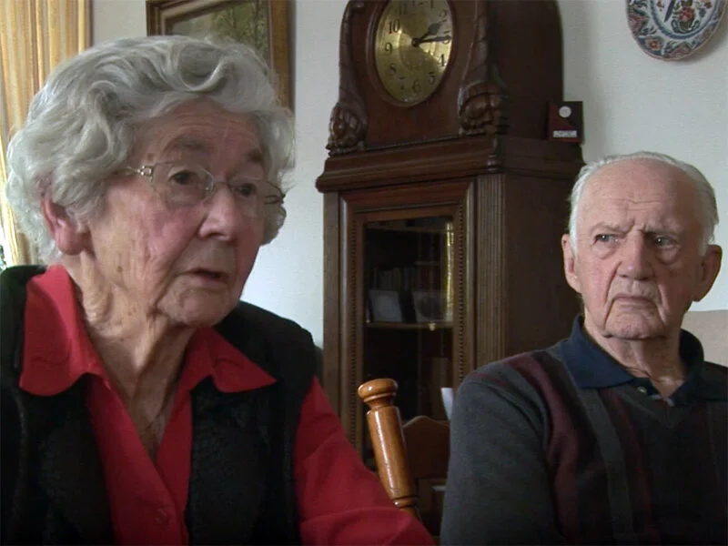
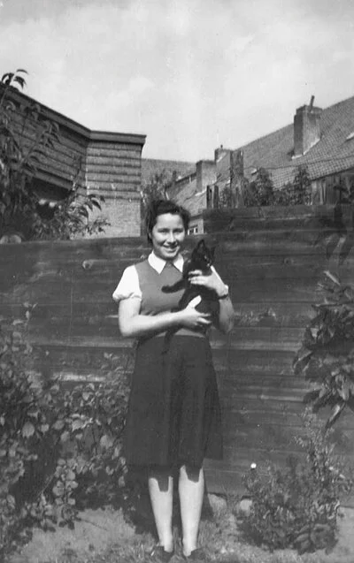

# dirk-en-dina-van-de-bovenkamp

> Bron: helenaveenvantoen.nl

# Dirk en dina van de bovenkamp

## DIRK EN DINA VAN DE BOVENKAMP

Dirk en Dina van de Bovenkamp trouwden in 1953. Ze maakten de oorlog als kind mee en hebben elk hun eigen oorlogsverhalen, maar ook gedeelde herinneringen. Dirk is geboren en getogen in de Peel, waar zijn opa en oma heen kwamen om tabak te telen in de proeftuinen van de Maatschappij. Dina arriveerde met haar familie in 1941, toen de oorlog al begonnen was. Haar vader was opzichter bij de Grontmij, die voor de ontginning van de hei boerderijen bouwde in het Mariaveen.

### Rustige eerste jaren

In die tijd was het nog vrij rustig in Helenaveen, al herinnert Dirk zich nog goed dat de oorlog begon: “Toen de oorlog uitgebroken is, dat vergeet ik ook nooit. We werden wakker, het was nog schemer, net tussen licht en donker. En nou dat gebrom van die vliegtuigen, allemaal van die Duitse Junkers, ik denk dat die op Rotterdam en zo hebben gevlogen. Met para's, met die parachutisten en dan stonden wij voor het dakraam te kijken naar die silhouetten: de één na de ander.”

Pas rond 1943 werd de invloed van de oorlog goed merkbaar: op verschillende plaatsen kwamen Wehrmachthuisjes met zoeklichten, bijvoorbeeld achter de familie Crommentuin (nu Koolweg vlakbij ingang Mariapeel) en bij de familie Terpstra, (nu Oude Peelstraat), waar de slachterij was. Ook vlogen er meer en meer vliegtuigen over. Zo nu en dan kwam er één neer in de Peel. Bij luchtalarm vanwege bombardementen op Duitsland vluchtten Dirk's moeder en jongere zus de kelder in, terwijl Dirk en zijn vader buiten gingen staan kijken wat er aan de horizon gebeurde. Zo zag hij meerdere vliegtuigen brandend neerstorten.

“Als we eens een mooie dag hadden dan gingen we een keer vissen in de Bokssloot, dat was een zijwiek van het kanaal. En op een gegeven moment hoorden we dat schieten van die flak (afweergeschut) en toen kwam er een Engelse bommenwerper, met vier motoren. Die had twee motoren stilstaan. Die vloog zo laag, daar kon dat afweergeschut niet bij. Die schoten er allemaal boven over, je hoorde wokwok, die ontploffingen. Nou, en toen lagen wij daar en hij kwam behoorlijk dicht bij ons langs. Die is terechtgekomen ergens bij Ospel. Ja, daar is ie dan aan de grond geraakt. Volgens mij hebben die het wel overleefd. Maar als ge dat hoort en sjtsjt, overal die scherven die rondvlogen. Toen waren we snel uit gevist; ik weet wel, dat we zo weg waren!”

### Ruth, of Ria

Bij Dina thuis was in deze jaren een Joods meisje ondergebracht: Ruth Winter, die Ria van Veen genoemd werd. “De dominee die kwam ze brengen achterop de fiets. Dat weet ik nog goed, ik zie ze nog komen.” Ruth ging door voor een nichtje van de familie. Op een dag zaten de meisjes bij vriendinnen, de zusjes Veldhuizen. Het gesprek kwam op gebruiken bij katholieken en protestanten. Opeens zei één van de meisjes: “Daar moet je in de Joodse kerk komen, daar is het altijd een lawaai.” Ruth werd daarop zo kwaad, dat ze een appel gooide naar één van de zussen. Toen werd de grond Dina's vader te heet onder de voeten en is Ruth in Sevenum ondergebracht, waar veel Joodse onderduikers de oorlogsjaren hebben uitgezeten.

### Evacuatie

In 1944 werd het menens. Dina en haar familie beleefden angstige momenten: “Ja, want die Duitse soldaten die kwamen overal in de huizen. Naar wapens zoeken en zo ook bij ons.” Dina en haar moeder kregen beiden een bajonet tegen de borst, terwijl een derde soldaat het huis doorzocht op zoek naar wapens. “En gelukkig: mijn vader had een paar dagen van tevoren een pistool in het kanaal gegooid. Een páár dagen van tevoren!”

Het moment van evacuatie was toen aangebroken: “en toen moesten we dan weg, er stond een grote kar langs het huis om wat spullen mee te nemen en toen kwamen die Duitsers de mannen als gijzelaars ophalen.” Spulletjes meenemen was toen geen optie meer: Dina, slechts veertien oud, en haar familie vertrokken halsoverkop. Ze kwamen, met de buren Kobus en Mien Maesen, terecht bij boer Haenen in Grashoek. Daar was een kamer voor hen leeggemaakt, de vloer met stro bedekt. Lang hielden Dina en haar familie het daar niet uit; het was te druk, te vol. Ze verhuisden naar de passantenkampen in Sevenum, nu Evertsoord. Ze kregen wel elke dag wortelstamppot te eten, maar hadden verder niets te klagen, alles was daar prima geregeld.

Dirk was intussen met zijn familie geëvacueerd op de Vliegert, net onder Grashoek. Hij herinnert zich hoe hij en zijn vader tijdens een nachtelijk uitstapje veel geluk hebben gehad: “mijn vader die had op het land de aardappels gerooid, die zaten in een kuil, met daarover het loof gegooid.” Dirk's vader was bang dat het zou gaan vriezen en wilde de aardappels gaan onderstoppen. Op een heldere, maanverlichte nacht maakte hij zijn zoon wakker om op pad te gaan. “Wij kwamen van de Vliegert aflopen op een zandweg richting Helenaveen, en op een gegeven moment hoorde mijn vader daar iets in een paar van die strooimijten: daar lagen Duitsers te slapen. Mijn vader liep daar heen en vroeg hoe laat het was. En ik hoor het nog: die Duitser, die riep tegen een maat van hem 'Hannes, wie spät ist es?'.”

Het bleek een uur of drie. De Duitsers vroegen wat ze wilden, en toen Dirk's vader vertelde van de aardappelen, was dit geen punt en mochten ze door. “En wij komen daar bij de Geldersestraat uit, het was inmiddels een beetje aan het betrekken, af en toe een wolk voor de maan en het was ijzingwekkend stil in het hele dorp. Toen zijn wij daar feitelijk gekomen op een moment dat het wisseling van de wacht is geweest, dus al wat er zat aan rustende troepen was naar het Deurnes kanaal gegaan. En toen vertrouwde mijn vader het is niet zo hard meer, want zag allemaal een beetje luguber uit. Dwars over het land zijn we teruggegaan. We hebben gelopen, gelopen; helemaal tot aan de hei en toen met een omweg terug.”

### Jan en Oege

Tegen het einde van de oorlog kruisen de oorlogsverhalen van Dirk en Dina elkaar middels hun broers, Jan en Oege. Deze jonge mannen waren bij de kerkrazzia in 1944 de dans ontsprongen en hadden zich verstopt op de hei. Neerkant was toen al bevrijd, en Jan en Oege wilden naar de Engelsen. Ze verstopten zich op de schelft van een verlaten paardenstal tot het donker genoeg zou zijn om over de Helenavaart dwars door de hei over het Deurnes kanaal te komen. Daar werden ze ontdekt door een aantal Duitsers, waarna ze werden afgevoerd naar een strafkamp in het Ruhrgebied. Daar werden ze tewerkgesteld in een wapenfabriek. Beiden hebben het wonderwel overleefd.

### Terugkeer naar huis

Eind 1944 konden beide families weer terug naar huis. Dat ging overigens niet zonder slag of stoot. Dina werd met haar jongere zusje vanuit het kamp in Evertsoord op pad gestuurd om een kruiwagen te halen, zodat ze met hun spulletjes naar huis konden rijden. En toen begonnen de Engelsen te schieten... De jonge meisjes slopen van sloot naar sloot om dekking te zoeken en kwamen net op tijd in een schuilkelder van het kamp. Ze waren nèt binnen voor de voltreffer. “En in de schuilkelder zaten de paters. Het was het ene weesgegroetje na het andere. Er werd gebeden daar, hoor! En op een gegeven moment komen de Engelsen binnen. En daar stonden we. Dat was schrikken: soldaten zijn soldaten. Maar ja, ik hoefde niet meer bang te zijn.”

Het huis was er bij terugkeer verschrikkelijk aan toe: het was geraakt door een voltreffer, alles was geplunderd en er liepen geiten in de kamer. De familie werd opgevangen in de jeugdherberg en tegen de kerst van 1944 was het huis weer bewoonbaar.

### spannende momenten

Ook Dirk maakte net voor de bevrijding nog spannende momenten mee: “Ik weet nog toen wij in Sevenum bij die boer waren; daar kwamen op een gegeven moment tegen de avond een paar Duitsers waarschuwen dat we binnen moesten blijven. Ze lieten daar de weg springen. Wij zaten daar op die koeienstal en daar was een dreun, een klap, dat wil je niet weten! Pang! Het regende gewoon stenen van het wegdek; de hele weg lag open. Toen dat gebeurd was, werd het stil. Toen zijn die Duitsers weggetrokken. 's Morgen werd het licht en wij zaten net aan een boterham. En daar kwamen de Engelsen, daar hadden we eerst nog geen erg in, met die helmen met takken erop en zwarte gezichten. Zo zijn we toen bevrijd.”
