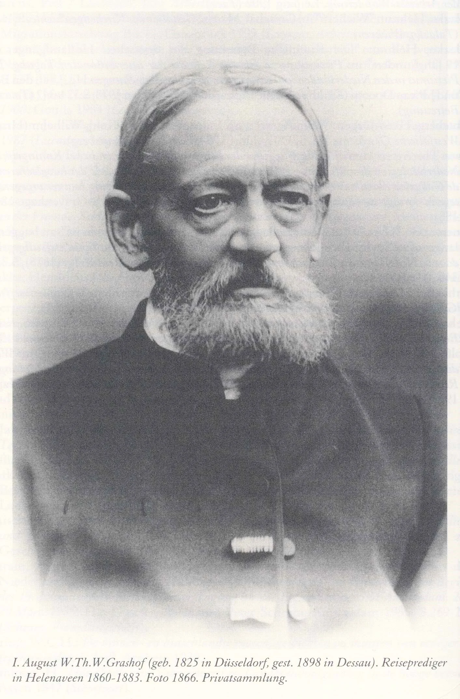
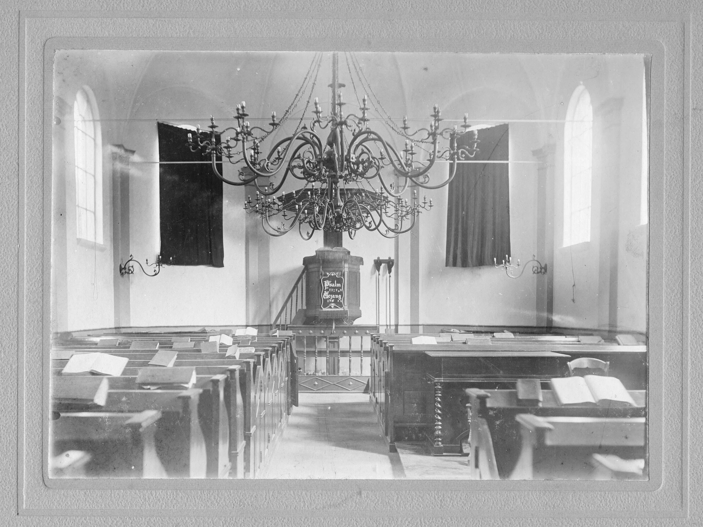

# dominee-grashof

> Bron: helenaveenvantoen.nl

(Foto: Hollandgang im Spiegel der Reiseberichte Evangelischer Geistlicher, p. 1192. 2007.)

Het interieur van de protestantse kerk van Helenaveen in 1875. Foto: Collectie Mij. Helenaveen.

Vanaf 1856 werkten jaarlijks Duitse Poepen als turfsteker in de veenderij van de Maatschappij Helenaveen. De protestantse Poepen kregen tussen 1860 en 1883 in de weken voor Hemelvaart bezoek van August Grashof. Grashof (1825-1898) was tussen 1850 en 1885 dominee in het Duitse plaatsje Süchteln, even over de grens bij Venlo. In 1860 ondernam hij zijn eerste reis naar Helenaveen om de Duitse protestantse seizoenarbeiders als zielzorger bij te staan. Zijn missies naar Helenaveen beschreef de dominee in reisverslagen, die een indruk geven van het werken en wonen in het nog jonge peeldorp.

### Hemelvaart in "das Helenaveen"

In 1862 werden 77 protestantse "Brabantgänger" uit Ladberg en Tecklenburg in de Peel verwacht en 66 Pruisen uit het Ambt Lingen, onder wie enkele protestanten. De Ladbergers reisden per trein van Lengerich over Münster, Hamm, Dortmund, Oberhausen en Ruhrort naar Viersen. Van daar liepen ze nog acht uur naar Helenaveen. Pas vanaf 1866 konden ze met de trein van Venlo naar ‘Halte Helenaveen’ en was hun wandelroute nog maar een achttal kilometer.

Op 9 april 1862 ving Grashof op station Viersen de arbeiders op. De volgende morgen om 7 uur hield hij in de danszaal waar ze geslapen hadden een kleine ‘kerkdienst’, waarna ze zwaar bepakt aanliepen richting Peel. Ze zijn rustig en opgewekt de grens gepasseerd, terwijl de rooms-katholieke Hannoveranen – zoals Grashof later vernam - met rauw gejuich en schertsend de bewoners van de grensdorpen lastig vielen.

“Deze arbeiders graven en steken van ’s nachts drie uur tot ’s avonds acht uur, met een afzonderlijke eetpauze van een half uur, en dat in natte turfputten.” Veenbaas Jan Deckers bevestigde de dominee, dat ze geen brandewijn dronken. “We blijven aan het werk, dan krijgen we het ook niet koud.” Ze zijn bestand tegen de driemaandelijkse ontbering. “Aardappelen zijn er niet, brood en koffie een enkele keer. Boekweitmeel, spek, eieren en goed bier staan op de dagelijkse en zondagse spijskaart van ’s morgens tot ’s avonds… Het enige echte genot is natuurlijk de ‘ehrbar’, korte Duitse pijp.” Grashof was bezorgd om zieke turfstekers "in een vreemd land, zonder gerieflijke verpleging, op de enkel met stro bedekte grond in de krakkemikkige hutten".

Op vrijdag 16 mei 1862 ging de dominee zelf de grens over naar Venlo. ’s Zaterdags haalde Jan Brink, een noorderling uit Helenaveen, hem daar op. Na een mars van vier uur over "grundlose" zand- en veenwegen bereikten ze ’s middags zijn logeeradres. Dat was bij de katholieke veenbaas Deckers. Na het eten en de zondagsvoorbereiding roeide een "Holländer" hem over “het mooie kanaal, dat het Helenaveen kriskras doorsnijdt. Grote rijnaken leggen zo midden in het moeras aan, dicht onder het raam van mijn slaapkamer en soms wekte mij het vroege gedoe op een met een hoge turflading landinwaarts stomend schip.” De roeitocht bracht Grashof eerst bij de familiehutten van Nederlandse protestanten. En vandaar naar de verderaf gelegen vrijgezellenhutten van de veenarbeiders uit Westfalen. Te voet ging het "voorzichtig over smalle bruggen zonder leuning of springend over afvoersloten naar de 20 tot 30 voeten diepe turfputten, waar de Tecklenburgers werkten". Allen – ook Nederlanders – beloofden naar de zondagsdienst te komen. Die hield Grashof in de dorpsschool - pas vijf jaar later beschikte de protestantse geemeenschap in Helenaveen over een eigen kerk - voor 64 Pruissen, twee lutherse Hannoveranen en 30 tot 40 Nederlandse protestanten. “Tegen het einde van de preek kwam door de openstaande deur ook nog een schare katholieken dichter en dichterbij, die in eerbiedige stilte luisterden tot aan de zegen.” Na de dienst bleven de Duitsers nog gezellig na en kon Grashof hen ieder een geschenk overhandigen, dat hij van een Gladbacher had meegekregen.

Roeiend ging het na het eten weer naar de hutten in de Peel. Onder de blote hemel werd een zangviering gehouden. De Nederlanders herkenden op 20 minuten afstand de gezangen. “Het was een lieflijk beeld op de weidse moerasvlakte aan het donkerblauwe kanaal, de mensen op banken, kisten en kasten, tonnen en omgekeerde kruiwagens luisterend en zingend om mij heen.”

Door de week wilde Grashof de peelwerkers niet storen. Hij bracht toen bezoeken aan zijn ambtsbroeders in Deurne, Helmond en Eindhoven. Het volgende, tevens zijn laatste weekend dat jaar in de Peel, herhaalden zich de activiteiten en rituelen van de week ervoor. De dominee mocht een roeiboot lenen van een protestantse én ook van een katholieke schipper. ’s Maandags 25 mei reed de dominee in het gezelschap van een koortsige Tecklenburger in een open koets richting huis om op tijd terug te zijn voor de Hemelvaartviering enkele dagen later in zijn eigen gemeente. [HetHelenaveenvanToen|HvdL|20210524]
