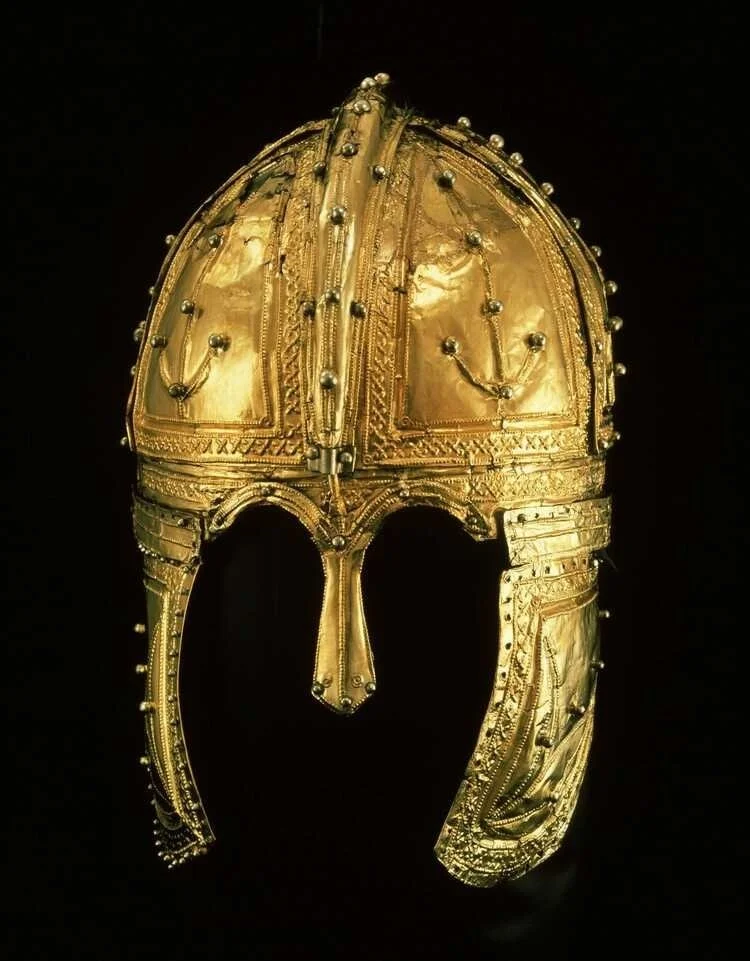

# een-romein-komt-om-in-de-peel

> Bron: helenaveenvantoen.nl

### Een Romein komt om in de Peel

### Een gereconstrueerd ooggetuige verslag

Net voor de vondst van de beroemde gouden helm van Helenaveen noteerde landmeter A.F. van Beurden het volgend op uit de mond van een boer in de buurt van de Schatberg (Sevenum):

“Ze zullen zoeken, maar ook niets vinden. Want in dezen Schatberg is veel gezocht, getuige de groeven in de flanken en de gaten in den top. Een officier van hooge komaf ligt hier begraven, hij heeft zijn gouden degen naast zich liggen en een schat, dien hij moest bewaren. Hij sneuvelde hier, hoe dat weet men niet, maar werd door zijn volgelingen hier in de buurt begraven. Ook dezen volgden hem echter in den dood. En aldus ligt hij hier te wachten.”

Uit: Limburgsche Sagen en Legenden, door A.F.van Beurden,in: Buiten 30 april 1910 (4e jrg.), nr. 18, pag. 207

Volgens mij beschrijft dit van generatie op generatie doorvertelde verhaal wat er gebeurd is met de Romein. Het zou als volgt gegaan kunnen zijn:

De Romein met zijn twee begeleiders werd opgejaagd door lieden die uit waren op buit. De rijk uitgedoste ruiter die alleen vergezeld werd door twee begeleiders leek een gemakkelijke prooi. Ze dreven de Romein en zijn paard het moeras in. Daar verongelukte hij met zijn paard dat op de kop een veenput inschoot.

De achtervolgers beroofden de Romein van zijn geld en goed en lieten hem dood achter.

Het kostbaarste dat hij bij zich had, de gouden helm, zat in een leren zak en die was onderin de veenput terechtgekomen. De achtervolgers wisten niet dat hij die bij zich had, anders hadden ze hem zeker gezocht en geborgen.

Ook hebben ze het zakje met zijn muntenverzameling niet gevonden. De Romein was kennelijk een vereerder van keizer Constantijn en verzamelde muntjes met zijn beeltenis.

Alles wat ze verder van waarde vonden hebben ze meegenomen. Slechts een paar kleinigheden bleven achter in het moeras.

De begeleiders die ook te paard waren wisten te ontkomen naar het oosten. Ze hebben, toen de overvallers weg waren, het lichaam opgehaald en het buiten het moeras begraven op de hooggelegen zandrug bij de Schatberg.

Na de begrafenis hadden hebben ze aan iemand van de lokale bevolking verteld van de overval. Ze zeiden ook dat hij een belangrijk en rijk man was, die een schat bij zich had.

Omdat de begeleiders wel wisten van de kostbare helm, zijn ze later teruggegaan en zochten in het moeras naar de helm, waarbij ze hun schoenen verloren.

Ze werden bij het zoeken alsnog gepakt en gedood door de achtervolgers die nog steeds in de buurt waren. Ook zij zijn van wapens en bezittingen beroofd.

De boeren zijn later ook nog gaan zoeken en vonden de gedode helpers

Deze lezing van het gebeurde verklaart de opvallende afwezigheid van veel voorwerpen op de plek des onheils. Mijns inziens is juist deze afwezigheid van materiaal de belangrijkste aanwijzing voor wat er is gebeurd.

Ook komt het overeen met het verslag zoals dat doorverteld is door de plaatselijke bevolking en dat uiteindelijk vlak voor de vondst van de Gouden Helm is opgetekend door Van Beurden (zie hieronder).

Er is weinig reden om het plaatselijk doorvertelde verhaal niet te geloven.Het is te toevallig dat het speelt op zeer korte afstand van de vindplaats van de helm.Het is te toevallig dat het op een eenvoudige manier de aanwezigheid (en afwezigheid) van de vondsten verklaart.

(Als dit alles klopt betekent het ook dat de Romein nog steeds in zijn graf rust ergens in de bossen van de Schatberg.)

Jan van Woezik , 13 juli 2021

De volledige tekst in het tijdschrift vindt U hieronder:

Buiten 30 april 1910 (De helm werd op 17 juni gevonden!)Limburgsche Sagen en Legenden. SCHATBERG, KRONENBERG, DE MEIR EN SCHENKENBURG ONDER SEVENUM. Een echt ouderwetsch, welvarend boerendorp, waar de landlieden hun oude gewoonten nog behouden hebben, waar 's winters nog gesponnen wordt, de huismoeders haar garen nog naar den wever brengen, waar de mannen nog manchester verkiezen boven nieuwerwetsch laken voor de ruime kleeren en de bruiloften nog met oude zangwijzen en eetpartijen gevierd worden zonder brasserij... dat is Sevenum, in het midden van Limburg, tegen de Peel gelegen. Daar ziet men nog huizen en stallen, groot en ruim op eigen erf in den boomgaard liggen en het tingerei, het koperwerk, de oude staande klok, de klaptafel, de groote eikenhouten kisten in het voorhuis staan. En klokslag twaalf uur's middags komt het eenvoudige middagmaal dampende op tafel, terwijl in den zomer daarna alles gaat “ungeren” of dutten. Maar zóó dom is de boer niet, of hij is den vooruitgang van den landbouw, der zuivelbereiding en der kippenfokkerij trouw gevolgd en bijgebleven; hij is goed op de hoogte van 't gebruik van kunstmeststoffen en der coöperatie. Daarom mogen wij van Sevenum spreken, evenals van Horst en Maasbree, als van een welvarende gemeente. Maar de oude spreektaal, het dialect, de oude zangdeunen, de zangwijzen van den trouwen koningszoon, van het jongmensch, dat niet voor lieven, noch voor liefde vatbaar scheen en toch ten slotte bezweek, de oude plaatselijke sagen, zij leven er nog voort. Waar de bodem over het algemeen zóó vlak is, is een heuvel gauw een berg en aldus noemt men een der vreemdkleurige, witgele zandduinen aan de Peel, den Schatberg. Hij is hooger dan de omliggende. Links liggen diepe moerassen, broekgronden langs welker randen dennenbosschen welig groeien. Rechts, het eindeloos schijnende, te ontginnen stuk Peel, dat reeds omgeploegd is en spoedig in cultuur gebracht zal worden. Hier en daar in de Peel, ver van ons af, tusschen een groep boomen als een miniatuur-oase in de bruinzwarte vlakte, een oud vervallen schaapskooi, dateerende uit den tijd, toen het schapenhouden nog loonde. Verder aan den horizon bosschen, torens, fabrieksschoorstenen, een boortoren, die de langzaam komende omzetting der Peel in bewoond en winstgevend terrein aankondigen. Wij zitten op den Schatberg, en denkt er aan, dat als een boer ons nu ziet zitten, hij voor zich heen mompelen zal: “ze zullen zoeken, maar ook niets vinden”. Want in dezen Schatberg is veel gezocht, getuige de groeven in de flanken en de gaten in den top. Een officier van hooge komaf ligt hier begraven, hij heeft zijn gouden degen naast zich liggen en een schat, dien hij moest bewaren. Hij sneuvelde hier, hoe dat weet men niet, maar werd door zijne volgelingen hier in de buurt begraven. Ook dezen volgden hem echter in den dood. En aldus ligt hij hier te wachten. De één vertelt u, het was een Romein, een ander dat het een Spanjaard was, maar ieder heeft toch wel eens in den Schatberg gegraven en oud en jong zijn op den wonderheuvel geklommen. De schat echter, hij is er nog evenmin gevonden als de “Kroon” op het gehucht Kronenberg, dat ge een weinig meer rechts op Horst ziet liggen, waar men sporen vond van oude bevestigingen, muurwerk, gebroken vaatwerk en aardewerk. Wat er ook van zij, vaststaat de meening bij het landvolk, dat er op den Schatberg en op Kronenberg vreemde dingen geschied zijn, die nog steeds op verklaring wachten. Op de “Meir”, een vierkant met wallen en grachten omgeven stuk grond, waar men nog brokstukken van muren vindt, woonde in oude tijd een ouden pastoor. Hij kwam af en toe naar het dorp en had een ouden schimmel, een wonderbeest. Des avonds steeg zijn bezitter in het zadel en zeide dan: “In einen keer tot in het Meer.” De Schimmel verhief zich en draafde door de lucht tot in het meer. Waarom, wie weet 't? Ook de oude Schenkenweg, bij het dorp, thans verdwenen, wordt als eene geestenplaats aangezien De Schencken van Nijdeggen hebben eene met vele wisselingen doorweven geschiedenis. Hun kasteel Schenckenburg zag soms rare dingen. De laatste der Schencken, die steek en degen droeg, was danig aan den drank en passeerde elken dag het Sint Antonius kapelletje, door zijne voorouders gesticht. Telkenmale ging hij spottende voorbij, tot men hem 's morgens na een zwelgpartij, dood vond in het kapelletje. In zijn laatste uur had hij Sint Antonius toch nog bezocht. Toen het kasteel nog in wezen was, moest de ophaalbrug elken avond te negen uur opgehaald worden. Vergat men het, dan kwam er een groote zwarte hond op de brug liggen, die iedereen met vurigen klauw en oogen weerde. Omdat er ook het paard 'paard zonder kop’ rond waarde, brak men het kasteel af, maar de daarvoor gevormde weide is nog als bedorven en er groeien slechts distelen en doornen.
