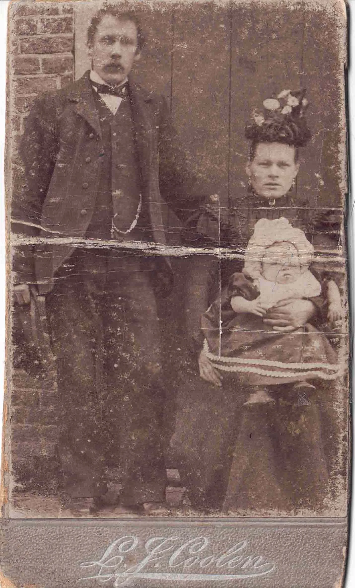
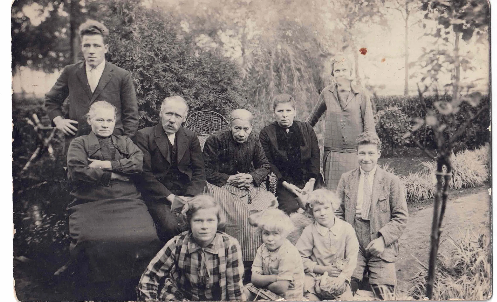
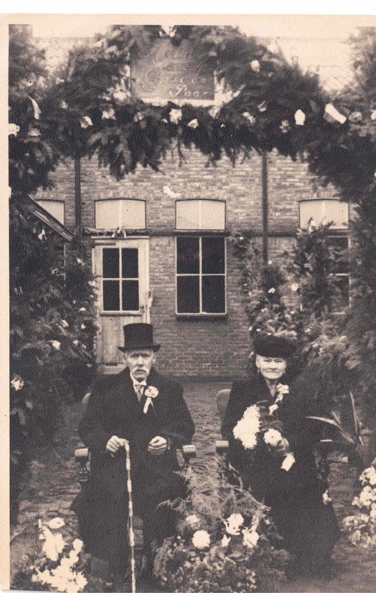
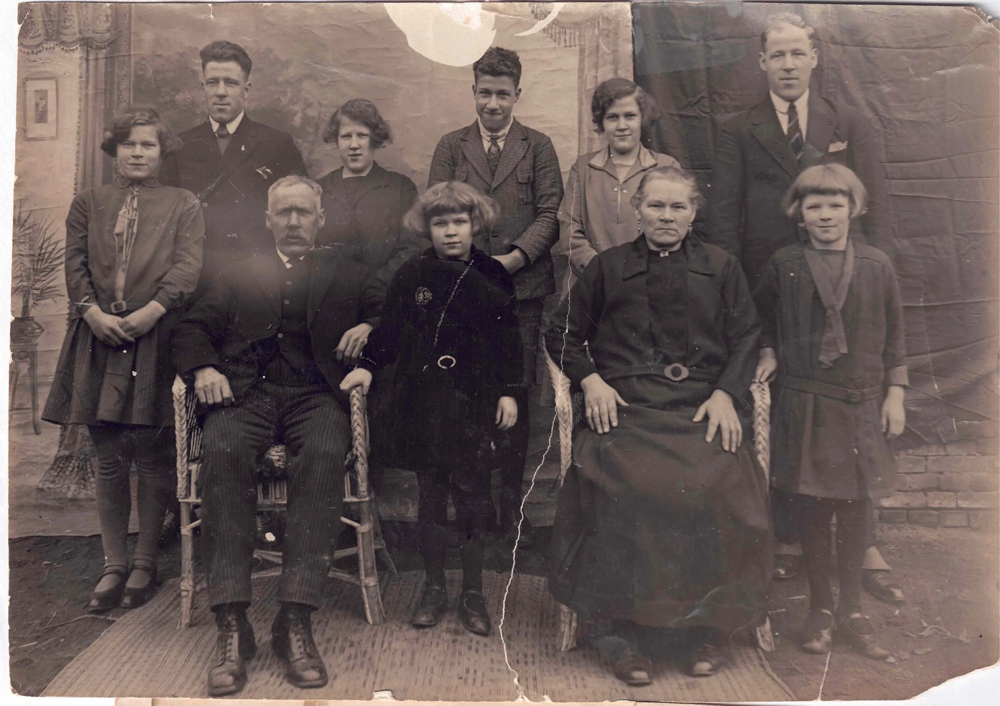
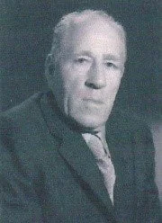
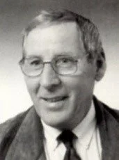
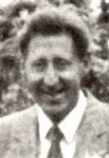

# familie-erkelens

> Bron: helenaveenvantoen.nl

### Tabaksplanter - en Later fruitteler - Erkelens emigreert naar Helenaveen

Naar een verhaal van Marinus Erkelens (Amsterdam, 1997)

Grootvader Marianus Erkelens en grootmoeder Hendrika van Dijk vertrokken op 30 april 1889 met hun gezin uit hun woonplaats Altforst, gemeente Appeltern (land van Maas en Waal), naar Helenaveen. Mijn vader Andries was toen 17 jaar.

In de jaren 1890 en later zijn nog andere families uit het land van Maas en Waal naar Helenaveen getrokken, met name de fam. Van Woezik, fam. Van Mullekom, fam. Kartner, e.a.

De mensen uit het land van Maas en Waal waren voor zover mij bekend tabakstelers, die min of meer in moeilijkheden waren geraakt door de concurrentie van de Indische tabak. Deze werd tegen lagere prijzen ingevoerd en ook de kwaliteit zou beter zijn. De eerste tijd na hun komst in Helenaveen blijken ze toch nog aan tabaksteelt gedaan te hebben, gezien het feit dat er in de Geldersestraat twee tabaksschuren staan, indertijd gebouwd voor het drogen van de tabak. Ze zijn sinds enige tijd verbouwd tot woonhuizen.

De Geldersestraat in Helenaveen is naar hen genoemd omdat ze in die straat kwamen wonen.

In het begin van de vorige eeuw bestonden Helenaveen en Griendtsveen nog niet. Toen was het terrein waarop nu deze plaatsen liggen woeste grond met moerassen en kleine meertjes met waterplanten. Het hogere gedeelte was begroeid met heide en berkenbomen. Zo is de veengrond ontstaan met een zwarte laag veen en grauwveen bovenop.

De heer Van de Griendt heeft indertijd veel van deze gronden opgekocht om de turf, waarnaar toentertijd veel vraag was, te kunnen exploiteren. Van de Griendt is begonnen met het laten graven van een kanaal (Helenavaart genoemd) dat aansloot op de Zuid-Willemsvaart en verder op de Maas. Met schepen ging de turf naar steden als Rotterdam en Den Bosch.

De schepen werden tevens gebruikt om op de terugweg compost uit Rotterdam en andere steden mee te brengen, die werd gebruikt om de gronden te verbeteren.

De gronden waarvan de zwarte turf was weggegraven (dat kon een laag van 1 à 1.5 meter dik zijn) en waarop het grauwe veen was achtergebleven, werd gedeeltelijk geschikt gemaakt voor tuinbouwproducten, het overige gedeelte werd landbouw. De compost die toentertijd vanuit Rotterdam en elders werd aangevoerd was bijzonder goed doordat er veel ‘tonnetjesmest’ van de mensen in was verwerkt. De grond werd door het regelmatig gebruik van compost zeer humusrijk en vochthoudend en daardoor bijzonder geschikt voor de teelt van groenten en kleinfruit (bv. aardbeien).

Naast de teelt van tabak is men ook direct tot het telen van groenten en kleinfruit overgegaan, mede ook door de toenemende vraag naar groenten uit het Duitse Roergebied. De teelten bestonden uit: tuinbonen, spekbonen, peulen, doperwten en later ook augurken.Voor zover mij bekend is vader niet meer aan de tabaksteelt begonnen, maar direct op de teelt van groenten overgegaan. Vader heeft ook nog enige tijd vruchtbomen gekweekt, maar er was in Helenaveen en omgeving weinig vraag naar vruchtbomen.

Het bedrijf van grootvader Erkelens was 1 ha. groot en gelegen aan de Helenavaart tussen Helenaveen en Griendtsveen.

Vader en moeder Erkelens in 1899

Vader Andries en moeder Gertruda zijn getrouwd op 18 mei 1899. Zij hebben eerst korte tijd op kamers gewoond bij de familie J. v.d. Werf. Van hieruit zijn ze verhuisd naar een huis van twee onder een kap, gelegen aan de Helenavaart dichtbij het centrum van Helenaveen. In het ene gedeelte woonde vader en moeder in het andere gedeelte de familie Bertus en Nel Klerks. Ons eerste zusje Christientje en ook ik (Marinus) zijn hier geboren. Christientje is zeer jong gestorven, nog voor dat ik in 1901 geboren werd. De andere kinderen zijn geboren in het huis van grootvader en groot­moeder waarin wij later zijn gaan wonen, dat zal omstreeks 1905 zijn geweest. Ik herinner me nog dat we zijn verhuisd per aak (platte boot) en dat ik in deze boot zat. Opa Erkelens herinner ik ook nog als een heel oude man.

Mijn vader Andries werkte toen al op het bedrijf van grootvader (Marianus) omdat die al oud was en het toch in de bedoeling lag dat vader en moeder het bedrijf te zijnertijd zouden overnemen. Grootvader is overleden in 1906.

Tante Dora was inmiddels getrouwd met ome Antoon Berkers. Zij zijn toen in Griendtsveen gaan wonen in een woonhuis met grote tuin, gelegen in het centrum. Ome Antoon was bankwerker bij Maatschappij Griendtsveen in de strooiselfabriek waar de grauwe turf werd verwerkt tot turfstrooisel. Tante Dora, die naaister van beroep was, had ook een winkel voor allerlei artikelen en garen.

Grootmoeder is bij tante Dora en ome Antoon gaan inwonen.

Vader heeft de eerste tijd ook nog vruchtbomen gekweekt. Er was in Helenaveen en omgeving echter weinig vraag naar vruchtbomen. De vraag betrof ook meestal hoogstammen, die 4 à 5 jaar gekweekt moeten worden om leverbaar te zijn. Vader had ook nog een eigen appel gekweekt, maar er bleek weinig interesse voor.

Vader Erkelens (Andries) was in Helenaveen de eerste die een fiets had of eigenlijk was dat Bertus Klerks, de vroegere buurman van vader en moeder. Klerks was namelijk de ver­tegenwoordiger van de rijwielfabriek Valuas te Venlo, en had een fiets om te demon­streren. De fiets was toen een zwaar onhandig ding zonder vrijwiel, doortrapper noem­de men die toen.

Ik heb ook op zo'n fiets geleerd en reed er soms mee naar Tante Dora in Griendtsveen. De tweede fiets die vader kocht was een damesfiets om ook moeder in de gelegenheid te stellen om te fietsen. Ik heb getracht het haar te leren. Dat gebeurde dan meestal 's avonds bij maanlicht. Want moeder wilde van de buren niet weten dat ze wilde gaan fietsen.

Het is haar echter niet gelukt te leren fietsen. Ze was ook erg bang om te vallen of in het kanaal terecht te komen, want ze kon niet zwemmen. Trouwens niemand van de oude mensen kon vroeger zwemmen, ook vader niet. Er was geen gelegenheid om het te leren en het was feitelijk ook onzedelijk volgens de kerk. De pastoor had het in zijn preek hier wel eens over.

Toen in Deurne een tweejarige tuinbouw-wintercursus werd gegeven, de eerste in deze streek omstreeks 1907, heeft vader deze gevolgd. Dit kon hij doen omdat hij een fiets had. De afstand was wel +/- 15 km. maar dat had hij er graag voor over.

Het theoretisch gedeelte van de cursus werd gegeven door mr. Hendriks, een onderwijzer met tuinbouwakte, een der eersten in deze streek. Mr. Hendriks was een zeer bekwame man die beter les gaf dan menig professor. Ik heb later ook les van hem gehad, toen in Helenaveen zo'n cursus werd gegeven. Hij was bijzonder goed in de vakken schei- en natuurkunde. Ik heb later, toen ik in Roermond de opleiding voor tuinbouwvak-onderwijzer volgde, les gehad van een doctor in de natuur- en scheikunde, maar van Mr. Hendriks heb ik beter les gehad dan van doctor Bemelmans.

Andries Erkelens was voor zijn tijd een man met veel kennis, speciaal op het gebied van de tuinbouw. Hij was in Helenaveen en omstreken de eerste die gebruik maakte van kunstmest bij de teelt van groente en fruit. Soms als hoofdbemesting, maar ook als aanvulling op het gebruik van stalmest, compost en gier.

Hij kende alle soorten en eigenschappen van kunstmest die toen gebruikt werden (kiezeriet, patentkali, superfosfaat, thomasslakkenmeel, chilisalpeter e.a.) en welke kunstmest bepaalde gewassen nodig hadden.

Familie Erkelens met Oma in 1920

Vader was voor vele tuinders een vraagbaak indien het ging over het gebruik van kunstmest, nieuwe technieken, snoeien, nieuwe rassen, enz.

Toen vader en moeder 50 jaar getrouwd waren (20 nov. 1949) was en er een groot feest en heeft de burgemeester van Deurne (waaronder Helenaveen ressorteert) op hun feest een uitvoerige redevoering gehouden, waarbij tot uiting kwam wat vader voor de mensen in Helenaveen heeft betekend.

Vader was zeer leergierig en las veel. Naast de Venlose Courant (toen tante Bet ge­heten) had vader ook de Maasbode. Hij had ook een bijzondere mooi handschrift en beschikte over een boek waarin alle officiële titels stonden van de hoge heren en dames. Bij brieven aan officiële personen, moest men daar heel erg op letten. Als iemand een brief aan een officieel persoon moest schrijven kwam men meestal daarvoor naar vader, terwijl men zou verwachten dat men daarvoor naar het hoofd van de school zou gaan. Het zal wel als oorzaak hebben dat vader dicht bij de mensen stond.

Zoals reeds vermeld las vader veel, ook weleens boeken, die hij als katholiek niet mocht lezen. Zo had hij een zesdelig boekwerk besteld dat in 6 maanden werd geleverd (en ook in 6 keren kon worden betaald). Het heette "De wereld in woord en beeld".

Er was een boek bij dat handelde over het leven van de pausen en waarin vooral het slechte leven van de Borgia’s werd benadrukt.

Vader had ook nogal eens kritiek op de slechte betaling van de veenarbeiders door de Maatschappij Helenaveen en Griendtsveen. In een bepaald jaar (welk mij is ontgaan) werden de turfgravers gekort in hun loon, terwijl de Maatschappij Helenaveen aan zijn aandeelhouders 23% dividend uitkeerde. Vader had dit een groot schandaal genoemd. Ook zijn opmerkingen, toen omstreeks 1910 de arbeiders begonnen met staken voor hoger loon en dit zowel door de pastoor als de dominee werd afgekeurd, dat zulks sterke afkeer verdiende. Hij was zeer sociaal voelend, maar dat werd hem niet altijd in dank afgenomen.

Op een avond stond ik te praten met Frits Deuling, een uit Groningen afkomstige boer, die naar Helenaveen was gekomen en op een boerderij was komen wonen.

Hij zei: "Marinus, weet je wat ze van jou vader zeggen, dat het een socialist is". Deze kwalificatie was toen gelijk aan wat men nu communist zou noemen.

Vader heeft indertijd nog gesolliciteerd naar een baan van opzichter-tuinbaas van de stadstuinen van Maastricht, dat zal omstreeks 1910-1911 zijn geweest.

Jaap Hoek, een vroegere buurjongen van ons thuis, werkte sedert enige tijd als tuinman in de stadstuinen van Maastricht. Hij liet vader per brief weten dat er voor de stadstuinen een tuinbaas werd gezocht en vond dat vader daar zeer geschikt voor zou zijn. Hij adviseerde vader dringend daarop te solliciteren.

Vader had wel idee van zo'n baan, ook dat zijn kinderen daar veel meer mogelijkheden zouden hebben dan in Helenaveen. Hij schreef op die baan en kreeg spoedig bericht om zich te komen presenteren. Hij werd aangenomen, het loon werd vastgesteld dat toender­tijd een weekloon betrof. Er was voor de tuinbaas een huis beschikbaar, alles leek in orde, en vader dacht zeker te zijn van die baan. Korte tijd later kwam er echter een bericht van de betreffende gemeente-instelling dat er toch van een benoeming werd afgezien. Redenen werden niet opgegeven.

Ik vergeet nooit wat vader zei toen hij de brief las: ”Daar hebben die verdomde geestelijken achter gezeten". In die tijd hadden de geestelijken en de mensen met kapitaal het voor het zeggen, de overige mochten geen eigen mening hebben en werden voor dom gehouden. Dat vader kritiek durfde te uiten op bepaalde toestanden is zeker wel de oorzaak geweest dat hij ‘n ‘socialist’ werd genoemd en de baan in Maastricht niet heeft gekregen.

Vader en de kinderen gingen elke zondag trouw naar de kerk, meestal naar de hoogmis die om 10.00 uur begon. Moeder was dan al naar de vroegmis geweest die om 7 uur begon. Wij woonden ca. 3 km van de kerk en school en de bezoeken moesten lopend geschieden. Ik herinner mij nog dat vader ’s zondags, als hij naar de kerk ging, een bolhoed ophad en een zwarte jas droeg. Bij hoogfeesten - Pasen, Pinksteren, Maria Hemelvaart op 15 aug. - had hij zijn beste bolhoed en een slipjas aan. Moeder droeg die dagen, ook gewoon ’s zondags, meestal een donkere mantel.

Moeder had de eerste jaren van haar huwelijk nog wel een rustig leven, maar doordat het gezin steeds groter werd was ze steeds meer bezet, zodat er weinig tijd overbleef voor andere dingen. Ze had wel steeds een mooie voortuin, de mooiste van het dorp. De eerste jaren had ze ook nog tijd voor zich zelf. Ik herinner mij nog dat moeder op haar manier wel een beetje trots was op zichzelf. Ik was denk ik ca. 5 jaar, dat ze voor de spiegel stond en haar haren aan het kammen was en zei: Marinus vind jij niet dat ik mooi haar heb?

Later werd het gezin steeds groter en had ze nauwelijks tijd voor zichzelf (ik was toen ons Stientje geboren werd de oudste van 10 kinderen en 20 jaar). Moeder had wel af en toe hulp van een huishoudster (Mien van Woezik), maar meer hulp kon niet betaald worden. Zus Grada, ik zelf en ook de anderen hielpen zo veel mogelijk. Zo heb ik onze Bertus en Stientje lopen geleerd. Een boks kende men toen blijkbaar niet.

Moeder had ook een eigen naaimachine waarop ze kleren voor de kinderen maakte en repareerde. Dan kocht zij van Piet Reinders uit Deurne, die op gezette tijden met een wagen, door een paard getrokken, met stoffen en huishoudelijke artikelen naar Helenaveen langs de deur kwam, een mooie lap stof waar zij dan mooie jurkjes van maakte voor de kleine meisjes. Ik hoorde haar meestal ’s avonds, soms nog heel laat op de naaimachine rammelen.

Moeder Erkelens trad vrijwel nooit op de voorgrond. Ze was met haar grote gezin van 10 kinderen dag in dag uit zodanig zwaar bezet, dat er weinig tijd overbleef voor dingen buitenshuis.

### Beschrijving van de fruitteelt in Helenaveen.

Naar een verhaal van Marinus Erkelens (Amsterdam, 1997)

Overzicht van de teelt van fruit door de familie Erkelens.

Als ik het geheel overzie wat de teelt van fruit betreft door de familie Erkelens, dan kom ik op bijna 100 jaar.

De familie Erkelens komt oorspronkelijk uit Gelderland, uit het Land van Maas en Waal. Grootvader en Grootmoeder Erkelens zijn met hun gezin in 1889 in Helenaveen komen wonen, mijn vader Andries was toen 17 jaar.De familie Erkelens betrok toen een bedrijf met woonhuis van ruim 1 ha (en later uitgebreid tot 2 ha), gehuurd van de Maatschappij Helenaveen te Helenaveen.

De grond was oorspronkelijk veengrond geweest waar het zwartveen onder uit was gehaald voor turf. Door het aanbrengen van een zandlaag van ca. 20 cm en veel compost was de grond geschikt gemaakt voor de teelt van groeten, fruit en landbouwgewassen.

Grootvader had in zijn vroegere woonplaats aan tabaksteelt gedaan. In Helenaveen is hij direct overgegaan op de teelt van groenten en fruit, mede door de grote vraag naar deze producten vanuit het Duitse Roergebied. De producten werden ook toen reeds via de groenteveiling in Venlo verhandeld bij afslag door iemand van het personeel van de veiling. Men had toen nog geen veilingklok.

Mijn vader Andries Erkelens werkte vanaf het begin van de komst in Helenaveen op het bedrijf van zijn vader. Hij heeft in 1906 het huis overgenomen. De eerste jaren heeft vader naast groenten en fruit ook vruchtbomen gekweekt. Veel hoogstammen waarnaar de meeste vraag was.

Mijn vader was in Helenaveen de eerste die een fiets had. De fiets was toen een zwaar en onhandig ding, zonder vrijwiel. Hiermede ging hij de boeren in de omliggende dorpen af (Liessel, Neerkant, Meijel e.a.) om zijn bomen te verkopen. De verkochte bomen werden in de herfst per boerenkar naar de afnemer gebracht. Vader moest soms de bomen ook nog planten (en later bespuiten met vruchtboomcarbolineum).

Van de zelf gekweekte bomen had vader indertijd op zijn bedrijf een tweetal fruitaanplantingen gemaakt met struikvormer appels en peren op zwakke onderstammen. De appels stonden op Doricin en de peren op Kwee.Indertijd (1908-1910) had vader veel contact met Ir. Sprenger, toen rijkstuinbouw consulent voor Limburg en Oost-Brabant. Ik herinner mij nog dat wij in 1908 een proefobject van Ir. Sprenger hadden van ca. 40 are met appels en zwarte bessen, volgens het wijker-blijversysteem dat toen iets nieuws was. De fruitteelt bestond toen nog vrijwel uitsluitend uit hoogstambomen.

De proef bestond uit hoogstam appel op 10x10 meter, daar tussen ruimten opgevuld met zwartebessenstruiken.Ir Sprenger kwam de eerste jaren jaarlijks een snoeiles geven. Als er in die tijd een tuinbouwcursus werd gegeven mochten de cursisten die snoeiles ook bijwonen.

De groei van de bomen en de bessenstruiken was op onze dalgrond bijzonder goed. Van de bessen was het 2e groeijaar al een flinke oogst.De zwarte bessen werden via een speciale zwartebessen overleg, dat in ’s-Hertogenbosch werd gehouden, verkocht. De gemiddelde prijs was laag, 11 cent per kg.

Het 3e groei jaar (1910) was er van de zwarte bessen een grote oogst. Vader verkocht de bessen in de voorkoop via een commissionair in Rotterdam aan een fabriek in Engeland tegen de prijs van 25 cent per kg. Voor die tijd een hoge prijs.

De fabriek in Engeland zond de benodigde ‘bussels’ om de bessen te vervoeren. Vader schakelde de hele buurt in om zijn bessen (4000 kg) in enkele dagen geplukt te krijgen. Ze werden per trein naar Rotterdam vervoerd. Toen ze in Rotterdam aankwamen brak er een staking uit onder de bootarbeiders en bleven onze bessen enige dagen in Rotterdam staan. Toen ze in Engeland aankwamen werden ze door de fabriek geweigerd omdat ze niet meer geschikt waren voor verwerking. Vader kreeg dus niets van zijn bessen en moest ook nog de vrachtkosten betalen en natuurlijk de plukkosten, een schade van ca. fl 800,--, voor die tijd een groot bedrag.

Vader besloot (met medewerking van Ir Sprenger) alle zwartebessenstruiken er uit te gooien. Ofschoon ik nog maar 9 jaar was heb ik vader geholpen met het rooien van de bessen. Door aan de takken te trekken komt er spanning op de wortels en laat de struik zich gemakkelijk rooien. Het open terrein ontstaan door het rooien van de zwartebessenstruiken werd in 1911 door vader geheel beplant met augurken. De zomer van 1911 was bijzonder warm en droog, de droogste zomer sinds mensenheugenis. In Venlo en elders waren de gewassen sterk verdroogd, ook de augurken.

Op onze vochthoudende grond groeiden de augurken bijzonder goed en gaven een grote oogst. Doordat in Venlo en omgeving alle augurken waren verdroogd was de prijs zeer hoog. Het geldelijke verlies van 1910 werd in 1911 drievoudig goedgemaakt.

Rond 1910 kreeg de maatschappij Helenaveen van Koning Willem III een groot geldbedrag voor de bouw van woningen voor de veenarbeiders, die toendertijd zeer slecht behuisd waren (plaggenhutten). Van dat geld is toen door de Maatschappij ook een boomgaard van ca. 1 ha. aangelegd met appels, peren en kersen, alle als hoogstam. Vader Dries heeft de bomen nog gepland maar heeft ze zelf niet mogen leveren. Bij de kersen was een partij zonder etiket. Vader heeft die toen maar ”Koningstuinkers” genoemd. Deze kers was een grote donkerrode vrucht van goede smaak.

De naam Koningskers is de aanleiding geweest dat het bedrijf waarop deze kers stond later de “Koningstuin” werd genoemd en deze naam thans (1997) nog draagt.

Vader en moeder Erkelens hadden rond 1920 10 kinderen, 4 zonen en 6 dochters. Van de dochters zijn er later 2 naar het klooster gegaan, de andere 4 zijn getrouwd.De jongste zoon Bertus is tijdens de oorlog met de deportatie door de Duitsers weggevoerd, omdat hij Engelse piloten, waarvan het vliegtuig was neergeschoten, had geholpen bij het onderduiken. Dat was in 1944.

Adrianus Erkelens 1925

Het bedrijf van vader was intussen met 1 ha. goede tuingrond uitgebreid. Verder met een hoeveelheid platglas, broeiramen maat 150x80 cm, voor de teelt van sla, komkommers, meloenen, wortels, enz. Er was ook een grote kas gebouwd voor de teelt van tomaten. Al met al was het een goed bedrijf geworden, het grootste in Helenaveen. Waarvan Janus en ik de leiding hadden.

Er was intussen ook een kleine vrachtwagen aangeschaft om de groenten en fruit naar de veiling te brengen. Janus was hiermee belast.De familie Erkelens was toendertijd ook de eerste van het dorp die een luxe auto had, waarvan vader en moeder veel plezier beleefde. Broer Janus was de chauffeur van beide wagens.

Familie Erkelens-Camps 1930

De broers Janus en Bertus zijn nog enige jaren op het bedrijf van vader blijven werken, mede ook omdat zij moeilijk gemist konden worden. Janus was intussen getrouwd met Marie Kessels en besloot het bedrijf Koningstuin van de Maatschappij te huren. Ze gingen ook in het huis wonen dat zich op het bedrijf bevond.

Op het bedrijf Koningstuin bevond zich reeds de boomgaard van appels, peren en kersen die de Maatschappij indertijd had laten aanleggen. Janus heeft toen het overige terrein vrijwel geheel beplant met struiken van appels en peren op zwakke onderstam. In 1940 kocht hij van een boer uit zijn omgeving, die het bedrijf beëindigde, 4 ha. goede zandgrond en beplantte deze geheel met peren en pruimen.

Toen bleek dat Bertus in Duitsland was overleden en vader zonder hulp kwam te zitten heeft hij schoonzoon Leonard Joosten, getrouwd met Koos Erkelens, in de gelegenheid gesteld om het bedrijf over te nemen. Zij zijn daar toen op ingegaan. Daar Leonard groentekweker van zijn vak was heeft vader hem de eerste jaren veel hulp verleend.

Janus heeft op beide percelen nog een aantal jaren fruitteelt bedreven.

Janus Erkelens (1904-1959)

Marie en Janus hadden 5 kinderen, 3 zonen en 2 dochters. De zonen Dries en Henk waren al op jonge leeftijd bij het werk op het bedrijf betrokken. Zoon Rien heeft eerst nog een tweejarige opleiding op tuinbouwgebied gevolgd in Boskoop.

Janus was nogal ondernemend en gesteld op eigendom. Mede in verband met zijn 3 zonen, die later fruitteler en boomkweker wilden worden kocht hij van de Gemeente Deurne aan de Liesselseweg 10 ha. De 10 ha. zijn door broer Janus geheel beplant met vruchtbomen, uitsluitend kleine boomvormen op zwakke onderstammen. Bij deze plantmethode zijn veel bomen nodig. Janus heeft deze grote aantallen zelf opgekweekt met behulp van zijn zonen Dries en Henk.

Het lag in de bedoeling van Marie en Janus om op het bedrijf een mooi huis te bouwen en er dan met het gezin te gaan wonen. Dat heeft Janus niet mogen beleven. Toen alle voorbereidingen voor de bouw van het huis waren getroffen bleek hij longkanker te hebben en is na enige tijd overleden. Dat was op 15 mei 1959.

Zijn vrouw Marie bleef met 3 zonen en 2 dochters achter. De 2 zonen Dries en Henk waren intussen oud genoeg en voldoende in de fruitteelt onderlegd om samen met moeder te gaan beheren; aldus werd besloten. Ook het 4 ha. groot bedrijf op de Grashoek hoorde daarbij.

Zoon Rien die intussen zijn praktijkopleiding in Boskoop had voltooid heeft toen het bedrijf Koningstuin overgenomen.

Rien heeft op het bedrijf Koningstuin nog enige jaren aan fruitteelt gedaan. maar heeft dat toen geleidelijk in een boomkwekerij omgezet, met tevens kassen voor de opkweek van jonge planten, coniferen, blauwe bessen enz.De blauwe bessenplanten werden meestal op contract gekweekt voor handelaren in planten. Sommige jaren wel 70-80.000 stuks.De coniferenplanten werden meestal voor eigen bedrijf gekweekt, bestemd om verder in containers te worden opgekweekt.

Maurice, de zoon van Rien, heeft later het bedrijf overgenomen.

Verder de gang van zaken aan de Liesselseweg.Enige tijd na het overlijden van Janus werd het huis toch afgebouwd. Het werd een mooi huis en kreeg de naam “Erica”. De eerste jaren werden de beide fruitbedrijven door Dries en Henk gezamenlijk beheerd, ook het gebouwencomplex dat bij het bedrijf behoorde voor het bewaren van het fruit, sorteren, enz. Ook door Dries en Henk zijn na enige tijd nog een aantal percelen fruit aangekocht voor uitbreiding van hun bedrijf, zodat hun bedrijf in totaal ca. 20 ha. bedroeg.

Door Dries en Henk werd na enige tijd besloten hun fruitbedrijf te splitsen, elk behield ca. 10 ha. Na het overlijden van Henk en Dries, zijn de fruitteelt bedrijven opgeheven.

Dries Erkelens (1936-1999)

Henk Erkelens (1937-1995)
