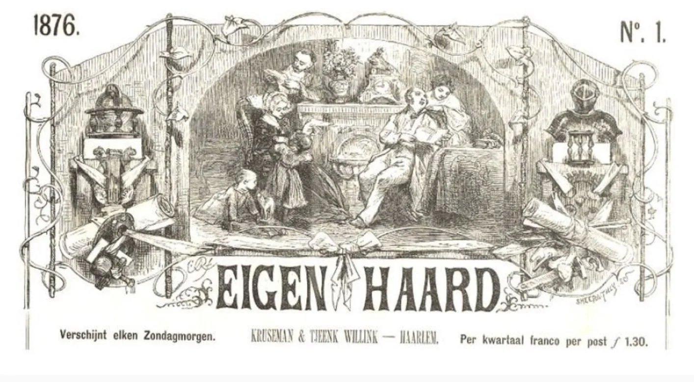
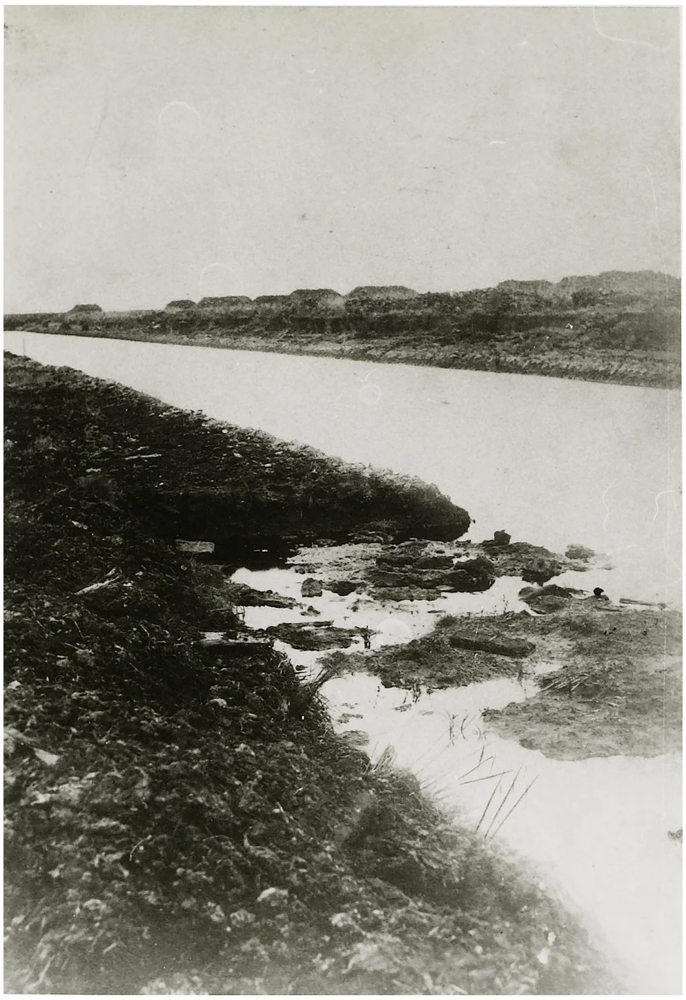
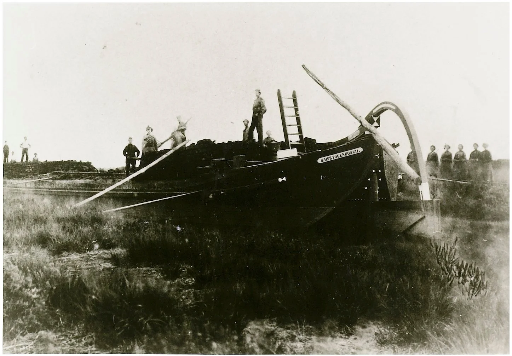
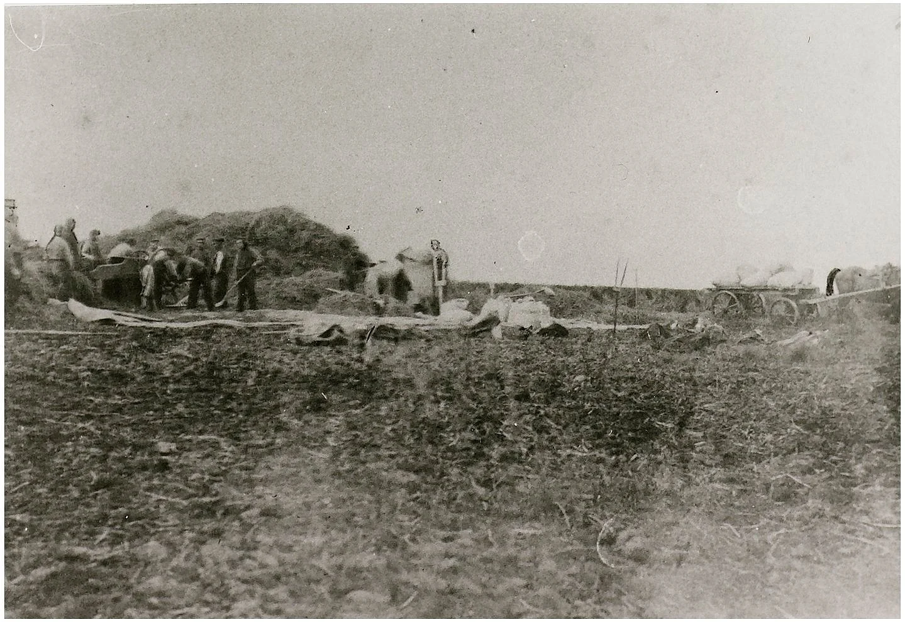
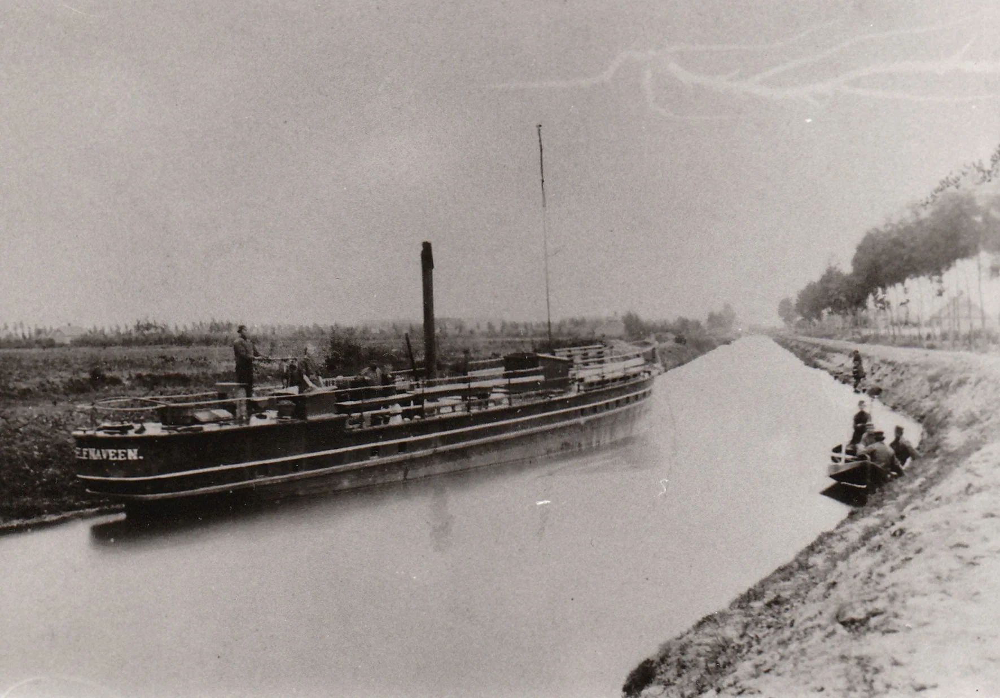
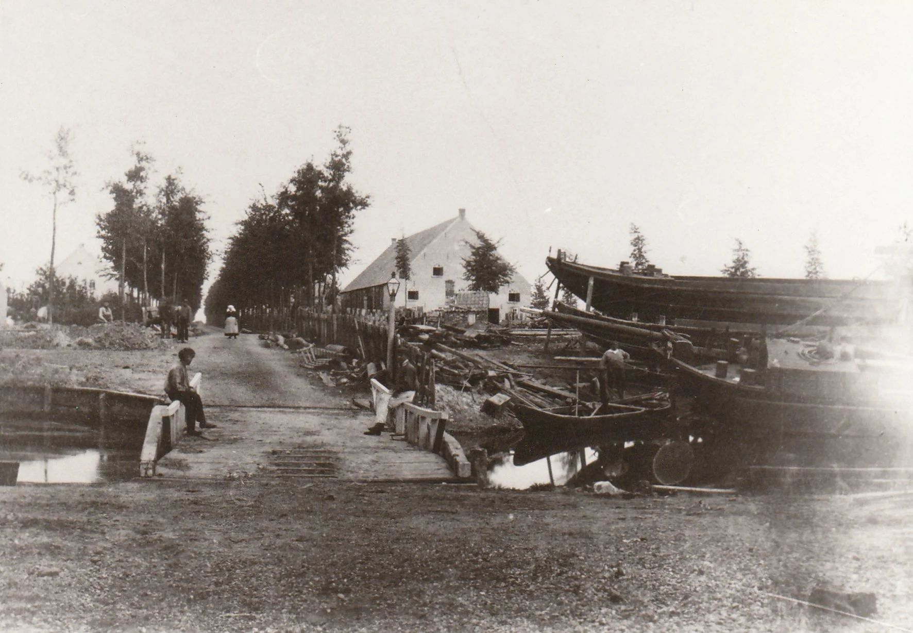
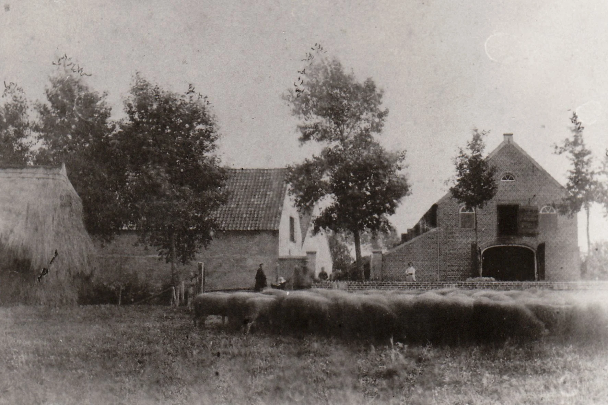
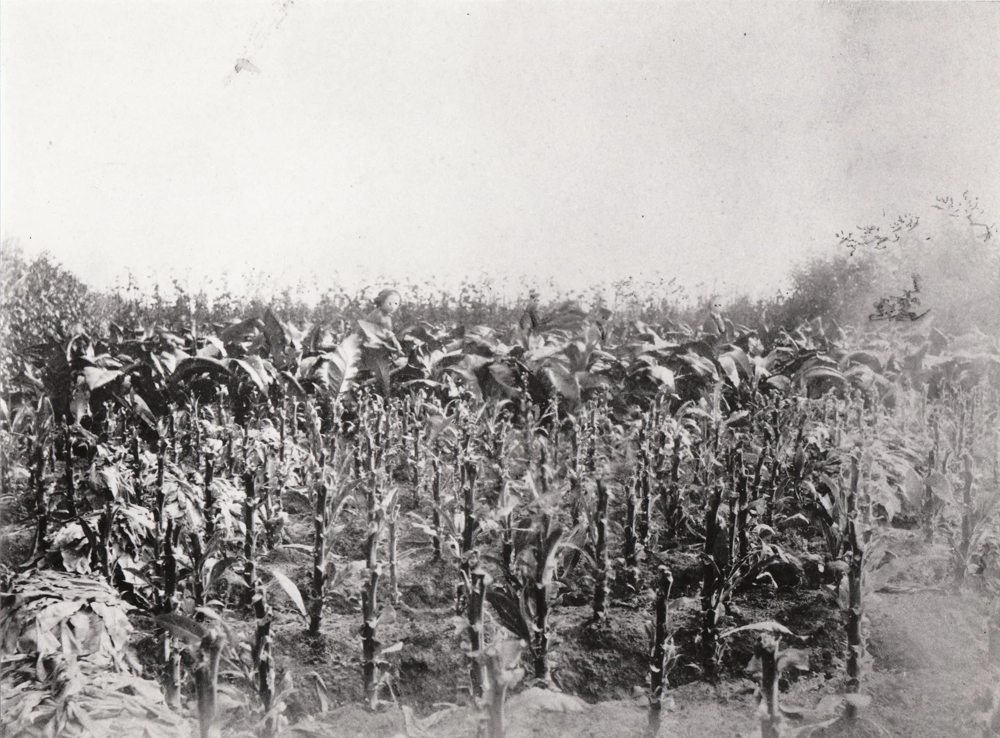
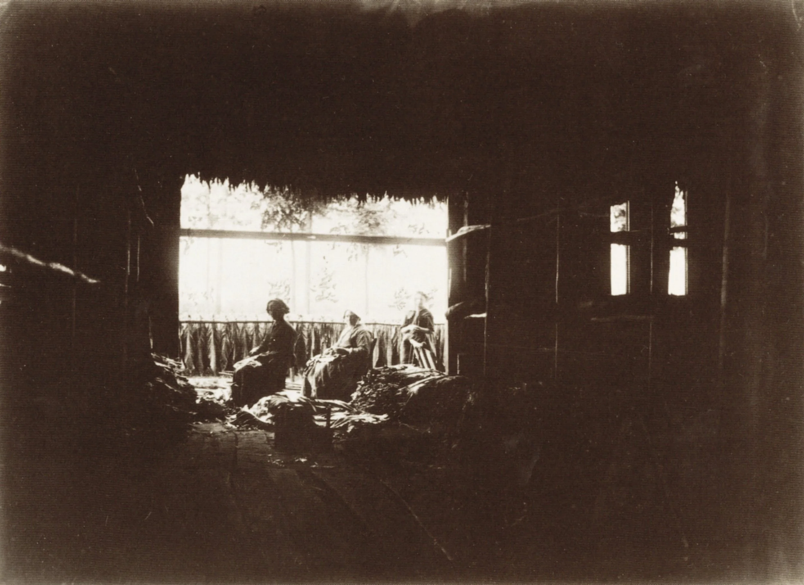

# fotos-verhaal-bosch

> Bron: helenaveenvantoen.nl

In het tijdschrift “Eigen haard” is een verhaal van G. Bosch gepubliceerd over Het Helena-veen.Bosch vertelt over zijn bezoek aan Helenaveen per boot vanaf Spoorhalte Helenaveen. Het verhaal is een en al lofzang over het werk dat Van de Griendt hier verricht.

Bosch zal later directeur worden van de Maatschappij Helenaveen. Dit lovende verslag heeft hem bij zijn sollicitatie naar die functie zeker geholpen.

In het tijdschrift zijn gravures opgenomen gemaakt naar foto’s die tijdens de reis gemaakt zijn. Het mooie is, dat deze foto’s die bijna 150 jaar geleden gemaakt zijn in het archief van de Maatschappij bewaard zijn gebleven.

Het Verhaal met de gravures vindt U hier: G. Bosch - Helena-veen

Pas gegraven wijk

Het schip de “s.Hertogenbosch”

Dorschen en zuiveren van boekweit in ‘t veen

Gezicht op de vaart

Gezicht op de Laan van Sevenum

Boerderij

Tabaksveld

Tabaksschuur (foto bewerkt door André Vervuurt)
