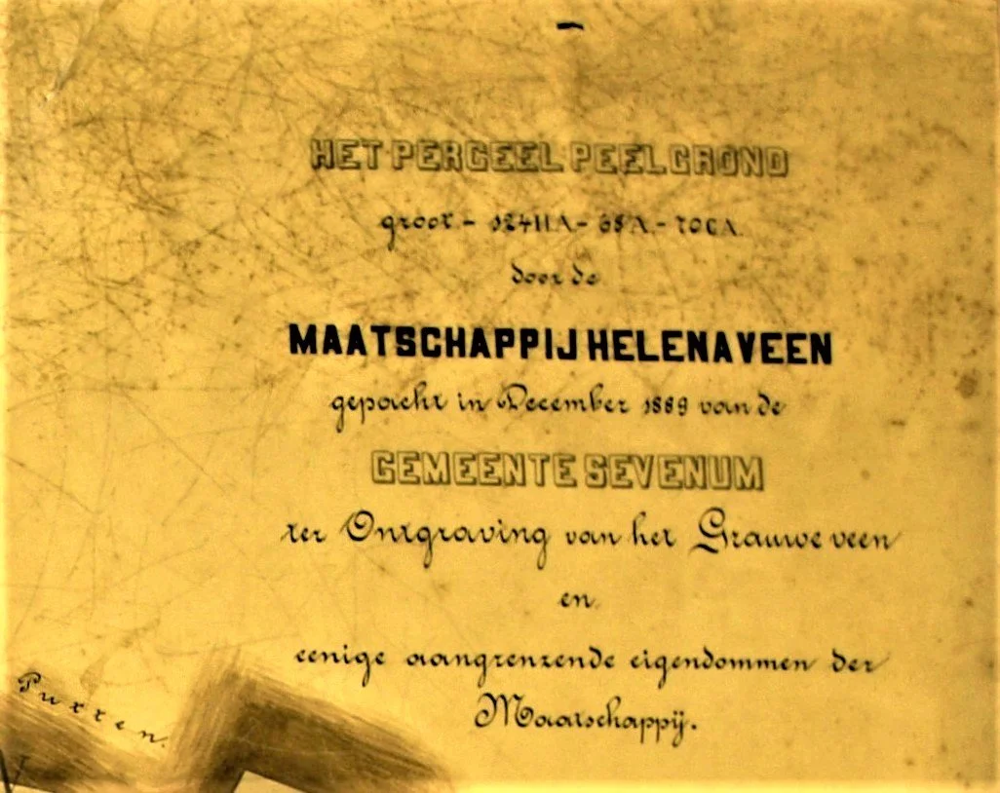
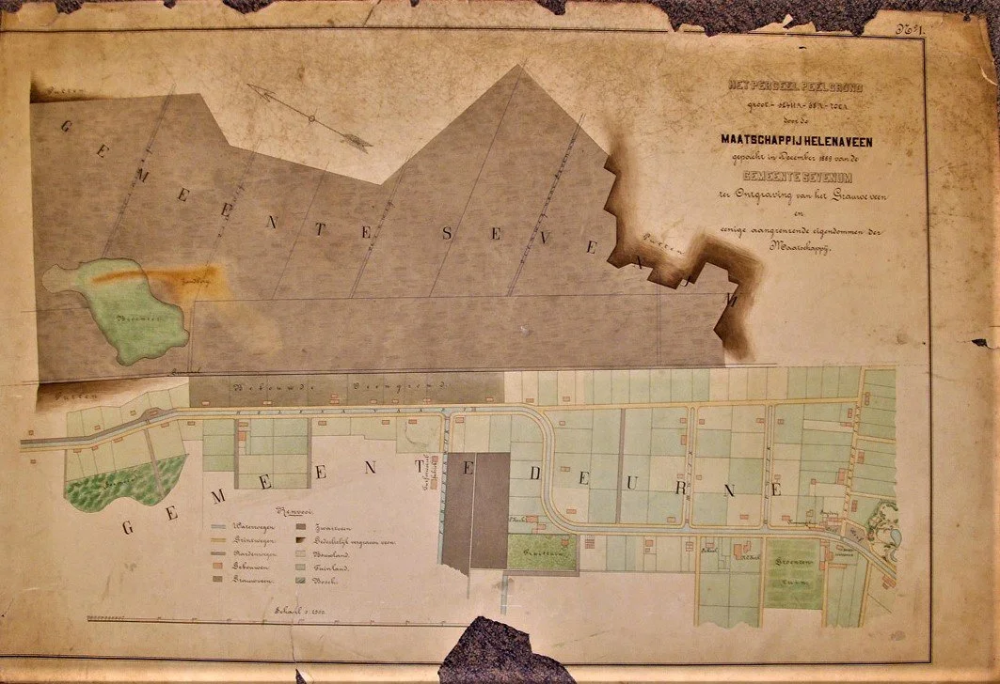
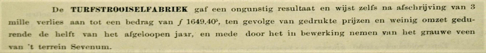
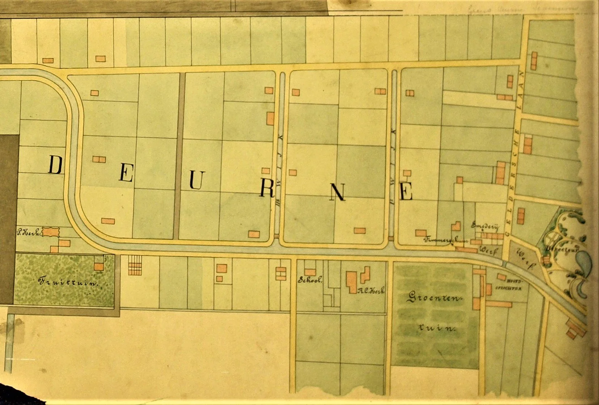

# grauwveenkaart-sevenum-1889

> Bron: helenaveenvantoen.nl

## DE KAART VAN HET IN 1889 GEKOCHTE GRAUWVEEN IN SEVENUM

Titel van de kaart van het door de Maatschappij gekochte grauwveen van de gemeente Sevenum.

De uitvinding van het maken van turfstrooisel in de jaren 80 van de negentiende eeuw bracht de Maatschappij Helenaveen ook al snel een nieuw verdienmodel. Aan een zijwijk van de Helenavaart bouwde ze een turfstrooiselfabriek. Hierin vonden grote aantallen Peelwerkers werk om het overvloedig in de Peel aanwezige grauwveen te verwerken tot turfstrooisel. Dat ging met boot en trein tot ver buiten Helenaveen naar buitenlandse paardenstallen van onder meer legers en paardentrammaatschappijen. Het turfstrooisel nam paardenpis beter op dan stro. De afzet van turfstrooisel groeide zo goed, dat de Maatschappij ook naar grauwveen buiten Helenaveen ging zoeken. Dat vond ze dichtbij, in Sevenum tegen de grens met Helenaveen. Het was daarom makkelijk te exploiteren. Voor het exploitatieplan liet de Maatschappij enkele kaarten maken.

Kaart van het in december 1889 aanwezige grauwveen in Sevenum, dat de Maatschappij van die gemeente kocht. Archief Mij. Helenaveen.

Vanwege de grote vraag naar turfstrooisel, meldde directeur Bosch in zijn jaarverslag over 1888: “er moet meer grauwe turf gegraven worden”. De aandeelhouders van de Maatschappij machtigden de directeur om van de gemeente Sevenum het recht op het afgraven van hun grauwveen te kopen. Hij mocht niet boven een prijs van 150 gulden per meter gaan. Uiteindelijk kwamen koper en verkoper uit op een deel van de Sevenummerpeel ter grootte van ongeveer 124 hectare. De Maatschappij betaalde Sevenum hiervoor f 103.239,05. Om dit te kunnen betalen, stelde de Maatschappij een obligatielening open. Geïnteresseerden konden inschrijven voor 110 gulden per meter met een rendement van 4 %.

De koop was gesloten en een exploitatieplan werd door Bosch voorbereid, maar de markt bleek onvoorspelbaar. In 1889 bracht de turfstrooiselfabriek nog f 45.859,72 op. Een jaar later kelderde de winst naar f 16.974,91 en een halve cent en in 1891 was het resultaat f 13.705,47. Bosch noemt in zijn jaarverslagen als oorzaken van de gedaalde prijs van turfstrooisel de scherpe concurrentie van stroleveranciers én andere turfstrooiselproducenten. De oogst van stro was in 1890 erg goed. Niet iedereen ging terug van turfstrooisel naar stro. In grote steden bleef men voorkeur houden voor turfstrooisel. Bosch verzucht in zijn jaarverslag over 1890 wat het volgende jaar zal brengen bij weer een eventuele goede “stroooogst”.

Uit het jaarverslag 1892 van de Maatschappij Helenaveen. Archief Mij. Helenaveen.

Ondanks het negatieve resultaat van de turfstrooiselfabriek over 1892, wordt dat jaar toch gestart met het winnen “van het grauwe veen van ’t terrein Sevenum”.

HET DORP OP DE KAART

Fragment van de grauwveenkaart met het dorp Helenaveen in 1889.

Een interessant onderdeel van de kaart is het dorp Helenaveen. In de titel van de kaart is dit opgenomen als “eenige aangrenzende eigendommen der Maatschappij”. Onder meer de tuin bij de directeurswoning, de smederij, de timmerfabriek en de kerken en de school zijn er op aangegeven. Dit fragment is al eerder op de website geplaatst bij ‘De kaart van 1889’ om de twee met elkaar te kunnen vergelijken. Zie daar voor een beschrijving. HetHelenaveenvanToen|HvdL|20220313

[wordt vervolgd]
