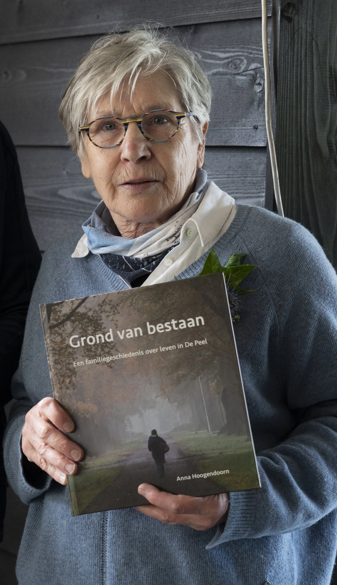

# grond_van_bestaan

> Bron: helenaveenvantoen.nl

### “Grond van bestaan”

Een familiegeschiedenis over leven in de Peel - Anna Hoogendoorn

Foto Martien Hovestad

Dit is de titel en ondertitel van een boek dat sinds 20 april jl. op weg is gegaan naar lezers. Een verhaal over enkele van mijn voorouders die zich vestigen in Helenaveen. Geurt Buis uit Wageningen gaat met een deel van zijn gezin in 1878 als tabaksteler zijn geluk beproeven op de door de firma Van de Griendt van turf ontgonnen grond. Enkele jaren later reist zijn zoon Aalbert hem met zijn jonge gezin na. Het dorp bestaat dan nog geen dertig jaar. De tabaksteelt loopt echter enkele jaren na hun komst op zijn eind. Ze zijn genoodzaakt evenals de andere tabakstelers om te overleven door over te schakelen naar land- en tuinbouw.

In 1914 komt Victor Ulens als Belgisch soldaat terecht in Nederland. Tijdens zijn verblijf in interneringskamp Amersfoort-Zeist vertrekt hij daar om turf te steken in Helenaveen en ontmoet Mina Buis, een van de kleindochters van Geurt. Ze trouwen in 1918 en krijgen samen vier dochters.

Het is inmiddels 1929 als Cornelis Hoogendoorn en Cornelia van Barneveld na het verlies van hun kaasboerderij met hun vijf kinderen en vierentwintig koeien vanuit Tienhoven zich vestigen in Helenaveen. Ze gaan wonen in de Koningshoeve, een kaasboerderij niet ver van de voormalige tabaksschuur, het onderkomen van Victor Ulens en Mina Buis.

Aan het eind van de Tweede Wereldoorlog ligt Helenaveen in de frontlinie met grote gevolgen voor de families. Dit alles bij elkaar vormt de basis voor een verhaal van dappere pioniers, stugge doorzetters en ingeburgerde dorpsgenoten.

Als nakomeling van beide families, aaneengesmeed door het huwelijk van mijn ouders Wies Ulens en Jan Hoogendoorn uit de Geldersestraat presenteer ik op deze plaats, ‘Helenaveen van Toen’, dit boek. Ik ben Beppie, het derde kind van totaal negen kinderen. Al ruim veertig jaar woon ik in Zwolle. Daar kennen ze mij als Anna Hoogendoorn.

Vanaf 2011 maak ik in mijn schrijfhuisje achter in de tuin een begin om herinneringen op papier te zetten. Daarbij gebruik ik informatieve boeken over de Peel, oude foto’s, interviews, archieven en materiaal gevonden op internet. Het resultaat is nu gebonden in bovenstaand boek.

Anna HoogendoornZwolle

Het boek is te koop zolang de voorraad strekt door mij te mailen via:a.a.hoogendoorn@home.nl

De prijs is 20 euro bij afhalen op een nader af te spreken plek in Helenaveen en 29 euro bij versturen per post.
