# helenaveense-militairen-in-de-mobilisatie

> Bron: helenaveenvantoen.nl

### Helenaveense soldaten in 1939 en 1940.

Op 28 augustus 1939 werd de Algemene Mobilisatie afgekondigd voor het Nederlandse leger. Daarvoor werden de dienstplichtige lichtingen 1924 tot en met 1939 opgeroepen. Dat betrof dus de mannen die vanaf 1904 tot en met 1919 geboren waren en die vanaf hun twintigste levensjaar hun dienstplicht hadden vervuld in het Nederlandse leger. Natuurlijk werden daarbij ook Helenaveense mannen opgeroepen.

Na veel naspeuringen zijn bij mij op dit moment de namen bekend van negenentwintig mannen die in 1939-1940 in Helenaveen woonden. Dus ook de mannen die elders geboren waren. Ook zijn de namen bekend van vier mannen die in Helenaveen geboren waren, maar die voor 1939 al verhuisd waren naar elders. Ook is de naam bekend van iemand die elders geboren was maar een relatie had met een Helenaveense vrouw.

Van de ene militair is veel en van de ander is weinig bekend. Opvallend is dat er bij veel (klein)kinderen van betrokken militairen weinig tot niets bekend is over het oorlogsverleden van hun vader of grootvader die in 1939-1940 in het Nederlandse leger zat.

Op enkelen na dienden deze mannen in het Nederlandse leger toen op 10 mei 1940 Duitsland Nederland binnenviel. Deze mannen lagen door heel Nederland verspreid. Dat varieerde van Den Helder, Grebbeberg tot in Limburg toe.

### Staat van dienst

Van alle mannen heb ik de Staat van Dienst. Op zo’n Staat van Dienst staan de persoonlijke gegevens van een militair. Bij welk onderdeel ze, tijdens het vervullen van hun dienstplicht, waren opgeroepen met daarbij een overzicht van mutaties wanneer ze opgeroepen waren voor herhalingsoefeningen etc. Soms zijn er nog aanvullende gegevens, zoals ook een Straflijst.Jammer genoeg wordt bijna nergens het oorlogsonderdeel vermeld waarbij men zat op het moment dat de oorlog uitbrak. Dus is het moeilijk om van iedereen te weten waar ze op dat moment in Nederland zaten toen de oorlog begon. Appellijsten uit die tijd zijn op 14 mei 1940 op bevel van hogerhand vrijwel allemaal vernietigd.Gelukkig is er bij sommige (klein)kinderen het oorlogsonderdeel wel bekend. Opvallend is daarbij vaak dat hun vader of grootvader dat op papier heeft gesteld.

De militaire dienstplicht vervullen had meestal een regionaal karakter. Dat wil zeggen dat de meeste mannen die voor het eerst hun militaire dienstplicht moesten gaan vervullen dit in hun eigen omgeving konden doen waar kazernes waren voor de opleiding. Natuurlijk afhankelijk bij welk wapen men was ingedeeld.Volgens de Staten van Dienst hebben de meeste Helenaveense mannen hun militaire dienstplicht vervuld bij het 2e Regiment Infanterie, bij het 17e Regiment Infanterie en bij het 3e Regiment Veldartillerie.

Zoals gezegd betekende dit voor het 2e Regiment Infanterie de Frederik Hendrikkazerne te Venlo, voor het 17e Regiment Infanterie de Ernst Casimirkazerne te Roermond en voor het 3e Regiment Veldartillerie de Seeligkazerne te Breda.

De oudere lichtingen werden, na het afkondigen van de Algemene Mobilisatie, over het algemeen vanuit de vredes- en stamregimenten ingedeeld bij de uit de Vredesregimenten gevormde Oorlogsregimenten. Dat betekende voor bijvoorbeeld het 2e Regiment Infanterie het 26e Regiment Infanterie (R+24). Maar zoals hieronder zal blijken was dat zeker niet altijd het geval.

### Krijgsgevangenschap

Tijdens de gevechten in mei 1940 zijn enkele Helenaveense mannen in krijgsgevangenschap geraakt in Duitsland. Gelukkig voor hen was dat niet voor lange duur. In juni 1940 konden ze allemaal weer naar huis.Meer informatie over deze krijgsgevangenenkampen is te vinden op https://krijgsgevangen.nl/ .

### 34 Helenaveense mannen opgeroepen

Ik zal in volgorde van oud naar jong de namen, met hun daarbij horende bekende informatie, van Helenaveense mannen vermelden die dus in 1939-1940 in het Nederlandse leger zaten.

Jan (Johannes Cornelis) van der Werf, geboren op 29-05-1904 te Helenaveen.

Jan van der Werf, de oudste van allemaal, was bijna 36 jaren oud toen op 10 mei 1940 de oorlog uitbrak. Hij was getrouwd en huisvader en vervulde zijn dienstplicht bij het 2e Regiment Infanterie te Venlo.

Op 29 augustus 1939 kwam hij na het afkondigen van de Algemene Mobilisatie weer bij het leger. Bekend is dat hij op 10 mei 1940 ingedeeld was bij de 2e Compagnie, van het Ie Bataljon, van het 13e Regiment Infanterie in de omgeving van De Rips in de Peel-Raamstelling. Dit onderdeel is in de daaropvolgende dagen teruggetrokken tot zelfs De Panne in België, dicht bij het befaamde Duinkerken.

Op 28 mei 1940, tijdens een aanval van Duitse vliegtuigen, werd hij, volgens een document, gewond door een bomscherf in de rechter lies. Volgens een ander document werd hij daarop in het Militair Hospitaal te Breda verpleegd tot zijn ontslag op 21 juni 1940 waarna hij naar huis kon terugkeren.

Janus (Marianus Henricus) Erkelens, geboren op 09-08-1904 te Helenaveen.

Hij vervulde zijn dienstplicht bij het 2e Regiment Infanterie en werd op 29 augustus ook gemobiliseerd. Echter werd hij op 13 september 1939 ontslagen wegens “gebreken”.

Jan (Johannes Theodorus) van der Zwaan, geboren op 29-11-1904 te Helenaveen.

Van Jan van der Zwaan is bekend dat hij zijn militaire dienstplicht vervulde bij het 2e Regiment Infanterie. Zijn oorlogsonderdeel op 10 mei 1940 is niet bekend.

Wel bekend is dat hij tijdens de meidagen krijgsgevangen is gemaakt en afgevoerd naar Stalag II-A Neubrandenburg, ongeveer 140 km ten noorden van Berlijn. Hij kreeg daar het krijgsgevangenennummer 29566. Hij werd op 12 juni 1940 ontslagen uit krijgsgevangenschap en kon naar huis terugkeren.

Jan Keimpe Snieder, geboren op 30-03-1905 te Vrouwenparochie (Friesland).

Hij vervulde zijn militaire dienstplicht bij het 9e Regiment Infanterie in de Jan Willem Frisokazerne te Assen.

Ook hij was getrouwd en huisvader en was woonachtig in Helenaveen.

Op 10 mei 1940 was hij waarschijnlijk ingedeeld bij het Ie Bataljon Bewakingstroepen, een onderdeel van het Etappencommando Amsterdam, dat weer onderdeel was van de Etappen- en Verzorgingsdienst van het Nederlandse leger. Dit bataljon was bestemd voor de bewaking van Etappenmagazijnen e.a. en voor de bewaking van vitale objecten zoals raffinaderijen en opslagplaatsen te Amsterdam.

Hij werd op 26 mei 1940 met groot verlof gestuurd.

Later een van de slachtoffers van de Kerkrazzia.

Dorus (Theodorus Joachim) Naus, geboren op 26-08-1905 te Helenaveen.

Dorus Naus vervulde zijn dienstplicht bij het Regiment Wielrijders. Ook hij werd opgeroepen op 29 augustus 1939 na de afkondiging van de Algemene Mobilisatie.

Op 3 februari 1940 ging hij op verlof in afwachting van ontslag uit de militaire dienst en op 17 februari 1940 met bewijs van ontslag wegens “gebreken”.

Bij het vervullen van zijn militaire dienst in 1925 kreeg hij verschillende malen straf. Volgens zijn straflijst kreeg hij op 9 juli 1925 10 dagen verzwaard arrest met als reden “Door met nog twee andere soldaten van de Compagnie gedurende den maaltijd luid uit te roepen “wij verdommen het te gaan zwemmen” vermoedelijk aanleiding geweest tot, doch althans zich als belhamels gedragen bij het lijdelijk verzet, dat bij een groot gedeelte van de Compagnie is ontstaan tegen het zwemmen, en waardoor de Compagnie in plaats van om 5.30 uur eerst om 5.55 kon afmarscheeren voor bedoelden dienst”. Op 25 juli 1925 kreeg hij weer straf. Ditmaal kreeg hij 4 dagen verzwaard arrest met als reden “Als post uitgezet, teneinde het betreden van een, door oefening met springmiddelen, gevaarlijk terrein te beletten, slapende op zijn post aangetroffen”. En op 6 augustus 1925 tenslotte 4 dagen licht arrest met als reden “Gemankeerd op het avondappel en 11 minuten daarna binnengekomen”.

Mogelijk was hij tijdens de mobilisatie ingedeeld bij de 1e Depotcompagnie Wielrijders te Gouda.

Michiel van Eckendonk, geboren op 27-01-1908 te Helenaveen.

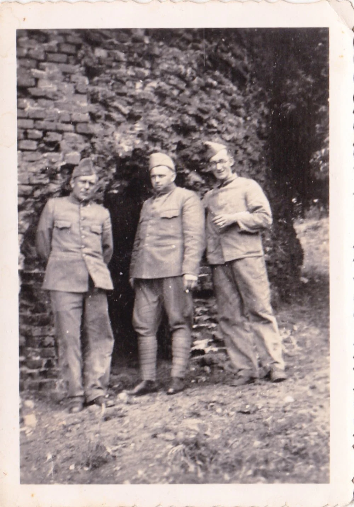

Links: Michiel van Eckendonk

Michiel vervulde zijn militaire dienstplicht bij het 2e Regiment Infanterie te Venlo en is op 7 augustus 1940 tijdens de voormobilisatie opgeroepen.

Op 10 mei 1940 was hij ingedeeld bij de Mitrailleurcompagnie, van het IIIe Bataljon, van het 26e Regiment Infanterie die was opgesteld aan de Maas bij Grubbenvorst in de Maaslinie. Op dat moment had hij de rang van korporaal. Hij wordt nog vermeld in een van de gevechtsverslagen die later zijn gemaakt over de gevechten in mei 1940. Een zeldzaamheid, want normaal gesproken worden bijna geen namen van gewone militairen vermeld.

Tijdens de gevechten bij Grubbenvorst is hij krijgsgevangen gemaakt en afgevoerd naar Stalag II-D Stargard, in het toen nog Duitse West-Pommeren, heden Polen, ongeveer 36 km ten oosten van Szczecin. Hij kreeg daar het krijgsgevangenennummer 35359. Op 6 juni 1940 uit krijgsgevangenschap ontslagen en op 10 juni 1940 met groot verlof gestuurd.

Dorus (Theodorus) Swinkels, geboren op 23-02-1908 te Helenaveen.

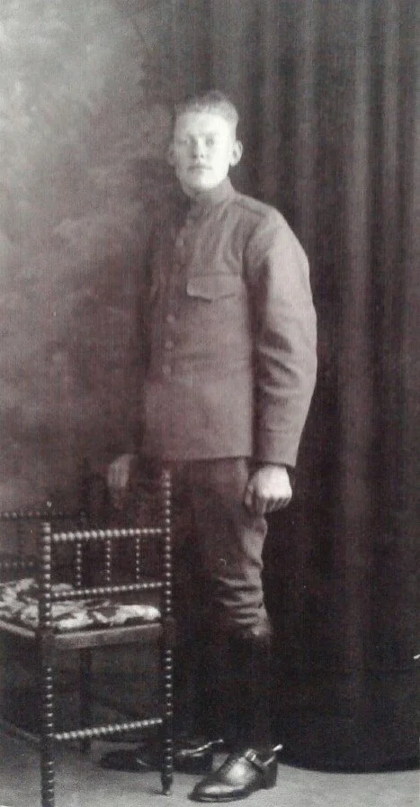

Opgekomen voor zijn militaire dienstplicht bij het toenmalige 3e Halfregiment van het IIe Regiment Huzaren, bestemd voor de opleiding tot paardenverzorger-oppasser. Zeer waarschijnlijk vervulde hij zijn dienstplicht in de Alexanderkazerne te Den Haag. Na diverse overplaatsingen en reorganisaties terechtgekomen bij het 3e Regiment Veldartillerie.

Tijdens de mobilisatie in 1939-1940 is hij overgeplaatst naar de Staf van het IIe Bataljon, van het 26e Regiment Infanterie dat gelegerd was in de omgeving van Haps in de Maaslinie.

Bij het vervullen van zijn dienstplicht nam, volgens zijn aanwezige straflijst, Dorus het niet altijd even nauw. Hij kreeg bijvoorbeeld in oktober 1929 4 dagen licht arrest omdat hij eetlepel en vork onvoldoende gereinigd had en een maand later kreeg hij 2 dagen licht arrest omdat hij niet behoorlijk “present” geroepen had bij het houden van het middagappel. In oktober 1939, dus tijdens de mobilisatie, kreeg hij zelfs nog 14 dagen licht arrest omdat hij “Onder valsche voorwendsels met verlof vertrokken” was.

Op 25 mei werd hij met groot verlof gestuurd.

Piet (Peter Johannes) Hendriks, geboren op 26-07-1909 te Deurne.

Hij kwam voor het vervullen van zijn dienstplicht in 1929 op bij het toenmalige 2e Halfregiment van het IIe Regiment Huzaren, waarschijnlijk in de Trip van Zoudtlandtkazerne te Breda. Volgens zijn Staat van Dienst op 2 januari 1939 gemobiliseerd. Op 10 mei 1940 mogelijk ingedeeld bij het 2e Regiment Huzaren. Dat onderdeel was verspreid opgesteld in Rosmalen, Sint Anthonis, Beers, Boxmeer en Oploo. Omdat het niet bekend is bij welk onderdeel hij nu precies zat is het moeilijk om de locatie waar hij was te bepalen. Daarvoor ontbreken de nodige gegevens.

Op 25 mei 1940 werd hij met groot verlof gestuurd.

Janus (Adrianus Johannes) van Grunsven, geboren op 02-06-1910 te Helenaveen.

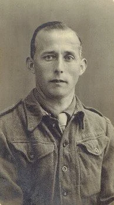

Opgekomen voor zijn dienstplicht bij het Regiment Wielrijders in de Isabellakazerne in Den Bosch. Getrouwd en op 10 mei 1940 vader van drie kinderen. Hij werd al op 11 april 1939 gemobiliseerd tijdens de crisisperiode rondom de Duitse inval van Denemarken en Noorwegen.

Bekend is echter niet bij welk oorlogsonderdeel hij in mei 1940 ingedeeld was.

Later nog per 20 december 1944 in dienst gesteld bij het Militair Gezag en vrijwillig verbonden bij de Dienst der Grensbewaking per 8 november 1945.

Met groot verlof gestuurd op 8 mei 1946 en wederom ingedeeld bij het 2e Regiment Infanterie per 9 mei 1946.

Arie (Adrianus Hendrikus) van Lieshout, geboren op 21-11-1911 te Helenaveen.

Hij vervulde zijn dienstplicht bij het 3e Regiment Veldartillerie te Breda en werd op 25 augustus 1939 gemobiliseerd.

Volgens correspondentie was hij in mei 1940 ingedeeld bij de Staf van het IIe Bataljon, van het 22e Regiment Infanterie. Indien dit klopt dan lag hij in die tijd in de omgeving van Veenendaal.

Verdere gegevens ontbreken. Op 25 mei 1940 met groot verlof gestuurd.

Gerrit Brouwer, geboren op 19-04-1912 te Jaarsveld (Utrecht).

Gerrit Brouwer vervulde zijn dienstplicht bij het 2e Regiment Infanterie in Venlo. Op 25 augustus 1939 werd hij gemobiliseerd.

Ook van hem is een straflijst bekend. Hij kreeg op 20 november 1939 1 dag licht arrest vanwege “Bij ’t genieten van bewegingsvrijheid zich verder dan 15 km buiten het Kantonnement begeven, onder verzachtende omstandigheden”.

Het voordeel van de aanwezige straflijsten is dat dan vaak het oorlogsonderdeel wel vermeld wordt. In dit geval dus de staf van het IIIe Bataljon, van het 2e Regiment Infanterie in de omgeving van Den Bosch.

Ook hij werd op 25 mei 1940 met groot verlof gestuurd.

Gerard (Gerardus) van Mullekom, geboren op 11-03-1913 te Essen (Duitsland).

Gerard van Mullekom had zijn dienstplicht vervuld bij het 2e Regiment Infanterie te Venlo.

Op 29 augustus 1939 kwam hij terug na de afkondiging van de Algemene Mobilisatie. Op 28 mei 1940 werd hij met groot verlof gestuurd. Verdere gegevens ontbreken.

Bertus (Hubertus Cornelis) Lagarde, geboren op 12-06-1913 te Helenaveen.

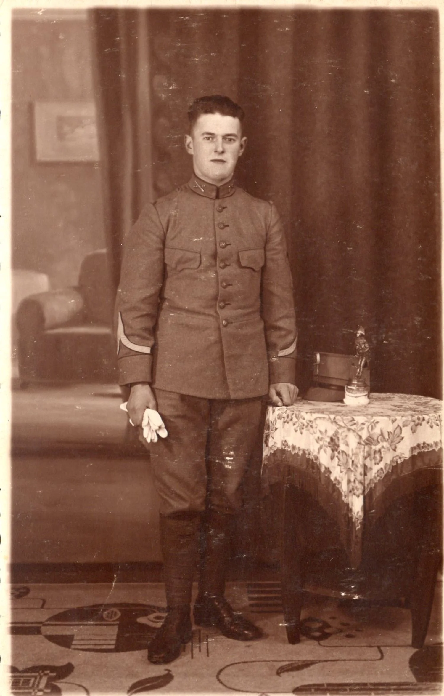

Bertus Lagarde vervulde zijn dienstplicht bij het 8e Regiment Veldartillerie in de Arthur Koolkazerne te Ede. Sinds 23 januari 1934 had hij de rang van korporaal. Ook hij werd na het afkondigen van de Algemene Mobilisatie op 29 augustus 1940 opgeroepen terug te keren naar het leger.

Uit correspondentie lijkt hij ingedeeld te zijn geweest bij de staf van het 19e Regiment Artillerie in de omgeving van Doorn. Na de gevechten in mei 1940 werd hij op 25 mei 1940 met groot verlof gestuurd.

Later een van de slachtoffers van de Kerkrazzia.

Nol (Arnoldus Antonius) Wijnen, geboren op 21-02-1915 te Helenaveen.

Hij vervulde zijn militaire dienstplicht bij het 17e Regiment Infanterie te Roermond en werd opgeleid tot mitraillist no. 6. Teruggekeerd in het leger op 29 augustus 1939 na het afkondigen van de Algemene Mobilisatie en op 25 mei 1940 met groot verlof gestuurd.

Waarschijnlijk ingedeeld bij een mitrailleurcompagnie. Verdere gegevens ontbreken.

Jan (Johannes Wilhelmus) van der Zwaan, geboren op 11-04-1915 te Helenaveen.

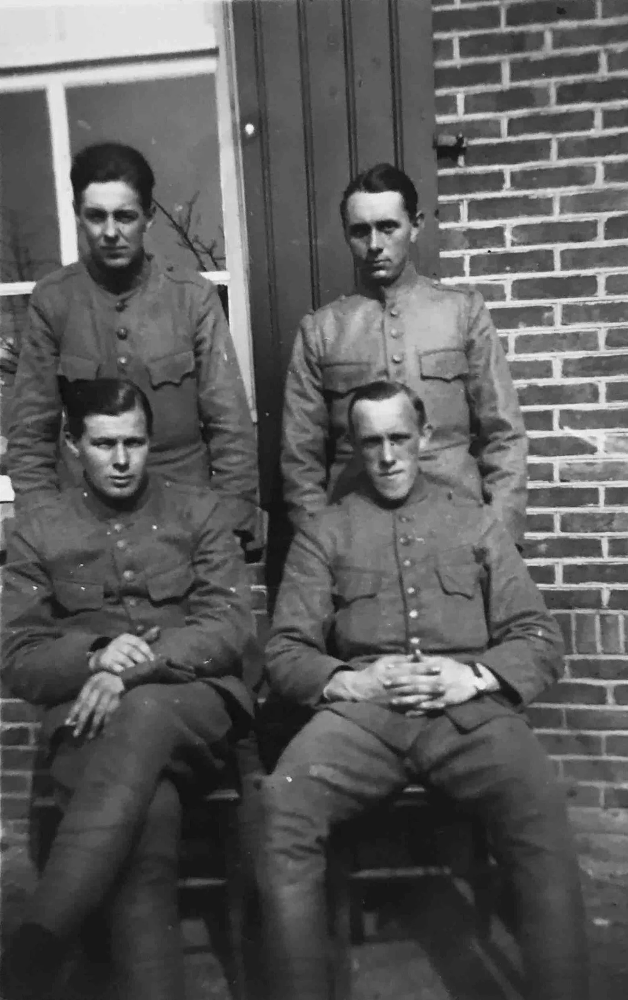

Rechtsboven: Jan van der Zwaan

Vervulde zijn militaire dienstplicht bij het 2e Regiment Infanterie te Venlo en werd daar opgeleid tot mitraillist no. 3. Ook hij werd op 29 augustus 1939 teruggeroepen en werd ook op 25 mei 1940 met groot verlof gestuurd. Verdere gegevens ontbreken.

Gezien de data van opkomst mogelijk tegelijkertijd met Nol Wijnen in dienst geweest.

Jan (Johannes) Crommentuijn, geboren op 18-01-1916 te Helenaveen.

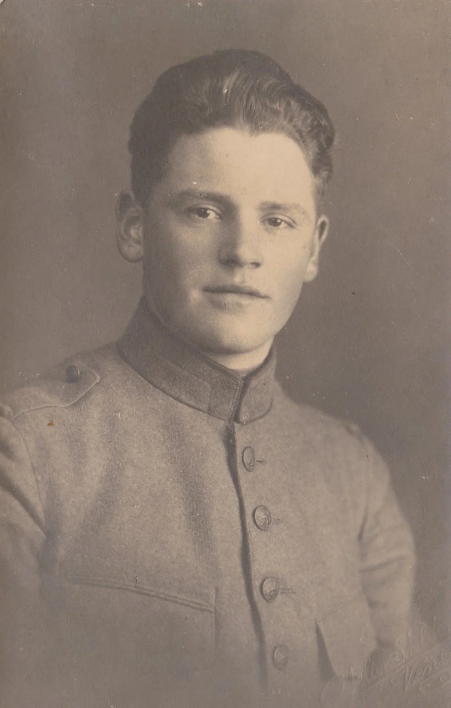

Jan vervulde zijn militaire dienstplicht bij het 2e Regiment Infanterie te Venlo. Hij werd op 25 augustus 1939 gemobiliseerd en was volgens zijn dochter Marga tijdens de mobilisatie gelegerd in de omgeving van Odiliapeel. Dat zou kunnen betekenen dat hij bij de 2e Compagnie, van het IIe Bataljon, van het 2e Regiment Infanterie ingedeeld was. Geheel zeker is dat niet. Verwarrend is echter een briefkaart van hem gericht aan zijn vader met daarbij vermeld de 4e Compagnie, van het IIe Bataljon, van het 6e Regiment Infanterie in de Chassékazerne te Breda. Hoe een en ander te rijmen is is mij tot op heden niet duidelijk.

Op 28 mei 1940 werd Jan met groot verlof gestuurd.

Harrie (Hendricus) Maessen, geboren op 27-06-1916 te Helenaveen.

Hij vervulde zijn dienstplicht bij het 2e Regiment Infanterie te Venlo. Werd op 29 augustus 1939 gemobiliseerd en op 28 mei 1939 met groot verlof gestuurd.

Ook gezien de zelfde data van opkomst bij hetzelfde regiment is het mogelijk dat Harrie Maessen samen met Jan Crommentuijn zijn dienstplicht vervulde.

Sjaak (Jacobus Johannes) van der Zwaan, geboren op 18-08-1916 te Deurne.

Ook hij heeft zijn militaire dienstplicht vervuld bij het 2e Regiment Infanterie en is, net als Jan Crommentuijn en Harrie Maessen, zoals dat werd vermeld “ingelijfd ”op 5 oktober 1936. Op 29 augustus 1939 gemobiliseerd, maar wel later, op 14 juli 1940, met groot verlof gestuurd of gedemobiliseerd. Bekend is dat hij sinds 19 maart 1937 de rang had van korporaal.

Albert (Lambertus Petrus) Klerks, geboren op 13-04-1917 te Helenaveen.

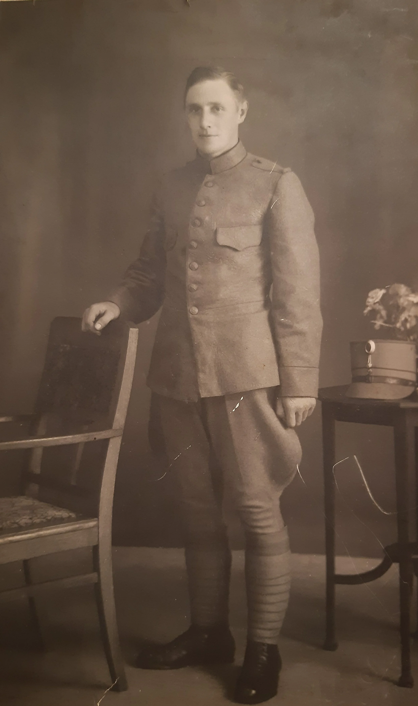

Vervulde zijn dienstplicht bij het 2e Regiment Infanterie te Venlo.

Op 28 mei 1940 met groot verlof gestuurd. Verdere gegevens ontbreken.

Jaap (Jacob) Hoogendoorn, geboren op 10-07-1917 te Tienhoven (Utrecht).

Hij vervulde zijn militaire dienstplicht bij het Korps Luchtdoelartillerie. Door reorganisatie werd hij per 15 juni 1938 ingedeeld bij het 2e Regiment Luchtdoelartillerie.

Op 10 mei 1940 was hij ingedeeld bij de 2e Batterij Luchtdoelartillerie in Den Helder in de Stelling Den Helder. Op 25 mei 1940 ging hij met groot verlof.

Job (Jacob) van de Bovenkamp, geboren op 27-07-1917 te Helenaveen.

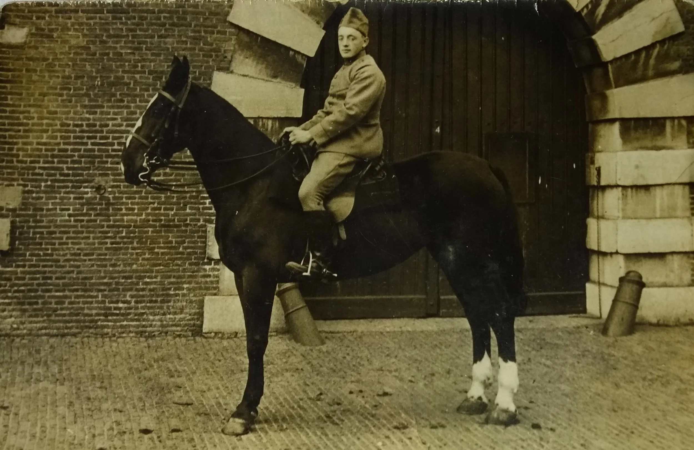

Job van de Bovenkamp vervulde zijn militaire dienstplicht bij het 3e Regiment Veldartillerie te Breda. Hij werd opgeleid tot bereden stukrijder.

Op 25 augustus 1939 teruggekeerd in militaire dienst. Op 10 mei 1940 was hij ingedeeld bij de 1e Batterij, van de IIe Afdeling, van het 3e Regiment Artillerie en bevond zich op dat moment in de buurt van Sint-Michielsgestel. Op 14 mei 1940 raakte hij bij het gevecht te Schelluinen gewond aan zijn rechterduim door een granaatsplinter. Volgens familie miste hij daardoor zijn duim en werd daarom op 1 oktober 1942 uit militaire dienst ontslagen wegens “gebreken”.

Ook van Jacob is een straflijst bekend. Tijdens zijn opleiding kreeg hij eenmaal 2 dagen licht arrest vanwege “Verzuimd tijdig een nieuw kopje te vragen aan de oppasser rustkamer en daardoor ondanks het bestaande verbod koffie gehaald in zijn veldflesch”. In maart en april 1940 kreeg hij tweemaal 3 dagen licht arrest opgelegd door zijn kapitein voor resp. te laat verschijnen en resp. nog te bed bevinden na de reveille.

Cor (Cornelis Gerardus) van Horen, geboren op 04-11-1917 te Helenaveen.

Cor van Horen vervulde, gezien de datum van opkomst, evenals Jan Crommentuijn, Harrie Maessen en Sjaak van der Zwaan, zijn militaire dienstplicht bij het 2e Regiment Infanterie te Venlo. Op 29 augustus werd ook hij gemobiliseerd en bevond zich op 10 mei 1940 bij de 1e Compagnie, van het IIIe Bataljon, van het 2e Regiment Infanterie in de omgeving van Vught en Den Bosch.

Op 15 mei 1940 werd hij als vermist opgegeven en was hij, bleek later, krijgsgevangen gemaakt. Daarvan keerde hij op 10 juni 1940 terug en werd op dezelfde dag met groot verlof gestuurd.

Zijn dochter Corrie heeft nooit geweten dat haar vader in het Nederlandse leger zat in mei 1940 en ook niet dat hij krijgsgevangen had gezeten in Duitsland. Onbekend is in welk krijgsgevangenenkamp hij heeft gezeten.

Ook van Cor van Horen is een straflijst bekend. Hij kreeg tijdens de mobilisatie op 23 oktober 1939 vier dagen licht arrest vanwege het feit “Op zondag 22 oktober ’39 op het middagappel gemankeerd”.

Wim (Wilhelmus Theodorus) van der Zwaan, geboren op 05-09-1918 te Helenaveen.

Een van de twee laatst opgeroepen dienstplichtige militairen voor 10 mei 1940. Hij was buitengewoon dienstplichtig.

Je had namelijk de gewone dienstplichtigen (g.d.) die in het algemeen verplicht waren tot het vervullen van werkelijke dienst voor eerste oefening, voor herhalingsoefeningen en in geval van oorlog, oorlogsgevaar of andere buitengewone omstandigheden opgeroepen konden worden en je had buitengewone dienstplichtigen (b.d.) die in het algemeen alleen verplicht waren tot het vervullen van werkelijke dienst in geval van oorlog, oorlogsgevaar of andere buitengewone omstandigheden.

Wim van der Zwaan werd pas op 1 april 1940 opgeroepen bij het depot van het 2e Regiment Infanterie. Omdat er oorlogsdreiging was werden tijdens de mobilisatie de eerste oefeningen niet bij de vredes- of stamregimenten gehouden maar bij de depots van betrokken korpsen. Veelal waren die depots in de Vesting Holland. Zo ook voor Wim en hij was ingedeeld bij de 2e Compagnie, van het 2e Depotbataljon Infanterie te Den Haag. Dit onderdeel is betrokken geweest bij de acties in en rondom Den Haag tijdens de meidagen van 1940. Hij werd op 25 mei 1940 huiswaarts gezonden met groot verlof.

Marinus (Marinus Antonius) van der Werf, geboren op 29-01-1919 te Helenaveen.

Marinus van der Werf werd al op jonge leeftijd (24 oktober 1938) opgeroepen voor het vervullen van zijn militaire dienstplicht. Dat gebeurde bij het 2e Regiment Infanterie te Venlo.

Bekend is dat hij op 10 mei 1940 bij de gevechten aan de Maas bij Grubbenvorst betrokken was en zeer waarschijnlijk daarom bij de 2e Compagnie, van het IIIe Bataljon, van het 26e Regiment Infanterie ingedeeld was.

Hij werd daar ook krijgsgevangen genomen en afgevoerd naar Stalag II-D Stargard, geregistreerd onder krijgsgevangenennummer 34804 en daar op 6 juni 1940 ontslagen uit krijgsgevangenschap en per 13 juni 1940 met groot verlof gestuurd.

Jan (Johannes Adrianus) Wijnen, geboren op 26-02-1919 te Helenaveen.

Jan Wijnen is de andere laatst opgeroepen dienstplichtige militair geweest uit Helenaveen. Ook hij was buitengewoon dienstplichtig. En ook hij werd op 1 april 1940 ingedeeld bij het depot van het 2e Regiment Infanterie, en net als Wim van der Zwaan, ingedeeld bij de 2e Compagnie, van het 2e Depotbataljon Infanterie te Den Haag. Ze zullen dus tegelijkertijd en op dezelfde locatie hun opleiding hebben gevolgd.

Ook hij werd op 25 mei 1940 huiswaarts gezonden met groot verlof.

Jan Hoogendoorn, geboren op 13-04-1919 te Tienhoven (Utrecht).

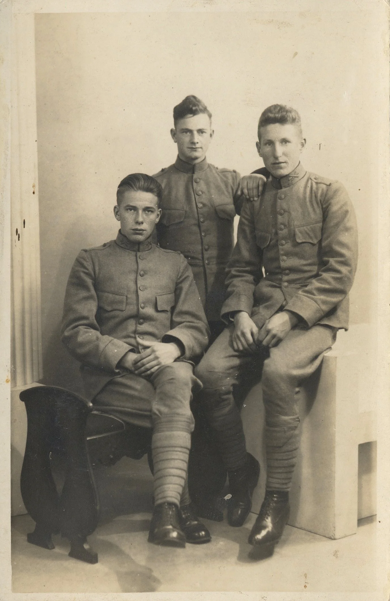

Midden: Jan van de Bovenkamp, rechts: Jan Hoogendoorn

Jan Hoogendoorn vervulde zijn militaire dienstplicht bij het 1e Regiment Luchtdoelartillerie in de Hojelkazerne aan de Croeselaan in Utrecht.

Hij was op 10 mei 1940 ingedeeld bij de 14e Batterij Luchtdoelartillerie in de omgeving tussen Den Haag en Wassenaar.

In die tijd was hij daar samen met zijn vriend Jan van de Bovenkamp die in die omgeving ook zijn militaire dienstplicht vervulde.

Op 25 mei 1940 werd Jan met groot verlof gestuurd.

Albert of Appie (Albertus) Oosterveen, geboren op 25-04-1919 te Helenaveen.

Hij vervulde zijn militaire dienstplicht bij het 2e Regiment Infanterie en zat daar in het oefendetachement van de S.R.O.I., afkorting voor School voor reserveofficieren der infanterie. Schijnbaar zag men wel potentie in hem.

Maar volgens zijn familie was het meer het type figuur die het niet zo nauw nam en “stoute dingen” uithaalde. Een beetje een “deugniet”.

Hij werd zelfs bij vonnis van de Krijgsraad van 18 juli 1939 schuldig verklaard “aan feitelijke insubordinatie gepleegd in tijd van oorlog, veroordeeld tot een gevangenisstraf van drie weken etc.” en kwam op 9 september 1939 uit de gevangenis volgens zijn Staat van Dienst.

Insubordinatie betekent letterlijk: Het actief of passief verzet van iemand lager in rang tegen iemand die hoger in rang staat. In de meeste gevallen houdt dit verzet in dat de persoon in kwestie een direct bevel van zijn meerdere weigert uit te voeren.

Waarschijnlijk was daarmee zijn loopbaan in het Nederlandse leger beëindigd.

Onbekend is bij welk oorlogsonderdeel hij op 10 mei 1940 was. Wel is bekend dat hij krijgsgevangen is gemaakt en naar Stalag II-D Stargard is afgevoerd en daar geregistreerd is onder krijgsgevangenennummer 34080. Daar werd hij op 6 juni 1940 uit krijgsgevangenschap ontslagen en op 10 juni 1940 met groot verlof gestuurd.

Harrie (Adrianus Franciscus Petrus) Wijnands, geboren op 04-05-1919 te Helenaveen.

Misschien wel de bekendste Helenaveense man die tijdens de meidagen van 1940 in het Nederlandse leger zat.

In ieder was hij wel de langste man van alle Helenaveense mannen in die tijd.

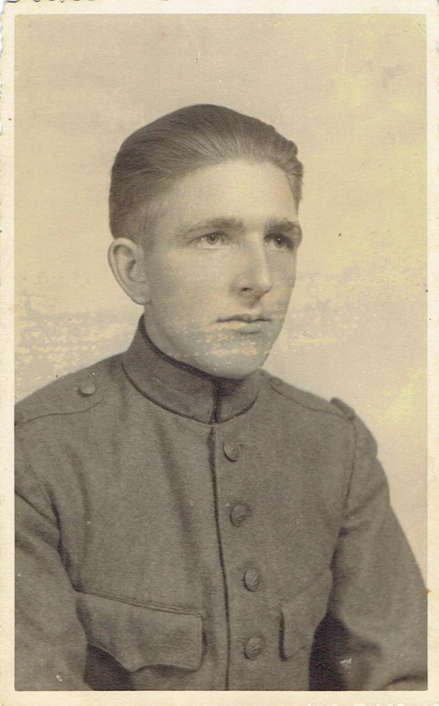

Een van de leuke dingen van de Staten van Dienst zijn de vermelding van de lengte en het gewicht.

Harrie had een lengte van 1 m en 877 mm en een gewicht van 71,5 kg. Daarmee was hij dus de langste man van het hele stel. Harrie Maessen was met een lengte van 1 m en 604 mm en een gewicht van 50 kg. in ieder geval de kleinste man van het hele stel.

Op foto’s van Harrie tijdens de mobilisatie hoef je vaak alleen maar te zoeken naar de langste man op de foto.

Harrie vervulde zijn militaire dienstplicht bij het 17e Regiment Infanterie te Roermond. Daar hij pas sinds 11 april 1939 in militaire dienst was gekomen heeft hij, na de afkondiging van de Algemene Mobilisatie op 28 augustus 1939, nog een deel van zijn opleiding gevolgd bij het 17e Depotbataljon Infanterie in Den Haag. Eerst bij de 6e Compagnie, later bij de 5e Compagnie en weer later bij de 4e Compagnie van het 17e Depotbataljon in de periode van augustus tot oktober, november 1939.

Volgens mutaties op zijn Staat van Dienst was hij op 19 oktober 1939 over bij de 4e Compagnie, van het 17e Depotbataljon, vervolgens was hij op 15 november 1939 over bij de Staf-IVe Divisie. En vervolgens staat er dat hij per 16 november 1939 in onderhoud was bij II-8 R.I. (IIe Bataljon, van het 8e Regiment Infanterie) met (16 M.C.). Dat was de 16e Mitrailleurcompagnie. Daar is hij bij ingedeeld gebleven tot en met de gevechten in de meidagen van 1940.

De 16e Mitrailleurcompagnie was gepositioneerd op de Grebbeberg. Daar heeft Harrie de verschrikkingen van de oorlog aan den lijve ondervonden. Hij is daar gewond geraakt, vermist geweest en krijgsgevangen gemaakt en naar Stalag II-A Neubrandenburg afgevoerd en geregistreerd onder krijgsgevangenennummer 32893.

Om een beeld te krijgen wat daar allemaal is gebeurd hierbij enkele feiten. Zijn compagnie bestond uit ongeveer 80 militairen. Daarvan zijn er tijdens die dagen 18 gesneuveld. Dat is 22,5%! Een uitzonderlijk hoog percentage.

Indien iemand meer over deze gevechten op de Grebbeberg van dit onderdeel wil lezen, zie de link: https://www.grebbeberg.nl .

Harrie keerde spoedig uit krijgsgevangenschap terug, in juni 1940, en werd per 14 juni 1940 met groot verlof gestuurd.

En jawel, ook Harrie heeft een straflijst gehad. Op 8 mei 1939 kreeg hij 4 dagen licht arrest vanwege “Een uur en vijfentwintig minuten na het avondappel de kazerne binnengekomen zonder dat hem avondpermissie was verleend” en op 22 april 1940 kreeg hij 4 dagen streng arrest vanwege “In het mobilisatietijdvak, 22-4-1940, zich merkbaar onder den invloed van sterken drank verkeerend, in het openbaar begeven.” met tussen haakjes: dronkenschap.

Wel leuk, zo’n anekdote.

Harrie heeft na de oorlog op 28 februari 1950 het Oorlogsherinneringskruis met de gesp met een daarbij behorend certificaat en weer veel later, op 18 juli 1991 het Draaginsigne Gewonden toegekend gekregen.

Hij heeft de verschrikkingen van mei 1940 nooit helemaal los kunnen laten en zeer waarschijnlijk is dat hij aan PTSS (Posttraumatische stressstoornis) heeft geleden.

Een term waar je vroeger niet veel van hoorde, tegenwoordig meer bekend en met name bij de veteranen van de laatste oorlogsconflicten.

Een ding is me wel altijd bijgebleven van Harrie. Ondergetekende is samen met Harrie een keer naar de Grebbeberg geweest, in de negentiger jaren. Hij wist dat ik me er ook mee bezig hield en vroeg me of ik hem kon helpen.

Wat was het probleem? Hij was verschillende keren naar de Grebbeberg geweest maar had nooit meer de locatie kunnen vinden waar hij nu precies op de Grebbeberg had gezeten. Natuurlijk waren er dingen veranderd aan de omgeving. Ik heb toen met behulp van een oude stafkaart met daarop de opstelling van zijn compagnie geprojecteerd op een toen hedendaagse toeristenkaart en ik wist waar we heen moesten om zijn oude opstelling te vinden. Harrie was erg blij dat hij zijn oude opstelling terug had gevonden en was mij daarvoor heel dankbaar.

Jan van de Bovenkamp, geboren op 06-10-1919 te Helenaveen.

De benjamin van het hele stel.

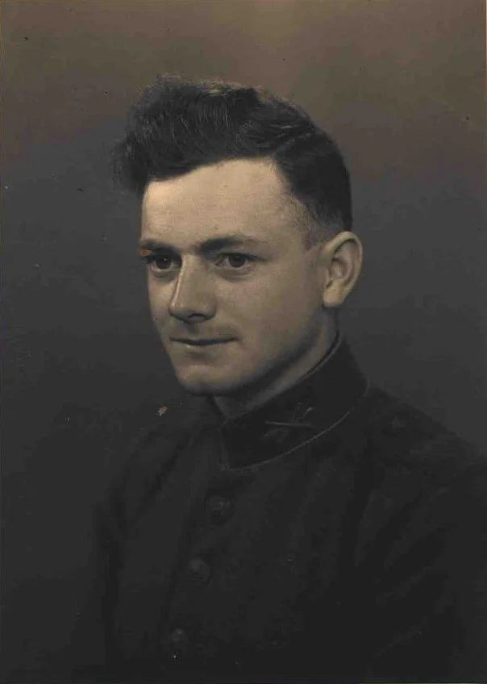

Hij vervulde zijn militaire dienstplicht bij het 1e Regiment Luchtdoelartillerie in de Hojelkazerne in Utrecht. Samen met zijn vriend Jan Hoogendoorn. Jan van de Bovenkamp kwam wel uiteindelijk bij een ander onderdeel terecht. Hij was namelijk ingedeeld bij de 13e Batterij Luchtdoelartillerie die opgesteld stond vlakbij vliegveld Ypenburg bij Den Haag. Dat onderdeel is zeer betrokken geweest bij de gevechten om dat vliegveld en de gevechten om Den Haag. Hij werd op 25 mei 1940 met groot verlof gestuurd.

In dezelfde volgorde van oud naar jong de mannen die in Helenaveen zijn geboren, maar inmiddels verhuisd waren naar elders:

Piet (Peter Hubertus) Brouwers, geboren op 04-01-1905 te Helenaveen.

Voor de oorlog verhuisd naar Deurne, van beroep timmerman. Hij vervulde zijn militaire dienstplicht bij het 17e Regiment Infanterie te Roermond. Hij was getrouwd en huisvader toen hij op 29 augustus 1939 wederom werd opgeroepen.

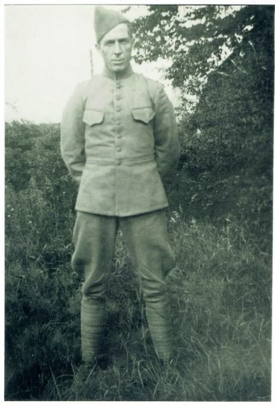

Tijdens de mobilisatie was hij ingedeeld bij de 2e Compagnie, van het IIIe Bataljon, van het 41e Regiment Infanterie. Dit onderdeel bevond zich aan de Maas te Neer. Hij was motorordonnans.

Tijdens de Duitse inval op 10 mei 1940 bevond hij zich in een van de kazematten aan de Maas. De aanval was hevig en de meeste kazematten kwamen onder vuur te liggen. Gelukkig voor Piet viel de kazemat waar hij was niet op omdat het onder een treurwilg stond en niet beschoten werd.

Op een gegeven moment trokken hij en een andere militair zich terug en zagen dat de andere kazematten zwaar beschadigd en verlaten waren.Ze zagen kans om ergens burgerkleding te krijgen en trokken naar Deurne.

Op 29 mei 1940 met groot verlof gestuurd.

Kees (Cornelis Henricus) Tijssen, geboren op 13-12-1911 te Helenaveen.

Voor de oorlog verhuisd naar Neerkant. Hij vervulde zijn militaire dienstplicht bij de 3e Compagnie hospitaalsoldaten-ziekendragers. Vanaf 1 januari 1936 behoorde hij tot de 3e Compagnie Geneeskundige Troepen en vanaf 1 juni 1938 werd hij overgeplaatst bij het Bataljon Geneeskundige Troepen. Vanuit dit onderdeel werden de betreffende militairen overgeplaatst naar allerlei onderdelen van het Nederlandse leger.

Tijdens de meidagen van 1940 was hij ingedeeld bij de 3e Compagnie, van het IIIe Bataljon, van het 14e Regiment Infanterie die in de omgeving van Gassel-Escharen lag.

Hij is krijgsgevangen gemaakt en afgevoerd naar Stalag II-A Neubrandenburg en geregistreerd onder krijgsgevangenennummer 28029. Weliswaar onder de naam Fijssen. Op 15 juni 1940 keerde hij daarvan terug.

Bekend is dat hij, volgens zijn Staat van Dienst, op 14 juni 1940 overgeplaatst werd naar de 2e Compagnie, van het Ie Bataljon, van het 14e Regiment Infanterie. Hij werd pas op 15 september 1940 met groot verlof gestuurd.

Ook van hem is een straflijst bekend. Hij kreeg op 2 februari 1932 een berisping vanwege “Het niet naar behooren opbergen van zijn uitrusting”. Je ziet, voor elk klein ding werd men in die tijd al gauw bestraft.

Piet (Petrus Johannes) Bakker, geboren op 07-08-1915 te Helenaveen.

Ook hij is voor de oorlog verhuisd naar Neerkant. Hij vervulde zijn militaire dienstplicht ook bij het 17e Regiment Infanterie te Roermond. Op 29 augustus 1939 gemobiliseerd en op 25 mei 1940 met groot verlof gestuurd.

Rinus (Marinus Johannes) Lagarde, geboren op 25-04-1919 te Helenaveen.

Rinus Lagarde was in 1937 verhuisd naar Horst, bakker van beroep en vervulde zijn militaire dienstplicht bij het 17e Regiment Infanterie. Is ook tijdens de meidagen van 1940 krijgsgevangen gemaakt en afgevoerd naar Stalag II-A Neubrandenburg met als krijgsgevangenennummer 30134. Op 15 juni 1940 keerde hij uit krijgsgevangenschap terug en werd op dezelfde dag met groot verlof gestuurd.

En als laatste militair de man die een relatie had met een Helenaveens vrouw (Martha Wijnands), zus van Harrie Wijnands.

Hans (Johannes Leendert) Lokker, geboren op 05-02-1918 te Kerkwerve (Zeeland).

Deze Zeeuw was dus in Helenaveen terecht gekomen vanwege zijn relatie met Martha Wijnands.

Zijn militaire dienstplicht vervulde Hans bij het 3e Regiment Veldartillerie in de Seeligkazerne te Breda. Ook hij werd op 29 augustus 1939 opnieuw opgeroepen na de afkondiging van de Algemene Mobilisatie.

Tijdens de meidagen van 1940 was hij ingedeeld bij de 2e Batterij, van de IIIe Afdeling, van het 3e Regiment Artillerie die opgesteld was in de omgeving van Sint-Michielsgestel-Schijndel. Hij had daar de functie van seiner-telefonist.

Op 25 mei 1940 werd hij met groot verlof gestuurd.

M.i.v. 16 mei 1945 kwam hij terug in werkelijke dienst bij het Militair Gezag. Uiteindelijk werd hij op 8 augustus 1946 ontslagen wegens einde verbintenis.

Tijdens die laatste periode als militair trouwde hij op 25 juni 1946 met Martha Wijnands in de Sint-Willibrordus(nood)kerk in Helenaveen.

Het is dus een lange lijst geworden, maar deze periode van Helenaveense geschiedenis is lange tijd onbelicht gebleven. Er werd ook niet veel over gesproken in de periode na de oorlog. Te pijnlijk, te moeilijk of iets om snel te vergeten. Ieder heeft zo zijn redenen hiervoor gehad.Toch werd het mij wel duidelijk tijdens de viering van Helenaveen 75 jaren bevrijd, dat er wel degelijk belangstelling voor deze periode was en is. Met dit verhaal is het hopelijk enigszins gelukt om meer duidelijkheid te krijgen over deze periode in de Helenaveense geschiedenis.

Wie zich meer wil verdiepen of meer wil weten waar zijn vader of grootvader heeft gezeten of gevochten heeft, kan contact opnemen met ondergetekende via de webmasters van deze website.

Ton van den Hurk
