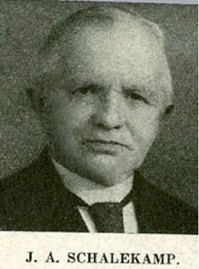
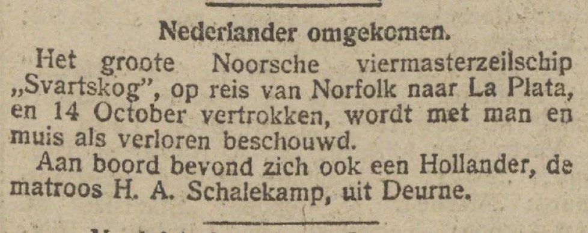
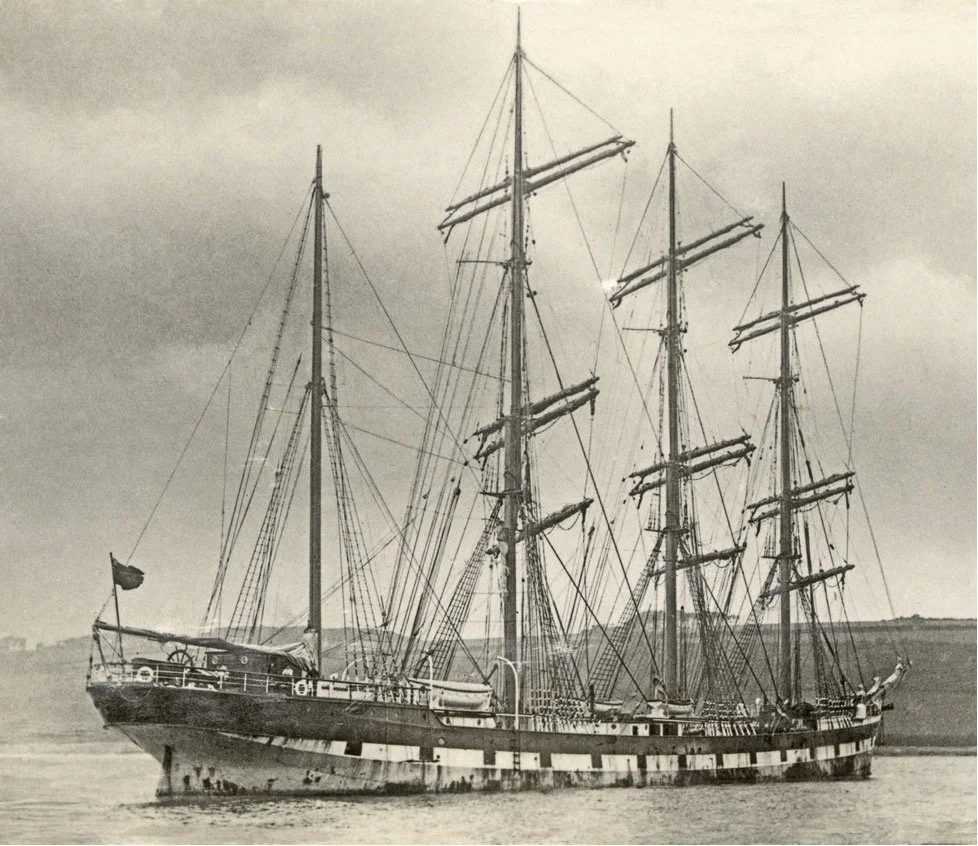
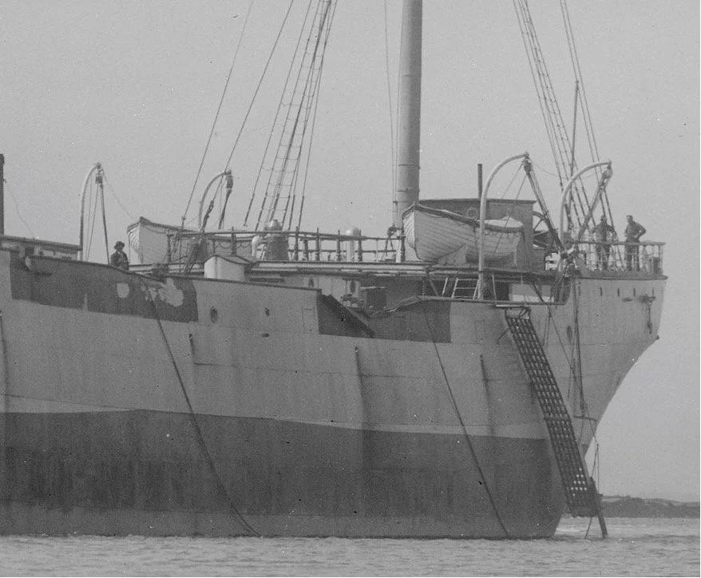
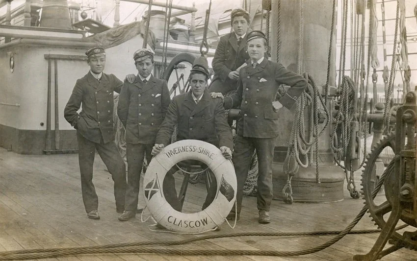

# huibrecht-schalekamp-komt-om-in-de-bermuda-driehoek

> Bron: helenaveenvantoen.nl

## Huibrecht Schalekamp verdrinkt in de Bermuda driehoek

### Het gezin Schalekamp

Van 1892 tot 1905 was J. A. Schalekamp dominee te Helenaveen, zijn eerste standplaats.

JOHANNES ARNOLDUS SCHALEKAMP werd geboren in Pernis op 29 juni 1859 en overleed in Sliedrecht op 4 januari 1944. Hij was evangelist en godsdienstonderwijzer.

Schalekamp was eigenlijk geen dominee, maar godsdienstonderwijzer. Hij was in Helenaveen geliefd, maar werd ook wel ijdel genoemd. Hij was zeer recht in de leer.

Johannes Arnoldus Schalekamp was 33 jaar oud toen hij in Helenaveen aangesteld werd.Hij was gehuwd met Dirkje Verschoor die geboren is op 26 november 1862 te Pernis; zij was dus 31 jaar toen ze in Helenaveen kwam.

Johannes en Dirkje kregen 14 kinderen waarvan de meesten op jonge leeftijd zijn gestorven.

1. Arie (Hoogvliet 21 november 1882 - Hoogvliet 22 maart 1883).

2. Arend Arie (Hoogvliet 28 oktober 1883 - Amsterdam 2 december 1976). Hij huwde met Baukje van Slooten (1890-1970).

3. Catharina (Hoogvliet 16 december 1884), overleden december 1969. Zij was getrouwd met Jan Gerhard du Pré.

4. Petronella (Hoogvliet 27 mei 1886 - Hoogvliet 16 januari 1887).

5. Teunis (Hoogvliet 5 september 1887 - Oldemarkt 13 augustus 1907).

6. Petronella (Hoogvliet 24 augustus 1889 - Dordrecht 6 september 1924). Zij was bij haar overlijden wijkverpleegster in Strijen.

7. Cornelia Elisabeth (Hoogvliet 22 juli 1891 - Deurne 20 december 1892).

8. Arie (Deurne 5 juli 1893 - Groningen 28 augustus 1930). Hij huwde met Hillegonda de Vos (1890-1924). Bij zijn overlijden was hij controleur-bankwerker en woonde hij als weduwnaar in Brunssum.

9. Cornelia Elisabeth (Deurne 28 maart 1895 - Deurne 24 november 1895).

10. Huibrecht Adrianus (Deurne 8 januari 1897 -1921). Hij was als matroos een van de opvarenden van het viermasterzeilschip Svartskog dat tijdens een orkaan in of nabij de beruchte Bermudadriehoek verging. Het schip was op reis van Norfolk naar La Plata.

11. Cornelia Elisabeth (Deurne 11 augustus 1898 - Heenvliet 27 juli 1917).

12. Dirkina Jacoba (Deurne 24 oktober 1901 - Joure-Haskerland 14 september 1913).

13. Johannes Arnoldus (Deurne 10 januari 1903 - Deurne 5 maart 1903).

14. Levenloos geboren kind (Deurne 24 januari 1904).

Op de pastorie woonden verder nog;

In 1899 Dienstmeid Jantien Brinks (14 jaar oud, Emmen)In 1903 Dienstmeid Cornelia van Loon (16 jaar oud, Rotterdam)

Op 27 maart 1924 hertrouwde Johannes Arnoldus met ELISABETH CATHARINA BAERKEN, een uitgetreden RK-non, die op 12 december 1884 in Rotterdam werd geboren. Het leeftijdsverschil tussen Johannes en Elisabeth was ongeveer 25 jaar. Op 26 juni 1926 werd in Overschie uit dit huwelijk een zoon geboren die dezelfde namen kreeg als zijn vader: Johannes Arnoldus Schalekamp. Onder de schrijversnaam JEAN SCHALEKAMP schreef hij diverse romans, verhalen- en reisbundels en hij vertaalde talloze boeken uit het Frans, Spaans en Engels in het Nederlands. Elisabeth overleed in Sliedrecht op 24 januari 1962.

Johannes Schalekamp heeft in zijn leven diverse boeken en geschriften uitgegeven.

In het boek: ’s LEVENS WISSELINGEN of Gods Genade verheerlijkt aan een verloren zondaarbeschrijft hij zijn leven als evangelist en ook het vele verdriet dat hij en zijn vrouw hebben gehad door het vroegtijdig overlijden van zijn kinderen. Mooi is te zien hoe hun rotsvaste geloof hen telkens weer hielp om over het verdriet heen te komen.

### tegen de wil van zijn ouders gaat Huibrecht naar zee.

Over zijn zoon Huibrecht Adrianus die in Helenaveen geboren is schrijft de dominee het volgende:

Vier jaar later verongelukte ‘n 24 jarige zoon op zee. Hoe gaarne hadden wij hem opgeleid gezien voor Christelijk onderwijzer; hij kon zoo goed en vlug leeren. Helaas, het mocht niet zo zijn. Hij moest en zou naar zee. En hoe wij het ook trachtten tegen te houden, het mocht niet baten, wij moesten eindelijk wel toegeven.Wat stonden wij soms angsten uit, als wij , tijdens den gruwelijken wereldoorlog, soms in bijna twee jaren geen tijding van hem ontvingen. Vele avonturen, spannende ogenblikken in doodsgevaar heeft hij doorleefd, doch niets was in staat, den lust tot zeevaren in hem te doven. In den zomer was hij met het Noorsche viermast-barkschip “Svatskog”, van Rotterdam uitgevaren. In ’t volgend voorjaar lag een oudere broeder van hem onze zoon A. In het sanatorium voor longlijders in Apeldoorn. In de lighal lag een medepatiënt “De Maasbode” te lezen. Opeens zei deze: “Zeg Sch. Ik lees daar, dat als zeker moet worden aangenomen, dat het Noorsche viermast-barkschip “Svatskog”, op reis van Baltimore naar La-Plata, met man en muis is vergaan. De eenige Nederlander onder de bemanning van 26 koppen is H.A. Sch…. Kan dat ook familie van je zijn?”

Het bericht in de Maasbode 10-04-1921

Natuurlijk ontstelde onze jongen zeer, en berichtte het ons per briefkaart, dringend aanspoorende tot nader onderzoek. Onmiddellijk toog ik er dan ook op uit, doch zekerheid kon ik van niemand bekomen, hoewel ik ‘t bureau van de “Maasbode”, den Waterschout, den Havenmeester en den Noorschen Consul, allen te Rotterdam, bezocht.Later kwam echter de Burgemeester van H. ons, namens den Minister van Buitenlandsche zaken, mededelen, dat door het scheepsgericht te Cristiana (thans Oslo) was uitgemaakt dat de “Svartskog” met man en muis was vergaan.Diep gevoelden mijne vrouw en ik ons terneergeslagen. Wat werden we zwaar beproefd.Wat ging Gods weg met ons tegen vleesch en bloed in. En toch… O, dank zij Gods genaderijke ontferming, als wij ooit ondervonden hebben, dat vertroostingen Gods ons niet te klein waren, dan is het juist in die donkere dagen van smart en beproeving geweest. Mijn lieve vrouw heeft meermaalen verklaard, dat die ramp haar nader tot den Heere heeft gebracht,Op bijzondere wijze heeft de Heere mij afgebracht van het denkbeeld, dat deze verongelukte zoon gewis voor eeuwig verloren zou zijn.Dit stond bij mij vast omdat hij zich tegen de ernstige vemaningen zijns vaders, en de tranen zijner moeder in, aan werelddienst en zondelust had overgegeven. Na het ontvangen van het eerste bericht , omtrent het vergaan van dat schip, had ik Zondagsavonds gesproken over Zach. 14:7b: “En het zal geschieden ten tijde des avonds, dat het licht zal wezen,.”Diep onder den indruk der vele smartelijke beproevingen, waarvan deze laatste niet de minst pijnlijke was, had ik daarover gesproken, en o.m. uitgeroepen: “Ik ben moe, ik verlang naar de eeuwige rust, waar ’t eeuwig licht zal wezen,” enz.

Aan ’t einde der godsdienstoefening kwam een der hoorders mij condoleeren; daarbij de gedachte uitsprekende, dat onze jongen in zijn doodstrijd, bij ’t worstelen met de golven, nog wel om genade gesmeekt kon hebben, en God hem dan nog wel genadig geweest kon zijn, en wij hem dan in den hemel zouden wederzien.Ik antwoordde: Och ja dat is een stoohalm, waaraan ik mij zou kunnen vastklemmen; tot de onmogelijkheden behoort dat niet, maar voor mij staat vast, dat hij voor eeuwig verloren is, maar ik heb genade ontvangen om God in zijn recht te billijken. Twee dagen later was de burgemeester gekomen, met het noodlottige officieele bericht en toen ik dat aan iemand vertelde, en tevens mededeelde het gesprek van Zondagavond, en welk antwoord ik gegeven had, maakte deze de opmerking: “En Uwe gebeden dan, mijnheer?”Toen werd ik beschaamd. Zou ik dan waarlijk nog mogen hopen?

Zaterdags daarop vroeg mijne vrouw, na het middagmaal: ”Wat zou dat nu toch zijn man, Ik heb den heelen dag zoomaar bij mij: Ik ben uw Goden en uws zaads God. Telkens komt dat in mij op.”

Ik riep uit: ”O kind, wat is God toch goed, neen, nu durf ik niet meer te zeggen dat onze jongen voor eeuwig verloren is, en al kunnen wij nu nog niet met volle zekerheid verklaren dat hij voor eeuwig behouden is, we mogen nu toch goede hope koesteren; de eeuwigheid zal ’t openbaren. Wat ben ik blij dat je me dat gezegd hebt, wat is God toch goed, om je dat te openbaren.”

Het schip van Huibrecht, de Svartskog (gebouwd onder de naam Inverness Shire).

Svartskog sv was a Norwegian 4 masted Sailing Barque of 2,370 tons built in 1894 by Robert Duncan & Co, Port Glasgow for Thomas Law & Co, Glasgow as the INVERNESS-SHIRE sv. In 1915 she was acquired by A/S Bark Inverness-Shire (H. Jeremiassen), Porsgrund. In 1916 she was purchased by A/S Christiansand (Sven O. Stray), Kristiansand, Norway and renamed SVARTSKOG. On October 16th, 1920 Svartskog left Newport News with a cargo of coal for Buenos Aires and disappeared with all hands. Posted missing by Lloyd’s 15 July 1921.

Toen de Svartskog verging was het geen zeilschip meer, maar was het omgebouwd naar een stoomschip.

Hieronder hetzelfde schip met twee schoorstenen. zoals het eruitzag toen het verging met Huibrecht aan boord.

Svrtskog zoals hij eruitzag toen zie verging.

The four-masted steel barque „Inverness-Shire“, built 1894 in Port Glasgow. after having been totally dis-masted in the Australia Bay.

Dezelfde foto maar dan vergroot.Het is verleidelijk te denken dat de man met de hoed links op de foto, die ons staat aan te kijken, de Helenavener Huibrecht Schalekamp kan zijn.

The crew of the “Svartskog” pose aboard their ill-fated vessel

In the winter of 1920-1921, the Norwegian ship the Svartskog vanished in or near the notorious Bermuda Triangle. That winter was one of the worst on record for the North Atlantic.

Jan van Woezik, 12 dec 2021
