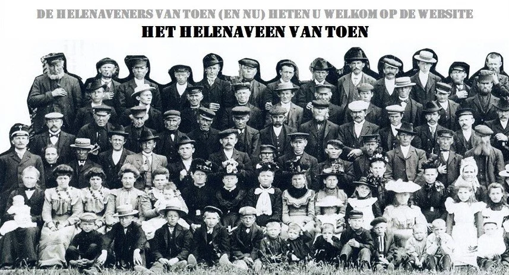

# index

> Bron: helenaveenvantoen.nl

Direct naar de inhoudsopgave

Direct naar de pagina met laatste bijdragen en wijzigingen

Parel in de PeelHelenaveen is een parel in de Peel. Ook al zijn onze ouders pas in 1854 hier neergestreken in de tot dan toe onbewoonde Oude Peel, we kunnen er veel over vertellen. Over de Helenavaart, die Jan van de Griendt vanaf de Noordervaart bij Meijel naar zijn van de gemeente Deurne gekochte verveningsgebied liet graven.

1853 het beginDat startte in juni 1853 onder leiding van Jan Deckers. Van overal kwamen kanaalgravers en turfstekers naar de Peel. Uit de directe omgeving, maar ook uit de veenkoloniën uit het noorden. De Poepen werden als seizoenarbeiders uit de buurt van Hannover gehaald. In januari 1854 hadden de kanaalgravers de plek bereikt waar Van de Griendt het dorp had gedacht. Vanaf dat moment schreef Jan Deckers niet meer “het graven van een kanaal vanaf de Noordervaart tot in de Peel van Deurne”, maar “… tot in het Helena-Veen”.

Houten en strooien huttenBoerderijen en huizen van steen werden gebouwd, maar vooral houten en strooien hutten voor de Peelwerkers die liever op het werk wilden wonen. De Helenavaart is de levensader van Helenaveen, waarlangs wij woonden en onze ouders en later wij turf staken en de grond ontgonnen voor het telen van groenten en fruit. Uit Gelderland kwamen tabakstelers en uit Holland de kaasboeren. Na de uitvinding van turfstrooisel kwam in Helenaveen ook een turfstrooiselfabriek. En vanaf 1910 bouwde de Maatschappij Helenaveen meer dan tien koningshoeven. Die zijn alle genoemd naar leden van het koningshuis, als dank voor de schenking door koning Willem III aan Helenaveen.

Veel verhalenOver dit alles valt genoeg door ons te vertellen. En ook over de scholen, de kerken, de in Helenaveen gevonden gouden helm van een Romeinse officier, de sagen en verhalen die we elkaar regelmatig bij het haardvuur vertelden, het Fonds Koning Willem III, Peelbranden, de oorlog en zo meer. Van Helenaveen zijn mooie foto’s en ansichtkaarten en prachtige kaarten gemaakt. Kijk maar eens naar wat er nu al op de website staat.

We wensen u veel lees- en kijkplezier en nodigen u uit om met de opgedane voorkennis ons interessante dorp te bezoeken.

Opmerkingen, vragen of bijdragen (foto’s of tekst) kunt u sturen naar info@helenaveenvantoen.nl
