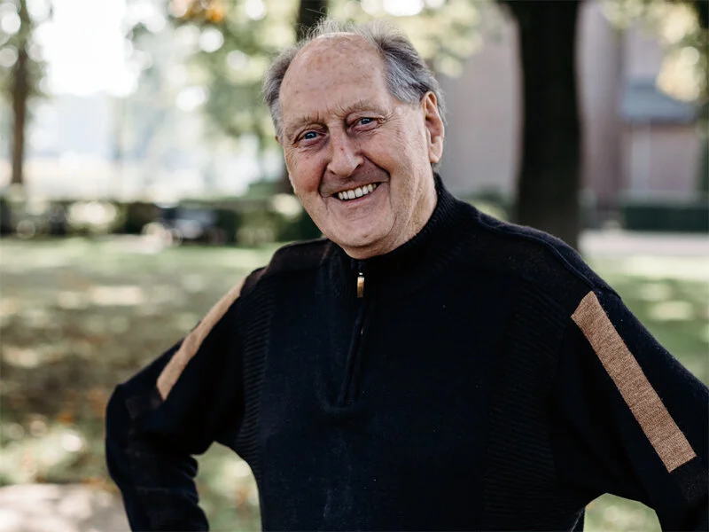

# jan-sonnemans

> Bron: helenaveenvantoen.nl

# Jan Sonnemans

## JAN SONNEMANS

Van de Helenaveense mannen die op 8 oktober 1944 werden weggevoerd, is Jan Sonnemans een overlevende. Hij was net zestien jaar en stond met zijn zondagse kleren aan op het punt stond om naar de kerk te gaan, toen hij werd opgepakt. In de zomer van 1945 keerde hij wonderwel terug naar Helenaveen. “Herdenkingen zijn voor mij altijd kwaje dagen. Dan droom ik veel, alsof ik weer in Duitsland ben.”

### De ochtend van 8 oktober

De eerste oorlogsjaren verliepen rustig in Helenaveen. In 1940, aan het begin van de oorlog, moest de familie Sonnemans het huis verlaten. Dat was op 10 mei, en op 11 mei was men alweer terug. Die eerste jaren had men weinig last van de oorlog. Tot Helenaveen geëvacueerd werd, eind september 1944. Zoals veel gezinnen uit Helenaveen ging de familie Sonnemans naar Grashoek. Ze zaten daar met 56 mensen bij één boer: “De koeien gingen de wei in, en wij verbleven op de stal.”

Op 8 oktober stond Jan Sonnemans in zijn zondagse kleren op het punt om naar de kerk te gaan, toen tien Duitsers met geweren mensen uit huis kwamen halen. “Er was nog wel een mogelijkheid om mensen te waarschuwen, dat gebeurde onder andere door dochters van Hoogendoorn. Bij ons op de boerderij waren 5 à 6 jonge kerels, die ’s morgens naar de mis gingen en daar gewaarschuwd werden. Die zijn gevlucht, het bos in of de hei op.”

Jan Sonnemans kon niet ontkomen en werd met een groep mannen uit Grashoek en Helenaveen weggevoerd: “Je was eigenlijk ’n kudde schapen, de Duitsers liepen er als een soort herder rondom heen. We zijn te voet naar Maasbree gemoeten. Van daaruit zijn we per vrachtauto naar Venlo gegaan en we zaten ’s morgen al om half 11 in de wagons.” Omdat het verkeer gewoon door moest gaan en de goederentrein waarin de mannen vervoerd werden voor elke overgang moest stoppen, duurde het een week voordat ze op hun bestemming in Duitsland arriveerden.

### 'Verkocht, op de markt'

De gedeporteerde mannen en jongens moesten 's ochtends aantreden voor het keurend oog van partijen die arbeidskrachten zochten. “We werden gewoon verkocht, op de markt…” Sommigen werden ondergebracht bij boeren of in de suikerfabriek, maar de meesten gingen naar Watenstedt, naar de Hermann Goering Werke, waar Jan afvalslakken van de hoogovens moest verwerken.

Hij en zijn lotgenoten werden ondergebracht in een barak: “We sliepen met 16 man in één barak, ’n tafel in het midden en aan elke kant 8 bedden, 2 hoog.” Op bed lagen alleen strozakken en één deken: “We hadden geen kleren, geen zakdoek, geen handdoek. We hadden niks.” Zo verzengend heet als het tijdens de arbeid was, zo koud was het 's nachts: er was geen kachel. “Als je de bedden tegen elkaar schoof had je met zijn tweeën twee dekens. We lagen natuurlijk altijd met de kleren aan in bed, we hadden niks anders.” Van wassen was ook nauwelijks sprake: er was geen water in het kamp.

### Tachtig uur per week tussen de gloeiende slakken

Gedurende drie maanden werkten Jan en de andere mannen elke dag van de week. Ze maakten dagen van 12 uur; op zondag duurde de werkdag 8 uur. Zo werkten ze tachtig uur per week. De gloeiende slakken van de hoogovens werden in kuilen gestort; deze moesten met pikhouwelen worden losgekapt en vervolgens op lorries geladen. Er was geen drinkwater, en het was warm: “We kregen klompen met dikke zolen en we kregen elke week nieuwe. Die brandden onder je voeten weg.”

Van oktober 1944 tot half januari 1945 hebben Jan en de anderen onder zeer moeilijke omstandigheden gezwoegd, tot ze er letterlijk bij neer vielen: “toen de bevrijding kwam werkte er van de 20 mannen geen één meer”, vertelt Jan. Hijzelf woog nog maar 31 kilo. “Ik was ondervoed, ik kon niet meer lopen en ik kon niks meer met mijn handen. Ik ben toen in het ziekenhuis gekomen, in Drütte. Ik lag daar in een hoek bij het raam en toen er een alarm kwam liep iedereen naar buiten en wij moesten blijven liggen, met grote schrik. De ramen en de deuren vlogen eruit en ik lag daar nog. Ze waren mij vergeten. Toen de hoofdzuster kwam kijken, lag ik binnen één minuut in de schuilkelder van dat ziekenhuis. Ze hadden een schuilkelder onder een hoge weg, met zand en slakken daarover. Dezelfde slakken die wij moesten bikken. Als er dan een bom op viel, ging die schuin naar beneden, vertelden ze ons, en was de kracht van die bom weg. Ik heb daar gelegen tot de Amerikanen mij eruit haalden. Ik heb twee maanden niet kunnen lopen. Ik kon niks.”

### Lange terugreis

De Amerikanen brachten Jan Sonnemans naar Frankrijk, waar ze in Soissons een kazerne hadden, helemaal ingericht als ziekenhuis. Jan kon daar aansterken tussen de Amerikaanse soldaten. Hij werd voorzien van een zomertenue, zeep, sigaretten en chocola en zag voor het eerst in zijn leven een tandenborstel en tandpasta. In de loop van juni 1945 werd hij ontslagen. Na nog enkele weken in een Frans tentenkamp op transport gewacht te hebben kon Sonnemans dan eindelijk naar huis: met de trein via Roosendaal naar Deurne en van daaruit met de taxi naar De Peel. Thuis hadden ze de hoop opgegeven Jan nog terug te zien. Maar: “er was een buurman die wist dat ik in het ziekenhuis terecht gekomen was en dat ik niet kon lopen. Die heeft de hele tijd gezegd: die komt terug!” En zo geschiedde.
