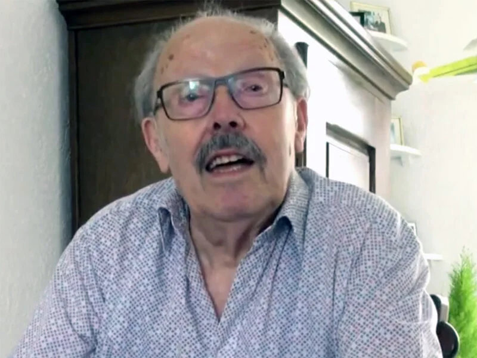

# jan-van-teeffelen

> Bron: helenaveenvantoen.nl

# jan van teeffelen

## jan van teeffelen

Er waren drie kinderen in het gezin Van Teeffelen. Jan is de oudste, geboren in januari 1932. Zijn broer is twee jaar jonger en woont nog in Helenaveen. Zijn zus is jong gestorven. Groot voordeel van het wonen in Helenaveen, ook in de oorlog, was dat de bevolking grotendeels zelfvoorzienend was. “Groenten, fruit, kaas en boter, noem maar op, dat was er allemaal. Als de een het niet had, had de ander het wel.”

### Mobilisatie

“Mijn allereerste ervaring was in 1939, toen de oorlog dreigde, dat al die militairen in actie kwamen, met de trotyl om de bomen om die te kunnen laten springen. De bruggen werden ook gereed gemaakt om ze te laten springen. Die kazematten stonden met het front gericht op Duitsland. De Duitsers kwamen uiteindelijk achterom, van de achterkant.”

### Oorlog

Het eerste dat Jan meemaakte van de oorlog zelf waren de vliegtuigen die overkwamen om Rotterdam te gaan bombarderen. Om op dat moment de Duitsers tegen te houden werden de bomen en bruggen vernield. Er werden versperringen opgeworpen. “En daarna kwamen de Duitsers kijken wat er allemaal gedaan was. Mijn vader vertrouwde het niet meer. Hij pakte de auto en reed ons naar Deurne. We kwamen in Deurne op de Markt en daar kwamen we de Duitsers tegen. Toen zijn dus maar heel snel omgedraaid.”

Later in de oorlog begon het bombarderen van Duitsland. Je hoorde ze al van ver aankomen: door het gedreun van de motoren gingen de ruiten trillen. De geallieerde vliegtuigen werden beschoten en dan moest iedereen de schuilkelder in. Bij Jan thuis hadden ze een schuilkelder samen met de buren. De vliegtuigen kwamen over in complete konvooien, honderden vliegtuigen op één avond. Er stond een zoeklicht tegen Mariaveen aan en op twee plaatsen in het dorp stond afweergeschut.

Jan herinnert zich met name het vliegtuig dat zijn brandbommen liet vallen. De Peel achter hun huis vloog in brand en het huis van Maessen en de boerderij van Hoogendoorn brandden af. Mensen beseften nauwelijks dat het zulk gevaarlijk spul was en namen onontplofte munitie mee naar huis. “Sommigen vonden het zulk mooi spul, dat ze het thuis op de schouw zetten.” Kinderen gingen ook met munitie spelen en dat liep soms fataal af.

### Evacuatie

In september 1944 kreeg het gezin de opdracht om binnen een paar uur weg te zijn. Waar ze naartoe gingen, moesten ze zelf maar uitzoeken. “Toen zijn we richting Grashoek gegaan, naar kennissen. Die hebben ons opgevangen. We moesten te voet. We hadden drie hokken met kippen. Je moest alles achterlaten. Dat was een heel treurige geschiedenis.” Ze kwamen terecht ‘op Struiken’, een stukje Maasbree dat dicht bij Grashoek lag. Tijdens de acties van de Duitsers en geallieerden, aanval en tegenaanval, kwam de boerderij in de vuurlinie te liggen. De eigenaar en een geëvacueerde vrouw uit Helenaveen kwamen daar om door een granaat.

### Razzia

Op 8 oktober, een zondag, ging Jan met zijn moeder naar de kerk in Grashoek. Daar zagen ze de Duitsers mannen uit de kerk halen. Ze zijn toen zo snel als mogelijk naar huis gelopen om te waarschuwen. Zijn vader en enkele anderen waren al op de hoogte en zijn direct de Peel in gedoken. Toen ze op het eerste evacuatieadres weg moesten kwamen ze slechts 800 meter verder terecht, bij Curvers.

Jan vertelt over hun ervaringen daar: “Toen we daar zaten, kwamen er op een gegeven moment ’n stuk of 7 tot 9, misschien wel 10 Duitsers. Wij dachten: oei, oei, dit gaat fout. Die gingen de schuur in, die nestelden zich daar heel netjes en die gingen feesten. Die hadden een accordeon en ik weet niet wat allemaal. Wij vonden dat maar raar en dachten: gaat dit wel goed? Op een gegeven gingen die achter die boerderij een groot gat graven. Toen vertrouwden we het helemaal niet meer, natuurlijk. Toen hebben ze zich helemaal omgekleed, ze hadden burgerkleren bij zich en alles wat Duits militair was ging in dat gat. Het gat werd dichtgemaakt. ’s Morgens moesten wij weer verhuizen van daar naar Sevenum en toen liepen die 10 Duitsers met ons mee, alsof ze erbij hoorden. Die waren aan het deserteren…”

In Sevenum zijn ze nog op vier verschillende plaatsen geweest. “We hebben geen honger geleden, kregen natuurlijk wel droog brood. Bij die boeren viel nog wel eens wat te halen, in een bergruimte zat bijvoorbeeld boter. Mijn vader heeft onder het hooi zelfs een complete bakkerswagen gevonden.”

### Bevrijding

In Sevenum werden ze bevrijd. De Duitsers hebben nog snel de kerktoren opgeblazen en kort daarna kwamen de eerste geallieerde verkenners de markt oprijden. Vanuit Sevenum mochten ze, na verkregen toestemming, naar Deurne, naar een oom van Jan. Toen ze naar Liessel werden gebracht kwamen ze langs hun huis in Helenaveen. “Toen zijn we geschrokken! De muren stonden er nog, en dat was alles. De ruiten eruit, de vensters, de luiken weg. Het dak was kapot. Overal zag je linten. Bij het huis waren de mijnen geruimd, maar daarbuiten niet.”

Uiteindelijk kwamen ze in Deurne en zijn vader Van Teeffelen en Jan nog verscheidene malen op de fiets met harde banden naar Helenaveen gereden om daar de zaak weer enigszins op orde te krijgen. Jan weet het niet meer precies maar hij denkt dat het februari of maart 1945 was voordat ze weer naar Helenaveen konden om er te gaan wonen. “Het verwondert me nog steeds, hoe mijn ouders en leeftijdgenoten, die bezig waren een bedrijf op te bouwen of lekker aan het lopen hadden, hoe die dan in één keer alles kwijt zijn. Je denkt wel eens: hoe hebben ze dat opgevangen? De boeren kregen wel die Marshallhulp, maar de tuinders niet. Die moesten zelf maar zien hoe ze het rooiden. Ik heb daar nooit iets van gehoord.” Ze kregen we schadevergoeding voor het huis en andere hulp van de HARK (Hulp Aktie Rode Kruis).

De wederopbouw ging vooral erg traag. In de eerste tijd na de bevrijding vielen er ook nog vaak slachtoffers door de mijnen. Jan vertelt het verhaal over een broer van zijn eerste vrouw die op een mijn liep in de Belgenhoek.
