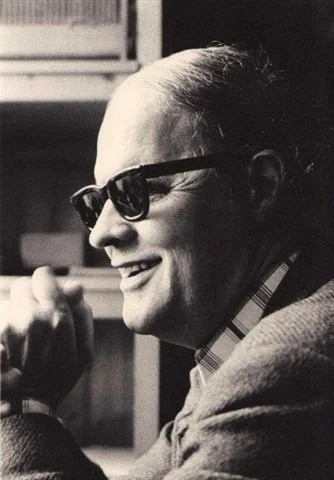
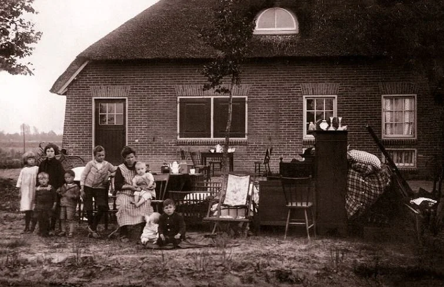
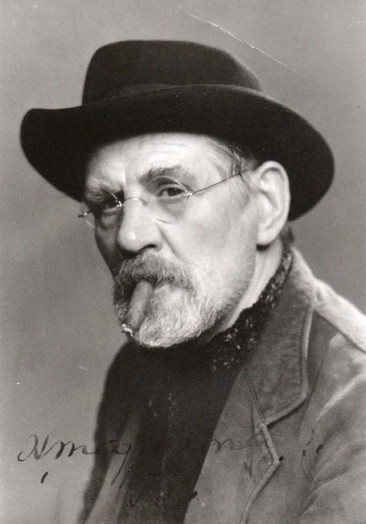
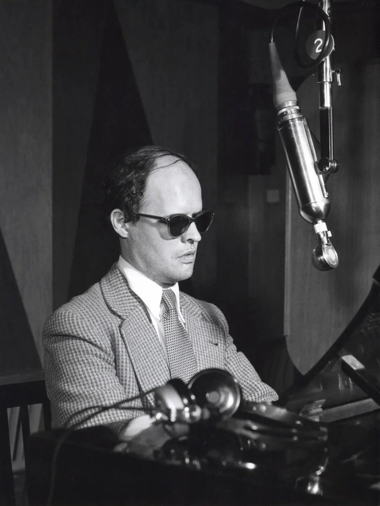
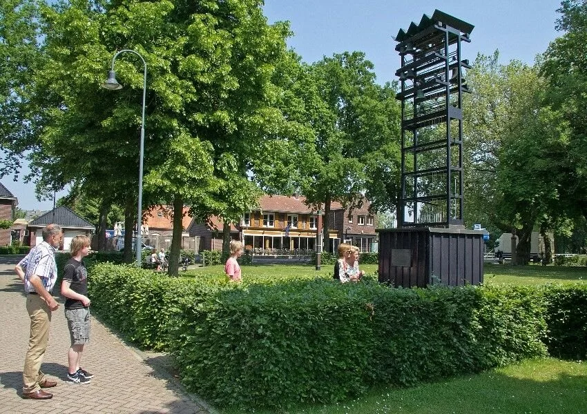
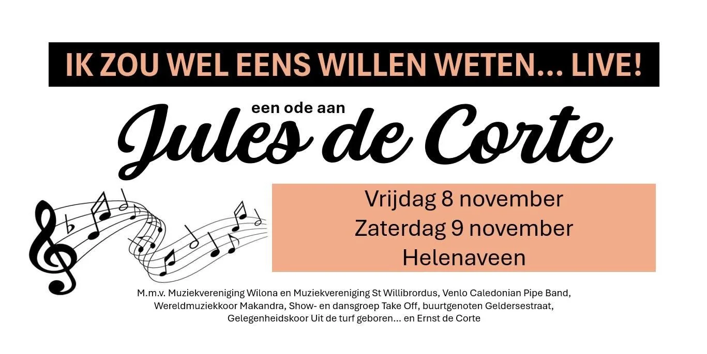

# jules-de-corte

> Bron: helenaveenvantoen.nl

Jules de Corte (1924-1996) was een Helenaveense zanger, pianist en tekstschrijver met landelijke bekendheid.

Hij werd geboren in Deurne-Sint-Jozefparochie als zesde uit een gezin van twaalf kinderen en was een zoon van Peer de Corte. Een socialist die een staking organiseerde bij het veenbedrijf van de Gemeente Deurne en daarom uit zijn huis werd gezet.

De familie De Corte na de uitzetting in 1928. Die nacht kampeerden ze onder een dekzeil dat een Deurnese middenstander hen uit medelijden was komen brengen. Vierde van links de nog kleine Jules

Toen Jules 14 maanden oud was, kreeg hij een middenoorontsteking. Een ongelukkige samenloop van omstandigheden en vooral ook het eigenzinnig optreden van dokter Wiegersma leidde uiteindelijk tot zijn blindheid.

De eigenzinnige dokter Wiegersma

Nog voor zijn derde jaar ging Jules naar het katholieke blindeninstituut De Wijnberg in Grave. Daar woonde hij tot aan het einde van de oorlog. Hij kreeg er uitstekend onderwijs, maar ervoer het als een kille, katholieke jeugdgevangenis. Hij leerde er ook pianospelen en bleek een muzikaal talent te zijn.Hij trouwde op 23 februari 1954 met Mien Verhoeven.Op 1 juli 1976 werd de echtscheiding tussen hen uitgesproken.

Jules ging daarna een relatie aan met Thea Dekker, met wie hij op 30 juli 1976 trouwde.

Hij woonde in Delft, Helmond en vanaf 1973 tot aan zijn dood woonde hij op adres Geldersestraat 9 in Helenaveen, waar hij in alle rust en vaak tot diep in de nacht werkte aan zijn composities.

Op 21-jarige leeftijd begon hij zijn muzikale loopbaan in Delft als pianist bij een dansschool, in restaurants en op bruiloften en partijen. Na het voltooien van een pianostudie ging hij bij de radio (KRO) werken.

Jules in de KRO radio studio

In kritische teksten uitte Jules de Corte zich tegen de vertegenwoordigers van het grootkapitaal. Zijn socialistische achtergrond klinkt nadrukkelijk in zijn liedjes door. In veel van zijn liedjes is zijn rancune tegen het kapitalisme hoorbaar. Ruim 35 jaar lang schreef hij meerdere radioliedjes per week voor de KRO en tal van tekstbijdragen voor andere omroepen.

Ruim 4000 liedjes schreef en componeerde hij tijdens zijn carrière. Met zijn muziek en teksten maakte hij tientallen grammofoonplaten en een cd. Daarnaast publiceerde hij een aantal boeken met gedichten, verhalen en filosofische overpeinzingen. Zijn bekendste liedjes zijn Ik zou wel eens willen weten, Koning Onbenul en de Vogels.

Hij was een talentvolle tekstdichter, die diverse dichtbundels liet verschijnen en zelfs te gast was tijdens De Nacht van de Poëzie in Utrecht. Verhalen over mensen in alledaagse en bizarre situaties, waarbij humor en verbazing de boventoon voeren, verschenen van zijn hand. Het waren veelal haarscherpe observaties van het ‘menselijk tekort’. De verhalen spelen zich meestal af in het gebied tussen droom en werkelijkheid. Wie in de jaren zeventig (1971 tot 1983) naar hem belde kreeg de Cortefoon - min of meer een antwoordapparaat - waar men verhaaltjes of liedjes van zijn hand kon beluisteren.Ondanks, of misschien wel dankzij zijn handicap, had hij een vlijmscherpe blik op de samenleving.

Binnen de dorpsgemeenschap van Helenaveen bleef hij zich ook nuttig maken, hij verzorgde de muzikale en technische werking van het klokkenspel op het dorpsplein.

Het Jules de Corte carillon op het kerkplein

Ook begeleidde hij de laatste jaren op zondag de gezangen tijdens de zondagse kerkdiensten in de protestantse kerk.

Vanwege de honderdste geboortedag van Jules de Corte stond Helenaveen in 2024 in het teken van de zanger, pianist en tekstschrijver. In Helenaveen vonden een drietal activiteiten en evenementen plaats die speciaal in het teken stonden van Jules de Corte en zijn werk. Het themajaar werd op Koningsdag in de protestante kerk aan de Soemeersingel in Helenaveen officieel geopend met een concert van “De Corte & Consorten” waar de aanwezigen konden genieten van de muziek van Jules, gespeeld door zijn zoon Ernst en diens muzikale vrienden.Daarna volgde nog het klokkenfeest met dorpspicknick rond het Jules de Corte carrillon en een muziekavond rond Jules in de Gouden Helm.

jvw 2024voor deze pagina is dankbaar gebruikgemakt van de gegevens over Jules op Deurnewiki
