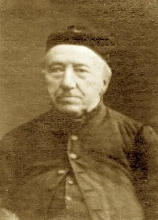
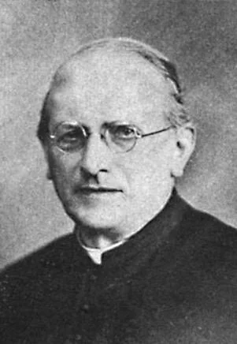
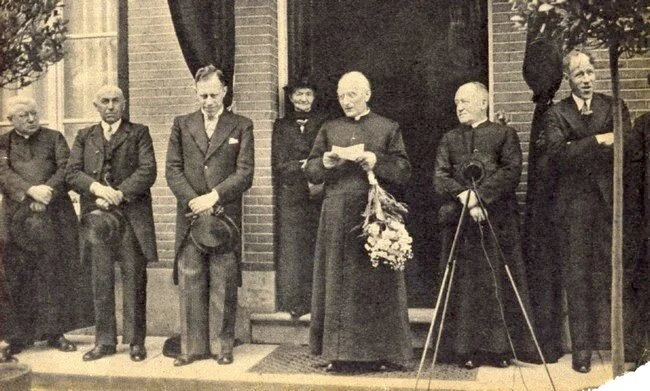
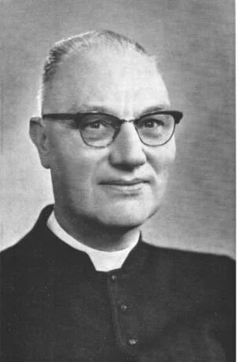
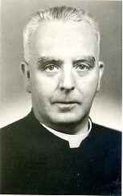
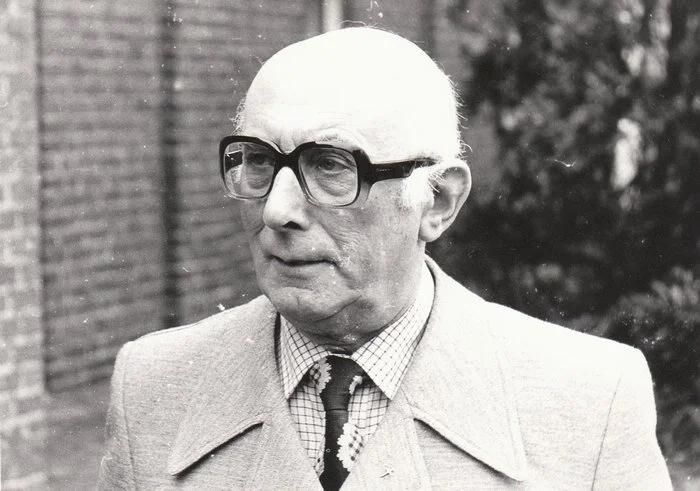

# kerken

> Bron: helenaveenvantoen.nl

De eerste Katholieke kerk

Rector van der Heijden

Pastoor Kerssemakers In Helenaveen bezocht hij regelmatig Café van Oers om te controleren of er geen drankmisbruik was en om de te jonge gasten naar huis te jagen. Één van de markante uitspraken van pastoor Kerssemakers was: Ge kunt de mensen nooit te dom veronderstellen.

Pastoor van Haaren. (coll AV)

Pastoor van Haaren bij het 50 jarig bestaan van de parochie en zijn 25 jarig jubilieum als priester (Coll GD)

Pastoor Strijbosch (Coll AV)

Pastoor Timmers (Coll AV)

Pastoor P. Lips (Coll AV)

## De RK Kerk in Helenaveen

De Rooms-Katholieke gelovigen van het Helena-Veen zijn in de beginfase aangewezen op kerkgang in de omgeving en wel voornamelijk te Meijel. Formeel behoren ze echter bij de nog jonge parochie Liessel, waar sinds 1832 een waterstaatskerk voor de dienst in gebruik is. Maar vanwege de afstand naar zowel Meijel als Liessel komen de mensen op zon- en feestdagen maar slecht naar de kerk. De afstand is veel te ver; ruim een uur lopen op een weg, die ook niet al te best is.

In 1855 neemt men zijn toevlucht tot pater Deerman, broeder van de kluis Koningslust (dit is tegenwoordig Huize Savelberg). Van een officiële benoeming is echter geen sprake.

In 1857 komt er echter een stenen huis vrij door het vertrek van veenbaas Brouwer. Dit huis, met een achterhuis, wordt klaar gemaakt voor vestiging van een pastorie met hulpkerk. Dit alles dankzij de hulp van Jan Deckers, zaakgelastigde van Maatschappij Helenaveen. Zijn zwager is directeur van het groot-seminarie te Haaren en hier woont ook Monseigneur Zwijssen.

Monseigneur Zwijssen besluit Josephus Martinus Nuijts naar het Helena-Veen te sturen. Op 15 oktober 1857 wordt “de kapel” ingezegend en hiermee wordt het Helena-Veen verheven tot rectoraat, toegewijd aan Sint Willibrodus. Rector Nuijts schrijft hierover aan zijn bisschop:

“Tien uren sloeg de klok van het veen, Monseigneur! En alles was herschapen; al de hutten waren opgesierd en uitgedoscht met groen en bloemen evenalsof Willem III zijne intrede zoude doen…… In de kerk werden wij verrast, alles was op het schoonste opgetooid, de chraniums versierden alle wanden, en bewondering en verbazing vervulden alle harten, eene diepe stilte doordrong het kerkgebouw op het oogenblik dat voor den eersten keer het onbloedig offer op dit verlaten oord aan God zoude opgedragen worden.”

Na de feestelijkheden komt de eenzaamheid in volle zwaarte op rector Nuijts af. Twee jaar later, op 7 november 1859, overlijdt rector Nuijts op 45-jarige leeftijd aan een ziekte, die omschreven wordt als “de zenuwe zinkenkoorts”. Jaren later zou er een straat in Helenaveen vernoemd worden naar deze pionier: de Rector Nuijtsstraat.

Rector Nuijts wordt opgevolgd door rector T. van den Eijnde. Na enkele jaren is de noodkerk veel te klein en het plan wordt opgepakt om een nieuwe kerk met een pastorie te bouwen. De voorbereidingen voor de bouw komen al in 1861 op gang, maar dit resulteert als gevolg van de slechte financiële toestand, verkeerde bouwontwerpen en strubbelingen over eigendomsrechten pas in 1876 tot de eerste steenlegging. In een schrijven aan de gemeenteraad van Deurne spreekt het kerkbestuur in Helenaveen over een 'bekrompen' gebouw waarin nu de diensten worden gehouden. Men schat voor het tot stand brengen van de kerk en pastorie een bedrag van ƒ 10.000,- te verstrekken. Het Rooms Katholiek kerkbestuur van Helenaveen richt ook een verzoek om subsidie aan het rijk onder toezending uiteraard van een ontwerp voor de te bouwen kerk en pastorie. De rijksadviseurs voor de monumenten van geschiedenis en kunst zijn echter in hun advies aan de minister hierover nogal negatief. Het ontwerp is naar hun mening zeer gebrekkig. De kerk kent geen priesterkoor en de pastorie mist volgens hun zeggen het karakter dat een woning moet hebben “voor een herder van een dergelijke gemeente'”. Omstreeks 1875 wordt er een nieuw plan opgesteld, waarin een kerk wordt aanbevolen, die voor uitbreiding vatbaar is. Uiteindelijk neemt rector Bijnen op 30 september 1882 de nieuwe kerk officieel in gebruik en betrekt de nieuwe pastorie.

Rector Bijnen uit in 1883 de wens om zusters naar het Helena-Veen te laten komen voor het onderwijs aan de kinderen en voor het opzetten van een naaischool. Onder andere door een gift van Jacobus Raaymakers uit Helmond wordt er een klooster gebouwd (op deze plaats staat tegenwoordig de Rooms Katholieke Kerk). Op 31 Juli 1883 wordt door rector Bijnen de eerste steen gelegd voor het Zusterklooster, datin 1884 door 5 zusters van de Orde van de Heilige Ignatius de Loyola betrokken wordt.

Op 28 mei 1884 wordt een Broederschap ter Ere van de Heilige Donatus opgericht. Oorspronkelijk aangeroepen voor het behoeden van mens en gewas voor extreme bliksem, droogte, regen en wind, wordt Donatus tegenwoordig voor de veiligheid in het verkeer om hulp gebeden. Jaarlijks vindt een auto-inzegening plaats. De viering van de H. Donatus vindt nog steeds jaarlijks plaats op de tweede en derde zondag van juli.

Op 16 oktober 1890 schrijft rector Bijnen een brief aan zijn bisschop, waarin hij de bisschop vraagt te overwegen om Helenaveen tot zelfstandige parochie te verheffen. Al jarenlang werkt het rectoraat zelfstandig. De financiën zijn redelijk en de grote afstand naar de officiële parochiekerk te Liessel vindt men geen aanvaardbare basis, mede vooral nu ook de eigen kerk inmiddels al weer enige jaren in gebruik is genomen. Ook ten opzichte van de protestantse gemeente wil men voor volwassen worden aangezien.

De officiële status wordt verkregen en met ingang van 1 maart 1891 wordt het rectoraat van Liessel door de bisschop tot parochie Helenaveen verheven. Op diezelfde dag wordt rector Bijnen tot pastoor van de nieuwe Willibrordus-parochie benoemd.

Op 20 november 1944 worden de Rooms-Katholieke kerk, de pastorie en het klooster door Duitse soldaten verwoest.

De zusters wijken tijdelijk uit naar Rijkswerkkamp 1 in Mariaveen. Nadat de voormalige woning van de hoofdonderwijzer, meester Theelen, verbouwd en uitgebreid is tot klooster, trekken de zusters op 9 oktober 1946 naar hun nieuwe onderkomen. Er wordt een noodkerk ingericht in de openbare lagere school.

In 1948 wordt pastoor Timmers geïnstalleerd als pastoor en hij begint met de voorbereidingen voor de bouw van een nieuwe kerk. Na afloop van een H. Mis in het noodkerkje, dat in de oude school is gevestigd, trekt pastoor Timmers op zondag 12 november 1950 naar de in aanbouw zijnde kerk van Helenaveen. Daar leest hij een oorkonde voor, welke vervolgens achter een gedenksteen in de nieuwe kerk gemetseld wordt. In de oorkonde, die ondertekend is door de pastoor, kerkbestuur, gemeentebestuur, aannemer en architect, is geschreven: "Deze kerk is op 12 november 1950 gesticht. De architectuur berust bij architect de heer Jos Deltrap. De bouw is opgedragen aan de heer Jos Coppelmans met zijn werklieden. De machtiging tot het stichten van de kerk werd door mgr. Mutsaerts gegeven op 15 oktober j.l.".

Op 1 oktober 1951 vindt de plechtige consecratie plaats van de nieuwe kerk door de bisschop van Den Bosch, Mgr. Mutsaerts, geassisteerd door pastoor Timmers. De pastoor verhuist met zus Anneke vanuit de noodpastorie een deur verder naar zijn nieuwe onderkomen.

In mei 1966 wordt voor de eerste keer een oecumenische kerkdienst gehouden in Helenaveen voor zowel de Protestanten als de Rooms-Katholieken. Pastoor Lips en dominee Duvekot uit Deurne leiden gezamenlijk deze zang- en gebedsdienst.

In 1986 wordt het klooster definitief gesloten en vertrekken de laatste zusters uit Helenaveen.

Op 18 augustus 2001 is de zelfstandige St. Willibrordusparochie van Helenaveen samengegaan met de parochies van Neerkant en Liessel.

De Rooms-Katholieke pastoors in Helenaveen zijn achtereenvolgens:

Josephus Martinus Nuijts, geboren te Bergeijk in 1814. Rector in Helenaveen van 15 oktober 1857 tot aan zijn dood op 7 november 1859. Hij is begraven op het Rooms Katholiek kerkhof in Helenaveen.

Theodorus Ludovicus van den Eijnde, geboren te Gemert in 1823. Rector van 23 november 1859 tot 23 september 1873. Daarna is hij benoemd tot pastoor van Bergeijk.

Franciscus Cornelus van der Heijden, geboren te Waalwijk in 1829. Rector van 23 september 1873 tot 22 juli 1878. Daarna is hij benoemd tot pastoor van Macharen.

Petrus van Beek, geboren te Klundert in 1834. Rector van 22 juli 1878 tot 17 november 1880. Daarna is hij benoemd tot pastoor van Gemert.

Wilhelmus Caspar Aloysius Bijnen, geboren op 10 juni 1838 te Helmond. Rector van 17 november 1880 tot 1 maart 1891. Dan wordt het rectoraat verheven tot een zelfstandige parochie en wordt hij pastoor van de St. Willibrordusparochie van 1 maart 1891 tot aan zijn dood op 30 juli 1896. Hij is begraven op het Rooms Katholiek kerkhof in Helenaveen.

Waltherus Dominicus Kerssemakers, geboren in Gestel en Blaarthem in 1852. Pastoor van 13 augustus 1896 tot aan zijn dood op 30 maart 1917. Hij is begraven op het Rooms-Katholiek kerkhof in Helenaveen.

Augustininus Cornelus Johannes van Haaren, geboren te Hooge Mierde in 1868. Pastoor van 30 maart 1917 tot zijn eervol ontslag op 1 januari 1946. Op 20 februari 1947 overlijdt pastoor Van Haaren en hij wordt begraven op het Rooms-Katholiek kerkhof in Helenaveen.

Petrus Johannes Wilhelmus Maria Strijbosch, geboren te Bladel in 1900, pastoor van 15 januari 1946 tot 13 februari 1948. Daarna is hij benoemd tot pastoor van Nijmegen.

Albertus Timmers, geboren in Uden in 1900. Pastoor van 20 februari 1948 tot aan zijn dood op 25 juli 1965. Begraven op het Rooms-Katholiek kerkhof in Helenaveen.

Petrus Johannes Gerardus Lips, geboren in Breda. Pastoor van september 1965 tot 1 juli 1984. Daarna gaat hij met emeritaat naar Hapert. Hij is de laatste pastoor, die in Helenaveen woonachtig is geweest.

## De Nederlands hervormde kerk in Helenaveen

Bij de komst van de vele veenarbeiders, vooral uit Drenthe, ontstaat behoefte aan geestelijke verzorging voor deze nieuwkomers. Voor een deel zijn deze arbeiders van Protestantse huize. De Protestanten die in deze streek komen wonen en werken behoren aanvankelijk tot de Hervormde Gemeente te Deurne. Op 13 juli 1856 preekt Dominee J. Breunissen Troost voor het eerst in het Helena-Veen. En het zou bij die ene keer blijven. Veenbaas J. Brouwer, in wiens huis hij preekt, maakt achteraf bezwaar de predikant verder nog te ontvangen. Spoedig daarna vertrekt Brouwer en een aantal van zijn medebroeders weer naar Overijssel. De predikant vermoedt dat "de volgens hem ongegronde vrees voor overlast van de R.K. bevolking" hiervan de reden zou zijn geweest. Het achterhuis van het huis wordt na het vertrek van Brouwer "tot eene R.K. kerk ingerigt en zijne woning door eenen geestelijke van die belijdenis betrokken, die sedert op den duur onder de R.K. bevolking der kolonie werkzaam blijft".

In 1857 ligt het kerkelijk werk in het Helena-Veen helemaal stil. Enkele arbeiders gaan in Deurne naar de kerk. In het daaropvolgende jaar begint dominee Breunissen Troost met zijn catechisatieles. Tijdens één van deze lessen brengt één van de arbeiders een boodschap over van de directie van Maatschappij Helenaveen met het verzoek of de predikant zijn "prediking in het Helena-Veen wilde hervatten, daarbij voegende dat de directie hem tegenmoet zou komen in de vergoeding zijner reiskosten". In het Helena-Veen wonen op dat moment 14 Protestanten , waarvan 7 lidmaten.

Op 29 januari 1860 neemt dominee Machiel Bernardus Pitlo de taak van dominee Breunissen Troost over. In de zomers van 1860 en 1861 is het aantal Protestanten vrij groot. Sommige Protestanten wonen vast in het Helena-Veen, maar velen zijn tijdelijk werkzaam in de Peel. Ook worden de godsdienstoefeningen bijgewoond door schippers, die met hun turfschepen in het kanaal liggen. Onder de Protestanten die in 1860 tijdelijk, gedurende 3 maanden in het Helena-Veen zijn, bevinden zich 65 Duitsers, meestal van Ladbergen in Westphalen. Op 15 augustus 1861 zijn er 56 Protestanten, 36 met vast verblijf en 20 tijdelijk, meestal "allen van de Dedemsvaart". Aldus dominee Pitlo in een verslag. Ook vindt er voor het eerst een doop plaats. Dominee Pitlo deelt in de kerkeraadsvergadering van 9 december 1860 mee, dat "in het Helena-veen onlangs Lammerghie Alarm bevallen is van twee kinderen. Van verschillende kanten is hem verzocht geworden om naar het Helena-veen over te komen om aldaar die kinderen te doopen. Hij wilde dat echter niet doen zonder daarover de kerkeraad gehoord te hebben. De gemeente van het Helena-veen verkeert in eene geheel exceptionele toestand. Zij ligt drie uren van de kerk van Deurne. In dit gure jaargetijde zou het met de kinderen op eene open kar naar de kerk van Deurne doodelijk voor die kinderen kunnen zijn". In het doopboek wordt vervolgens de volgende aantekening gemaakt: "Den 16 den december zijn in tegenwoordigheid van den Ouderling L.H. Baas, in het voor godsdienstoefening bestemd gebouw in het Helena-Veen gedoopt Albertus, zoon en Siena, dochter van Lammechie Alarm, genoemde kinderen zijn geboren in het Helena-Veen den 3 den November 1860". Helaas overlijden de beide kinderen binnen 2 weken. Ook in Helenaveen heerst er een grote kindersterfte.

De eerste keer dat er in de nog aanwezige archiefstukken van de Hervormde Gemeente te Deurne wordt gesproken van een kerkgebouw in Helenaveen is in de kerkeraads-vergadering van 5 mei 1861, waarin besloten wordt opbrengsten van "drie godsdienstige toespraken gehouden in het Helena-Veen" te deponeren in het Kerkefonds, met als doel "als eene eerste bijdrage tot den bouw van een Protestants kerkgebouw in het Helena-Veen". Het schoolvertrek is namelijk te klein en "de plaats in een boekweit-magazijn, die in sommige tijden van het jaar kan worden afgestaan, is donker en laag van verdieping en heeft bovendien een te onwaardig voorkomen, in vergelijking met het kerkgebouw der Roomsch-Katholieke medeburgers".

In mei 1862 sturen de gemeenteleden een verzoekschrift naar de kerkeraad van Deurne voor een eigen (hulp)predikant. Dit verzoekschrift heeft als kern: "het groot aantal Protestanten maakt het noodzakelijk dat er andere maatregelen genomen worden om te voorzien in onze geestelijke behoeften. Vele zaken moeten wij missen die de Protestanten genieten, die een Godsdienstleeraar in hunne nabijheid hebben". Het verzoekschrift leidt uiteindelijk tot de bevestiging van hulpprediker Johannes Christian Carel Abbing in het Helena-Veen op 8 mei 1864.

Nog voor de bevestiging van de hulpprediker J. Abbing bezoeken een aantal heren uit ’s-Hertogenbosch, vergezeld van dominee A. Rutgers van der Loeff uit Leiden het Helena-Veen. Ze zijn onder de indruk van zowel het "grootsche werk der landontginning" als "door wat ze van hunne protestantsche geloofsgenoten hoorden en zagen". Ze stellen de kerkeraad van Deurne voor om een kerkgebouw te stichten en "eene voegzame woning voor den Hulpprediker in het Helena-Veen de hand te bieden" met medewerking van de Protestanten in Nederland. De kerkeraad besluit op 26 april 1864 "het aanbod dier Heren dankbaar aan te nemen".

Op 1 januari 1868 neemt J. Abbing afscheid als hulpprediker en vertrekt naar Heeze. Tot zijn opvolger wordt benoemd Edelhardus Bernardus Swalue, die op 5 januari als de eerste zelfstandige predikant wordt bevestigd.

De commissie onder leiding van dominee A. Rutgers van der Loeff verzamelt ondertussen ruim fl 10.000,- bijeen uit geheel Nederland voor een kerkgebouw. De bouw kan beginnen. Op 3 november 1867 wordt de kerk feestelijk in gebruik genomen, waarbij dominee Rutgers van der Loeff een predikatie houdt over de tekst Hebr. 6:7 "Want de aarde die den regen menigmaal op haar komende, indrinkt, en bekwaam kruid voortbrengt voor degenen door welke zij ook gebouwd wordt, die ontvangt zegen van God". In zijn preek legt hij verband "tusschen godsdienst en landontginning".

In 1868 wordt er bij het kerkgebouw de pastorie en een verenigingsgebouw gebouwd.

Op 29 maart 1870 wordt uiteindelijk de zelfstandige kerkgemeente Helenaveen gesticht; de eerste nieuwe protestantse kerkgemeente in Noord-Brabant sedert het sluiten van de Vrede van Munster in 1648! De Hervormde gemeente van het Helena-Veen telt op dit moment 23 lidmaten, ook wel belijdende leden genoemd.

Op 5 juni 1883 overlijdt dominee Swalue op 44-jarige leeftijd aan een dubbele longontsteking en hij laat een vrouw met 6 jonge kinderen na.

## De gereformeerde kerk In Helenaveen

In 1892 maken 4 gezinnen en enkele personen zich los van de Hervormde Gemeente en met steun van de gereformeerde classis wordt de Gereformeerde kerk in Helenaveen gesticht. Deze gemeenteleden achten "de weg van doleantie" onvermijdelijk. Ze vinden de Staatssynodale organisatie van 1816 en 1852 onwettig. Zo ontstaat er een derde kerkgemeenschap in Helenaveen!

De Gereformeerde gemeenschap heeft nooit een eigen kerkgebouw en een eigen predikant gehad. Maar vanaf 31 januari 1892 is het wel een zelfstandige gemeenschap met een eigen kerkeraad. Tot praeses (=voorzitter) wordt benoemd G. Buis en tot scriba (= secretaris) F. Blankenstijn. Ten huize van de familie Buijs in de Geldersestraat worden de godsdienstoefeningen gehouden; ’s morgens om 10.00 uur en ’s avonds om 18.00 uur. Af en toe komt er een dominee van elders naar het Helena-Veen (per trein en/of fiets) om kinderen te dopen of het avondmaal te vieren, wat alleen kan als er een dominee is. De eigendommen van de kerk bestaan uit een doopvont, een avondmaalstel, een collectezak, een lessenaar en twaalf stoelen! Enkele jaren later kerkt men bij de familie Kappe in Griendtsveen. Omdat het haast niet te doen was, twee keer 1,5 uur te lopen, wordt in de loop der jaren de tweede kerkdienst afgeschaft. Doordat de familie Kappe gaat verhuizen, wordt er weer teruggegaan naar de familie Buis aan de Geldersestraat in Helenaveen. Vanaf november 1926 is Gereformeerd Helenaveen een wijkgemeente van de Gereformeerde kerk van Helmond.

In de notulen van de Gereformeerde Kerk van Helmond van 24 november 1931 wordt de mogelijkheid besproken, om iedere zondag in Helenaveen een preek te lezen. De heer G.B, Praasterink, ouderling van de Gereformeerde Kerk in Helmond, zal zich hiermee gaan belasten. Aldus geschiedt. De predikant van Gereformeerd Helmond gaat één keer per maand voor en op de andere zondagen zijn het de "preeklezers", onder wie vaak de heer Praasterink. Het betekende voor deze voorgangers wel elke zondag op de fiets (door weer en wind) van Helmond naar Helenaveen en de wegen waren destijds niet zo goed begaanbaar als nu!

In de kerkeraadsvergadering van 6 oktober 1941 wordt besloten om bij de eerstkomende lichte maan een ledenvergadering van de groep Helenaveen te houden. Dan zal daar besproken worden om voor Helenaveen een ouderling te benoemen, zo mogelijk de heer Hoogendoorn. Tot 5 september 1954 is C. Hoogendoorn ouderling geweest. Op die datum wordt hij opgevolgd door zijn zoon Jac. Hoogendoorn. In 1943 kerkt men in de huiskamer van de familie Hoogendoorn in de voormalige jeugdherberg aan de Geldersestraat, die na het afbranden van hun boerderij daar mochten wonen. Na een tussenperiode van weer enkele jaren op de Geldersestraat 3 bij de familie Ulens, zijn de huiskamerdiensten in de jeugdherberg gehouden tot zondag 9 november 1969.

Op 11 juli 1963 wordt er tijdens een kerkeraadsvergadering de vraag gesteld of er nog sprake is van een kerkdienst als Jac. Hoogendoorn in Helenaveen een preek leest en er verder geen ambtsdrager aanwezig is. Men kan in de kerkenorde geen antwoord vinden en er wordt daarop op 27 september 1963 besloten er geen probleem van te maken. Hoogendoorn is ouderling en vertegenwoordigt dus de kerkeraad! Voorwaarde is wel, dat de preken moeten zijn van een Gereformeerde predikant. Later komt P. Hoogenboom als diaken erbij en was het helemaal geen probleem meer.

Lees hier meer over de geschiedenis van de Gereformeerde Kerk in Helenaveen

Samen op weg

Vanaf 1963 wordt er gepraat over samenwerking tussen Gereformeerden en Hervormden. Kerkeraadsvergaderingen worden gezamelijk georganiseerd. Na bijna 100 jaar zelfstandigheid ontstond er behoefte aan meer samengaan met vooral kerkelijke gemeenten in Deurne en Helmond. Vanaf 1965 is er een Samen-op-Weg beweging gaande en met succes. In het afgelegen Helenaveen verloopt de samenwerking veel sneller dan in Helmond. Vanaf 16 november 1969 worden alle diensten in Helenaveen gemeenschappelijk en wordt de Nederlands Hervormde kerk in Helenaveen ook de thuiskerk voor de Gereformeerden. Hierdoor is op 9 november 1969 ook een einde gekomen aan de huiskamerdiensten in de voormalige jeugdherberg. De Hervormd-Gereformeerde gemeente van Helenaveen is een feit.

Vanaf het vertrek van dominee Alsfelt naar Valkenswaard in 1947 is Hervormd Helenaveen een bijstand in het pastoraat van Deurne. Dominee Quéré en dominee Christoffels zijn de laatste eigen predikanten van Helenaveen geweest. Zij kwamen als emerituspredikant in Helenaveen. Dat betekende ook, dat de volledige financiële lasten niet meer voor rekening van de Helenaveense gemeente kwamen. Helenaveen heeft nog steeds haar eigen kerkeraad en dus ook haar eigen beslissingsbevoegdheid. Maar de predikant van Deurne verzorgt vanaf het vertrek van dominee Christoffels op 10 juni 1965 de geestelijke verzorging van Hervormd Helenaveen en de Gereformeerde predikant van Helmond de geestelijke verzorging van Gereformeerd Helenaveen.

Het kerkgebouw in Helenaveen wordt in de jaren 1969 en 1975 gerestaureerd. Ter gelegenheid van de 100ste sterfdag van dominee Swalue wordt op 5 juni 1983 de naam van de dominee blijvend verbonden aan de kerk door de plaatsing van zijn grafsteen in de voorgevel. Ook in het dorp leeft zijn naam voort in een straatnaam in de dorpskern (Dominee Swaluestraat).

De voorgangers zijn geweest:

1853-1859 vanuit Deurne Dominee J. Breunissen Troost

1860-1863 vanuit Deurne Dominee M.B. Pitlo

1864-1868 De heer J.C.C. Abbing (eerste eigen hulppredikant)

1868-1870 Dominee E.B. Swalue

Op 29 maart 1870 wordt Hervormd Helenaveen een zelfstandige kerkgemeente.

1870-1883 Dominee E.B. Swalue

1884-1887 Dominee Lagerweij

1888-1892 De heer J. Den Burger (godsdienstonderwijzer)

1892-1905 De heer Schalenkamp (godsdienstonderwijzer)

1906-1911 Dominee Broer de Jong

1911-1918 Dominee P. de Jagher

1919-1921 Dominee J. Pelinck ter Hazeborg

1921-1927 Dominee T.G. Meester

1928-1930 Dominee W.A. van Bruggen

1932-1940 Dominee W.E. van de Berg

1941-1943 Dominee D. Schakel

1943-1947 Dominee J.A. Alsfelt

1948-1954 Dominee H.K. Quéré

1955-1965 Dominee A.C. Christoffels

Oprichting van de Samen-op-weg Gemeente. Vanaf dit moment zijn de dominees niet meer woonachtig in Helenaveen.
