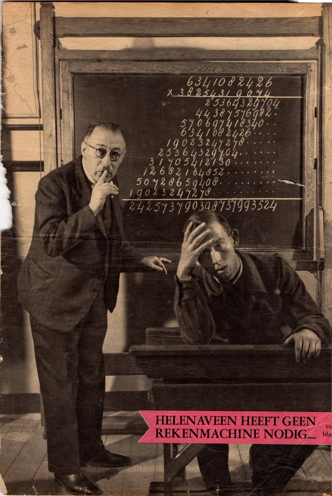
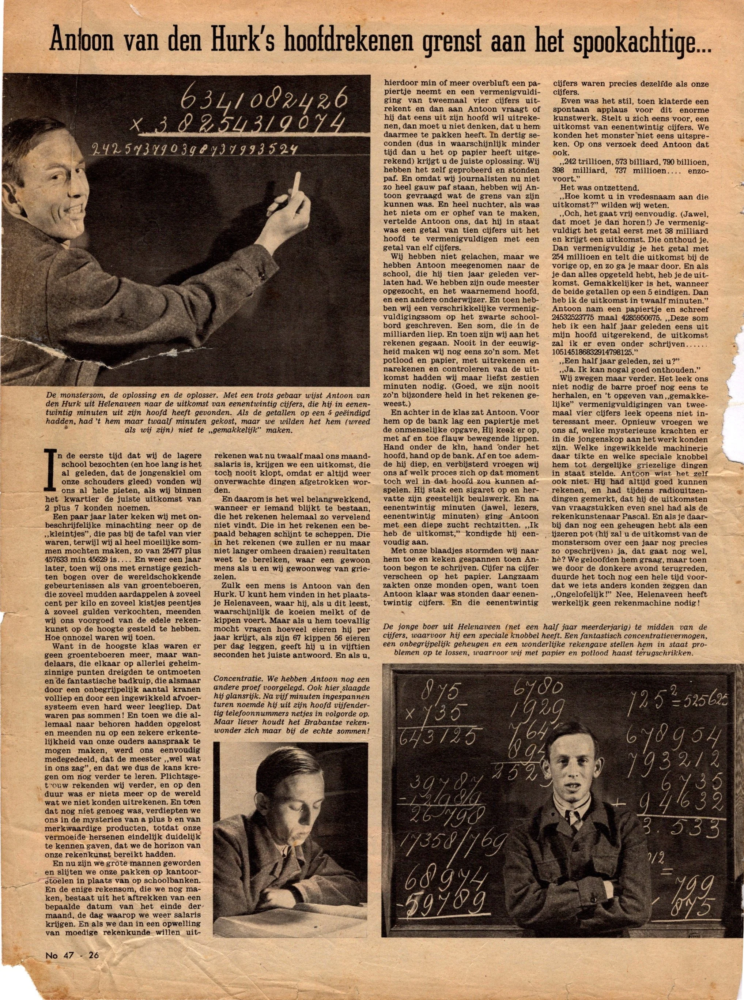
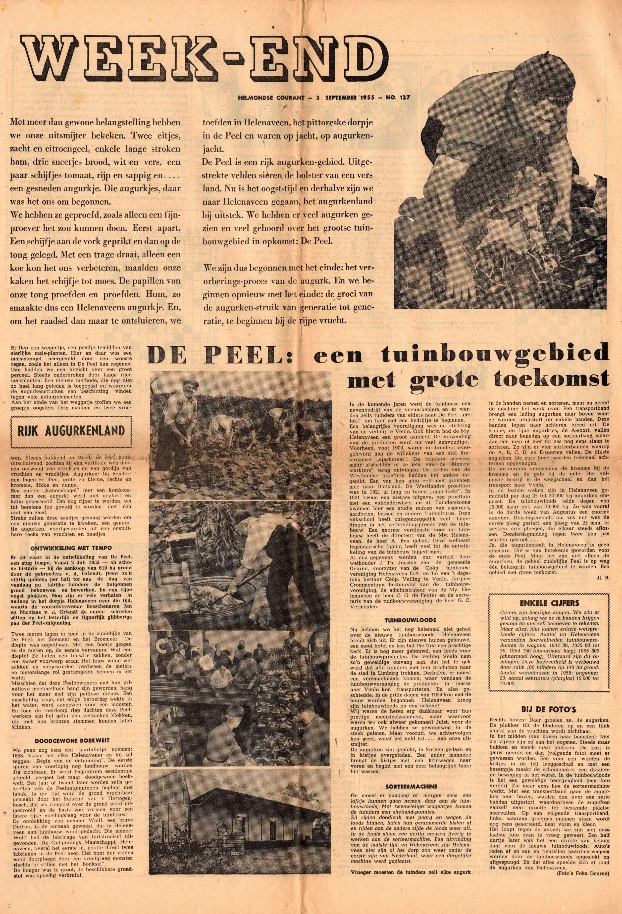
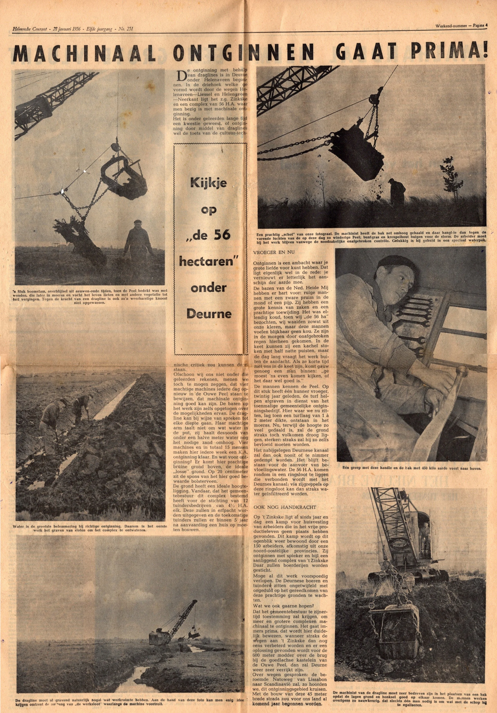

# krantenartikelen

> Bron: helenaveenvantoen.nl

### Krantenartikelen

Een tijdschriftartikel uit het begin van de 1950-er jaren. De bron is waarschijnlijk De Katholieke Illustratie of Panorama.Het knipsel komt uit de verzameling van Martien Rutten (1932-2022).

Rekenwonder Antoon van den Hurk

Wie kent de precieze bron en datum van het artikel?

2 krantenartikelen uit de verzameling van Grada Maessen-van Teeffelen (1917-2013). Met dank aan Gerard Maessen.

Helmondse Courant - 3 september 1955

Helmondse Courant - 28 januari 1956
