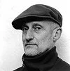

# kunst-in-de-peel

> Bron: helenaveenvantoen.nl

### Kunst(enaars) in Helenaveen

Lukas Smits

Lukas Smits woonde in de zestiger jaren op Soemeersingel…OpleidingAcademie voor kunst en vormgeving Den BoschJan van Eyck academie Maastricht.

Exposeerde in binnen- en buitenland, o.a. in:Van Abbemuseum, EindhovenLa Passerelle des Arts, BordeauxCentre Culturel ToulouseVerwierf tweemaal de Koninklijke prijs voor schilderkunst en een reisbeurs van de Franse regering.Voerde diverse opdrachten uit in openbare gebouwen oa mosaiek op het hoofdgebouw van de CVV in Grubbenvorst

Jan van de Waterlaat

Jan van de Waterlaat (Helmond, 15 mei 1939 - Deurne, 1 maart 1995) was een Nederlands beeldend kunstenaar.

Van de Waterlaat was autodidact als kunstenaar. Vanaf zijn jeugd maakte hij pentekeningen, schilderijen en beeldhouwwerken. Hij was wars van conventies en ijverde er niet voor door te breken in de kunstwereld. Desondanks exposeerde hij in de jaren 60 en 70 in binnen- en buitenland. In zijn eigen regio - hij woonde sinds de jaren 60 in Helenaveen - exposeerde hij geregeld in De Wieger en het Gemeentemuseum Helmond.

Tussen 1960 en 1978 maakte Van de Waterlaat voornamelijk marmeren en hardstenen beelden. In de laatste 15 jaar produceerde hij voornamelijk beeldhouwwerken in het platte vlak.

Jules de Corte

Dirk Verberne

Thijs van de Manakker

Fanfare Wilona

Monument Kanaal

Monument park

Buste Juliana

Jager met zwijn
