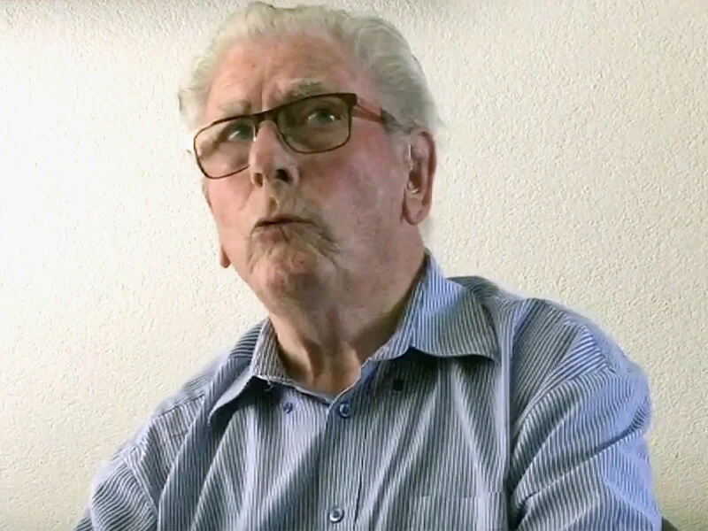

# martien-rutten

> Bron: helenaveenvantoen.nl

# Martien Rutten

## Martien Rutten

Martiens ouders hadden een kleine tuinderij, die lag vlak vóór de Wilhelminahoeve. Zijn vader is daar gaan tuinen, nadat hij eerst werkzaam was als voerman en toger bij de Maatschappij Helenaveen. In de tuinderij teelden zij bonen, augurken en erwten. Bij hem thuis waren 4 kinderen: Piet (geboren in 1922), Bert (van 1925), Andries (van 1928) en Martien, geboren in 1932.

In de buurt werden later in de oorlog Duitse soldaten ondergebracht bij de familie Wullms op de Wilhelminahoeve en bij Van der Kroon op de Julianahoeve. De kinderen konden toen al niet meer naar school en ze waren vaak bij de Duitsers: die hadden bijvoorbeeld ‘goei boter’. “Bij Wullms waren ze daar allemaal minder blij mee. Die hadden grote kinderen. Vader Wullms hield dat allemaal goed in de gaten, met name de dochters.”

Martien herinnert zich de geallieerde vliegtuigen die werden neergehaald door de Duitsers, met name het vliegtuig dat achter het Wehrmachthuisje terecht kwam. “De Duitsers renden alle kanten op, ze dachten dat het vliegtuig op het huis zou vallen.” Bij een Engelse jager vond hij een pistool. “Dat heb ik tegenover de Wilhelminahoeve in de kanaal gegooid. Ik durfde het niet mee naar huis te nemen.” Toen hij samen met een zoon van Wullms een achterwiel van het vliegtuig wilde gaan halen, was Roel Vermeulen ze te slim af. Hij had het wiel net wat eerder te pakken. Bij gesneuvelde Duitsers werd ook wel eens wat kleding of laarzen buit gemaakt. “Dat ging dan onder het mom van: die heeft hij toch niet meer nodig.”

### Evacuatie

Héél het gebied tussen Deurnes Kanaal en Helenavaart werd ontruimd en ze moesten naar het eerste kamp in Mariaveen. Daar hebben ze twee tot drie weken gezeten. Bij hen in het kamp zaten de gezinnen van Toon Arts, Toon van Woezik en Jan Janssen. Die kampen werden gebouwd om het Mariaveen te ontginnen. De kampen zouden later boerderijen worden en er zouden ook tuinderijen komen.Van die kampen waren er drie, telkens bestaande uit twee gebouwen. In het kamp werden bonen in de buurt geplukt, er werd een varken geslacht en zelfs een koe, van Van der Kroon. Ander eten, voornamelijk brood, werd vaak gehaald op de Zwarte Plak, waar het vanuit het dorp America gebracht werd.

### Razzia

“Mijn broers zijn alle drie meegenomen. Onze Andries was net 16, hij had juist een persoonsbewijs. Toen de Duitsers zijn ‘Ausweis’ vroegen liep hij direct naar ons moeder om het te vragen.” Andries is in Duitsland achtergebleven, Bert heeft het maar ternauwernood overleefd. Hij is uiteindelijk via Frankrijk terug naar huis gekomen.

### Evacuatie

De familie Rutten moest evacueren naar Sevenum, waar ze ’s avond in het donker aankwamen. Ze hebben een nacht op stro in het gemeentehuis geslapen en werden daarna ondergebracht “bij Han en Nel Maessen, op de Grubbenvorsterweg”. “Als de Duitsers binnenkwamen moest mijn vader daar op de vliering kruipen. Ik had een biljartkeu meegenomen uit het gemeenschapshuis, die werd afgezaagd en er kwam een touwtje doorheen. Mijn vader gebruikte die bij het lopen om véél ouder te lijken.” De rest van de oorlog zijn ze op die plaats gebleven.

Toen de Duitsers gingen terugtrekken hebben ze op Steinhage nog een betonnen brug laten springen. Dat werd voor velen een obstakel, omdat er veel schotelmijnen waren gelegd door de Duitsers. Martien herinnert zich: “Er kwam een Duitser met een mest-kruiwagen vol met geweren. Bij die brug wist hij het niet meer en kieperde het hele zootje in de beek en ging op Grubbenvorst aan.” Net vóór de bevrijding lieten de Duitsers de toren van de kerk van Sevenum springen. Er werd voortdurend zwaar geschoten. “De granaten vielen vóór mij op de weg, zulke gaten en ik moest er tussendoor.”

### Terug naar huis

De familie werd door een neef met paard en wagen thuisgebracht, dwars door de Peel, langs het kamp, tot aan de kapotte brug bij Crommentuijn. “Toen wij thuis kwamen… dat kun je je niet voorstellen. De varkenskooi lag vol met kapot gegooide inmaakglazen. Alles was kapot gegooid, gewoon vernielzucht.” Een bijzonder feit: het Wehrmachthuisje uit de oorlog werd hun woning. Martien en zijn vrouw hebben daar 37 jaar gewoond.
