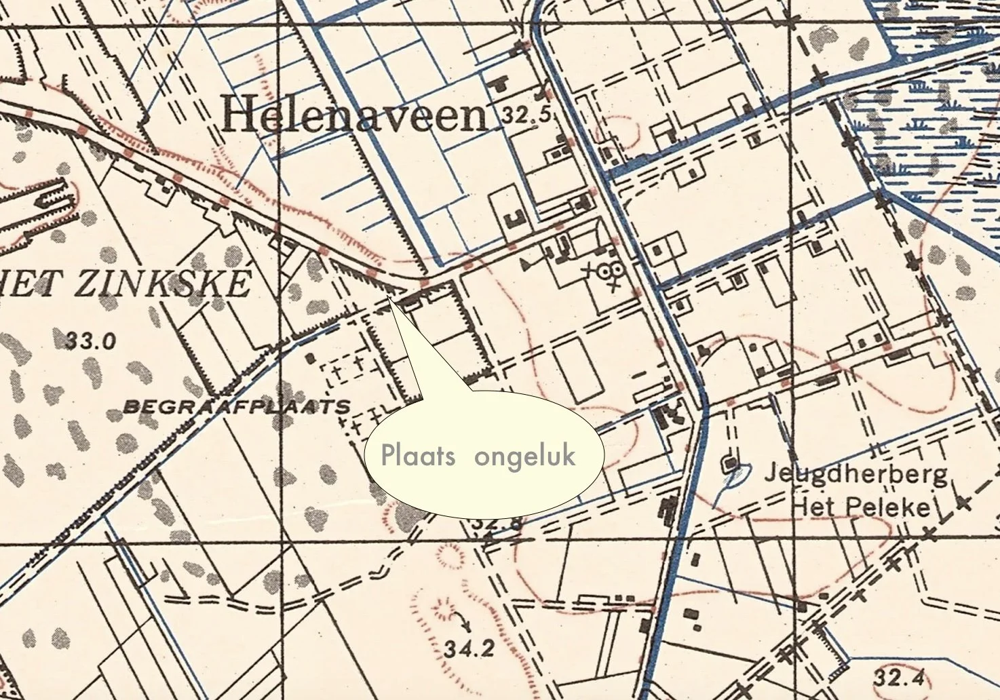
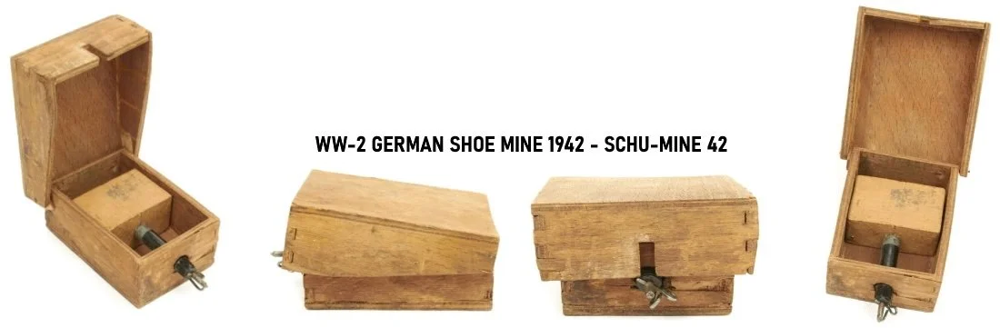
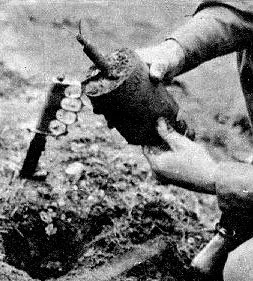
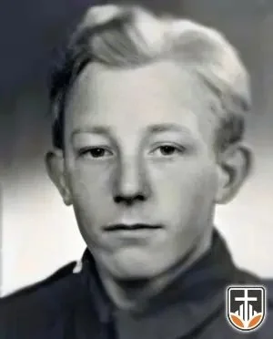
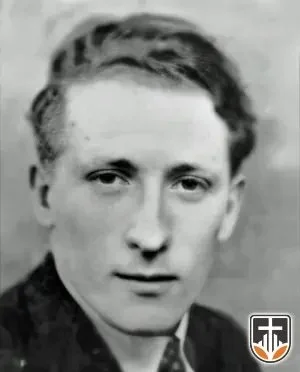
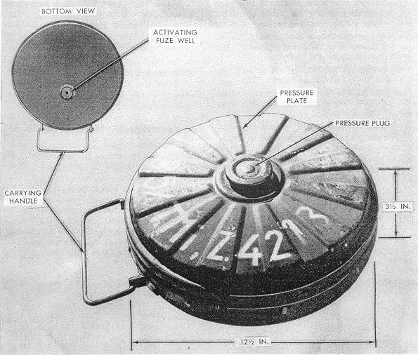
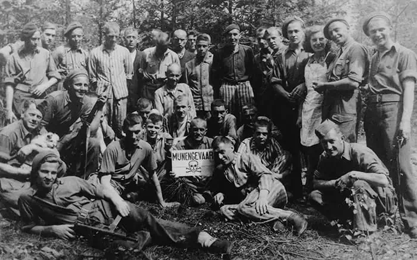

# mijnenruimen-aan-de-lagebrugweg

> Bron: helenaveenvantoen.nl

### Twee doden bij het opruimen van mijnen aan de Lagebrugweg.

Na de oorlog ligt het bezaaid met mijnen en ander oorlogstuig. Met munitie, granaten en dergelijke weten de meeste mensen wel raad. Veel wordt gewoon in het kanaal en in de wijken gegooid. De mijnen is natuurlijk een ander verhaal, die kun je niet zo maar oppakken en in “de knaal” kieperen. Daar komen specialisten aan te pas die opgeleid zijn in het opruimen van mijnen.Op 19 mei 1945 zijn die mijnenruimers aan het werk in Helenaveen op het punt waar de Lagebrugweg en de Oude Peelstraat bij elkaar komen. In de hoek van de twee straten ligt een grote kuil.

De Duitsers verwachtten dat de aanvallers dekking zouden zoeken in die kuil die ze daarom vol Shu-mijnen gelegd hadden. Dat zijn houten kistjes met springstof en ijzerscherven erin.

In de berm van de Lagebrugweg liggen ook mijnen die door Frans van den Eijnden uit Liessel en korporaal Meindert Postma uit Drachten in Friesland, geruimd zullen worden.

Frans heeft verkering met een meisje uit Meijel en ze staan op het punt te trouwen. Ofschoon hen is ingeprent altijd voor de volle 100% bij het werk te zijn, laten ze elkaar foto’s zien en waren hierdoor afgeleid. Een van hen heeft waarschijnlijk een Spring-mijn met zijn prikker aangeraakt waarop die afgegaan is. Zo’n mijn komt uit de grond tot ongeveer borsthoogte en explodeert dan.

Spring mijn

Frans en Postma worden volledig onthoofd. Iemand haalt de pastoor (Van Haaren?) erbij die Frans van den Eijnden de laatste sacramenten toedient. Hij weigert dit ook te doen bij Postma, omdat die niet katholiek is.

Omdat Meindert Postma loog over zijn leeftijd was hij pas 17 jaar toen hij, na zijn verdwijning met Lute, in Breda in dienst trad bij het Canadese leger, bij het 1st Dutch Bomb Disposal Company

Frans van den Eijnden, een burger mijnenruimer uit Liessel die een spoedcursus had gevolgd in het onschadelijk maken van mijnen, Hij was 27 toen hij verongelukte.

Tot ver na de oorlog was het kinderen van de Lagebrugweg door hun ouders verboden om in het “boske” tussen de Lagebrugweg en de Oude Peelstraat te spelen. Dat was te gevaarlijk omdat er oorlogstuig kon liggen. Bij de aanleg van het fietspad naar het voetbalveld werd inderdaad nog een granaat gevonden.

Uit de leg- en ruimrapporten in het EODD-archief blijkt dat de mijnen op 2l november 1944 gelegd zijn door het Regt.Pi.Zug van Duitse Regiment Hübner, en wel op vier plaatsen. Op de bewuste locatie zijn achter de splitsing volgens het legrapport 69 S-Minen in Streueinsatz gelegd en 3 R-Minen (Riegelminen) op de weg naar Neerkant.

Men heeft op de bewuste locatie 2 R-Minen, 48 Schu-Minen en 2 T-Minen 35 (Tellerminen, model 35) geruimd.

Teller Mine 35

Verder wordt in het rapport in gebrekkig Engels het volgende vermeld:

1 Ri.M blown up by others.1 S.Mine killed a corporal and a civilian.At least 6 British soldiers and 2 civilians got an accident.About 10 Shumines are threwn off with stones by the farmers.The rest is cleared by a Dutch policeman in winter ’44.

Er is op 25 oktober 1945 door Duitse krijgsgevangenen van l./PiBtl.346 onder Nederlandse bewaking van II-8 R.I een nacontrole uitgevoerd. Er is toen niets meer aangetroffen.

Mijnenruimers met vrijwilligers uit kamp Vught met hun gevangeniskleding nog aan.

Bovenstaand verhaal is een bewerking van de gegevens op de site van Richard Schoutissen.De foto’s komen eveneens van https://www.oorlogsslachtoffers.nlOorlog over Neerkant 1939-1945, geschreven door Tjeu Sonnemans is een bron waaruit Richard op zijn beurt putte.

jvw okt 2024
