# monumenten-en-kunst

> Bron: helenaveenvantoen.nl

### Kunstwerken en gedenktekens in Helenaveen.

Helenaveen kent een groot aantal monumenten en kunstwerken. Hieronder is de geschiedenis daarvan uitgezocht.Waarom zijn ze geplaatst en wie is de maker?

### 1 Jules de Corte carillon

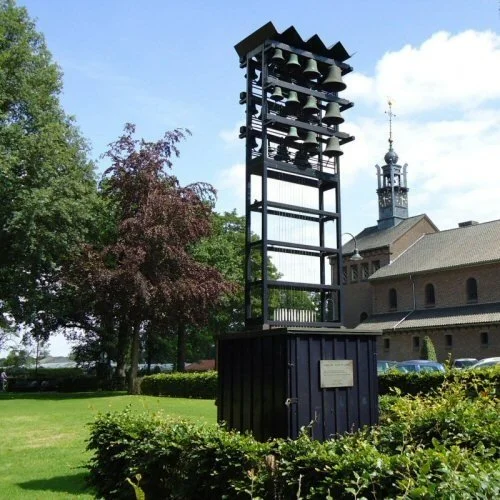

Het Jules de Corte carillon

Op het Hannes Joostenplein in Helenaveen staat sinds 1975 het Jules de Corte-carillon. Het werd gebouwd door klokkengieterij Eijsbouts uit Asten en bestaat uit 23 klokken. Het carillon staat in een donkerblauw houten huisje.

Aan één kant hangt een bronzen plaat met een gedicht van Jules de Corte: In de oude toren zingt het carillon Van alle dagen regen, van alle dagen zon Ik wou dat ik zijn liedje altijd verder zingen kon Het carillon is geplaatst met geld uit het Koning Willem III-fonds, tegelijk met het borstbeeld van koningin Juliana. Op 6 december 1975 werd het officieel in gebruik genomen. Jules de Corte was er zelf bij en begeleidde kinderen uit het dorp bij het zingen van het lied Hertog Jan. Daarmee maakte hij meteen zijn debuut als beiaardier (klokkenbespeler).

Het carillon hangt in een stalen constructie en heeft een speelcabine. Het kan met de hand worden bespeeld, maar werkt ook automatisch via een programmeerbare computer.

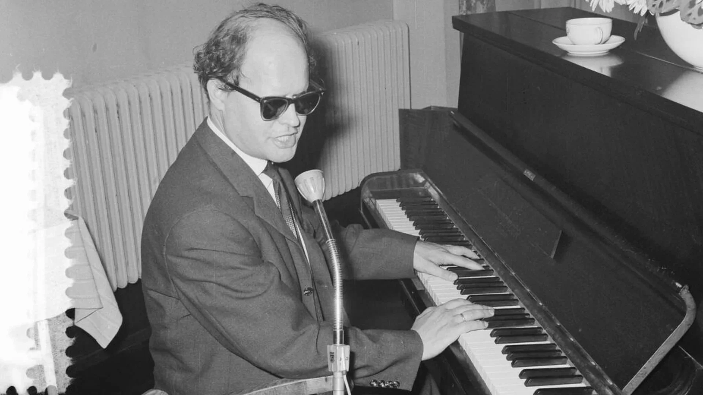

Jules de Corte

===========================

### 2 Jager die het zwijn doodDE

Monument ter gedachtenis aan de zondag razzia

Monument ter gedachtenis aan de ‘Zondag-Razzia’.

Het monument herinnert aan de kerkrazzia van 1944 en werd geplaatst op initiatief van de bond van gerepatrieerden van Helenaveen. Het werd op 8 oktober 1956 onthuld.

Dit oorlogsmonument is een stenen beeld van een jager met een geweer. Aan zijn voeten ligt een dood wild zwijn. Het beeld staat op een hoge zuil met daarop de datum 8 oktober 1944. Het is gemaakt door beeldhouwer Niel Steenbergen uit Teteringen. Vele jaren was dit de centrale plek voor de dodenherdenking van Deurne. Van alle plaatsen van Deurne heeft Helenaveen het meeste te lijden gehad van de oorlog.

Krantenbericht Oorlogsherdenking

Over Niel Steenbergen

Niel Steenbergen (1911–1997) was een Nederlandse kunstenaar. Hij was beeldhouwer, tekenaar en maakte ook penningen en medailles. Hij volgde opleidingen in Tilburg, Antwerpen en Amsterdam. Later gaf hij les aan de kunstacademie in Tilburg.

Hij maakte onder andere oorlogsmonumenten, beelden voor kerken zoals altaren en preekstoelen, en kerkelijke voorwerpen voor bisschoppen. Na de oorlog richtte hij samen met twee collega’s de Vrije School voor Beeldende Kunsten op, de latere Academie St. Joost. Steenbergen was ook betrokken bij een commissie die de overheid adviseerde over het plaatsen van oorlogsmonumenten.

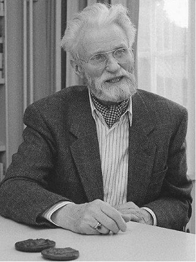

Niel Steenbergen

===========================

### 3 De kiepkarren

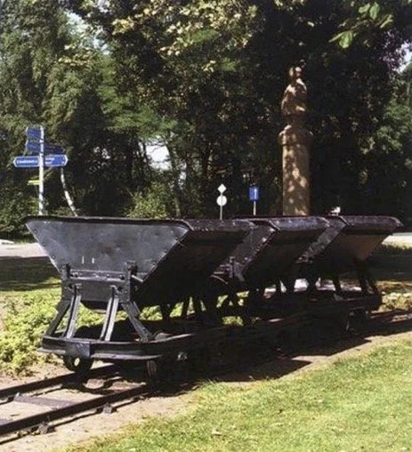

Kiepkarren uit Mariaveen

In 1978, bij het 125-jarig bestaan van Helenaveen, kreeg het dorp drie oude kiepkarren cadeau. Ze werden overhandigd aan het Comité Helenaveen 125 door C. de Feijter en geplaatst op het plein voor de Sint-Willibrorduskerk.

De kiepkarren werden gebruikt om grond te verplaatsen tijdens de ontginning. Ze zijn een tastbare herinnering aan het veenverleden en de latere ontginning van Helenaveen.

===========================

### 4 monument burgerslachtoffers

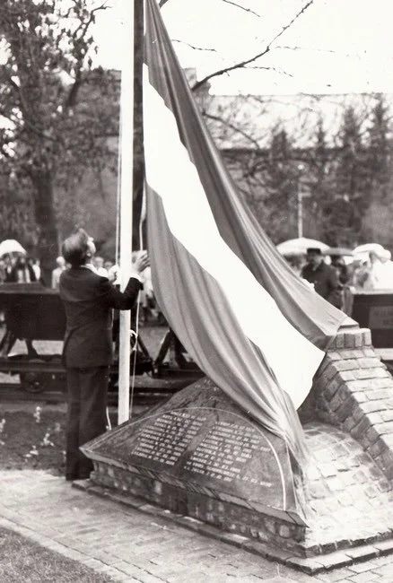

Onthulling door burgemeester Van Genabeek

Op 4 mei 1985 werd in Helenaveen een nieuw oorlogsmonument onthuld door Burgemeester Van Genabeek . Sindsdien is het een vaste plek voor herinnering en respect tijdens de dodenherdenking in Helenaveen.Het monument is bedoeld als eerbetoon aan de inwoners van het dorp die tijdens de Tweede Wereldoorlog zijn omgekomen door deportatie of oorlogsgeweld. Het staat vlak bij het bestaande monument “Jager die het zwijn doodde”.

Het idee voor het monument kwam van de dorpsraad van Helenaveen. Ook de Bond voor Gerepatrieerden en het Oranjecomité hielpen mee. De financiering kwam tot stand met hulp van het Koning Willem III-fonds, de Rabobank, het Comité 125 jaar Helenaveen en donaties van inwoners.

Het ontwerp van het monument is van architect Maarten de Jonge uit Venray, die op dat moment nog in Deurne woonde. De bouw werd uitgevoerd door vrijwilligers G. Janssen en S. Crommentuijn.

Het monument bestaat uit twee kleine muurtjes die haaks op elkaar staan, als teken van de ‘fundamenten’ van Helenaveen. Ze symboliseren dat ondanks het oorlogsgeweld de basis van het dorp is blijven bestaan. De muurtjes staan op een bolvormige heuvel van grijze stenen. Daartegenaan rust een driehoekige steen, die doet denken aan het dak van een huis. Op de steen zijn de namen gegraveerd van 22 mensen die in de oorlog zijn omgekomen:

"Ter nagedachtenis aan Helenaveens inwoners die als gevolg van deportatie en oorlogsgeweld zijn overleden. 1940–1945" Anker, K. (13-10-1889) Arts, A. (02-02-1898) Bremer, J. (16-01-1920) Derks, B. (19-08-1898) Erkelens, H. (26-07-1914) van Grunsven, C. (04-07-1913) Hendriks, P. (05-01-1905) van Kessel, W. (29-05-1888) Kröhne, C. (03-01-1915) Lagarde, H. (12-06-1915) Lagarde, M. (27-01-1906) van Lierop, P. (21-07-1920) van Lieshout, H. (27-01-1917) Leonard, broeder (26-08-1907) Luijten, F. (28-07-1917) Maessen, L. (08-10-1889) Rutten, A. (29-06-1928) Slot, H. (17-11-1907) Snieder, J. (30-03-1905) De Vries-Schonnewille, G. (27-03-1899) van der Zwaan, J. (17-10-1917)

Het pleintje waarop de twee oorlogsmonumenten staan werd bij gelegenheid van het 75 jarig bevrijdingsfeest opnieuw ontworpen door Dirk Verberne met als doel er meer een eenheid van te maken en het wat rustiger te laten ogen. Ook werd toen een tegel in de bestrating opgenomen met een vredesduif getekend door Yenthe de Klein die daarmee op school de tekenwedstrijd ter gelegenheid van de herdenking won.

===========================

### 5 Vierzijdige Driehoek

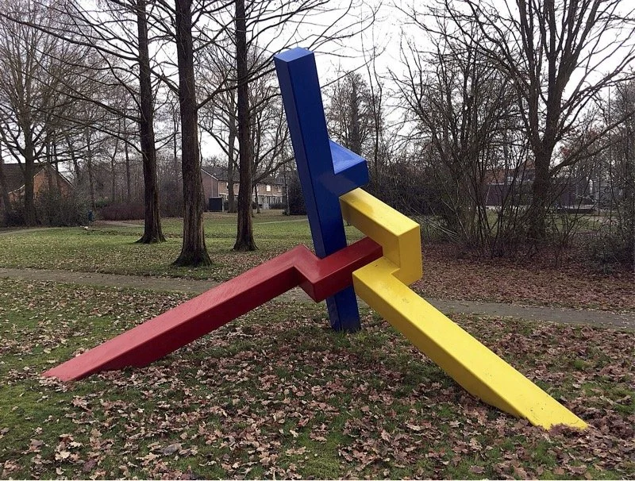

Vierzijdige driehoek

Op 23 januari 1990 werd in Helenaveen een bijzonder kunstwerk onthuld door burgemeester Van Genabeek. Het werd geplaatst ter gelegenheid van het 150-jarig bestaan van het dorp.De kleurrijke stalen constructie, genaamd Vierzijdige Driehoek, is ontworpen door kunstenaar Norbert Veeger uit Breda.

Het kunstwerk bestaat uit balken van staal, gelakt in de kleuren rood, blauw en geel. Het ontwerp is abstract, speels en modern van vorm, passend bij het jubileum van een dorp dat trots is op zijn verleden én vooruitkijkt naar de toekomst.

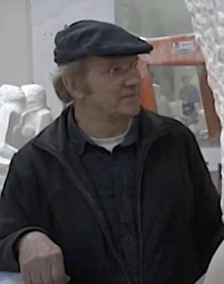

Norbert Veeger

Norbert Veeger volgde zijn opleiding aan kunstacademie Sint Joost in Breda en studeerde daarna aan de befaamde Accademia di Belle Arti in Carrara, Italië.

In 1989, opende hij zijn eigen atelier in Effen (Breda), waar hij zich vooral richtte op abstracte kunst en designobjecten. In 1991 werd hij gevraagd als docent beeldhouwen bij Bleu et Vert.

===========================

### 6 Mijmerplek met de Hellehond

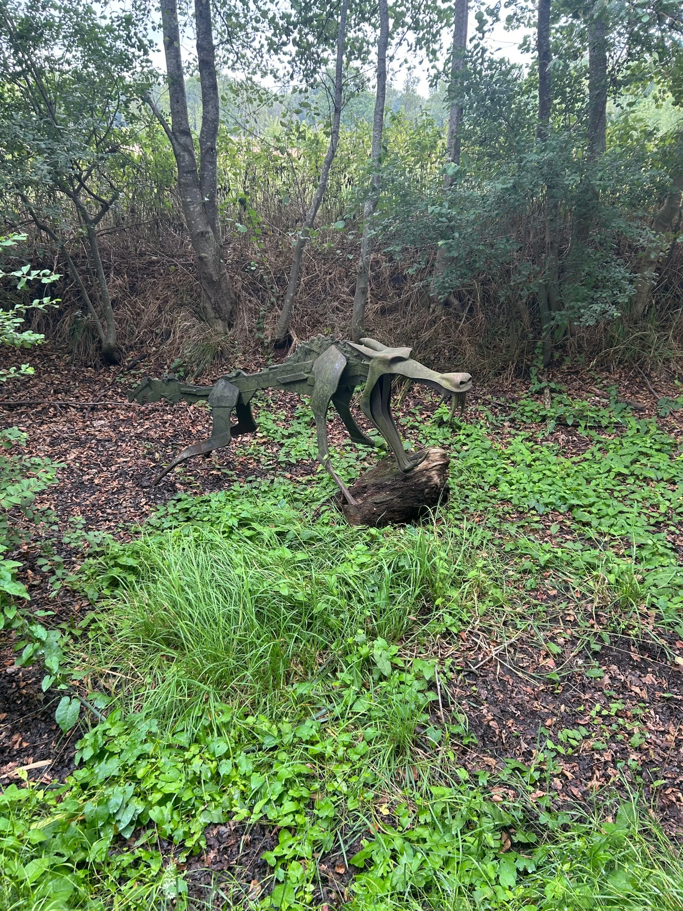

De Hellehond

Aan de Koolweg in Helenaveen zijn twee huisputten aangelegd op de plek waar vroeger zogenoemde Koningswoningen stonden. Dit gebeurde op initiatief van Jan van Woezik, die zich jarenlang inzette voor cultuur in de Peelregio via de Peelvenencommissie. De eerste huisput is ingericht als een rustige ‘mijmerplek’, met informatie over de geschiedenis en een opvallend kunstwerk: de Hellehond.

Het beeld van de Hellehond is gemaakt door de Helenaveense kunstenaar Dirk Verberne. In zijn kunst komen ambacht, landschap en legende op een bijzondere manier samen.

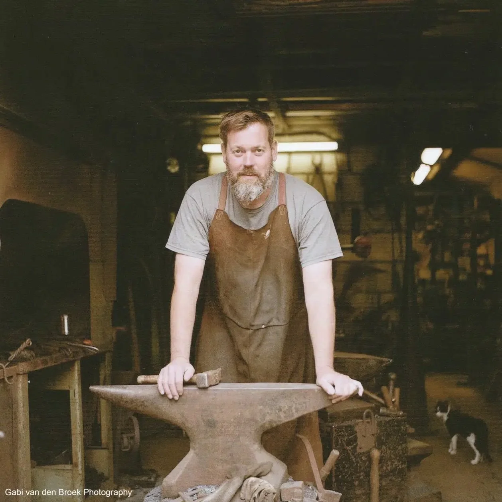

Dirk Verberne

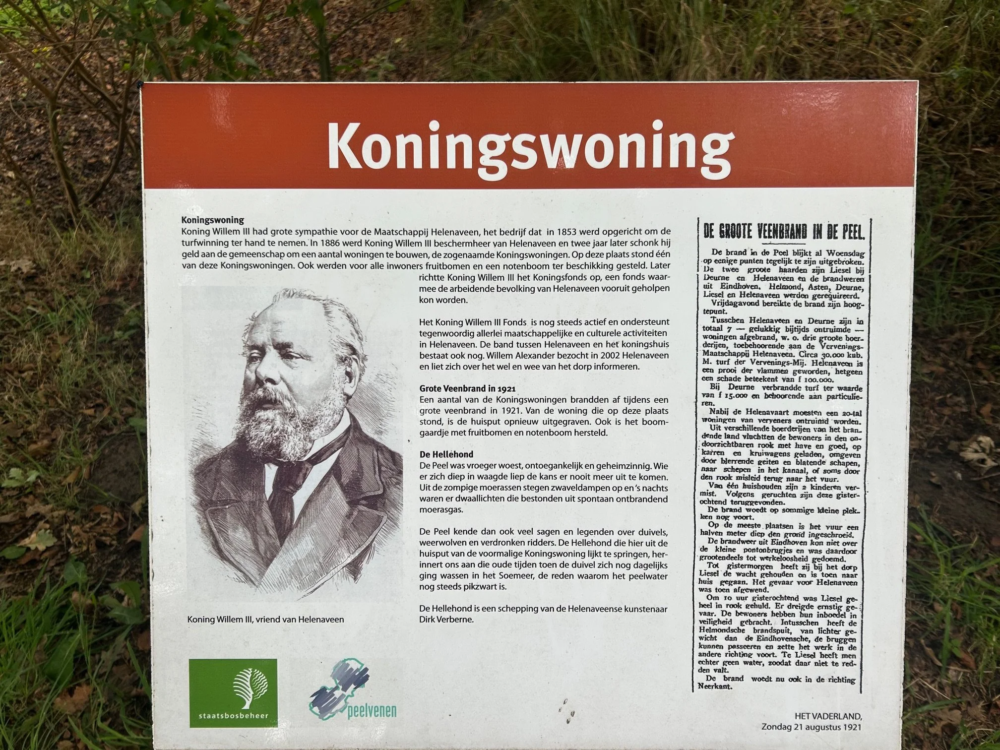

Bord bij Mijmerplek

De KoningswoningenDe Koningswoning die hier stond werd gebouwd in 1888 door een schenking van Koning Willem III. Hij steunde de Maatschappij Helenaveen en richtte een fonds op om de werkende bevolking te helpen. Ook werden fruit- en notenbomen uitgedeeld. Het fonds bestaat nog steeds en ondersteunt maatschappelijke en culturele initiatieven. De band met het koningshuis leeft voort: ook koning Willem-Alexander bracht een bezoek aan Helenaveen.

De veenbrand van 1921 In 1921 verwoestte een grote veenbrand een deel van de Peel en meerdere Koningswoningen, waaronder het huis dat hier stond. De oorspronkelijke huisput is opnieuw uitgegraven en omringd met fruitbomen, als herinnering aan vroeger.

De Hellehond Uit de put lijkt een zwarte hond te springen: de Hellehond. Dit kunstwerk verwijst naar sagen over de Peel, ooit een gevaarlijk, moerassig gebied vol dwaallichten en mysterieuze verschijningen.

Volgens de legende sprong de duivel elke dag in het Soemeer om zich te wassen, wat het water daar zo zwart zou maken. De Hellehond staat symbool voor die spannende, soms griezelige kant van het Peelverleden.

De tweede huisput 100 meter verder is om onduidelijke reden door SBB dichtgegooid. Gelukkig is de bijbehorende boomgaard wel behouden gebleven.

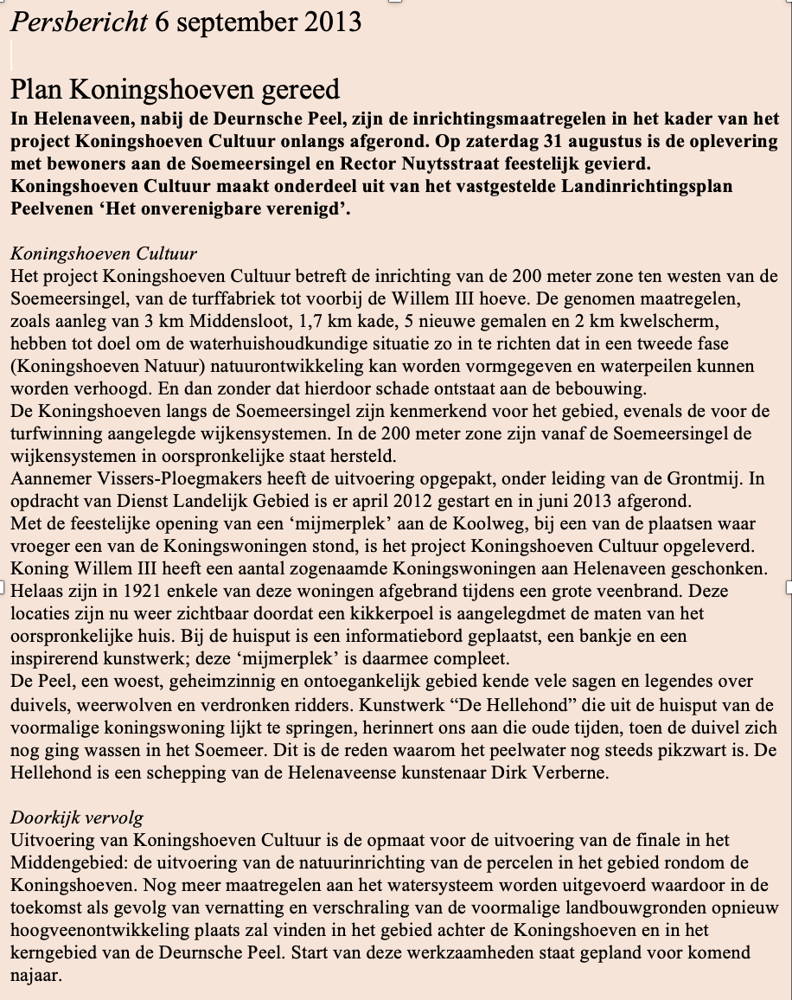

Persbericht opening Mijmerplek

===========================

### 7 Verleden Veen

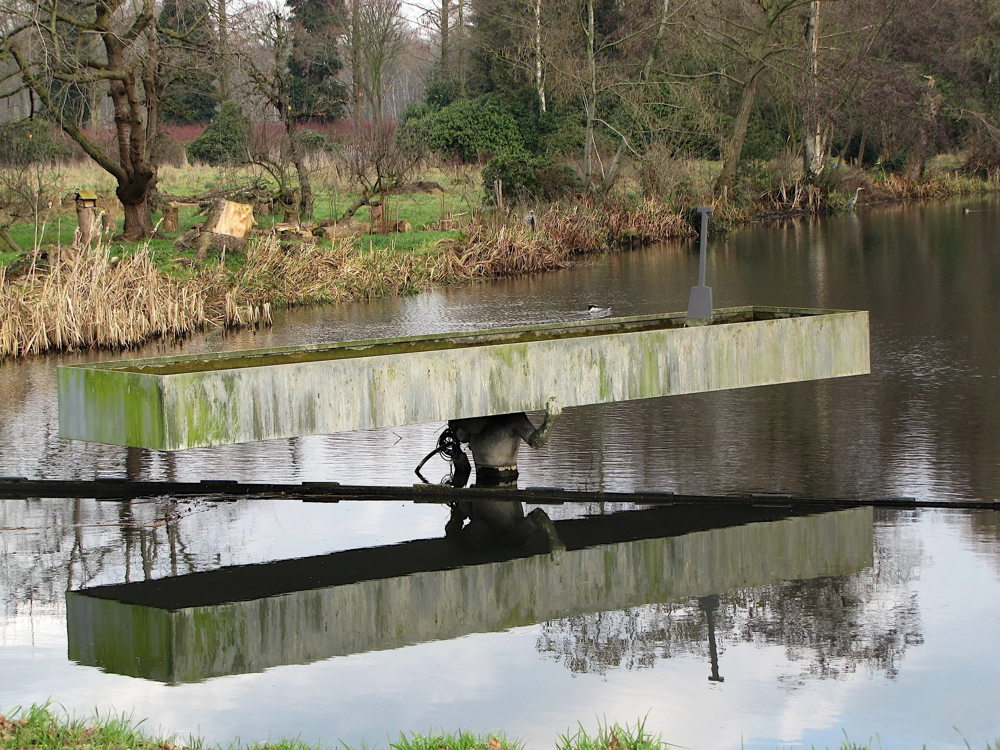

Verleden Veen

In de Helenavaart, op de plek waar de Soemeersingel en de Sevenumseweg elkaar kruisen, staat sinds 2006 het kunstwerk Verleden Veen. Het is gemaakt door kunstenaar Jan Ros uit Amersfoort en werd onthuld op zondag 25 juni 2006 door burgemeester Daandels en mevrouw E. van Doorne-Derix, voorzitter van het Fonds Koning Willem III.

De gemeente Deurne beloofde bij het 150-jarig bestaan van Helenaveen in 2003 dat er een blijvend kunstwerk zou komen voor het dorp. Kunstenaars konden hun idee insturen. In 2005 werd het ontwerp van Jan Ros gekozen.

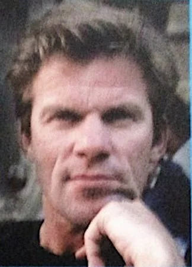

Jan Ros

De realisatie van Verleden Veen werd mogelijk gemaakt door bijdragen van: de gemeente Deurne, de provincie Noord-Brabant en het Fonds Koning Willem III.

Verleden Veen is een modern kunstwerk dat symbool staat voor het zware werk in de Peel. Het bestaat uit abstracte vormen die samen een verhaal vertellen: een waterbak verwijst naar het kanaal, een rechtopstaande schop staat voor het verrichte werk, en een gebogen figuur verbeeldt de turfstekende arbeider.

===========================

### 8 H. Anna en Maria Zusterklooster.

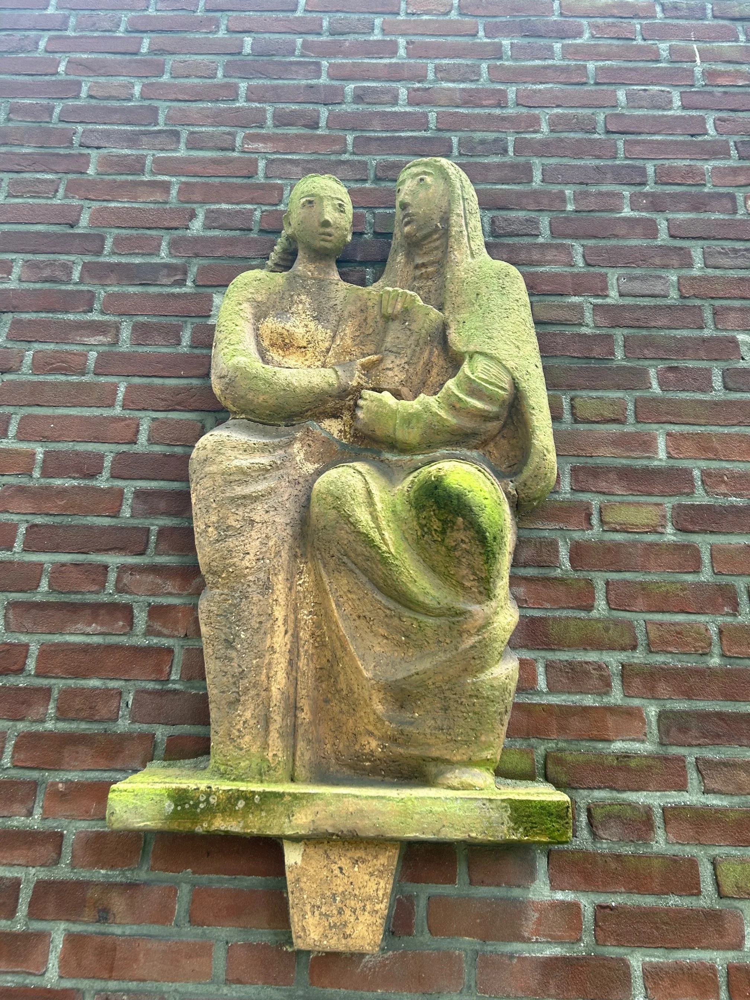

H. Anna onderwijst Maria

Het klooster in Helenaveen heette het St. Anna-klooster. De zusters behoorden tot de orde van de Franciscanessen van Veghel. Hun doel was: “Den evenmensch nuttig te zijn door het onderwijs en het oefenen van verschillende liefdewerken.” Dit kwam vooral tot uiting in het geven van onderwijs en het verlenen van ziekenzorg. Ook in Helenaveen was dat het geval. De zusters runden de bewaarschool en de katholieke school, en verzorgden daarnaast de wijkverpleging.

Het beeld op de gevel van het voormalige St. Anna-klooster, van de zittende Anna die haar kind Maria lesgeeft, is dan ook zeer toepasselijk.

Het beeld werd in 1953 gemaakt door Frans Tuinstra voor de gevel van het nieuwe klooster, ter vervanging van het oude klooster dat tijdens de bevrijding van Helenaveen was verwoest.

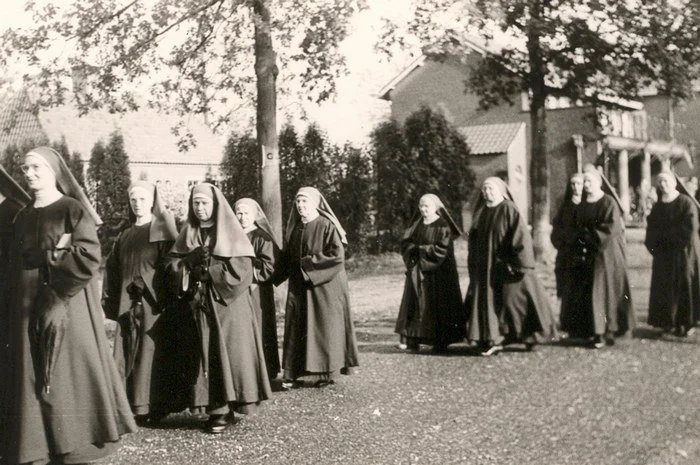

De zusters op weg naar hun nieuwe klooster in 1956

Frans Tuinstra (1923–2006) was een bekende Nederlandse keramist uit Maastricht. Hij volgde zijn opleiding aan de Stadsacademie in die stad en werkte aanvankelijk bij Russel-Tiglia in Tegelen. In 1956 vestigde hij zich als zelfstandig pottenbakker bij kasteel Neercanne.

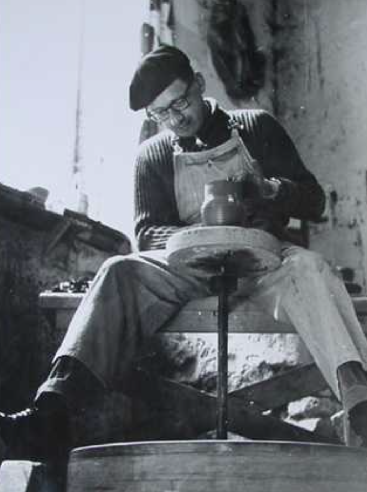

Tuinstra werd vooral bekend door zijn keramische gevelreliëfs en sectieltegels, vaak figuratief en modernistisch van vorm. Daarnaast maakte hij religieuze voorstellingen in keramiek, waaronder grotere reliëfs en gevelplaten voor gebouwen en instellingen.

Het nieuwe klooster is een uitbreiding van de oude schoolmeesterswoning en werd ontworpen door architect Deltrap uit Deurne. Dat het gebouw van Deltrap is, is te herkennen aan het karakteristieke metselverband dat naar hem is genoemd: het zogeheten Deltrapverband. Hierbij bestaat elke laag uit twee strekken gevolgd door een kop, waarbij de kop van de bovenliggende laag precies boven het midden van de eerste strek van de laag eronder staat.

Ook de RK-kerk in Helenaveen is van de hand van Deltrap en gemetseld in hetzelfde verband. Het beeld van Sint Willibrord op de kerk is eveneens van Frans Tuinstra.

===========================

### 9 Beeld van St Willibrord

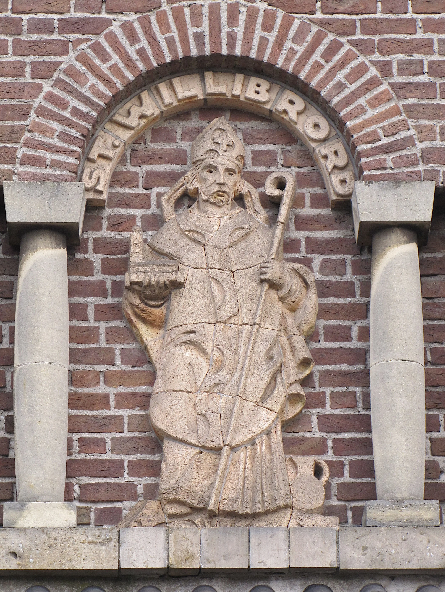

St Willebrord op de achtergevel van de Kerk

Het beeld van Sint Willibrordus aan de gevel van de Sint‑Willibrorduskerk is ontworpen door Frans Tuinstra (1951). Het reliëf bevindt zich in een gevelnis en is vervaardigd uit terracotta, kenmerkend voor Tuinstra’s religieuze werk.

Het beeld maakte deel uit van een reeks terracottabeelden aan de kerk, waaronder ook voorstellingen van het Heilig Hart, Maria, Jozef, Donatus, Antonius en Gerardus – alle vervaardigd door Tuinstra in 1951. Deze beelden zijn helaas uit Helenaveen verdwenen toen de kerk aan de eredienst werd onttrokken.

Het beeld van Sint Willibrordus is typerend voor Tuinstra’s stijl: figuratief, expressief en aangepast aan de gevelarchitectuur van wederopbouwkerken.

De voorstelling bevat meerdere duidelijke symbolen:

Mijter – teken van zijn bisschopsambt

Staf – symbool van geestelijk leiderschap en zijn missionaire taak

Kerkmodel – verwijzing naar zijn rol in het stichten van kerken en de verspreiding van het evangelie

Kruik aan zijn voeten – verwijst naar de legende van de Willibrordusputten, waarin hij bronwater zou hebben gezegend

De kerk werd tussen 1950 en 1951 herbouwd onder leiding van architect J. Deltrap, nadat de neogotische Cuyperskerk in 1944 was verwoest. Het nieuwe gebouw werd opgetrokken in traditionalistische stijl met invloeden van de Bossche School.

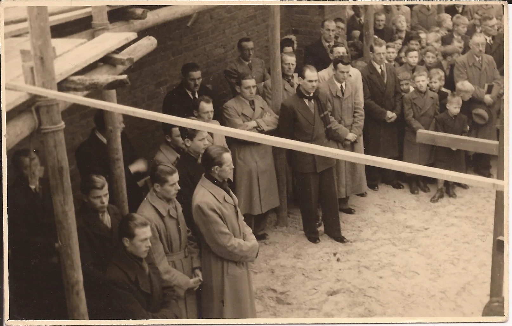

Eeste steenlegging van de nieuwe kerk (rechts meester Theelen met zijn leerlingen)

In november 2023 werd de kerk met een afscheidsviering uit gebruik genomen en vanaf begin 2024 officieel onttrokken aan de eredienst

Het gebouw is getransformeerd tot veertien wooneenheden, waaronder verscheidene levensloop-appartementen en een Mariakapel die permanent toegankelijk blijft voor gebed.

===========================

### 10 Romeins tempeltje gouden Helm

Op de hoek van de Oude Peelstraat en de Centurioweg in Helenaveen staat een bijzonder monument in de vorm van een Romeins tempeltje. Het markeert de plek waar in 1910 een van de meest opvallende archeologische vondsten van Nederland werd gedaan: de Gouden Helm van Helenaveen.

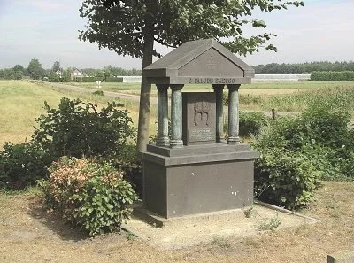

Vindplaats gouden Helm

Het tempeltje is ontworpen en vervaardigd door kunstenaar Joep Coppens uit Vlierden. Het bouwwerk, opgebouwd uit basaltlava, brons en baksteen, is vormgegeven in de stijl van een klassiek Romeins tempelgebouw – als eerbetoon aan de tijd waarin de helm werd gedragen. Het monument is a-typisch voor de beeldhouwer Joep Coppens. Maar het toont daarentegen wel zijn liefde voor de geschiedenis van de Peel. Joep was jarenlang voorzitter van Heemkundekring H.N. Ouwerling en maakte deel uit van de Monumentencommissie van de Gemeente Deurne.

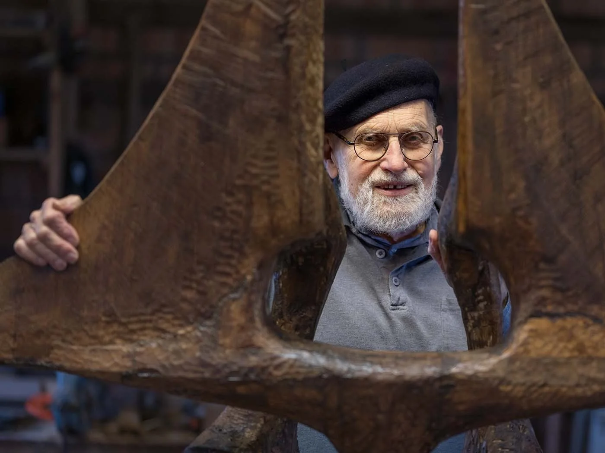

Joep Coppens

Het monument werd op 21 juni 1998 geplaatst in opdracht van de Werkgroep Romeins Monument Helenaveen, bestaande uit Jan van Woezik en Peter van Dijk. Ook Stichting Behoud Natuurlijk Helenaveen speelde een belangrijke rol. In het kader van de reconstructie van de Peel tot natuurgebied zette deze stichting zich in voor het behoud van de cultuurhistorie van Helenaveen.

De plaatsing van het tempeltje werd mede mogelijk gemaakt met financiële steun uit het NUBL-fonds (Nadere Uitwerking Brabant-Limburg). De directe aanleiding was een initiatief van de Dorpsraad en Stichting Peelfeesten: een groots dorpsfeest met als thema een Romeins spektakel.

In het driehoekige timpaan (het bovenste frontvlak) van het tempeltje staat in het Latijn : “E PALUDE EMERGO” (Ik kwam boven uit het veen)In het midden is een afbeelding van een Romeinse helm te zien.

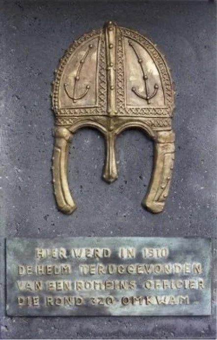

Gouden helm

===========================

### 11 Sporen die bleven

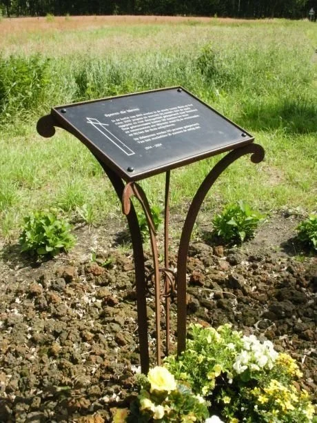

Sporen die bleven

Aan de Koolweg staat het monument “Sporen die bleven” als een blijvende herinnering aan de kerkrazzia op 8 oktober 1944.

In 2004 is – bij het 60-jarig jubileum van de bevrijding – een monumenten-reeks opgericht in 45 dorpen in Noord- en Midden-Limburg, waaronder Helenaveen. Dit gebeurde op initiatief van de Stichting Deportatie oktober 1944 Noord- en Midden-Limburg.

De tekst op de plaquette luidt:

SPOREN DIE BLEVEN

In de herfst van 1944 werden in de streek tussen Maas en Peelruim 3000 jongens en mannen bij razzia’s door de nazi’sopgepakt en voor dwangarbeid gedeporteerd naar Duitsland.Deze gebeurtenissen kostten 120 mannen het levenen veroorzaakten een blijvende wond bij de overlevendenen bij hen die thuis achterbleven.

Uit Helenaveen werden 143 personen gedeporteerd.Van hen overleefden 26 mannen de oorlog niet.

1944–2004

Het monumentje bestaat uit een smeedijzeren standaard op een ondergrond van ijzeroer, gemaakt door kunstsmid Thijs van de Manakker.

Thijs van de Manakker

De razzia’s van oktober en november 1944

Tijdens de Tweede Wereldoorlog had Duitsland een tekort aan arbeidskrachten, omdat bijna alle Duitse mannen in het leger zaten. In het najaar van 1944 besloten de nazi’s om in de regio tussen Maas en Peel in Limburg Nederlandse mannen op te pakken om hen in Duitsland te werk te stellen. De grootste razzia vond plaats op zondag 8 oktober 1944, direct na de mis. Ook Helenaveen was toen aan de beurt.

Overigens kloppen de aantallen die genoemd worden niet helemaal. (zie De Kerkrazzia op deze website)

===========================

### 12 Plastiek Openbare School Zonnedauw

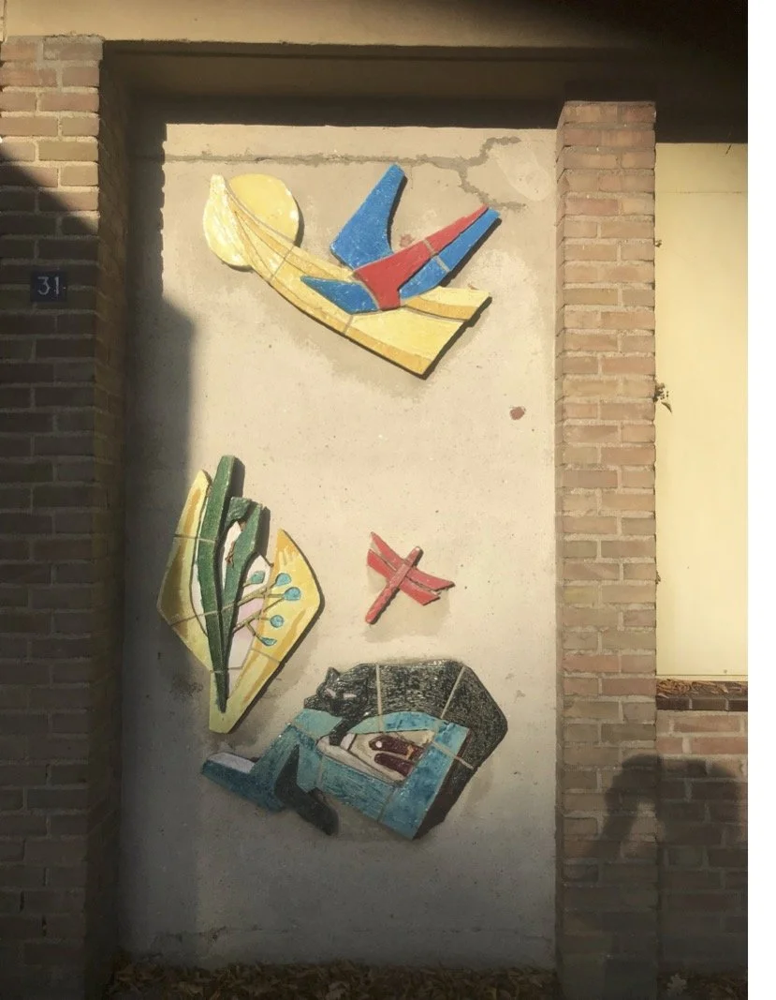

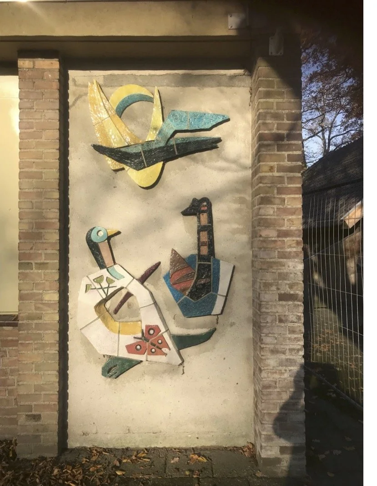

Aan de Soemeersingel in Helenaveen stond van 1970 tot 1982 de Openbare Lagere School Zonnedauw. De school werd gebouwd omdat er in de bestaande school (de "nieuwe school") geen plek meer was voor niet-katholieke leerlingen. Die school werd vanaf 1970 volledig katholiek.

Een aantal protestantse families vond het belangrijk dat er ook openbaar onderwijs in het dorp bleef, en zij wisten af te dwingen dat er een aparte openbare school kwam: Zonnedauw. Toch was het leerlingenaantal uiteindelijk te klein om de school in stand te houden. In 1982 verdween het openbaar basisonderwijs uit Helenaveen. Later is de naam veranderd in “De Wiek”

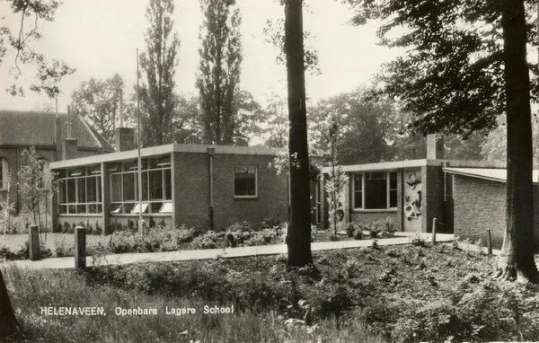

Op de gevel van de school werd een kunstwerk geplaatst: een plastiek (een keramisch reliëf). Het werd gemaakt door Frans Jacobs, een kunstenaar uit Deurne die lange tijd actief was in de regio. Veel van zijn keramische werk liet hij uitvoeren bij De Porceleyne Fles in Delft, een bekende Nederlandse aardewerkfabriek. Ook dit kunstwerk is daar vervaardigd.

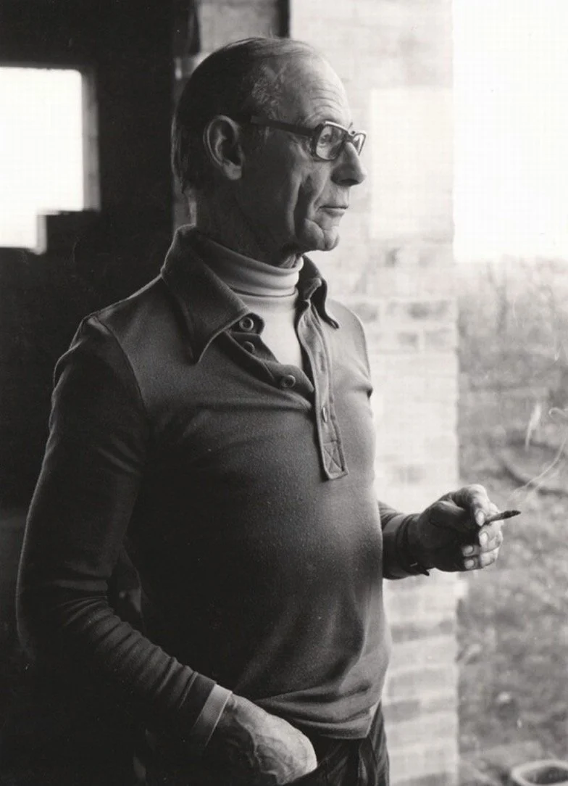

Frans Jacobs

Frans Jacobs, was een veelzijdig kunstenaar, vooral bekend om zijn monumentale kunst op en aan gebouwen. Hij werkte als beeldhouwer, glazenier, tapijtwever en edelsmid.

Aanvankelijk studeerde hij bouwkunde aan de Technische Hogeschool in Delft, maar stapte later over naar de kunstopleiding in Arnhem, waar hij diverse technieken leerde, zoals tapijtweven, wandschilderen en glas-in-lood.

Op 25 juli 1940 vestigde hij zich in Deurne. Tijdens de Tweede Wereldoorlog werd hij gearresteerd omdat hij joodse onderduikers hielp. Als reserveofficier werd hij niet naar een concentratiekamp gestuurd, maar belandde hij als krijgsgevangene in Neu Brandenburg (Duitsland), waar hij in 1945 door het Russische leger werd bevrijd.

Na de oorlog werkte hij als edelsmid en maakte sieraden en liturgische objecten. Zijn bekendste werken bleven echter de grote kunstwerken in de openbare ruimte, zoals het keramisch reliëf op de gevel van de voormalige openbare school Zonnedauw in Helenaveen.

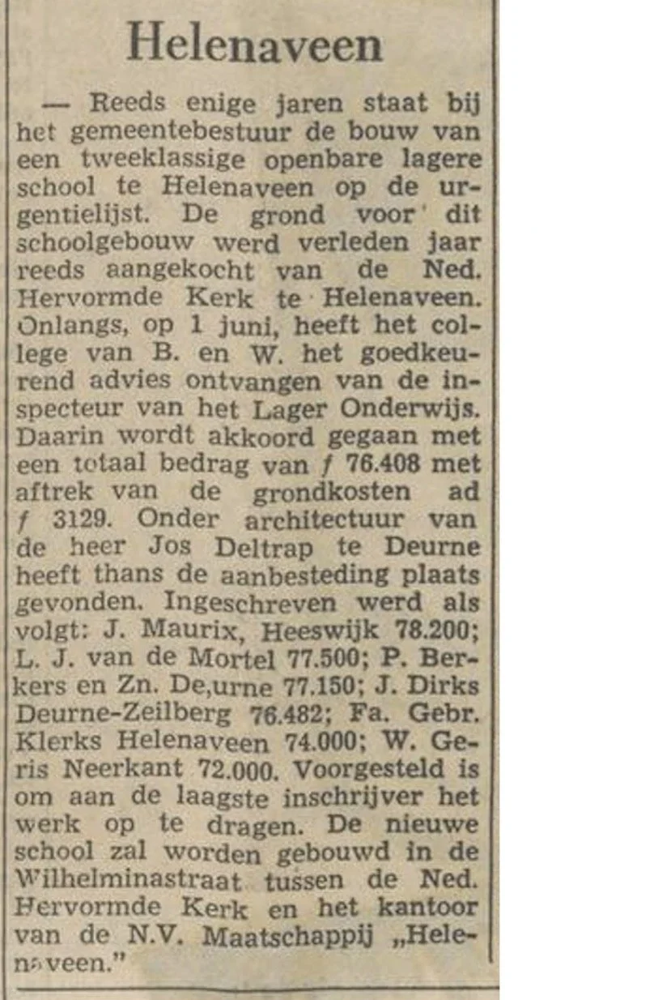

Aanbesteding Zonnedauw

===========================

### 13 Tankversperring Hogebrug

Tankversperring

Ter gelegenheid van 80 jaar bevrijding is aan de Hogebrug een nieuw herdenkingsmonument geplaatst. Het is een reconstructie van een oude tankversperring (aspergeversperring) uit de tijd van de Peel-Raamstelling, een Nederlandse verdedigingslinie van voor de Tweede Wereldoorlog.De nog aanwezige ijzeren cassettes zijn opnieuw voorzien van stalen balken naar originele tekeningen.Ze dienden om vijandelijke voertuigen tegen te houden die dan beschoten konden worden vanuit de kazematten aan de overkant van het Deurnes kanaal.

Het initiatief kwam van Dirk Verberne. Zijn werk verwijst vaak naar de geschiedenis en het landschap van de Peel.Een en ander werd gerealiseerd met steun van ‘Het Helenaveen van Toen’, de Dorpsraad Helenaveen en de Gemeente Deurne (Cultuurfonds 'Het verhaal van Deurne'.)

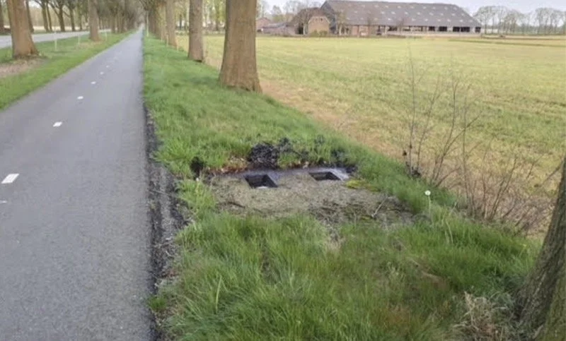

Restanten aspergeversperring met de originele cassettes.

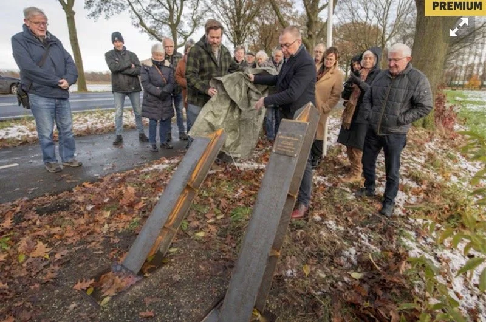

Opening door Wethouder Helm Verhees, samen Met Dirk Verberne

===========================

### 14 Borstbeeld koningin Juliana

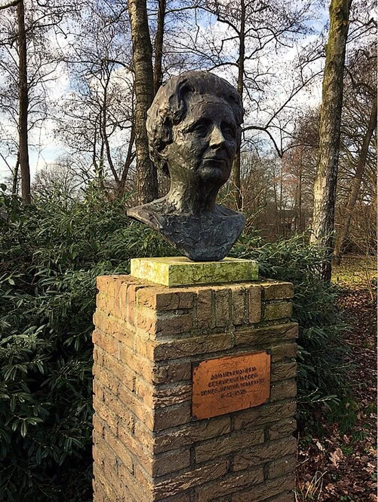

Aan het Rectorspad in Helenaveen staat een bronzen borstbeeld van koningin Juliana. Het beeld werd op 6 december 1975 geschonken aan het dorp door het Fonds Koning Willem III. Burgemeester Hoebens onthulde het beeld tijdens een feestelijke bijeenkomst.

Het beeld staat op een ronde verhoging met een vierkante sokkel van baksteen. Op een koperen plaat op de sokkel staat de tekst: "AAN HELENAVEEN GESCHONKEN DOOR FONDS KONING WILLEM III 6-12-1975"

Het beeld staat voor de hechte band die Helenaveen altijd heeft gehad met koning Willem III en het koninklijk huis. Het is een kopie van een eerder beeld dat was gemaakt voor het kantongerecht in Tilburg.

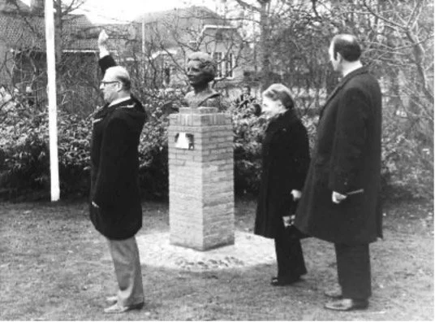

Onthulling door burgemeester Hoebens

Over de kunstenares: zuster Jesualda

Het borstbeeld werd gemaakt door zuster Jesualda, geboren als Johanna Gerarda Antonia Kwanten (1901–2001). Zij was een veelzijdige kunstenares uit Tilburg, die naast beeldhouwen ook tekende, illustreerde, etste en lithografieën maakte.

Zuster Jesualda trad in 1929 toe tot de Zusters van Liefde. Ze haalde haar lesbevoegdheid tekenen in Amsterdam en gaf ruim dertig jaar les in tekenen en kunstgeschiedenis op een meisjesschool van de congregatie. Daarna ging ze zelf weer in de leer: eerst tekenlessen aan de Rijksakademie in Amsterdam, later volgde ze daar ook de opleiding beeldhouwen.

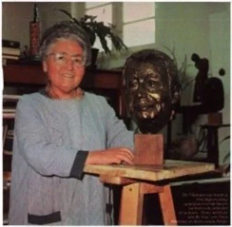

Vanaf 1966 werkte ze in haar atelier in Tilburg. Ze werd vooral bekend om haar bronzen beelden van bekende personen, waaronder koningin Juliana, koningin Beatrix, cabaretier Toon Hermans, en vele anderen uit de wereld van toneel, literatuur en kerk. Haar stijl is herkenbaar en persoonlijk, en haar werk is op diverse plekken in Nederland te zien.

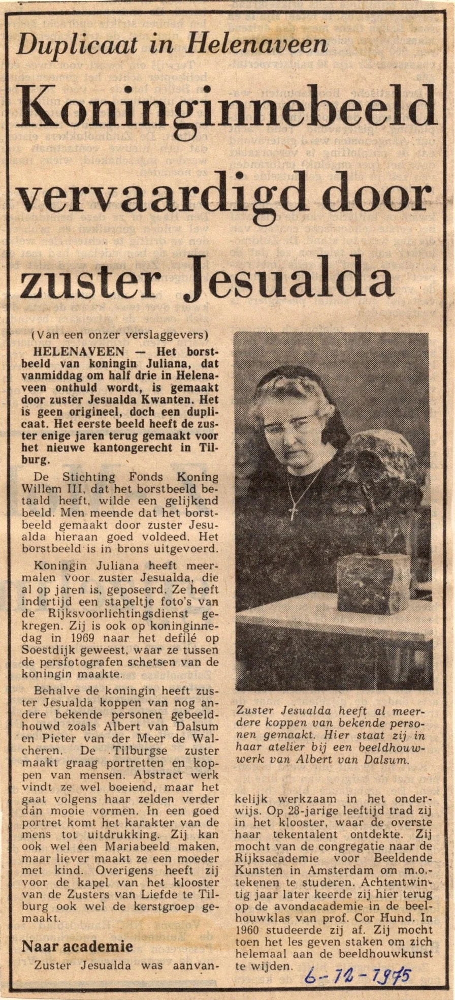

Dagblad voor Noord Limburg

===========================

### 15 Peeltroef bij Hoeve willem III

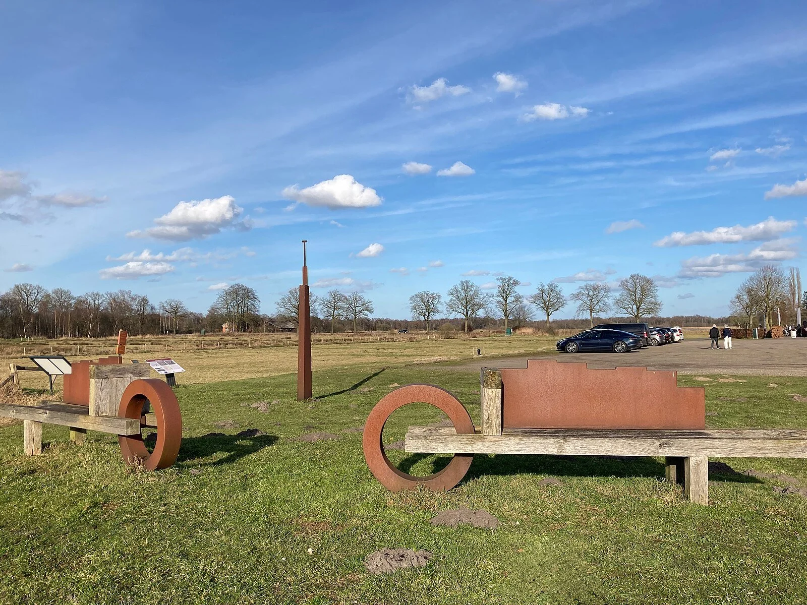

Peeltroef bij hoeve Willem III

Op veel plekken in de Peel zijn zgn Peeltroeven te vinden. Kleine en grotere monumentjes vertellen het verhaal van de Peel. Bij veel van die Peeltroeven staan banken in de vorm van een gestileerde turfkruiwagen en een hoogveenzuil, die de hoogte aangeeft van het afgegraven turf.De Peeltroef bij Hoeve Willem III werd op 30 april 2016 geopend door Gedeputeerde Patrick van der Broeck van de provincie Limburg.

De Peeltroeven zijn gemaakt door de Helenaveense kunstenaar Dirk Verberne. Dirk is geboren en getogen in de Peel en laat zich voor zijn werk inspireren door de verhalen, geschiedenis en mythen van de streek.

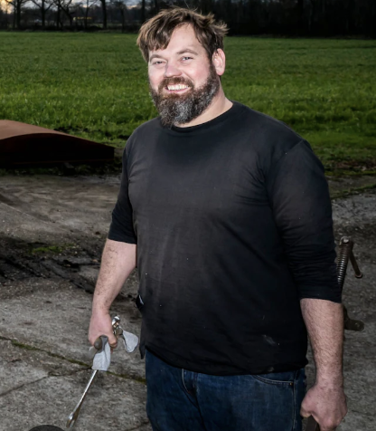

Dirk Verberne

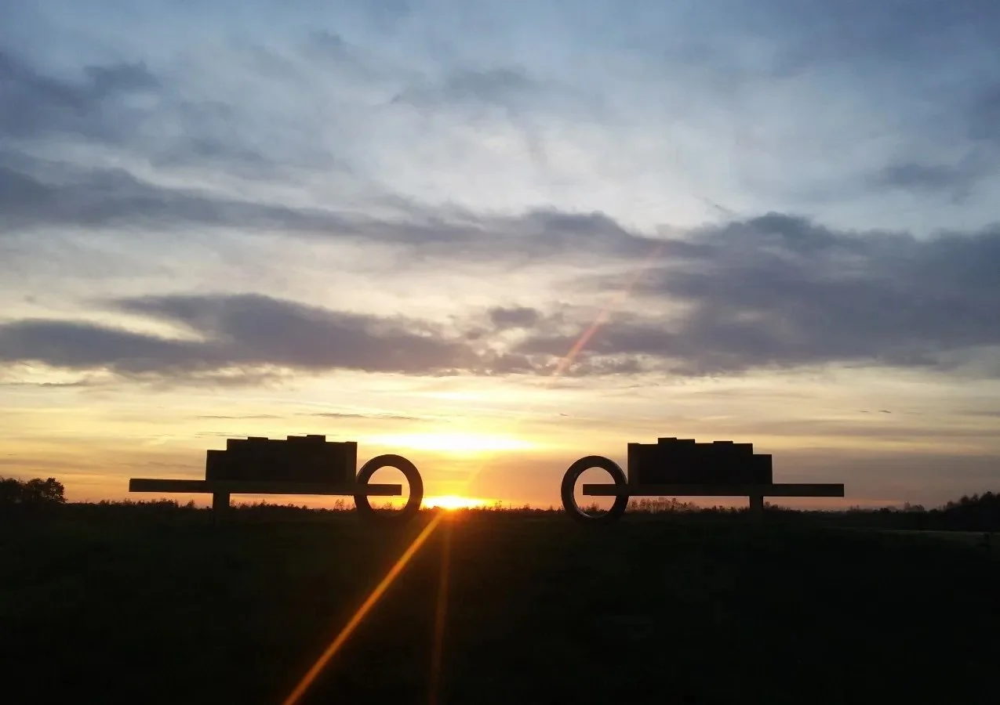

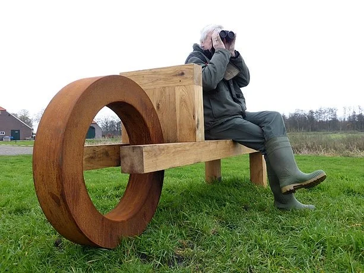

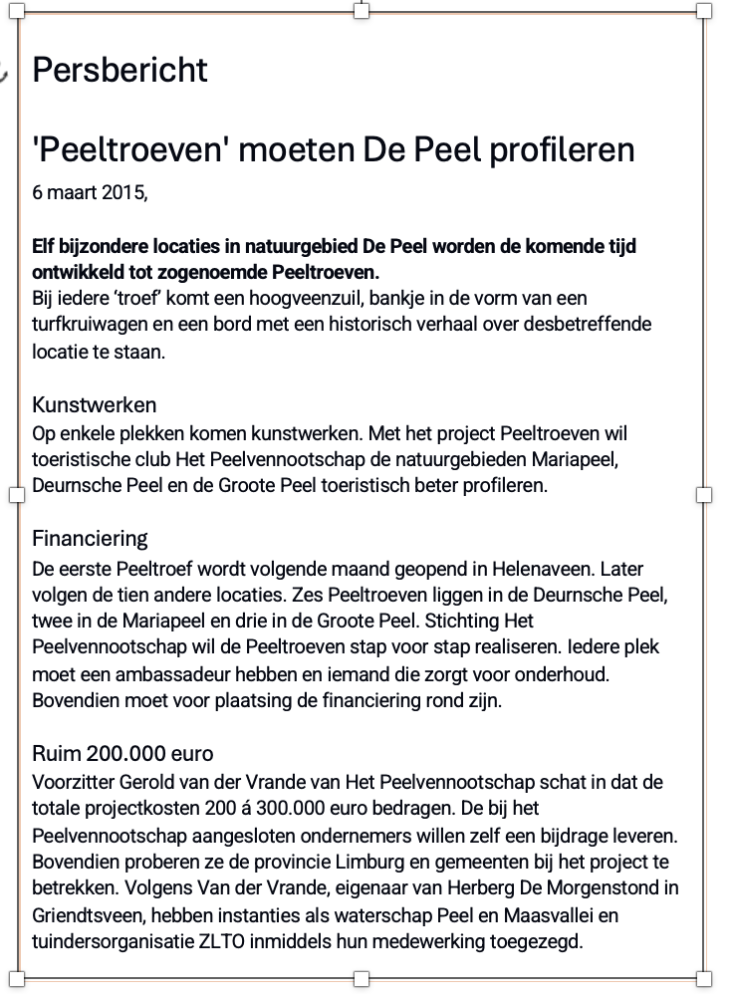

===========================

### 16 Doopvont RK Kerk

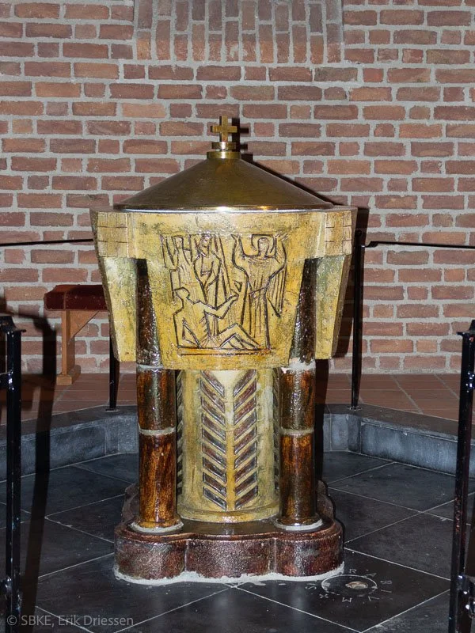

In de Doopkapel van de RK kerk bevindt zich het doopvont van Helenaveen. Het bestaat uit zoutgeglazuurd steengoed met bijbelse taferelen.Het is gemaakt in keramisch atelier St. Joris in Beesel door Piet Schoenmakers.

Bijna alle katholieke Helenaveners zijn boven dit doopvont gedoopt.

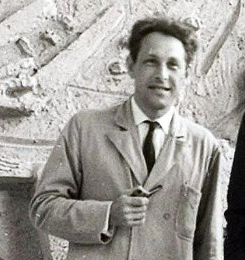

Piet Schoenmakers werd van 1932 tot 1936 opgeleid aan de Teekenschool in Roermond en studeerde vanaf 1937 aan de Rijksakademie van beeldende kunsten in Amsterdam.Hij ontwikkelde zich tot een veelzijdig kunstenaar: beeldhouwer, glaskunstenaar, graveur, keramist en schilder. Hij werkte als ontwerper voor het Beeselse Atelier St. Joris.

===========================

JvW 7 augustus 2025

Bronnen: WikipediaDeurnewikiCollectie Gerard VeldhuizenDelpherSBKE stichting Beesels keramisch erfgoed
