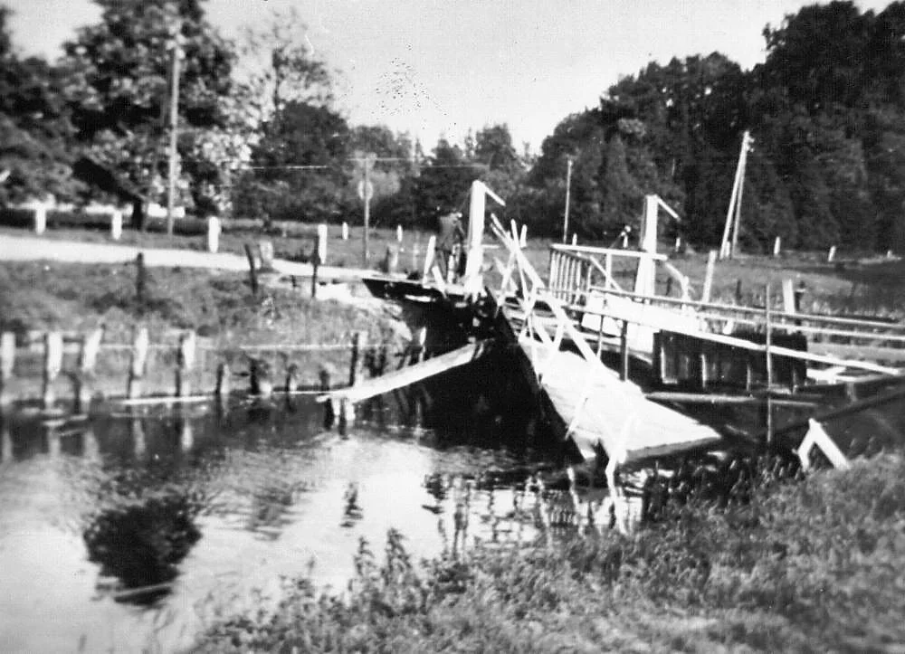

# oorlog

> Bron: helenaveenvantoen.nl

# Oorlog in Helenaveen

### Verhalen van ooggetuigen

Het lijkt het relatief rustig in Helenaveen tijdens de tweede wereldoorlog, zeker vergeleken met de bijna compleet verwoeste dorpen in de buurt, zoals Neerkant, Liessel en Meijel, maar dat ligt bij nader inzien toch anders. De impact van de oorlog op de inwoners van Helenaveen was heel groot. Niet voor niets was de officiële herdenking van de gemeente Deurne in de eerste jaren na de oorlog steeds in Helenaveen.

Hieronder vindt u de verhalen van de gewone mensen van Helenaveen in de vorm van hun persoonlijke herinneringen. De vertellers waren toen nog kinderen, daardoor zijn de verhalen soms niet helemaal correct zin of historisch juist. Ze geven echter heel goed weer onder welke barre omstandigheden men toen geleefd heeft.

Het zijn verhalen over de bezetter, het onderduiken, de deportatie van de mannen naar Duitsland, maar ook van Joodse onderduikers, verraad en liquidatie.

Veel is er niet verteld na de oorlog. Dat veelbewogen hoofdstuk van het boek van het leven was afgesloten. Men moest vooral verder: kijken naar de toekomst en niet naar het verleden. Op deze website maken we het boek nog een keer open en kijken vol verbazing nog een keer terug naar. Opdat de verhalen niet verloren gaan en we blijven leren van de geschiedenis.
