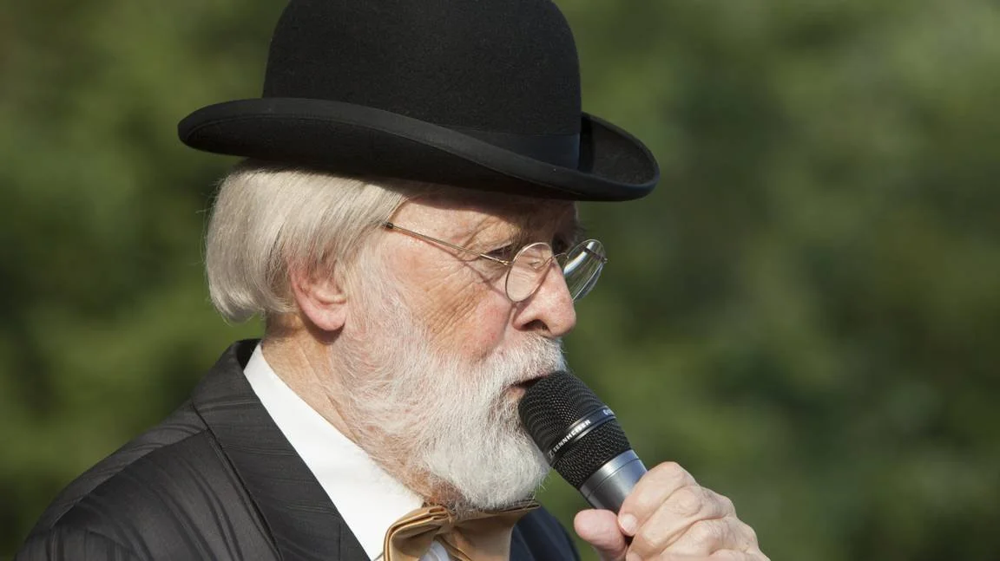

# pierre-kartner-vader-abraham-overleden

> Bron: helenaveenvantoen.nl

### Pierre Kartner overleden

Pierre Kartner

11 april 1935 - 8 november 2022

Vandaag (11 november 2022) werd het overlijden bekend van Pierre Kartner, vooral bekend onder zijn artiestennaam Vader Abraham.

Zie:

Pierre Kartner - Wikipedia

Sommige inwoners van Helenaveen weten dat er een familieband is tussen ‘n aantal Helenaveense families en Pierre Kartner. Natuurlijk geldt dat voor de familie Kartner, maar ook voor de familie Van Mullekom. Zie onderstaande samenvatting van de stamboom.

Kwartierstaat Pierre Kartner

Generatie I

Petrus Antonius Laurentius Kartner, geboren op 11‑04‑1935 te Elst.

Generatie II

Wilhelmus Arnoldus Kartner, geboren op 28‑03‑1896 te Deurne en Liessel, overleden op 01‑11‑1986 te Breda op 90‑jarige leeftijd.

Gehuwd met

Grada Johanna van Ottelen, geboren op 27‑12‑1901 te Huissen, overleden op 02‑01‑1992 te Breda op 90‑jarige leeftijd.

Uit dit huwelijk:

1. Petrus Antonius Laurentius, geboren op 11‑04‑1935 te Elst.

Generatie III

Henricus Hubertus Kartner, geboren op 18‑12‑1856 te Helmond.

Gehuwd op 28‑jarige leeftijd op 04‑05‑1885 te Deurne en Liessel met de 26‑jarige

Petronella van Mullekom, geboren op 13‑06‑1858 te Appeltern, overleden op 06‑01‑1919 te Deurne en Liessel op 60‑jarige leeftijd.

Uit dit huwelijk:

1. Wilhelmina Henrica, geboren op 09‑11‑1890 te Deurne en Liessel, overleden op 16‑04‑1975 te Lierop op 84‑jarige leeftijd.

Gehuwd op 26‑jarige leeftijd op 21‑07‑1917 te Deurne en Liessel met Johannes Theodorus Kilwinger, 33 jaar oud, geboren op 03‑11‑1883 te Deurne en Liessel, overleden op 24‑09‑1968 te Lierop op 84‑jarige leeftijd.

2. Wilhelmus Arnoldus, geboren op 28‑03‑1896 te Deurne en Liessel.

Cornelis van Ottelen, geboren circa 1875 te Elst, overleden op 18‑02‑1930 te Elst.

Gehuwd op 04‑01‑1900 te Valburg met

Wilhelmina Meijer, geboren circa 1870 te Valburg, overleden op 08‑11‑1948 te Elst.

Uit dit huwelijk:

1. Johanna Mechelina, geboren XX‑01‑1900 te Valburg.

2. Martinus Theodorus, geboren XX‑01‑1901 te Elst, overleden op 16‑01‑1901 te Elst.

3. Grada Johanna, geboren op 27‑12‑1901 te Huissen.

4. Martinus Theodorus, geboren circa 1903 te Elst, overleden op 23‑04‑1913 te Elst.

5. Johanna W.M. Geboren op 22‑07‑1905 te Elst, overleden op 02‑11‑1987 te Arnhem op 82‑jarige leeftijd.

Gehuwd met Gerardus H. van Xanten.

6. Martinus Theodorus, geboren op 25‑08‑1913 te Elst, overleden op 29‑06‑1986 te Elst op 72‑jarige leeftijd.

Gehuwd met Louisa M.H. Rijcken.

Generatie IV

Hendricus Kartner, geboren op 13‑11‑1818 te Utrecht, overleden op 19‑08‑1881 te Deurne en Liessel op 62‑jarige leeftijd.

Gehuwd op 31‑jarige leeftijd op 08‑12‑1849 te Helmond met de 33‑jarige

Maria Seerden, geboren op 12‑11‑1816 te Helmond, overleden op 07‑01‑1894 te Deurne en Liessel op 77‑jarige leeftijd.

Uit dit huwelijk:

1. Henricus Hubertus, geboren op 18‑12‑1856 te Helmond.

Willem van Mullekom, geboren op 02‑10‑1824 te Alphen, overleden op 20‑06‑1879 te Deurne en Liessel op 54‑jarige leeftijd.

Gehuwd op 24‑jarige leeftijd op 25‑04‑1849 te Appeltern met de 27‑jarige

Hendrica de Blank, geboren op 15‑05‑1821 te Alphen, overleden op 24‑01‑1894 te Deurne en Liessel op 72‑jarige leeftijd.

Uit dit huwelijk:

1. Petronella, geboren op 13‑06‑1858 te Appeltern.

Marinus van Ottele, geboren circa 1834 te Dodewaard, overleden op 17‑10‑1900 te Elst.

Gehuwd op 30‑04‑1863 te Elst met

Johanna Volmeijer, geboren circa 1838 te Elst, overleden op 28‑12‑1904 te Elst.

Uit dit huwelijk:

1. Cornelis van Ottelen, geboren circa 1875 te Elst.

Theodorus Meijer.

Gehuwd met

Megchel Meijer.

Uit dit huwelijk:

1. Wilhelmina, geboren circa 1870 te Valburg.

Generatie V

Johan Kartnar (Gernerd), sergeant, gedoopt circa 1780, overleden op 03‑01‑1857 te Eindhoven.

Gehuwd met

Elisabeth Betz (Pijts/Beits), gedoopt circa 1780 te Utrecht, overleden op 23‑11‑1845 te Best.

Uit dit huwelijk:

1. Marie Jeanne Josephine Kartner, geboren op 06‑04‑1811 te Roermond, overleden op 14‑03‑1880 te Amersfoort op 68‑jarige leeftijd.

Gehuwd (1) op 27‑jarige leeftijd op 10‑10‑1838 te Haut(Belgie) met Jean Baptiste le Roij.

Gehuwd (2) op 38‑jarige leeftijd op 19‑12‑1849 te Amersfoort met Hermanus Konijn, gedoopt circa 1810 te Amersfoort.

Gehuwd (3) met N.N. N.N.

2. Pieter Antonie Gernard, geboren circa 1813 te Utrecht, overleden op 23‑03‑1815 te Utrecht.

3. Gerard Gernerd, geboren op 20‑03‑1815 te Utrecht, overleden op 05‑03‑1863 te Leeuwarden op 47‑jarige leeftijd.

4. Hendricus Kartner, geboren op 13‑11‑1818 te Utrecht.

Peter Seerden, gedoopt op 30‑01‑1790 te Weert, overleden op 19‑12‑1831 te Helmond op 41‑jarige leeftijd.

Gehuwd op 24‑jarige leeftijd op 24‑06‑1814 te Helmond met de 31‑jarige

Jacoba van den Broek, gedoopt op 21‑10‑1782 te Bakel, overleden op 10‑01‑1848 te Helmond op 65‑jarige leeftijd.

Uit dit huwelijk:

1. Maria, geboren op 12‑11‑1816 te Helmond.
