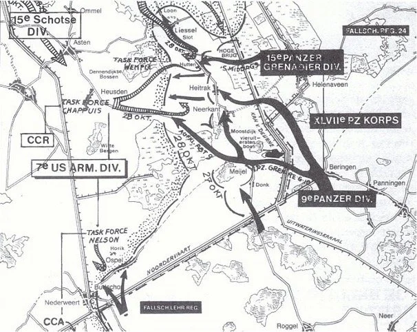
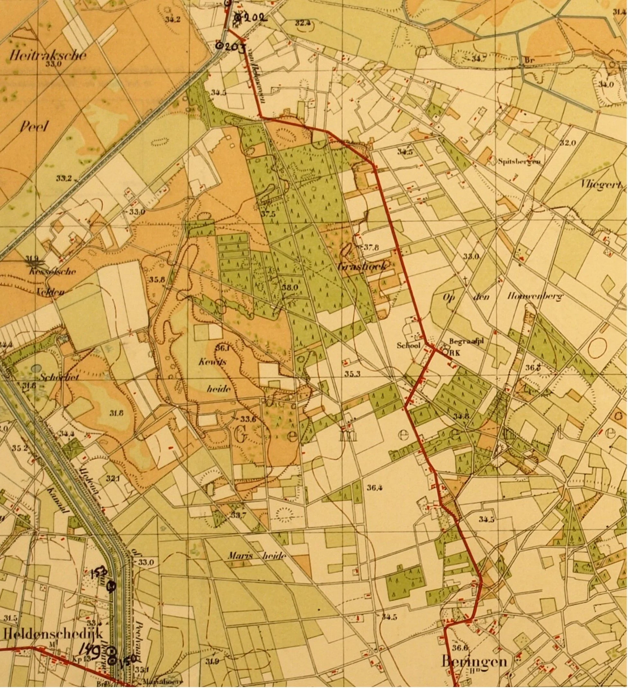
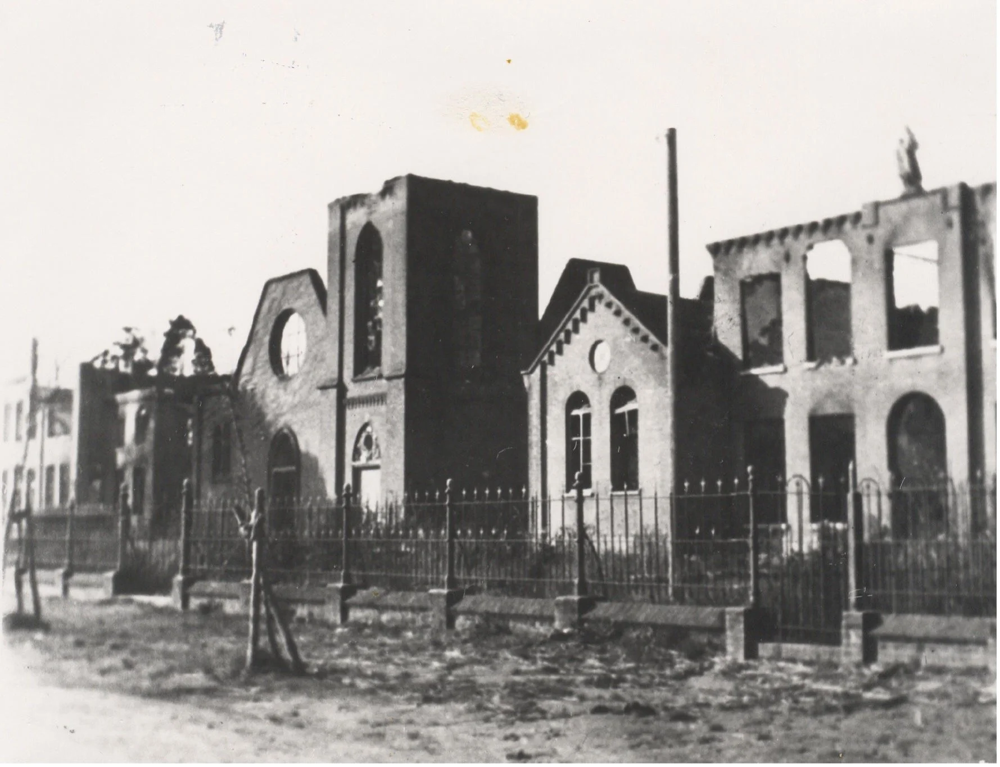
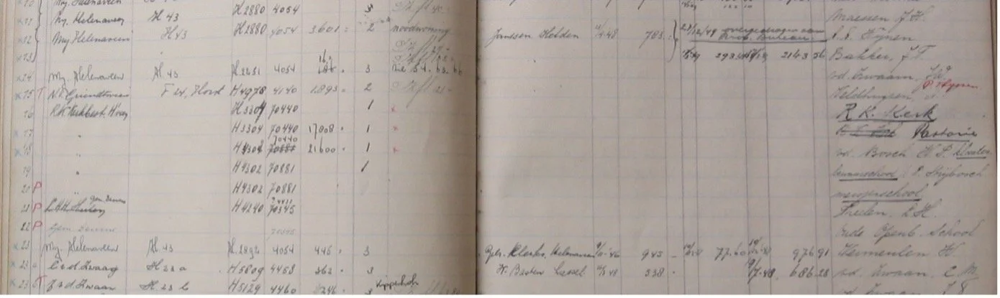
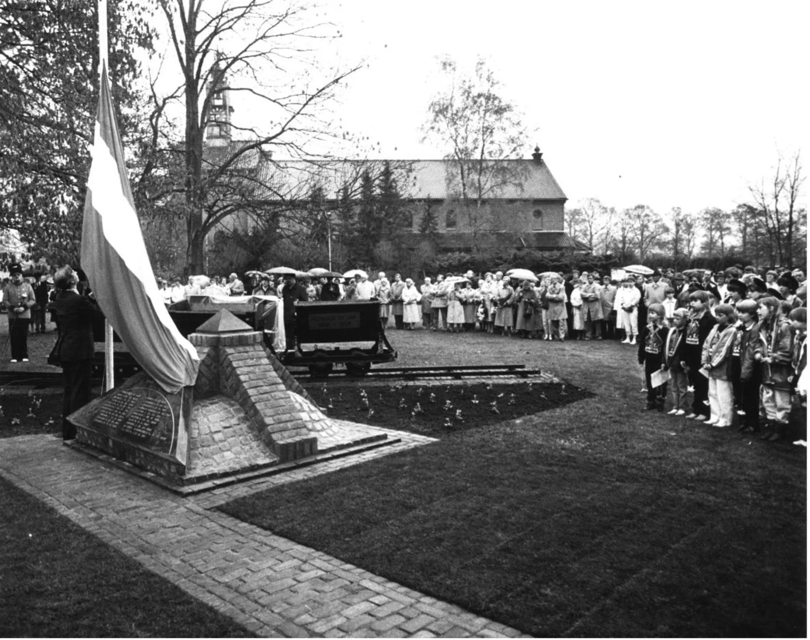
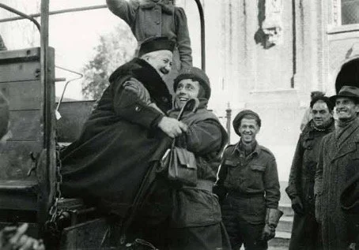
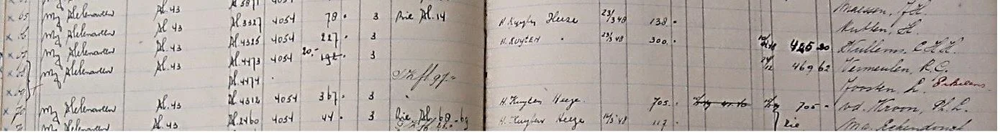
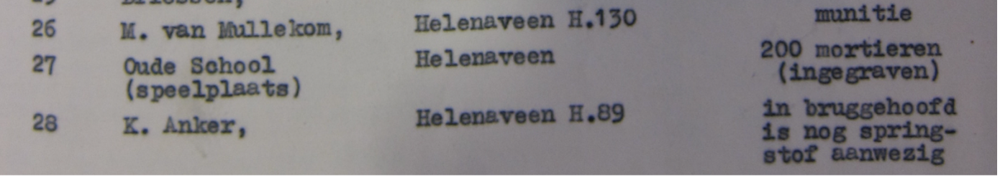

# pietertje-de-vries

> Bron: helenaveenvantoen.nl

SPANNENDE MAANDEN VOOR HELENAVENERS. WAAR BLIJVEN DE TOMMIES?

Door Hans van de Laarschot

Eind september 1944 evacueren de Helenaveners vanwege het oorlogsgevaar, maar zeker ook op bevel van de Duitse commandant, naar het kamp van de paters in het Mariaveen en naar Grashoek. Een van hen is de eenentwintigjarige Pietertje de Vries. Pietertje of Pietje is een dochter van Evert de Vries († 1937) en Geesje Schonewille, die aan de Helenavaart wonen op het adres H68. Na de oorlog trouwt Pietertje met Roel Vermeulen en gaan zij daar wonen. Ze begint op 23 september met het opschrijven in haar dagboek van alles wat ze meemaakt, ziet en hoort. Door de Duitse tegenaanval op 27 oktober wordt het oorlogsgeweld intenser en door fatale gebeurtenissen bijna ondraaglijk. Het zal nog tot 21 november aanhouden. Dan zijn de Duitsers door de Britten uit Helenaveen en Grashoek verdreven. Pas in december 1944 mogen de Helenaveners terug naar hun verwoeste dorp.

We pakken het dagboek van Pietertje op op de dag vóór de Duitse aanval.

Vorderen van de Duitse tegenaanval vanachter de Peelkanalen eind oktober 1944. (Collectie Hans van Toer)

Duitse tegenaanval

Donderdag 26 oktober 1944: “… Tegen de avond kwam de onheilstijding …! HEEL HELENAVEEN MOET ONTRUIMD WORDEN! DE KAMPEN MOETEN OOK GERUIMD! IEDEREEN MOET WEG! Wat nu begonnen …? Morgenochtend om 9 uur moeten we weg zijn. We zeggen wel dat we niet gaan, maar gaan toch maar aan het pakken.

’s Avonds zijn er 3 keer soldaten in huis geweest om naar mannen te zoeken. Ze wisten Toon van Woezik te zitten. Toen hoorden we ineens een gegil en gekerm. We schrokken vreselijk, want het kwam van Beukers af. Toen hoorden we een schot en raakten we helemaal overstuur, want we dachten dat er iemand dood geschoten was. We zaten alle drie te trillen van de schrik.

Toen er even later geklopt werd, durfden we haast niet de deur open te maken, maar we moesten wel, of we durfden of niet. Dus de deur maar open gemaakt en er kwamen drie soldaten binnen waaronder de luitenant. Eén heeft overal gekeken of er geen mannen waren en de andere twee hebben met ons gepraat. We waren blij toen ze weer gingen. We waren zo bang, dat we in de kelder gingen slapen. Maar van slapen kwam niets terecht door de schrik!!”

De omgeving van Grashoek ten zuiden van Helenaveen waar de belevenissen van Pietertje de Vries zich afspelen. Rechts van het midden de katholieke begraafplaats, waar de moeder van Pietertje in eerste instantie begraven wordt. Onder: Beringe van waaruit de bevrijders de evacuees naar veiliger oorden brachten. (Nationaal Archief | collectie Hans van de Laarschot | www.oorlog-depeel.nl)

Waar moeten we heen?

Vrijdag 27 oktober: “Na een hele lange en bange nacht kwam eindelijk de morgen. Omstreeks half 6 begonnen ze weer te schieten, zó erg als we nog niet meegemaakt hadden. Bij Wulms en Hermans, overal ratelden de mitrailleurs. We dachten dat we er vanaf zouden komen en niet meer weg hoefden. We hadden wel een beetje schrik, maar in die kelder zaten we toch tamelijk goed. We wilden tenminste dat ze doorschoten, dat we er vanaf komen. Maar ’t mag niet zo zijn. ’t Schieten hield om 8 uur weer op. Zo nu en dan viel er nog een schot, maar niet van betekenis. Toen we weer buiten durfden komen gingen we eerst naar Crommentuin en Beukers om te horen of die weggaan. Maar die wisten ’t ook nog niet wat of ze doen moesten. De paters waren nog naar de commandant geweest, maar hadden ook niets bereikt.

Bij Beukers hoorden we wat er ’s avonds gebeurd was. Toon van Woezik hadden ze niet gevonden, maar z’n vrouw en kind. ’t Hondje hadden ze doodgeschoten. Haar hadden ze meegenomen de hei in, dan was d’r man vrij. Leugens natuurlijk!

Tegen de middag was het schieten weer verder weg. Toen we wisten dat we tóch weg zouden moeten, zijn we maar op pad gegaan. Ieder met een volgeladen kruiwagen. Je wist niet wat je mee moest nemen. We konden naar Sevenum of naar de Grashoek. Maar ik ging liever naar de Grashoek, vanzelf. Tante Rie ook. Het was een hele onderneming. We konden vrij lopen naar het dorp, maar toen we in de Geldersestraat kwamen, begonnen ze weer erg te schieten. We moesten vlak langs het geschut. Dat was wel akelig, maar we moesten toch verder. We kwamen tegen de avond bij Linders aan, DOODMOE! Toen hoorden we dat de Grashoek ook moest ontruimen, maar die gingen niet. We konden voor één nacht bij Van Ooyen slapen. We waren al op verschillende plaatsen om onderdak wezen vragen, maar nergens was meer plaats. We zaten wel in de put. Als er nu geen plaats meer voor ons was, waar moeten we dan heen?”

Elke dag schieten

Zaterdag 28 oktober: “’s Nachts hebben we goed geslapen. Tegen de morgen werd er wel geschoten, maar het was Duits geschut (dat hier volop staat). Daar hoefden we niet bang voor te zijn. ’s Morgens ben ik met tante Mien Ulens al vroeg op pad gegaan om onderdak te vinden, maar het was overal hetzelfde: evacuees en inkwartiering. Maar ten laatste konden we toch bij een boer in een kippenhok komen, nog een eind verderop bij S. Joosten. … In dat kippenhok zaten konijnen, maar ze zouden het voor ons leegruimen …. Toen we daar kwamen hadden ze het kippenhok al netjes opgeknapt en een kachel erin gezet. Dat was fijn!

We hebben ons een tafel gemaakt en verder maar van alles opgeschooid. Van de één ’n stoel en van de ander ’n bord en zo tobben we maar aan. Ons bed was ook gauw klaar. Wat stro op de grond en de dekens er op! Gelukkig dat we die meegenomen hebben. Liggen kunnen we tenminste. We zijn blij dat we onderdak hebben. Onderwijl dat we stoelen haalden, schoten ze een Engelse jager neer, niet ver van ons vandaan. We hebben er nog voor in de sloot gelegen.”

Zondagnacht en -morgen is er weer druk geschoten. ’s Middags was dat ook zo en ook door vliegtuigen werd geschoten.

Maandag 30 oktober: “’s Morgens wordt er altijd al vroeg geschoten. Dat is hier akelig in zo’n kippenhok. Alles schudt en rammelt. Lammy Brouwer en ik zijn al vroeg op pad gegaan om brood te halen in Koningslust. Het is een heel eind lopen, maar we hadden toch weer een brood toen we thuis waren. We hoorden overal dat de Tommies uit Liessel en Meijel teruggeslagen zijn. Dat is niet best, zo komen we niet vrij. …”

Waar ze aankloppen om eten worden ze veelal niet teleurgesteld. In Panningen of Maasbree of Koningslust, overal krijgen ze vlees, brood en ander etenswaren. Dinsdagavond “schoten ze zo erg, dat we echt schrik hadden. Wij waren daar niet zo veilig, nu slaapt Wiel (een onderduiker) voortaan bij ons.”

Donderdag 2 november: Ze zijn weer op pad gegaan voor eten. “Ze schoten onderweg zo op vliegtuigen dat we nog in een sloot hebben gelegen. De scherven van het afweergeschut vielen overal naast ons neer. Richting America viel een vliegtuig. Toen we bijna thuis waren begon de Engelse artillerie te schieten. De granaten vielen dichtbij, zodat we moesten gaan liggen. We waren blij toen we weer thuis (bij Joosten in de Grashoek) waren. …”

Kerk, klooster en pastorie in Helenaveen na het verdrijven van de Duitsers op 21 november 1944. (Collectie Mij. Helenaveen | heemkundekring H.N. Ouwerling)

De schade aan kerk, klooster en pastorie was bijna 40.000 gulden (geldbedragen in 6e kolom). (Archief gemeente Deurne)

Een fatale granaatinslag

Na 4 november kan Pietertje niet meer verder met het noteren van de dagelijkse oorlogsbelevenissen. De reden dat ze het niet meer kan opbrengen is heel begrijpelijk. Haar moeder, Geesje de Vries-Schonewille, is op zondag 5 november gedood door een granaat. Die trof ook Sjaak Joosten (1890) van hun evacuatieplek. Op het fatale moment was Pietertje niet in het kippenhok, haar vijfenveertigjarige moeder helaas wel. Dominee Alsfelt kreeg het na enig aandringen voor elkaar, dat moeder Geesje – protestants -begraven mocht worden op het ongewijde deel van het katholieke kerkhof van Grashoek. Omdat de mannen niet gezien mochten worden, droegen op woensdag 8 november tien meisjes de kist. “De hele tijd was er nog niet geschoten. Wel waren op de heenweg vliegtuigen overgevlogen, maar toen we weer teruggingen begon het onderweg weer. We hebben toen nog in de sloot gelegen. Vanaf dat ogenblik ben ik bij Van Ooyen gekomen.” Later heeft Pietertje haar dagboek uit haar geheugen aangevuld.

Precies een week na het dodelijk ongeluk van haar moeder was er “een granaatinslag vlak bij ons huis. We dachten dat ons laatste uur geslagen had. Wat werd er toen gebeden en geschoten.” Op 17 november was “de hele dag granaatvuur zonder onderbreking. We waren zo bang. We sliepen ’s nachts allemaal in de kamer onder tafels, net of dat ook nog iets zou helpen. De schoorsteen was ook al van het huis geschoten. Ik was helemaal niet meer bij Joosten geweest. Eerst was ik te verdrietig en nu kunnen we niet meer van huis.” De dag erop “ging het granaatvuur onverminderd door, terwijl er bijna geen Duitsers meer waren. Dus zo komt de Tommie. Toen ’s middags een Engels vliegtuig het Duitse geschut vlakbij ons beschoot, stonden alle huizen in de buurt onder dikke kruitdamp. De angst was vreselijk, maar het liep goed af. Die stank vergeet je ook nooit meer.” Op zondag 19 november was het “wat rustiger. We zagen nog wat verspreide Duitsers die iets op de grond legden en die zich moesten dekken voor een vliegtuig. … ’s Avonds kwamen ze twee keer zeggen, dat we moesten vertrekken naar Sevenum, want de Tommies waren op komst en zouden alles plat schieten.” Uiteindelijk konden ze blijven, maar op maandagmorgen om 7 uur “kwam een granaatscherf zo vlakbij, dat de glasscherven van de ramen over ons heen vlogen en wij de schuilkelder ingevlucht zijn. We zijn daar de hele nacht gebleven … Zoals wij die nacht hebben gebeden, hadden we nog nooit gedaan, want we wisten als er een granaat op de kelder valt, zijn we allen dood. We hebben gesmeekt om behoud en genade tot dinsdagmorgen.”

Dodenherdenking bij het oorlogsmonument in Helenaveen, waarop de naam van de moeder van Pietertje de Vries, G. de Vries-Schonewille, een vermelding heeft. (Fotocollectie gemeente Deurne | heemkundekring H.N. Ouwerling)

Vrij

Deurnenaren genoten al vanaf 24 september van hun teruggekregen vrijheid. Het duurde nog tot dinsdag 21 november, dat de Britten de Duitsers uit Helenaveen en Grashoek hadden verdreven. Die dag “om een uur of half 8 ’s morgens kwam Lida Brouwer zeggen dat alle Duitse soldaten weg waren. Ulens meende reeds maandag een Engelse tank te hebben gezien rond het huis van Van Ooyen. En inderdaad, wij konden het niet geloven, maar het was echt waar. Wij togen met het weinige bagage dat we dragen konden naar de grote weg; iemand met een stok met een hemd eraan gebonden voorop. En daar zagen we dan eindelijk tot onze grote blijdschap de eerste Tommies, onze bevrijders die ‘goodmorning’ zeiden. Wij verstonden er natuurlijk niets van. Het Wilhelmus werd gezongen met tranen van blijdschap en ontroering, want er was ook verdriet. Nu waren we VRIJ. We kregen cake en biscuit, chocolade en sigaretten; wat een luxe. Maar onze ellende was nog niet voorbij, al dachten we dat.”

Een blije evacuee uit Venray wordt door een Britse bevrijder voor de kerk in Bakel van de truck geholpen. (Collectie Imperial War Museum | heemkundekring H.N. Ouwerling)

Zelfs baby’s worden ontsmet met “DDT”. (Collectie Imperial War Museum | heemkundekring H.N. Ouwerling)

De evacuees konden nog niet meteen terug naar huis. Pietertje ging met andere evacuees te voet naar Beringe. Van daar zouden ze door Engelse soldaten worden weggebracht. “Weg van het front, maar we wisten niet waar naar toe. Toen we eindelijk in een vrachtwagen van de Engelsen konden, werden we weggereden, maar waarheen …? Over Meijel, dat helemaal kapot geschoten was, en Neerkant, ook heel erg, en Liessel minder, naar Deurne. Daar stonden veel mensen langs de weg, want ze hadden gehoord dat er evacuees door zouden komen... In Bakel werd gestopt en werden we in de school ingespoten met DDT-poeder, zogenaamd ontluisd. We werden geregistreerd en kregen soep, thee en brood. Toen verder naar Boekel waar we door vrijwilligers naar mensen werden gebracht, die zich opgegeven hadden voor evacuees. De familie Vermeulen en ik werden bij een boer gebracht en onderweg werd tegen pa Vermeulen gezegd, als er iets niet goed was, moest hij het direct zeggen. Dat vonden we heel raar, maar later niet meer. We moesten op stal blijven, daar stond wel een tafel en stoelen. Toen vader Vermeulen vroeg of ze iets te drinken hadden, kregen we koud water! Wat een verschil met Grashoek. In nood deel je alles samen en in weelde kun je niets missen. Hoe we daar geslapen hebben, weet ik niet meer. De volgende dag kwam er iemand kijken hoe we het hadden. Niet goed dus!” Ze konden naar een ander adres waar ze het heel goed hadden. Daar hoefden ze niet lang te verblijven, want familieleden hadden gehoord waar ze terecht waren gekomen. Twee ooms kwamen Pietertje en Roel halen; op de fiets naar Deurne. “Maar het zou toch nog wel even duren eer we eindelijk naar huis mochten, want er mocht niemand Helenaveen in. Roel en oom Fok gingen het toch proberen, maar bij Anker durfden ze niet verder, want er lagen mijnen in de weg. Ook in het dorp lagen mijnen. Dat was allemaal afgezet met lint en dan wist je dat het er niet deugde. Ook hadden de Duitsers in verschillende huizen zogenaamde boobytraps achtergelaten aan deurklinken, kasten en zelfs in boeken. Als je daar aan kwam, gingen ze af. Maar uiteindelijk kwam toch de dag dat we naar huis konden. Ik denk zo ongeveer half december.

De schade aan het huis van Roel Vermeulen en Pietertje de Vries (no. 68) en hun buren viel mee (geldbedragen in 6e kolom). (Archief gemeente Deurne)

In het dorp was veel kapot geschoten, maar in ons huis viel het mee. Alleen een vreselijke troep! In de kamer en slaapkamer een dikke laag stro op de grond, waar vuil ondergoed en handgranaten lagen. En hele rissen kogels. Onvoorstelbaar! Varkenspootjes, verschimmeld en wel! Pakketjes die de Duitsers klaar hadden liggen om naar huis te sturen met cadeautjes voor de familie! Er lag ook een mooie handtas, dus die wilde ik wel. Tot ik er mee naar de kerk ging en vrouw Anker naar me toekwam en zei: “dat is mijn tas”. Weg tas. Zo sjouwden die moffen alles door elkaar. Dingen van een ander lagen bij ons en omgekeerd. Uit de stellingen in het bos hebben we bedden, divan- en tafelkleden, matten enzovoort moeten halen.”

Overal in Helenaveen loerde het gevaar van ontplofbare munitie en springstof. (Archief gemeente Deurne | Collectie Richard Schoutissen | www.oorlogsslachtoffers.nl)
