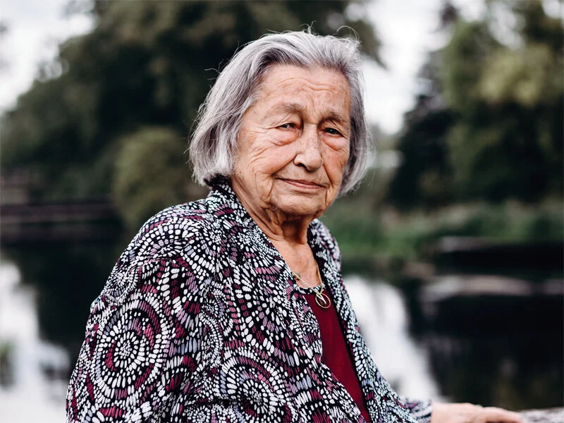

# riek-van-esseveldt-snieder

> Bron: helenaveenvantoen.nl

# Riek Van Esseveldt-Snieder

## RIEK VAN ESSEVELDT-SNIEDER

De ouders van Riek Van Esseveldt-Snieder waren kaasboeren en kwamen in 1936 in de Willem III Hoeve wonen en werken. Riek maakte de oorlog mee als kind in het deel van Helenaveen dat 'Boven' genoemd wordt.

### Rustige eerste jaren

De eerste jaren van de tweede wereldoorlog verliepen voor de familie Snieder vrij rustig. In 1940 moest vader 'opkomen' en was hij tien dagen onder dienst, maar verder gebeurden er weinig spannende dingen. Dat veranderde in het najaar van 1944.

### Eerst de koeien, dan de mannen

In september 1944 vorderden de Duitsers koeien bij de boerenfamilies. Bij Riek thuis mochten twee koeien achterblijven voor de melk. Riek vertelt dat haar vader een angstig voorgevoel had: “Op een gegeven moment gingen de koeien weg en mijn vader zei: dat gaat ook met de mannen gebeuren.”

Op zondag 23 september volgde een nieuw verlies: er kwamen jonge Duitse soldaten aan op de Willem III Hoeve, van achter over de Soeloop. Ze waren nat en hongerig, en werden door de familie Snieder netjes voorzien van koffie, thee en brood. Op maandag werd de familie de hoeve uitgezet: “Er kwamen hoge Pieten in.” De familie Snieder verhuisde naar de stukje verderop, waar ze bij de familie Prijs een kippenhok betrokken. De hele familie werd daar ondergebracht, inclusief opa en oma van vader's zijde.

Riek's moeder ging dapper iedere dag melken en kaas halen thuis. De kaas hield ze goed verborgen voor de Duitsers. Riek vertelt: “Ze hadden al met een hooivork door de tralies gestoken, maar konden niet ontdekken waar wij de kaas hadden. Wij hadden een schuiftrap, daar kon je mee de kelder in. Die schuiftrap hebben ze nooit gevonden.” De moeder van Riek ruilde melk met de Duitsers voor 'kuch' (zuur, donker brood). Wat ze over had bracht ze naar de familie Schonewille, een eindje verderop in de straat. Daar zat het vol met evacuees uit Griendtsveen.

### Razzia en evacuatie

In de ochtend van 8 oktober 1944 kreeg Riek's vader gelijk: hij werd opgepakt en meegevoerd: “Mijn vader is meegenomen op die 8e oktober. Ze hebben het altijd over de Kerkrazzia, maar Boven werden de mensen gewoon uit de huizen en schuren gehaald, huis aan huis. Overdag waren we in het kippenhok, toen mijn vader weg was, en 's nachts in huis. Daarna zijn we naar de Emmahoeve gegaan, die was helemaal onderkelderd.”

Niet lang daarna volgde de evacuatie van Helenaveen. Riek herinnert zich: “Opa zei: jullie hebben nog een toekomst, gaan jullie maar weg.” De familie moest richting de Zeilberg lopen, waar ze op een afgesproken plek opgepikt werden door de Engelsen. In het gemeentehuis werden ze verdeeld over een aantal beschikbare plaatsen. Riek kwam in De Rips, dat toen al bevrijd was, terecht bij haar opa en oma van moederskant. Moeder zelf bleef in Deurne, om dichter bij opa en oma van vaderskant te zijn.

### Terugkeer

Rond het nieuwe jaar ging onder andere Riek's moeder naar de Peel om polshoogte te nemen: “Ome Teunis en ome Wijnand gingen met mijn moeder naar de Peel om te kijken. Toen ze terugkwamen, net voor nieuwjaar, hadden we nog twee koeien. De andere dag was er één op ’n mijn gelopen.”

Zo net na de oorlog zat de Willem III hoeve vol met ontheemden: evacuees, mensen uit de buurt wiens boerderijen te erg beschadigd waren, mannen die terugkeerden uit Duitsland. De vader van Riek was niet bij deze laatste categorie: “Mijn vader kwam niet terug, mijn moeder bleef alleen. Er moesten getuigen zijn die verklaarden dat mijn vader zeker gestorven was. Ik ben toen, ik was een meisje van 16, overal naar toe geweest, naar de Grashoek en andere plaatsen. Toen zei iemand, die werkte ook bij ons: ik wil best wel getuigen, want jullie vader was héél slecht toen ik weg ging.”

De moeder van Riek was 38 toen ze weduwe werd. “We hebben daarna nog lang gewacht op mijn vader, maar die kwam niet meer terug.”
