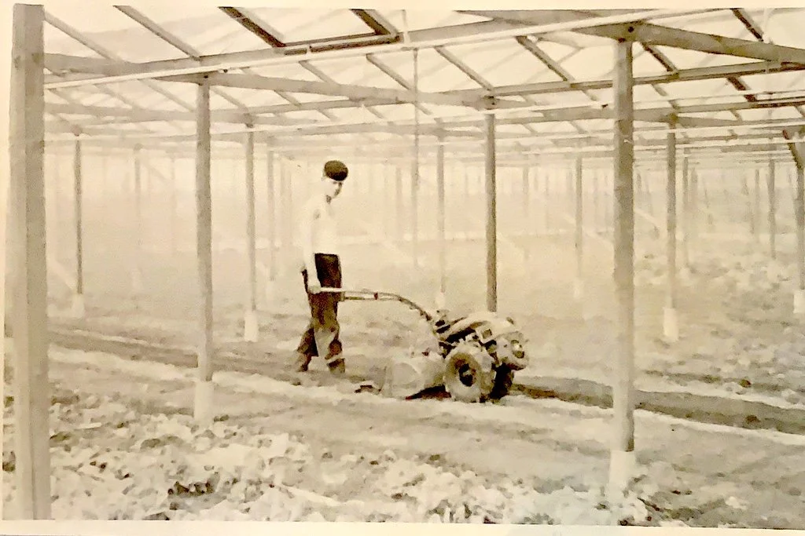
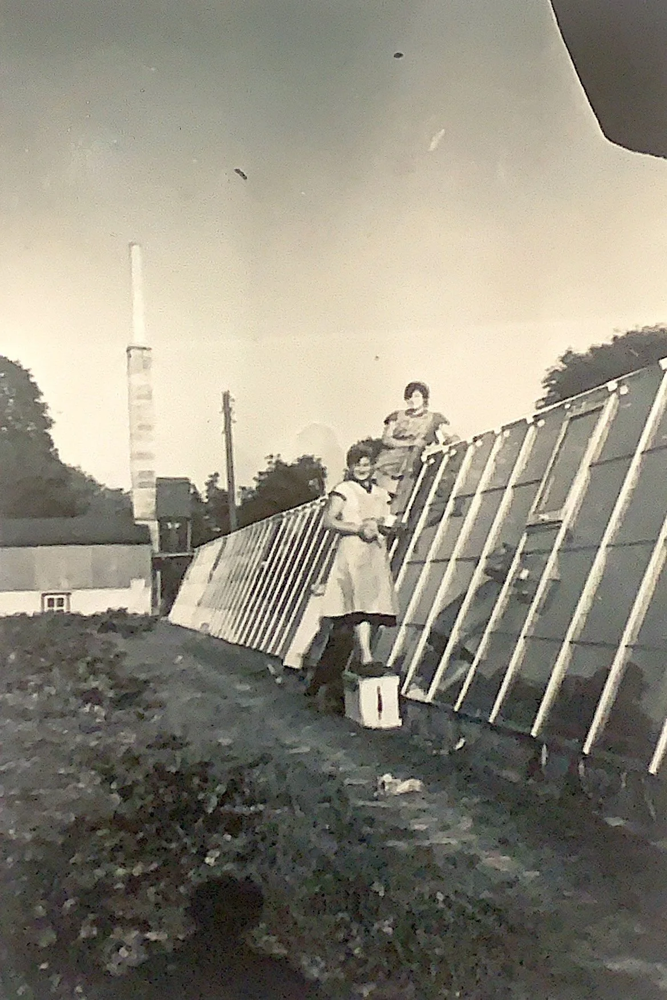
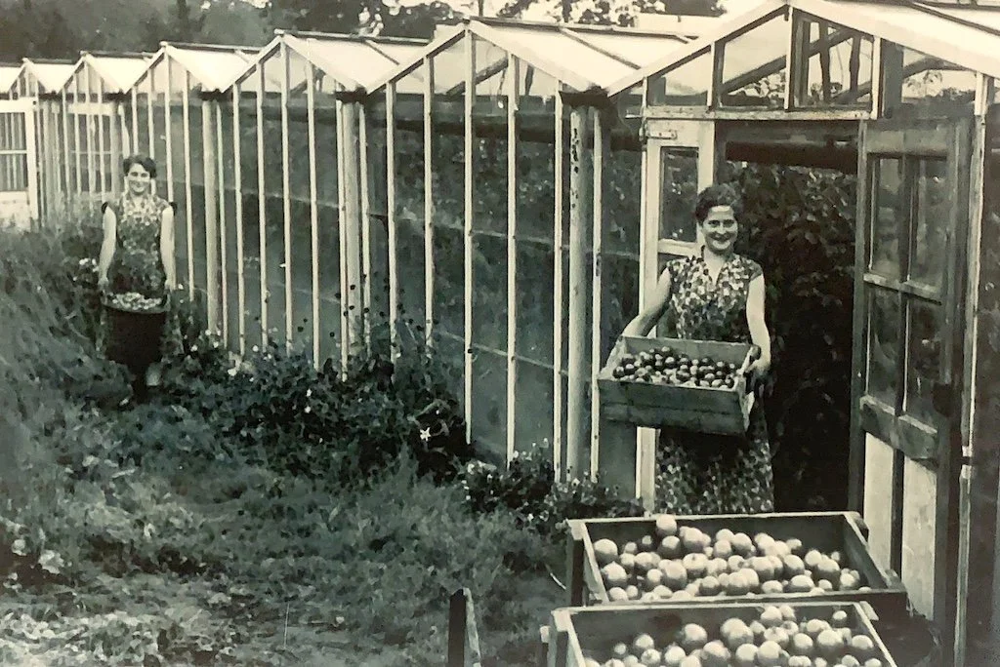
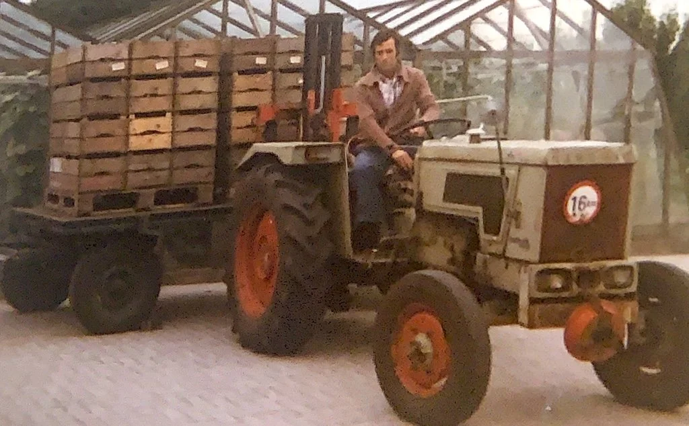

# riky-bakker-mijn-werk-op-de-tuinderij

> Bron: helenaveenvantoen.nl

Werken op de tuinderij door Riki Bakker.

Met 14 jaar kwam ik van school en ben bij mijn ouders thuis aan het werk gegaan.

Op maandag, de wasdag, moest ik moeder helpen met de was. Op zondag werd de witte was al in de grote ketel gedaan, met water en zeep. De ketel werd gestookt met hout, tot dat hij kookte. Daarna werd de was nog eens flink omgedraaid en dan was het voor die dag klaar.

Op maandag werd de ketel opnieuw aangestookt en als hij kookte ging de was in de wasmachine die flink op en neer draaide in het warme sop. Daarna door de wringer en nog twee keer spoelen in lauw warm water. Nadat alles nog een keer door de wringer gegaan was, ging het op de waslijn om te drogen. Bij goed weer buiten en bij slecht weer op de zolder. Dat was het werk op de wasdag.

Verder moesten ‘s morgens en ‘s avonds de kippen en de varkens gevoerd worden

Overdag hielp ik Moeder met alle voorkomende werkzaamheden. Als er dan tijd over was ging ik mee naar buiten. Bij ons is de eerste kas van Helenaveen gebouwd . Deze kas was van hout en niet geimpregneerd dus werd hij iedere herfst geverfd.

In de kas was altijd werk: Sla poten en snijden, tomaten plukken en dieven of water geven en indraaien. In die jaren was er geen water voor iedere plant, de tomaten stonden op een klein heuveltje en liet je het water gewoon tussen de rijen lopen.

De sla die te klein was voor de veiling werd in een kist gedaan en dan gingen Marietje en ik naar de Grashoek om deze te verkopen langs de deur. Moeder was dan weer blij als we een paar gulden mee naar huis brachten.

Buiten hadden we in het voorjaar spinazie, die werd vroeg in de morgen gesneden en dan naar de veiling gebracht. Onder plat glas hadden we komkommers - stambonen - worteltjes en aardbeien.

Buiten hadden we ook nog augurken - bonen - aardappelen - tuinbonen - selderij en verschillende soorten kool. Verder een stukje bieten voor de twee koeien. De melk was voor eigen gebruik, maar er ging ook een melkbus naar de melkfabriek in Liessel. Toen kwam er nog geen melkboer langs de deur.

Toen er op het Zinkske hei geploegd werd, kocht mijn Vader daar acht hectaren grond. Er kwam een tractor en op het Zinkske werden landbouwproducten gezet om te proberen of die daar groeiden.Rogge - suikerbieten - aardappelen maar ook augurken en bonen. Verder zwarte bessen en aardbeien en er werd natuurlijk ook een kas gebouwd.

In 1959 gingen we er wonen in een nieuw gebouwd huis met Vader en Moeder en negen kinderen. Rina en Marietje waren ondertussen kraamverzorgster, Joke deed de verpleegster opleiding in Tegelen. Harrie studeerde in Valkenburg, Theo ging naar de tuinbouwschool in Horst. Wim ging naar de technische school in Helmond, Elly volgde de huishoudschool in Neerkant en Truus ging nog naar de lagere school in Helenaveen.Jan onze oudste broer nam de tuinderij op de Kervelweg over.

Er werden op het Zinkske ook weer kippen gehouden in een hok maar ook op de bergzolder, dat was nog nooit vertoond. En er waren ook varkenhokken, de biggen die daar geboren werden bleven tot ze vet waren en gingen dan naar de slachterij. Maar ook voor ons zelf iedere winter eentje in de diepvries. Zo hoefde je niet naar de slager.

Theo aan het werk in de kas aan de Zinkskeslaan

De groenten die er waren gingen naar de veiling in Venlo. De aardappelen, soms wel twee hectaren, werden uit gedaan met de machine maar het oprapen was handwerk.Bij het rapen sorteerde je al de grote en de kleine. De grote voor te eten en voor de handel.De kleine werden met wortels gekookt, doorgedraaid en zo gevoerd aan de varkens. De rogge die er groeide was ook voor de verkoop en het stro voor ons zelf en de verkoop.

En dan was er ook altijd een stuk suikerbieten voor de verkoop. Daar was veel handwerk aan. Schoffelen, afplukken en op één zetten. Als ze volgroeid waren was het uittrekken, afsteken en opladen, dan aan de weg op een hoop brengen en zo gingen ze naar de suikerfabriek.

Zo heb ik met plezier mee kunnen werken tot mijn zes en twintigste jaar. In dat jaar ben ik getrouwd met Wim van Mullekom, met wie ik samen heb getuind op ons bedrijf aan de Centurioweg.

Riki Bakker van Mullekom

Schilderen van de kas. op de achtergond het ketelhuis

Tomaten oogst

Augurken laden voor naar de veilingloods op de Centurioweg
