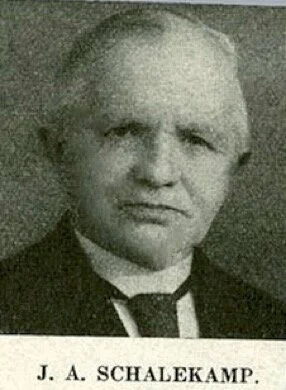

# schalekamp-socialisten

> Bron: helenaveenvantoen.nl

### Dominee Schalekamp vertelt over een keet vol socialisten

In Juli, was ik in den namiddag naar de Peel gewandeld, en liep daar nu in het turfveld. Verschillende keeten had ik reeds bezocht, en hier en daar ook bij turfbulten gesprekken gehouden, met turfstapelende vrouwen en meisjes en jongens. 't Werd reeds tegen den avond; 'n eind verder stond nog een groote keet, waarin niet minder dan 35 socialisten huisden, met eene keetmeid en een keetjongen. Zou ik er heengaan? 't Werd al zoo laat. Minstens twee uren had ik dan noodig, eer ik van daar weer thuis was.

Maar als ik er niet heenging, kon men wel eens denken dat ik bang was. Dat wilde ik niet weten. Dus na kort beraad trok ik er op af.

Nog niemand vond ik er in, dan in 't midden der lange keet, de keetmeid en den keetjongen, bezig met aardappelen schillen. Ze keken mij wantrouwend aan.

Ik vroeg: „Jullie kent me zeker niet " „Nee" was 't antwoord. „ Ik ben de dominee van 't Veen." 'n Grijnslach was 't eenig antwoord. Ik zette mij op een bank neer, verwachtende dat de lieden toch wel spoedig komen zouden. En zoo gebeurde het ook; zes mannen kwamen binnen, die allen eenigszins verwonderd naar mij keken.

„Goeden avond, vrienden!" zeide ik.

„Ook g'navend," was 't antwoord. Weldra zetten de mannen zich tegenover mij, op een bank, aan de lange tafel neer.

Boven de tafel, over de geheele lengte der keet, hing aan houten jukken aan de zoldering, een plank. Dat was hun provisiekast. Nadat de mannen even gezeten hadden, kregen ze van die plank brood en spek. Toen ze ieder eenige sneden brood gesneden hadden, belegden ze die met dikke stukken spek. Ik zat alles maar zwijgend aan te zien, totdat een der mannen begon te eten; toen vroeg ik: „Hé, doen jelui dat zo?"

„Hè?" vroeg een man van ruim 60 jaar.

„Ja, zie je, ik vraag dat zoo maar, omdat ik dat zoo heel anders gewoon ben; als ik ga eten, dan bid ik er altijd eerst des Heeren zegen over af."

„Hm," was 't antwoord: „wij leven hier maar als de honden hoor."

„0 ja? Dus je trekt je maar van niets wat aan?"

„Kun je begrijpen! Niks hoor."

„Nou, da's verbazend gemakkelijk; jelui eet en drinkt en werkt en slaapt, en bekommert je verder maar nergens over."

„Jij hebt 't begrepen hoor; wij leven hier maar zeer onverschillig."

„ja, ja, leven als 'n hond, en ten slotte sterven als 'n hond." De man keek mij eenigszins verwonderd aan.

„Ja, goeie vriend," zei ik toen. „Als je leeft als 'n hond, dan sterf je ook als 'n hond, dat kan niet uitblijven."

„Zie vriend, je leeft er maar zorgeloos op door; over dood en eeuwigheid denk je maar niet, en toch vriendje, komen er wel eens tijden in 't leven voor, dat je er maar al te krachtig bij bepaald wordt."

Jvw
