# steenkool

> Bron: helenaveenvantoen.nl

### Helenaveen en de kolenmijn die er nooit kwam

Begin 20e eeuw was steenkool booming business in Nederland. Omdat men hoopte ook buiten Zuid-Limburg steenkool te vinden, werd in 1903 de Dienst der Rijksopsporing van Delfstoffen (ROD) opgericht. Na een aantal mislukte boringen, richtte men het vizier op de Peel, een tektonisch hoger gebied waar de kansen beter leken. De eerste boring vond plaats in Helenaveen. Bij de scheepswerf aan de Geldersestraat verscheen een imposante boortoren.

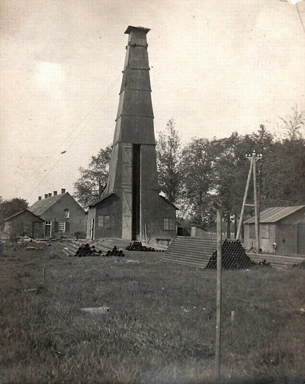

De boortoren vanuit het zuiden gezien met de voorraad boorpijpen.

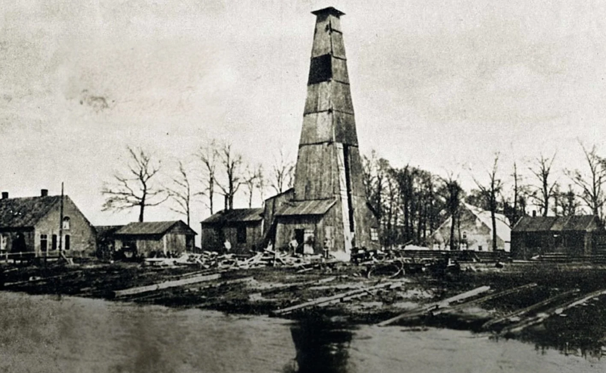

De boortoren op de voormalige scheepswerf . De sleephelling is nog aanwezig

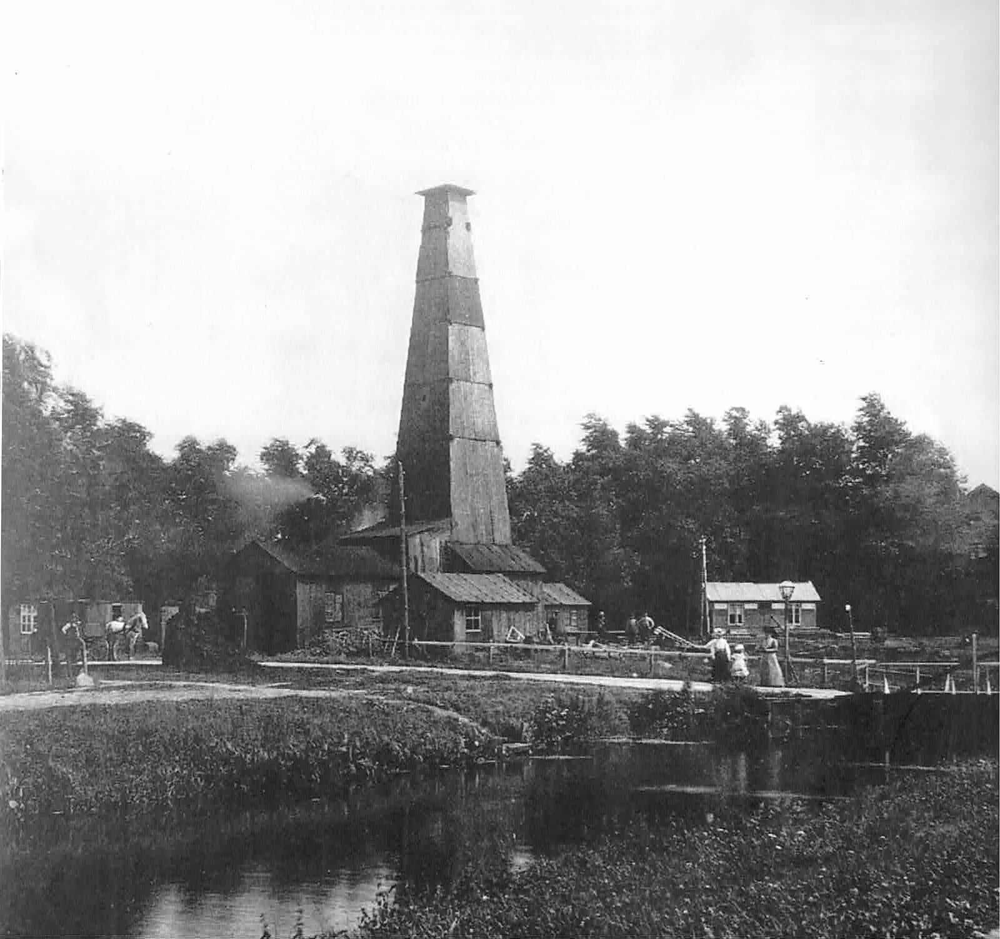

Rook en stoom uit de machinekamer, de boortoren in vol bedrijf.

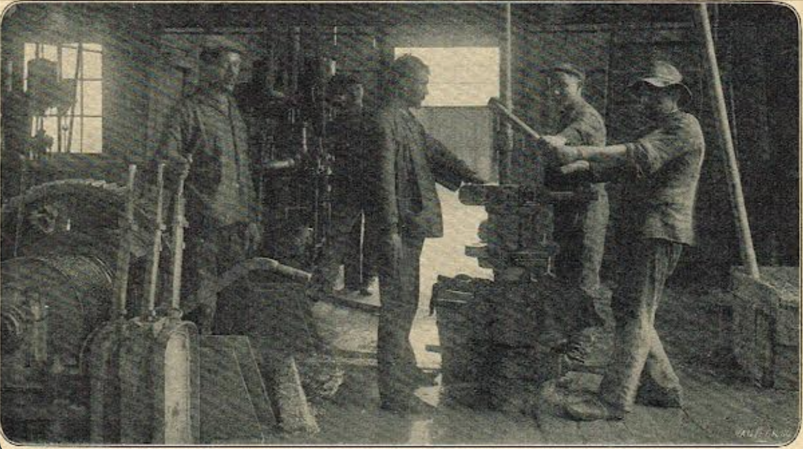

Het inwendige van de boortoren

In augustus 1906 was het raak in Helenaveen: op 914 meter diepte werd steenkool gevonden. Het was groot nieuws – de vlag ging uit, koningin Wilhelmina stuurde een gelukstelegram en zelfs in de Eerste Kamer werd de vondst geprezen. Nieuwe boringen in onder andere Helden volgden snel.

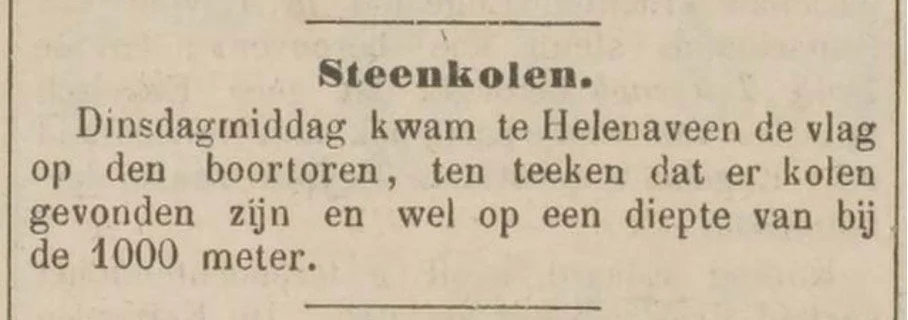

Bredasche courant 17-08-1906

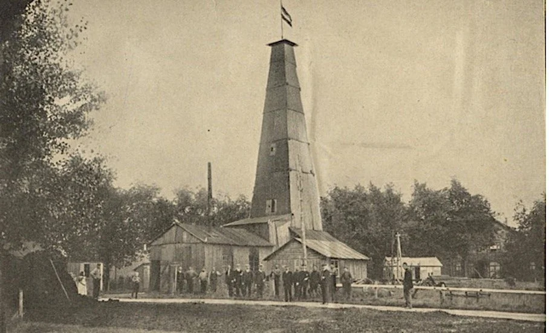

Steenkool gevonden, vlag in top en het personeel op de foto.

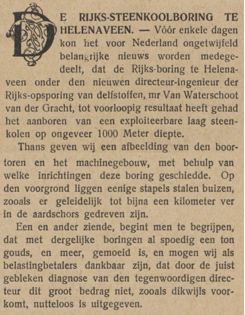

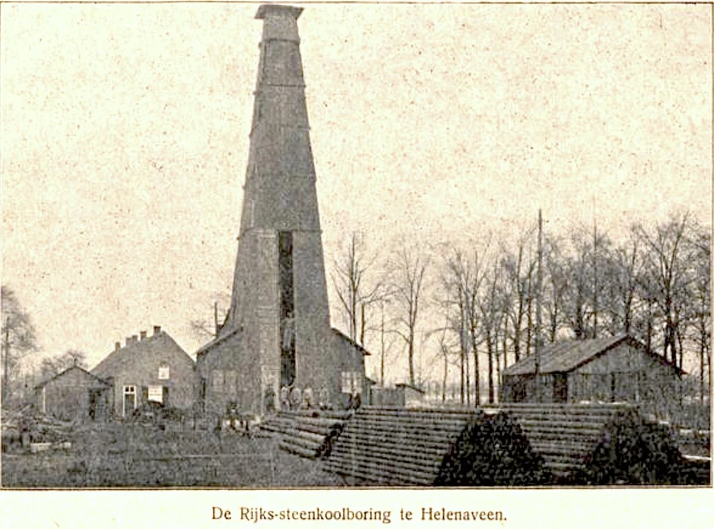

Geïllustreerd zondagsblad voor katholieken 26-08-1906

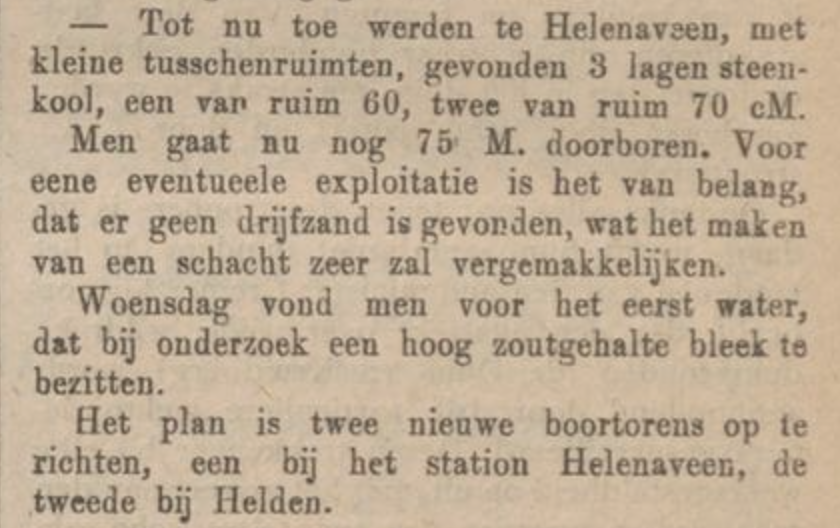

Westlandsche courant 05-09-1906

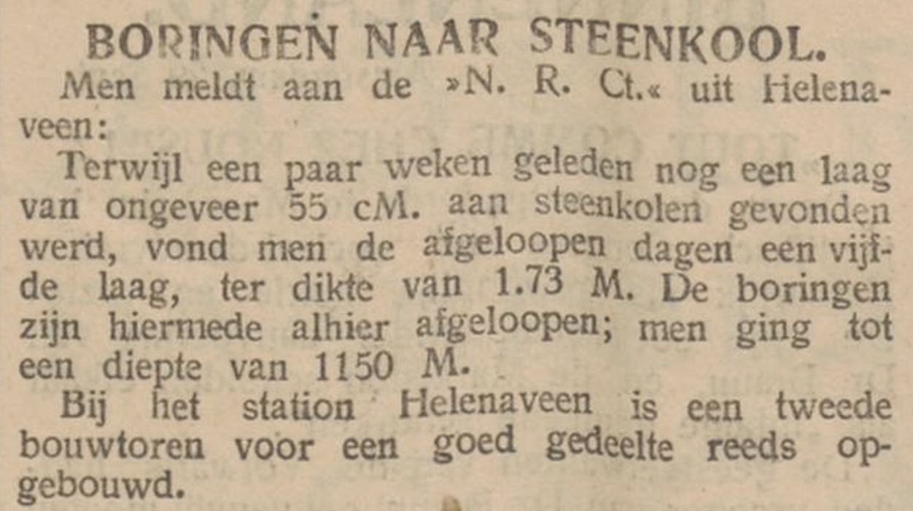

De morgenpost 29-09-1906

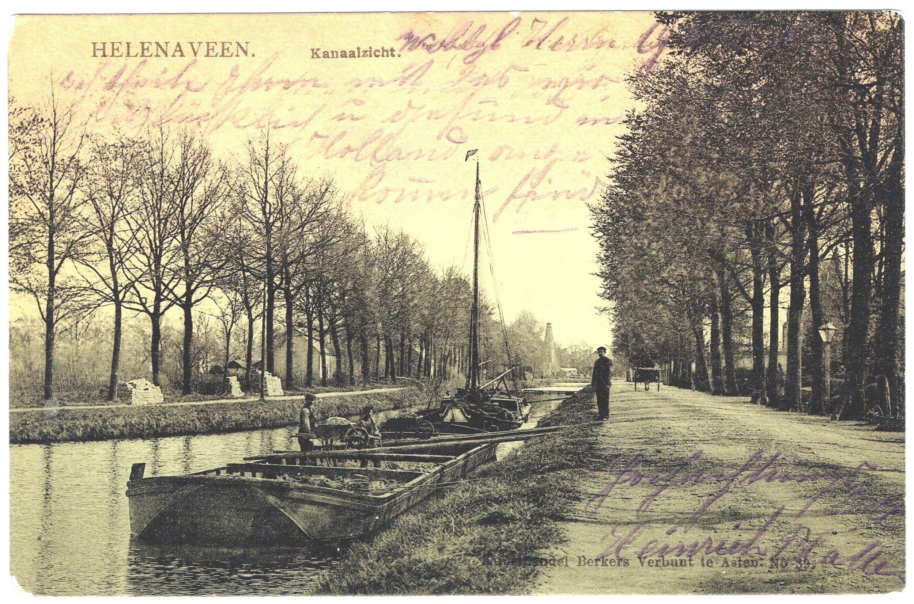

Schepen lossen mest uit den Bosch. Op de achtergrond de boortoren

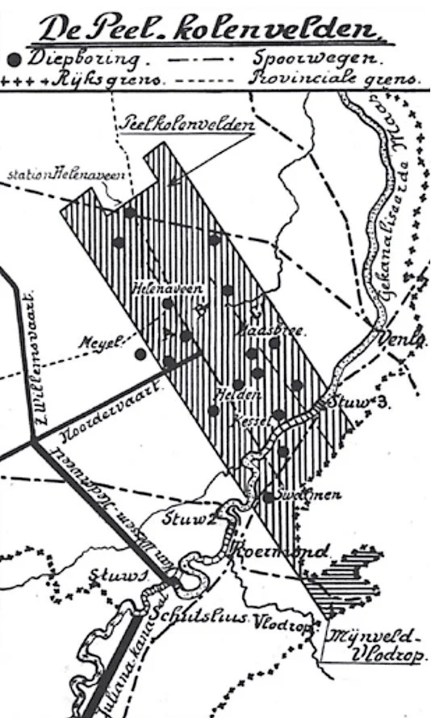

Uit onderzoek bleek dat het Peelgebied maar liefst 1,7 miljard ton steenkool bevatte op winbare dieptes. Toch werd er geen mijn aangelegd. Door de economische onzekerheid na de Eerste Wereldoorlog durfde men het risico niet aan.Tijdens de crisisjaren van de jaren dertig pleitte men opnieuw voor mijnbouw, onder meer om werkloosheid tegen te gaan, maar ook toen gebeurde er niets.

Na de Tweede Wereldoorlog nam de vraag naar energie sterk toe. In 1952 werd de Peelcommissie opgericht, die opnieuw een enorme voorraad steenkool in de regio bevestigde. In het naburige Vlodrop begon men zelfs aan de aanleg van staatsmijn Beatrix.

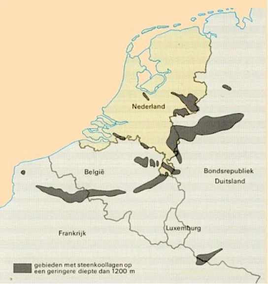

Maar opnieuw liep het anders: in 1962 werd de bouw stilgelegd en in 1965 werd besloten de Limburgse steenkolenmijnen definitief te sluiten. De ontdekking van het aardgasveld in Slochteren maakte steenkool overbodig.

En zo bleef Helenaveen het dorp dat bijna een kolenmijn kreeg.

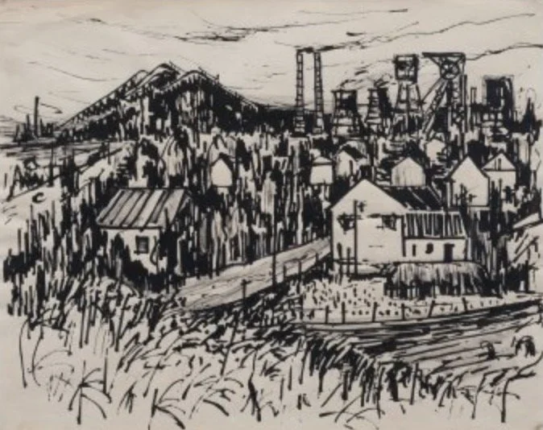

(tekening Ber Mengels, demijnen.nl)

Zo had Helenaveen er misschien uit kunnen zien.Rechts de schachtbokken, koeltorens, schoorstenen en bedrijfsgebouwen bij de Geldersestraat. Links de steenberg in Mariaveen. Op de voorgrond de mijnwerkerswijk aan weerszijden van de Oude Peelstraat.

J.v.W 10 juli 2025

BronnenDeurnewikiTheo van de Mortel - Boortorens in de Peel ( https://natuurtijdschriften.nl/pub/1021589 )DelpherAndré Vervuurt: Helenaveen van Boven tot Koningslaan 1900-1925Collectie Cees Hogendoorn Collectie Gerard Veldhuizen
