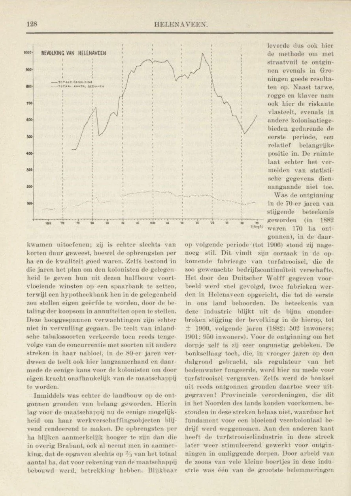

# tijdschrift_econ_geographie

> Bron: helenaveenvantoen.nl

### H.A. Schönhage,

### HELENAVEEN, sociografie van een ontginning in de Peel.

Tijdschrift voor Economische Geographie29e jaargang, no. 6 - 15 juni 1938.

