# verhalen-van-ooggetuigen

> Bron: helenaveenvantoen.nl

### Oorlogsverhaal Helenaveen

Dit is het oorlogsverhaal van Helenaveen, samengesteld aan de hand van verschillende getuigenissen, gebeurtenissen, belevenissen en ervaringen van Helenaveners die de oorlog hebben meegemaakt. Het is een overlevering van ervaringen en belevenissen, zo veel mogelijk naar waarheid opgeschreven. Deze overleveringen worden zo goed mogelijk geplaatst in het grote verhaal, maar blijven met name persoonlijk en subjectief.

### Werkgroep Helenaveen Bezet en Bevrijd

Sandra van Cauwenberghe, Annie van Galen-Derks, Nelly Kastelijn, Hans van de Laarschot, Riki van Mullekom-Bakker, Gerard Veldhuizen, Wim van der Werf en Jan van Woezik.

### Verhalen van ooggetuigen

Waarom een herdenking over de oorlog in Helenaveen? Allereerst vanwege het feit dat het in november 2019 75 jaar geleden is dat Helenaveen en de omringende Peel werd bevrijd. Het klinkt misschien raar, maar de echte oorlog in Helenaveen begon pas bij de bevrijding…

Waarom? Door een volstrekt onbelangrijke beslissing voor het dorp werd de geallieerde opmars naar de Duitse grens stilgelegd door de Duitse tegenaanval en werd Helenaveen en de strook land tussen de Peelkanalen maandenlang frontgebied.

De persoonlijke verhalen uit met name die periode hebben wij – de werkgroep Helenaveen Bezet en Bevrijd – getracht te achterhalen. Deze verhalen en andere ervaringen zijn de basis voor Helenaveen bezet en bevrijd. Natuurlijk vervagen na 75 jaren of meer de herinneringen, maar nu kunnen we deze persoonlijke herinneringen van de mensen uit ons dorp nog horen en delen. Lees de persoonlijke oorlogsverhalen van de inwoners van een klein dorp in de Peel of koop het boek.

### De verhalen

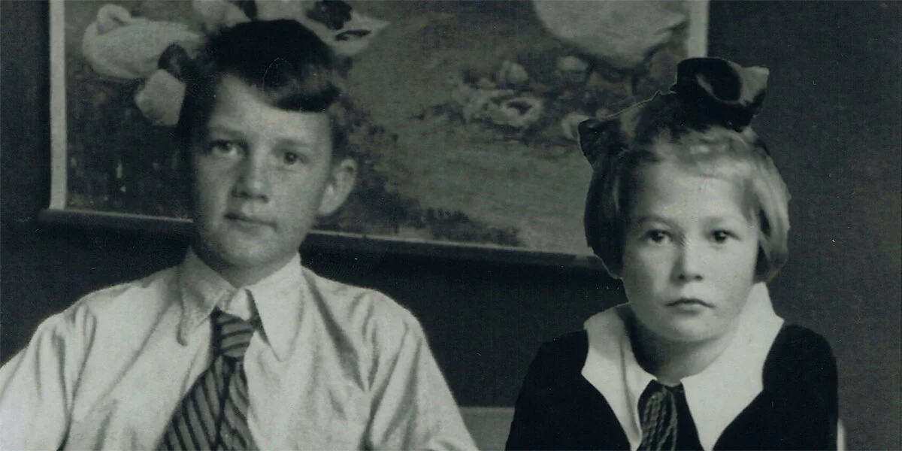

Dirk en Dina van de Bovenkamp als kinderen

### verhalen van ooggetuigen

Het lijkt het relatief rustig in Helenaveen tijdens de tweede wereldoorlog, zeker vergeleken met de bijna compleet verwoeste dorpen in de buurt, zoals Neerkant, Liessel en Meijel. Bij nader inzien ligt dat toch anders. De impact van de oorlog op de inwoners van Helenaveen was heel groot.

Hieronder vindt u de verhalen van de gewone mensen van Helenaveen in de vorm van hun persoonlijke herinneringen. De vertellers waren toen nog kinderen, daardoor zijn de verhalen soms niet historisch correct. Ze geven echter heel goed weer onder welke barre omstandigheden men toen geleefd heeft.

Het zijn verhalen over de bezetter, het onderduiken, de deportatie van de mannen naar Duitsland, maar ook van Joodse onderduikers, verraad en liquidatie. Veel is er niet verteld na de oorlog. Dat veelbewogen hoofdstuk van het boek van het leven was afgesloten. Men moest vooral verder: kijken naar de toekomst en niet naar het verleden.

Op deze website maken we het boek nog een keer open en kijken vol verbazing nog een keer terug. Opdat de verhalen niet verloren gaan en we blijven leren van de geschiedenis. Lees hieronder de persoonlijke verhalen van ooggetuigen en klik hier voor de locaties.

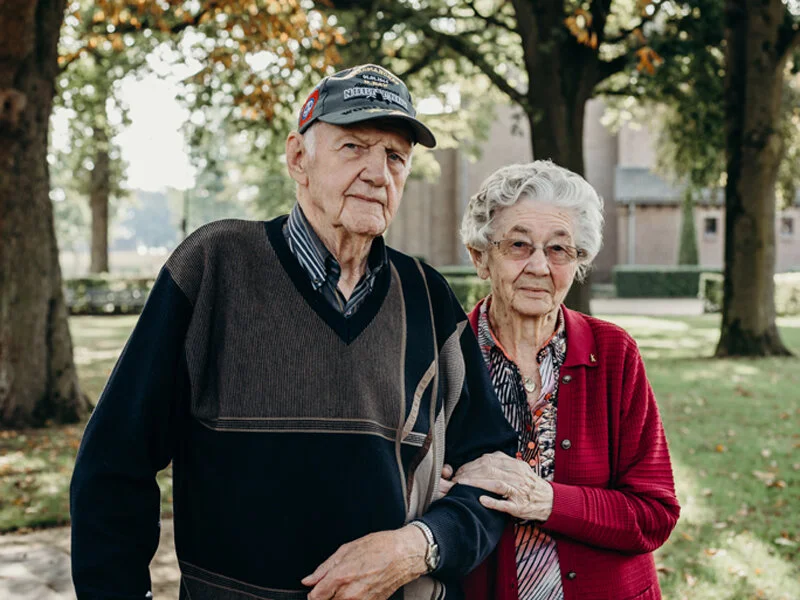

### DIRK EN DINA VAN DE BOVENKAMP

Dirk en Dina van de Bovenkamp trouwden in 1953. Ze maakten de oorlog als kind mee en hebben elk hun eigen oorlogsverhalen, maar ook gedeelde herinneringen. Dirk is geboren en getogen in de Peel, waar zijn opa en oma heen kwamen om tabak te telen in de proeftuinen van de Maatschappij. Dina arriveerde met haar familie in 1941, toen de oorlog al begonnen was. Haar vader was opzichter bij de Grontmij, die voor de ontginning van de hei boerderijen bouwde in het Mariaveen.

Klik hier voor het volledige verhaal en de video.

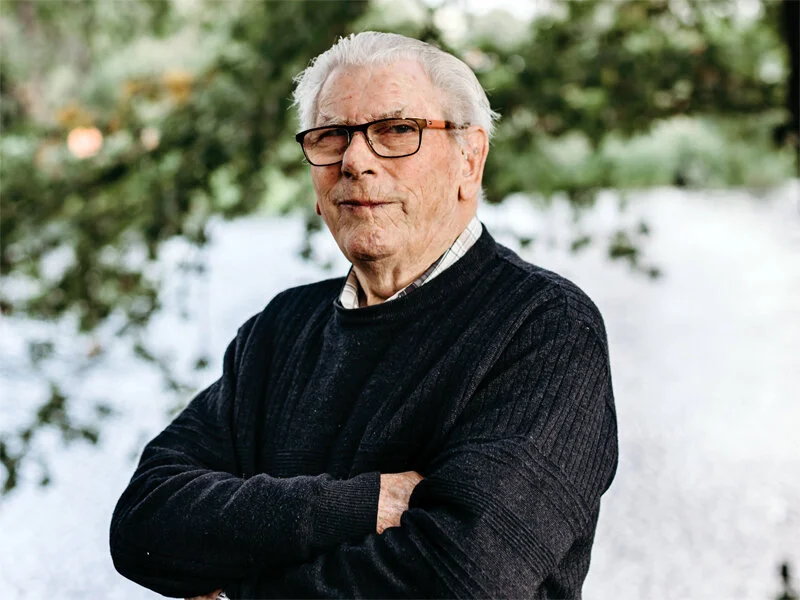

### Martien Rutten

Martiens ouders hadden een kleine tuinderij, die lag vlak vóór de Wilhelminahoeve. Zijn vader is daar gaan tuinen, nadat hij eerst werkzaam was als voerman en toger bij de Maatschappij Helenaveen. In de tuinderij teelden zij bonen, augurken en erwten. Bij hem thuis waren 4 kinderen: Piet (geboren in 1922), Bert (van 1925), Andries (van 1928) en Martien, geboren in 1932.

Klik hier voor het volledige verhaal en de video.

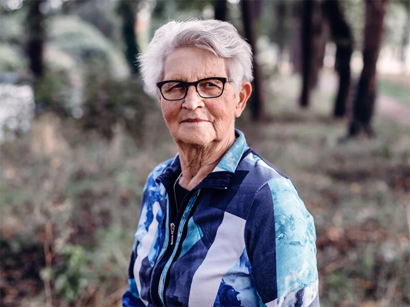

### Riki Bakker

75 jaar geleden moesten mensen in Helenaveen op stel en sprong evacueren op 28 september 1944. Bij Riki Bakker kwamen Duitse soldaten ’s avonds aanzeggen dat ze onmiddellijk moesten vertrekken.

Klik hier voor de video en het artikel in het ED.

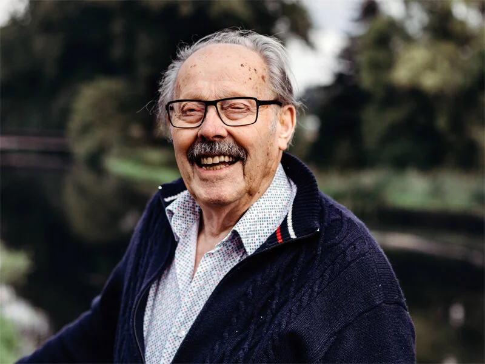

### Jan van Teeffelen

Er waren drie kinderen in het gezin Van Teeffelen. Jan is de oudste, zijn broer is twee jaar jonger, zijn zus is jong gestorven. Groot voordeel van het wonen in Helenaveen was dat de bevolking grotendeels zelfvoorzienend was. “Groenten, fruit, kaas en boter, noem maar op, dat was er allemaal. Als de een het niet had, had de ander het wel.”

Klik hier voor het volledig verhaal en de video.

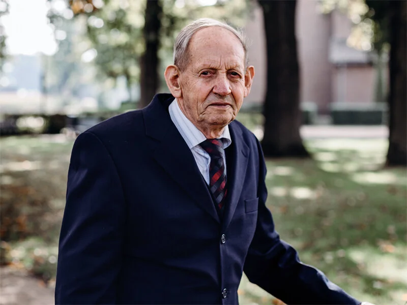

### Geert Schonewille

Geert Schonewille maakte de oorlog mee als kind: toen Helenaveen bevrijd werd was hij slechts tien jaar oud. Geert heeft toch bijzondere verhalen te vertellen: zijn ouderlijk huis bood onderdak aan een keur van gasten gedurende de oorlogsjaren.

Klik hier voor het volledige verhaal.

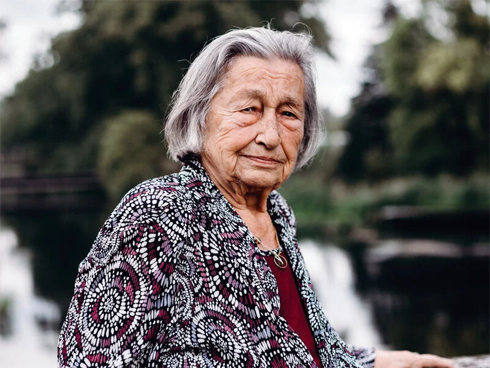

### RIEK VAN ESSEVELDT-SNIEDER

De ouders van Riek Van Esseveldt-Snieder waren kaasboeren en kwamen in 1936 in de Willem III Hoeve wonen en werken. Riek maakte de oorlog mee als kind in het deel van Helenaveen dat 'Boven' genoemd wordt.

Klik hier voor het volledige verhaal.

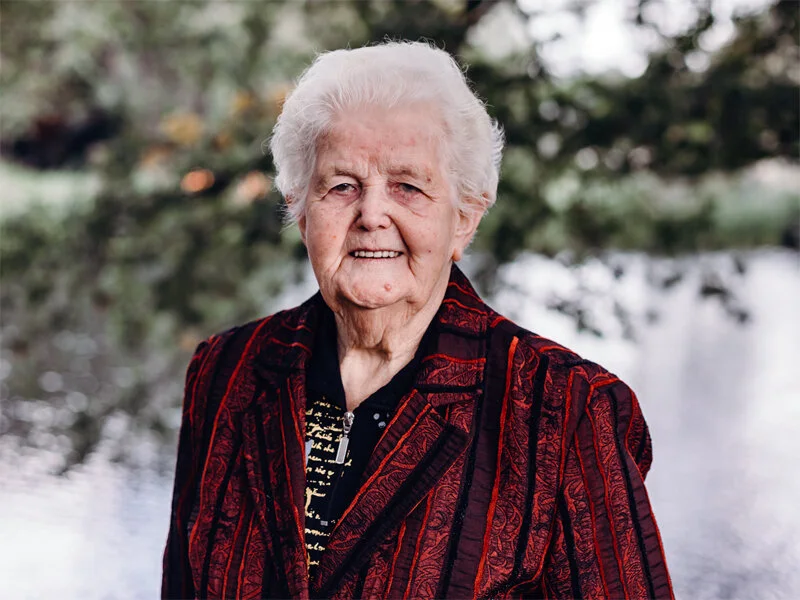

### Marietje van Horen-van der Werf

In het begin van de oorlog was Marietje 11 jaar. Nederlandse soldaten waren in het dorp gelegerd. Ze herinnert zich nog goed hoe het allemaal begon: “we zaten bij ons in de kamer voor de raam en toen zag je die (Nederlandse) soldaten zo allemaal Helenaveen inkomen.”

Klik hier voor het volledige verhaal en de video.

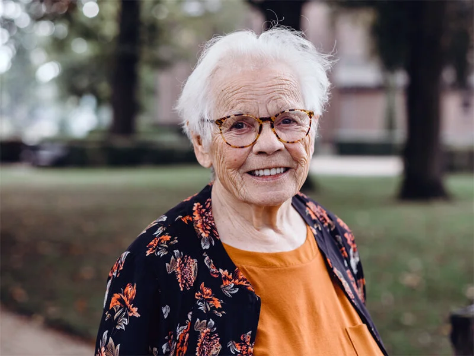

### Mien Crommentuijn

Mien is 89 jaar oud en was 10 toen de oorlog uitbrak. Ze heeft wel eens de vraag gekregen van een schoolkind: “hoe weet u dat allemaal? Ik kan nu al slecht iets onthouden. Bent u wel echt 88?” Het antwoord van Mien: “iets dat zoveel indruk op je maakt, blijft je wel bij.”

Klik hier voor het volledige verhaal en de video.

### JAN SONNEMANS

Van de Helenaveense mannen die op 8 oktober 1944 werden weggevoerd, is Jan Sonnemans een overlevende. Hij was net zestien jaar en stond met zijn zondagse kleren aan op het punt stond om naar de kerk te gaan, toen hij werd opgepakt. In de zomer van 1945 keerde hij wonderwel terug naar Helenaveen.

Klik hier voor het volledige verhaal.

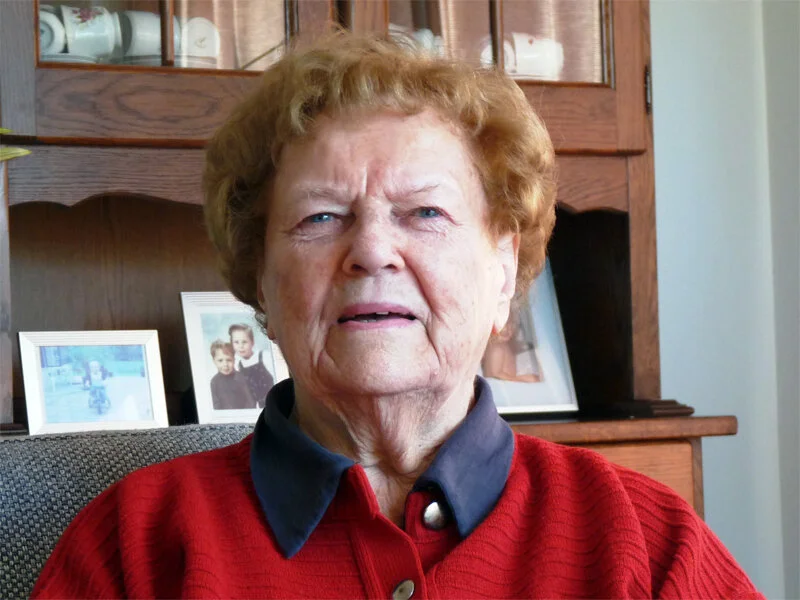

### Annie Van Esseveldt-Anker

Annie Van Esseveldt-Anker heeft als kind de oorlog meegemaakt in het gebied dat in Helenaveen 'Boven' genoemd wordt. De eerste jaren van de Tweede Wereldoorlog gingen grotendeels langs de familie heen. Er kwamen vliegtuigen over, nu en dan stortte er één neer en dat wat het dan.

Klik hier voor het volledige verhaal.

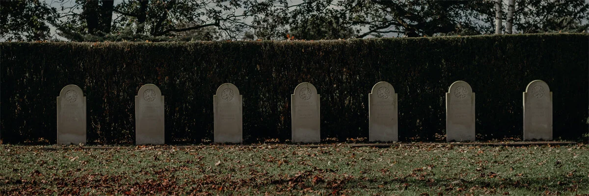

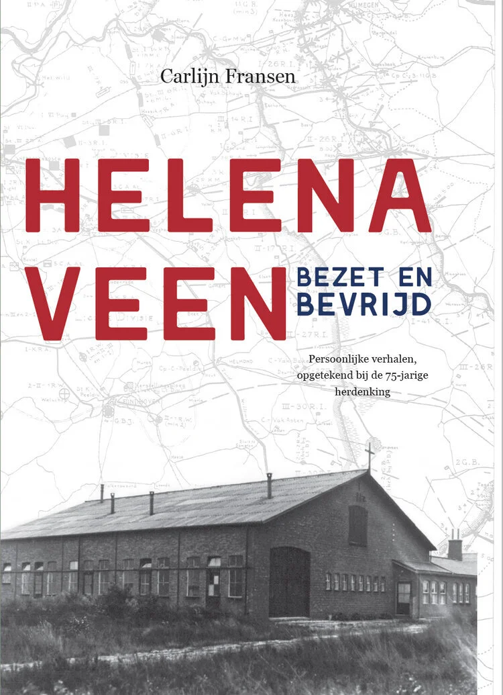

## Het boek

Persoonlijke verhalen, opgetekend bij de 75-jarige herdenking door Carlijn Fransen in samenwerking met de werkgroep Helenaveen Bezet en Bevrijd.

Het boek kost € 10,00. Het is te koop bij Hotel Eetcafé In d’Ouwe Peel, Cafetaria ’t Veen in Helenaveen en Museum Techniek met een Ziel in Neerkant.

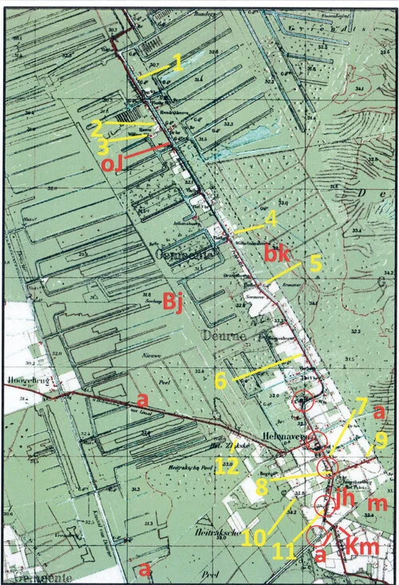

## locaties in de oorlog

Wilt u ook weten waar alles zich heeft afgespeeld? Klik op de kaart om uit te vergroten en lees hier wie waar heeft gewoond.
