# verslag-kapitein

> Bron: helenaveenvantoen.nl

### verslag van de gevechtshandelingen bij Helenaveen op 10 mei 1940Geschreven door Kapitein J. de Vries

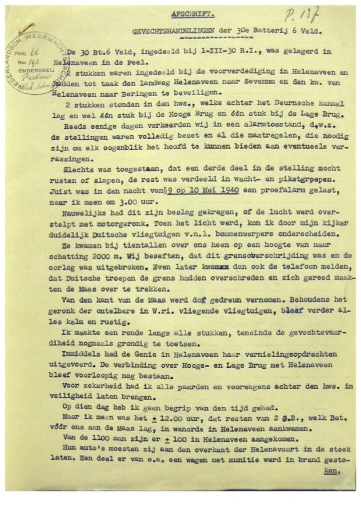

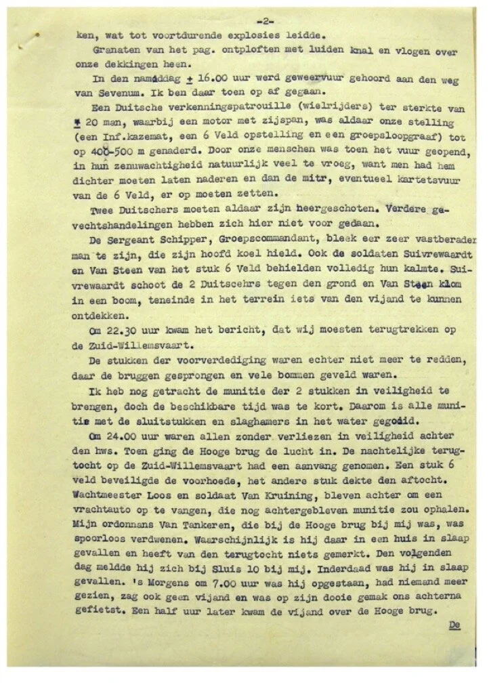

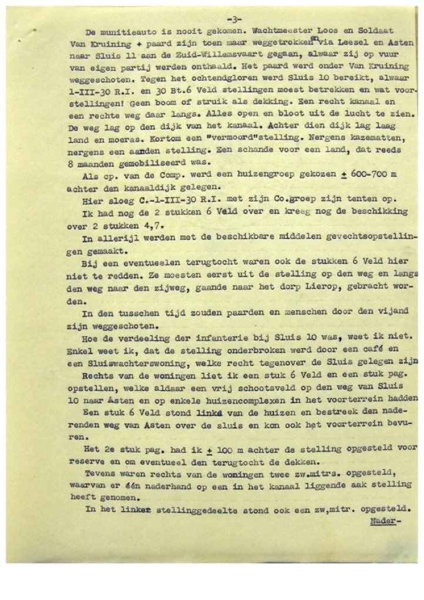

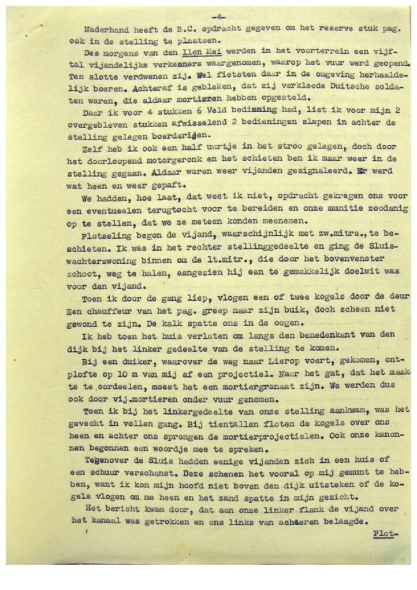

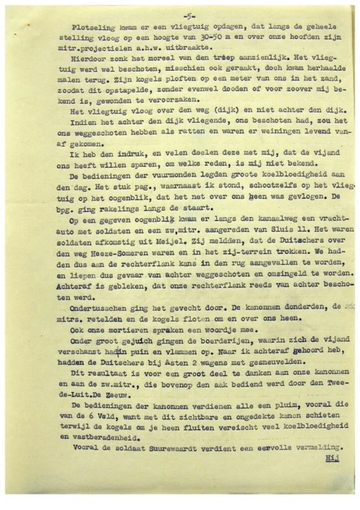

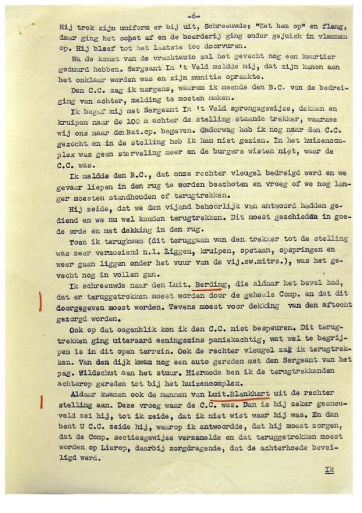

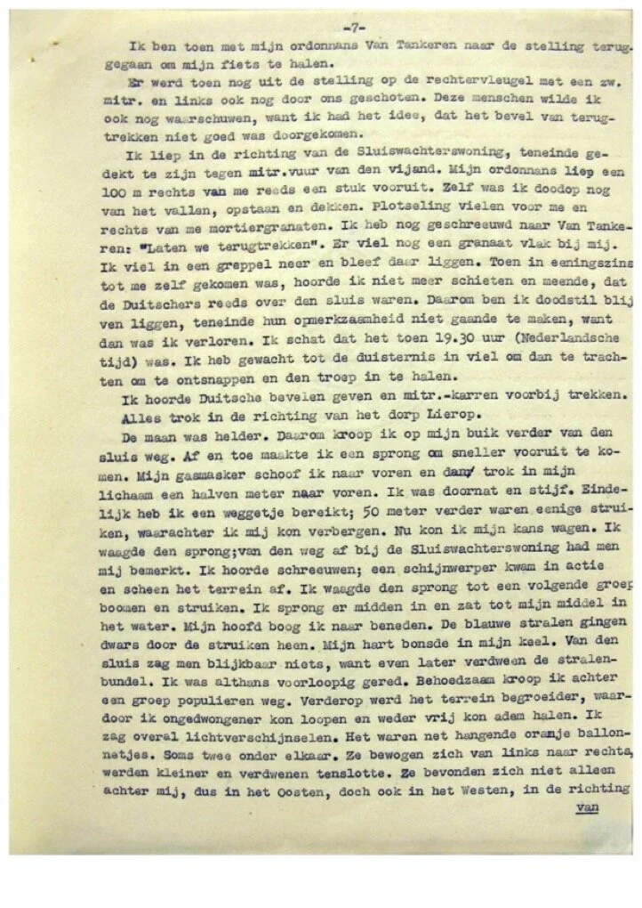

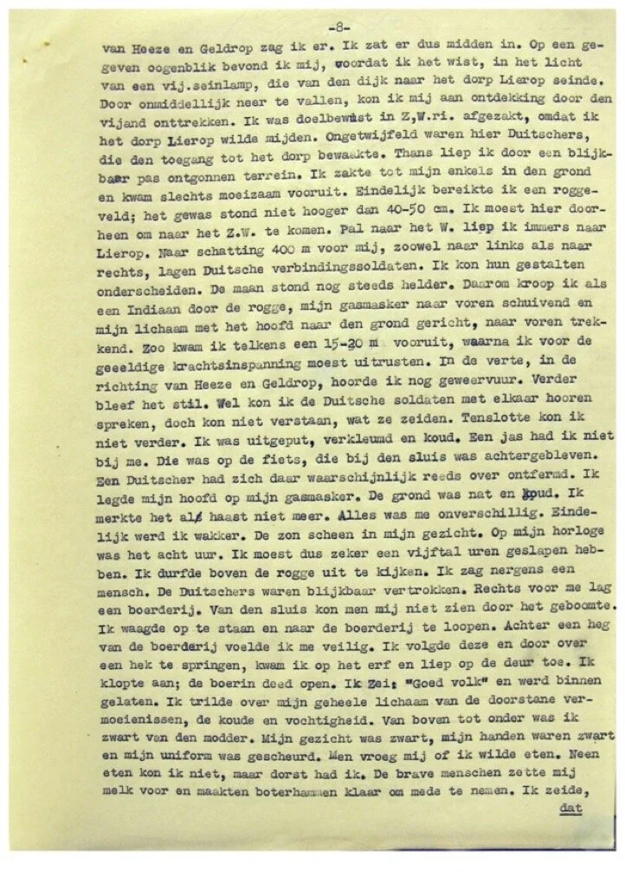

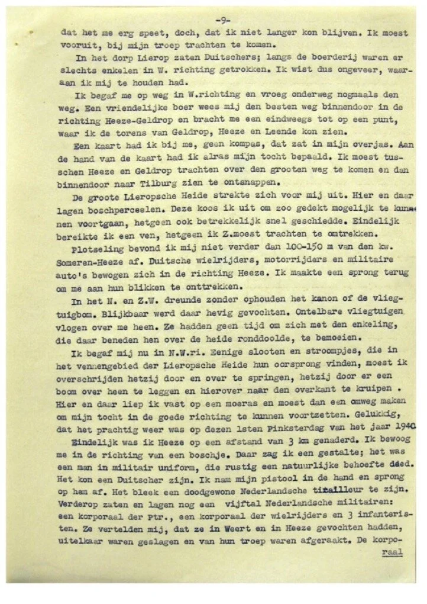

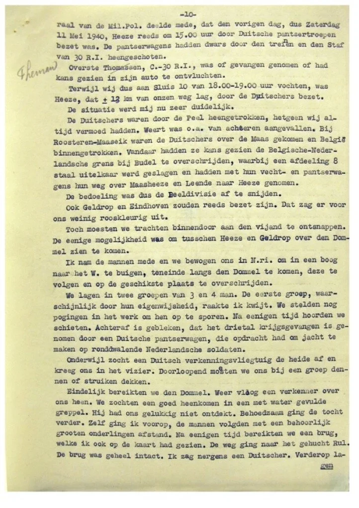

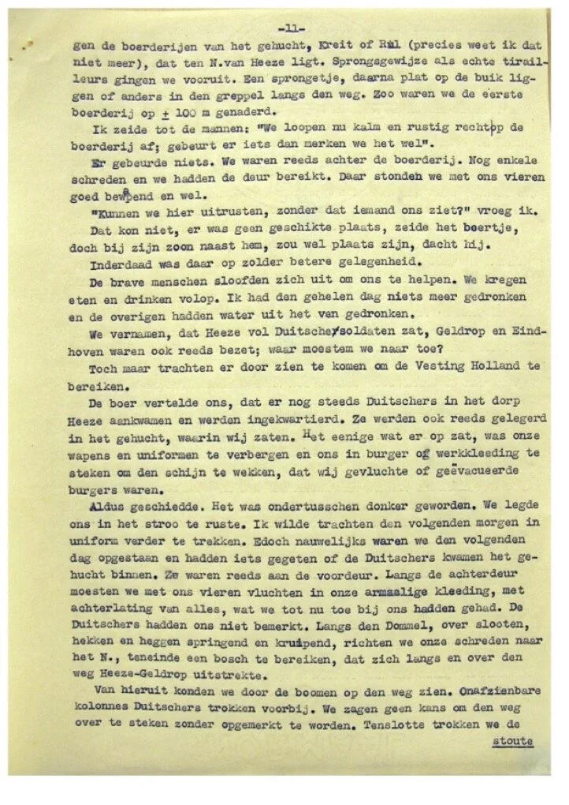

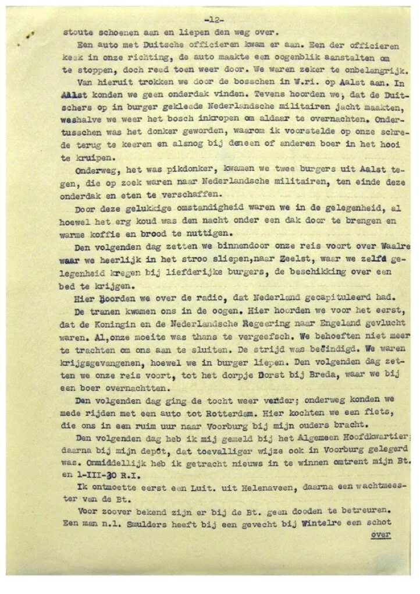

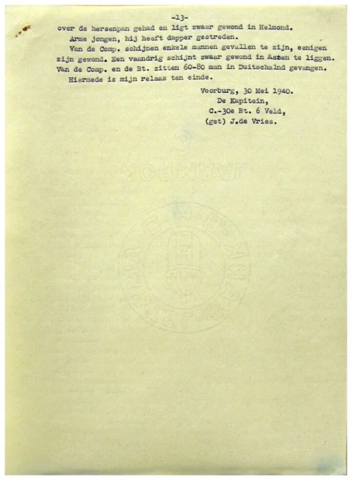

Hans v d Laarschot
