# wehrmachtshuisje

> Bron: helenaveenvantoen.nl

Het Wehrmachthuisje aan de Koolweg.

Tegen de bosrand aan de Koolweg werd in 1941 door de Duitsers een huisje gebouwd, een zogenaamd Wehrmachtshuisje. Het was bedoeld voor de soldaten die een zoeklicht (Flakscheinwerfer) met een luisterapparaat (Horchgerät) moesten bedienen.

Dergelijke huisjes zijn er in de omgeving veel gebouwd, allemaal om de bemanning van zoeklichten onder te brengen en allemaal hadden ze ongeveer hetzelfde ontwerp.

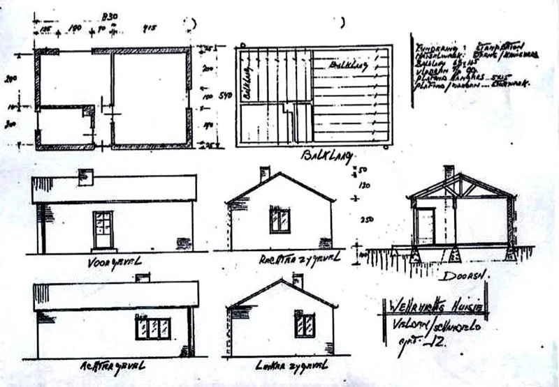

Ontwerp Wehrmachtshuisje

Links van de voordeur was een keuken met schouw, daarachter een kantoor met verbindingsapparatuur en rechts een grote ruimte als slaapplaats. De bemanning bestond uit ongeveer 10 speciaal voor dit doel opgeleide soldaten.

Engelse bommenwerpers onderscheppen

Het Wehrmachthuisje was niet verbonden met het Duitse leger (landmacht), maar met de Duitse luchtmacht, de "Luftwaffe". Die had als taak om zich te verdedigen tegen bombardementen door bommenwerpers die vanuit Engeland naar Duitsland vlogen. Nederland speelde een cruciale rol in deze verdediging, omdat het precies tussen de Engelse vliegvelden en Duitsland lag.

De Peel lag onder een belangrijke vliegroute naar het Ruhrgebied, een regio waar veel oorlogsindustrie geconcentreerd was. De luchtverdediging stond onder leiding van generaal Josef Kammhuber, die later ook generaal bij de NAVO werd. Het verdedigingssysteem dat naar hem werd vernoemd, de Kammhuberlinie, strekte zich uit van Denemarken tot voorbij Parijs.

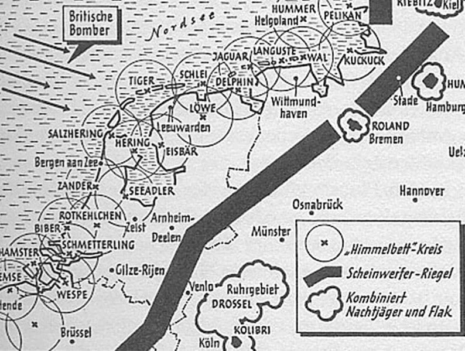

Dit uitgebreide systeem omvatte zoeklichten, luchtafweerkanonnen (FLAK), nachtjagers, vliegvelden (zoals dat in Venlo), en een steeds groter wordend netwerk van radarstations. De Duitsers noemden deze verdedigingsstrategie het "Himmelbett-Verfahren" (Hemelbed-methode), omdat het doel was een beschermend scherm over Duitsland te creëren.

Het bijgevoegde kaartje laat zien hoe het Duitse verdedigingssysteem werkte. Britse bommenwerpers werden al aan de kust door radar gesignaleerd. Vervolgens werden ze opgewacht in een gordel van zoeklichten, waar ze onder vuur genomen werden door nachtjagers. Bommenwerpers die aan deze lichtbundels wisten te ontsnappen, werden bij grote steden en het Ruhrgebied opnieuw opgewacht door nachtjagers en luchtafweergeschut (FLAK, Flugzeug Abwehr Kanone).

De organisatie

De gordel met zoeklichten was georganiseerd in vierkante blokken, elk toegewezen aan een Flakregiment. Helenaveen viel onder regiment 1. Elk regiment was verdeeld in drie afdelingen, en elke afdeling bestond uit drie batterijen van elk negen zoeklichten.

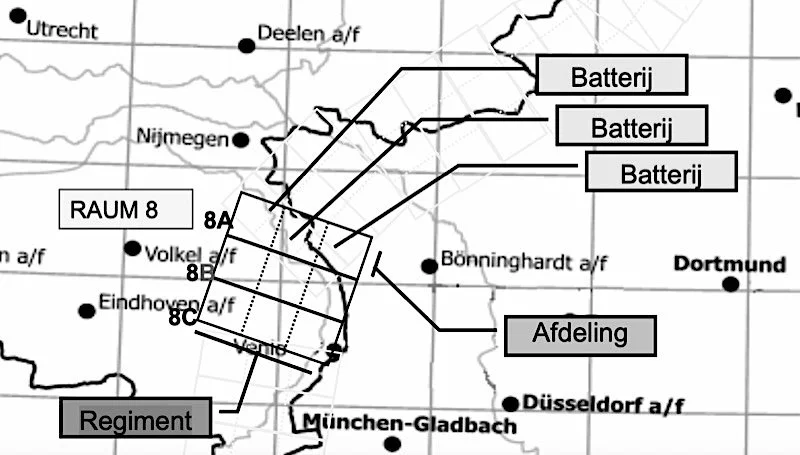

Elke zoeklichtbatterij was uitgerust met negen 150 cm zoeklichten.Binnen een batterij waren de zoeklichten georganiseerd in drie groepjes van drie. Eén zoeklicht fungeerde als hoofdzoeklicht en onderhield contact met de hoofdcommandopost, terwijl de andere twee zoeklichten (hulpzoeklichten) door het hoofdzoeklicht werden aangestuurd. Het zoeklicht aan de Koolweg was een hoofdzoeklicht. De bijbehorende hulpzoeklichten stonden in Grashoek op de Vliegert en in Liessel op het Loon. De hoofdcommandopost van de batterij bevond zich in Meijel, in het Startebos.

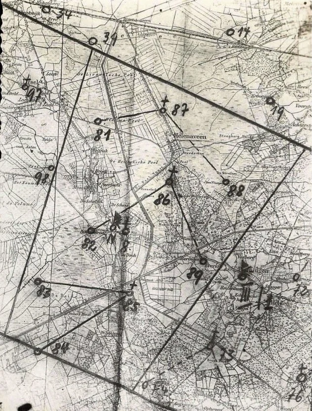

Het kaartje hierboven geeft een overzicht van de negen zoeklichten van de batterij waartoe Helenaveen behoorde. De lichten met een kruisje markeren de hoofdzoeklichten. Deze zeldzame kaart werd na de oorlog teruggevonden in de portefeuille van een gesneuvelde militair. (Mededeling Hans van de Laarschot.)

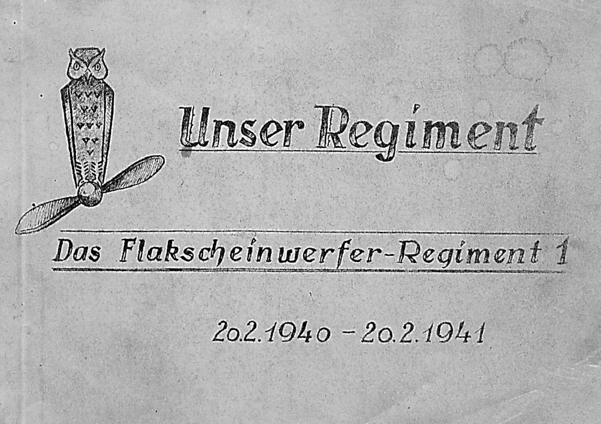

Dagboek van Regiment 1

De ingang van het hoofdkwartier in Meijel (Eulenhorst)

Hoe werkte de luchtverdediging met zoeklichten?

Wanneer Engelse bommenwerpers de Nederlandse kust naderden, werden ze gesignaleerd door de radarstations van de Himmelbett-gordel. Na deze detectie werden nachtjagers ingezet, in dit geval vanaf het vliegveld van Venlo.

De nachtjagers cirkelden als roofvogels boven een lichtbaken op de grond, dat diende als richtpunt voor de verdediging. De zoeklichten speelden hierbij een cruciale rol door de bommenwerpers in hun lichtbundels te vangen, zodat ze zichtbaar werden voor de nachtjagers.

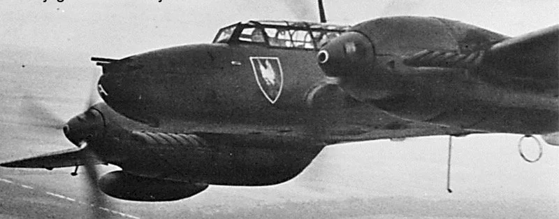

Cirkelende nachtjager

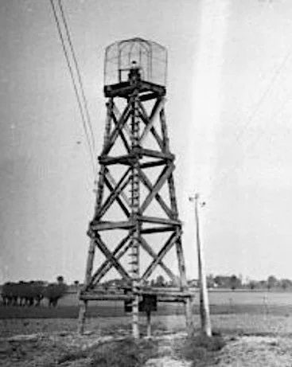

Lichtbaken

Vliegtuigen opsporen in het donker.

Wanneer vijandelijke bommenwerpers tot op ongeveer 15 kilometer van de zoeklichten waren genaderd, werden ze opgespoord met een zogenaamd Horchgerät (officiële naam: Ringtrichterrichtungshörer).

Dit apparaat bestond uit vier aluminium hoorns die via rubberen slangetjes verbonden waren met de oordoppen van de bedienaars. Deze draaiden het apparaat met een handwiel net zo lang totdat het geluid van de naderende bommenwerpers in beide oren even sterk was. Eén operator draaide het apparaat horizontaal, terwijl een andere de verticale beweging bediende. Op deze manier kon de richting van het vliegtuig zeer nauwkeurig worden bepaald, tot ongeveer een halve graad nauwkeurig – vergelijkbaar met de diameter van de maan aan de hemel.

Horchgerät

Een belangrijke beperking was echter de snelheid van het geluid. Tegen de tijd dat het motorgeluid de oren van de operator bereikte, was het vliegtuig alweer kilometers verder gevlogen. Om dit probleem te ondervangen, beschikte het Horchgerät over een ingenieuze mechanische rekenmachine. Deze voorspelde de actuele positie van het vliegtuig op basis van de gemeten richting en de geschatte snelheid van het vliegtuig.

De rekenmachine werd bediend door een derde bemanningslid, die de snelheid van het vliegtuig instelde en met een handwiel de beweging van de trechters compenseerde. De berekende positie van het vliegtuig werd vervolgens elektrisch doorgegeven aan het zoeklicht, dat hiermee in de juiste richting werd gedraaid.

Wanneer bommenwerpers in de verte te horen zijn, bepalen de twee luisteraars dus de richting waaruit het geluid komt. Tegelijkertijd proberen ze aan het motorgeluid het type vliegtuig te herkennen, wat een aanwijzing geeft voor de kruissnelheid. Deze snelheid wordt vervolgens door derde bedienaar ingesteld op de rekenmachine.

Naarmate het Horchgerät draait, begint een schijf op de rekenmachine mee te bewegen. De operator draait aan een handwiel om deze schijf stil te zetten. Vanaf dat moment volgt de rekenmachine automatisch de vermoedelijke koers van het vliegtuig. De operator controleert of de berekende koers constant blijft en stelt deze, indien nodig, bij.

De rekenmachine bepaalt nu nauwkeurig de richting naar de werkelijke locatie van de vliegtuigen en stuurt de gecorrigeerde hoogte- en zijhoeken via een elektrische verbinding door naar het zoeklicht. Dit stelt het zoeklicht in staat om direct op de juiste positie gericht te worden, klaar om de bommenwerper in het licht te vangen.

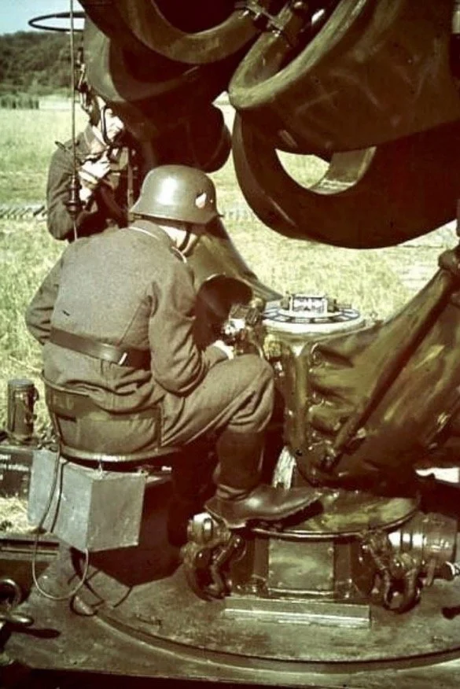

Originele kleurenfoto uit 1939 et de rekenmachine

Het zoeklicht en de stroomvoorziening

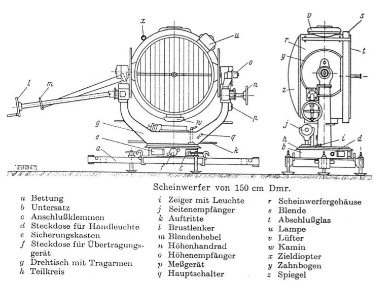

Het zoeklicht beschikte over een parabolische glazen reflector met een diameter van 150 centimeter en een brandpuntsafstand van 65 centimeter. De lichtopbrengst bedroeg maar liefst 990 miljoen candela. Het effectieve bereik was tot 8 kilometer, terwijl de lichtbundel een hoogte van maximaal 5.000 meter kon bereiken.Het zoeklicht kon een volledige 360 graden draaien en had een elevatiebereik van -12 graden tot 192 graden. De betrouwbaarheid in het veld was zeer goed.

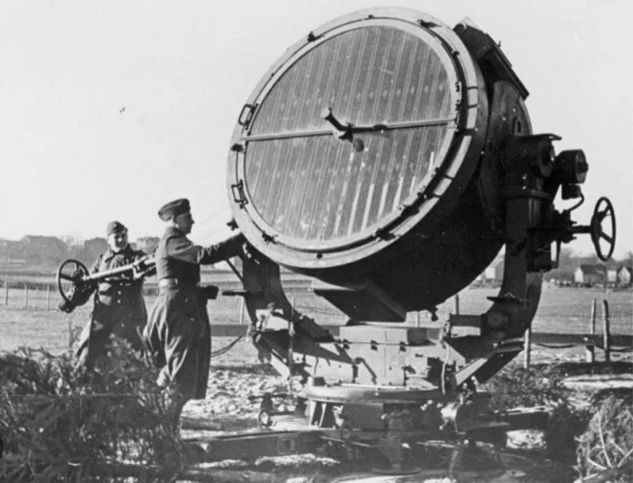

150cm Flakscheinwerfer

De lamp van het zoeklicht was een booglamp, die werkte met twee koolstaven waartussen een elektrische vlamboog ontstond – vergelijkbaar met een continue bliksemflits. De spanning tussen de koolstaven was 110 volt gelijkstroom, met een stroomsterkte van 200 ampère. De koolstaven brandden langzaam op en werden automatisch op de juiste afstand van elkaar gehouden. Een staaf van een halve meter kon ongeveer een uur branden voordat deze vervangen moest worden.

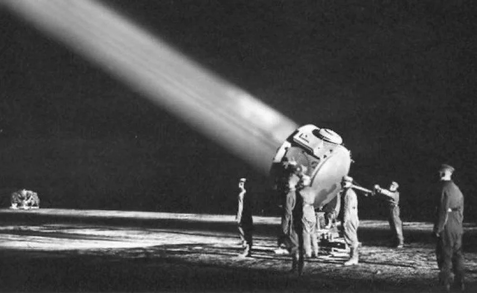

Zoeklicht met op de achtergrond het Horchgerät

De stroom werd geleverd door een generator, aangedreven door een 8-cilinder Mercedesmotor die op benzine liep. De motor leverde een maximaal vermogen van 54 pk bij 1500 toeren per minuut, terwijl de generator een maximaal vermogen van 24.000 watt kon produceren.

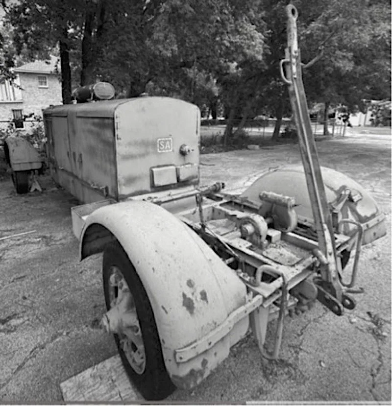

De generator hier op een speciale aanhanger waarmee ook het zoeklicht getransporteerd kon worden.

Het zoeklicht was via een 200 meter lange kabel verbonden met de generator. Deze afstand was nodig om te voorkomen dat het geluid van de generator het Horchgerät zou storen, dat dichtbij het zoeklicht opgesteld stond.

Aanvallen van de jager

Het zoeklicht werd pas zo laat mogelijk ingeschakeld, omdat het inschakelen de positie van de stelling zou kunnen verraden. Dit verhoogde het risico op een aanval op de stelling zelf of gaf de bommenwerper de kans om het licht te ontwijken.

Wanneer het zoeklicht werd ingeschakeld en een vliegtuig in de lichtbundel gevangen werd, ging de rondcirkelende jager direct tot de aanval over. Het element van verrassing en de nauwkeurigheid van de lichtbundel waren hierbij cruciaal voor een succesvolle onderschepping.

Dunkelsuchgerät

Naast het Horchgerät werd ook gebruik gemaakt van een Dunkelsuchgerät, een zogenaamde donker-zoekkijker. Dit was een lichtsterke verrekijker, uitgerust met een horizontale en verticale schaalverdeling en een elektrische uitlezing.

Dunkelsuchgerät

Met de Dunkelsuchgerät kon de exacte positie van een zichtbaar vliegtuig worden vastgesteld. Deze metingen werden vervolgens direct doorgegeven aan de commandopost, waardoor de luchtverdediging nog nauwkeuriger kon opereren.

Het einde van de zoeklichten

De Verlichte Nachtjacht (Helle Nagtjagd) had als nadeel dat de belichtingstijd van een vliegtuig relatief kort was. Britse bemanningen leerden al snel om de Kammhuberlinie in een duikvlucht te passeren, waardoor de tijd voor een aanval door jachtvliegtuigen beperkt was.

Met de komst van nieuwere en betere radarsystemen werd een reorganisatie van de verdedigingsgordel noodzakelijk. De rol van zoeklichten werd steeds minder belangrijk, vooral ook omdat de jagers voorzien werden van radar. In juni 1942 werden de schijnwerperregimenten grotendeels teruggetrokken naar Duitsland om de grotere steden te verdedigen, omdat de bevolking daar wilde zien dat er bescherming was. Alleen in Someren bleef nog een schooleenheid actief, en dat slechts anderhalf jaar.Daarna sprak men van de donkere nachtjacht (Dunkle Nachtjagd)

Het Wehrmachtshuisje na de oorlog

Na de bevrijding kwam het Wehrmachtshuisje automatisch in bezit van de Maatschappij Helenaveen, op wiens grond het stond.

Na de oorlog werd het huisje gebruikt als woning. Eerst door de familie Jan Jonker en daarna vele jaren door Martien Rutten en zijn gezin. Martien verbouwde het huisje eigenhandig, waarbij hij het verhoogde en er een tweede verdieping aan toevoegde.

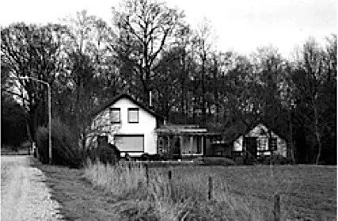

Het door Martien Rutten verbouwde huisje

Martien Rutten, die tijdens de oorlog een jongen van ongeveer tien jaar was, woonde destijds naast de Wilhelminahoeve (de plek waar nu het transformatorhuisje staat). Hij herinnert zich nog hoe hij samen met zijn kameraden in de schemering de Duitse bemanning uitdaagde door te roepen "pang pang." De Duitsers speelden mee en zetten hen onverwacht vol in het licht van de schijnwerper. Het thuisfront was minder geamuseerd: volgens Martien kregen ze nooit eerder zo’n uitbrander als toen.(Mededeling Martien Rutten)

Toen Martien en Mien Rutten naar Panningen verhuisden, werd het huisje door de Maatschappij verkocht. Het gebouwtje is sindsdien door diverse verbouwingen bijna onherkenbaar geworden, maar het staat er nog steeds. Tegenwoordig wordt het bewoond door Oscar en Elise Bakker.

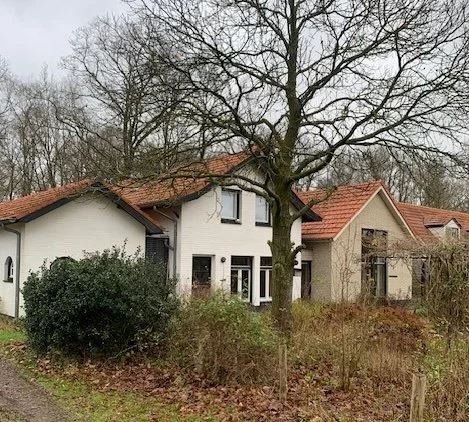

Huidige toestand (2024)

Andere sporen die overbleven

Hoewel veel van de oorspronkelijke structuren verdwenen zijn, zijn er nog enkele sporen te vinden van de Duitse activiteiten rond het zoeklicht. Op de Algemene Hoogtekaart Nederland (AHN) is de plaats van het zoeklicht nog te herkennen als een ronde aarden wal in het bos achter Koolweg 40.

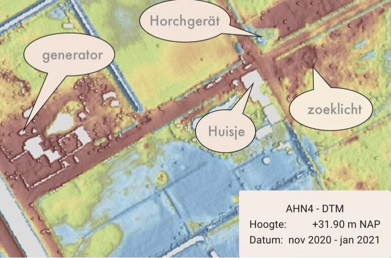

De generator stond destijds op 190 meter afstand, naast Koolweg 42, op een betonnen plaat. Na de oorlog bouwde de Maatschappij op de plaat een stookhuisje, dat er nog steeds staat.

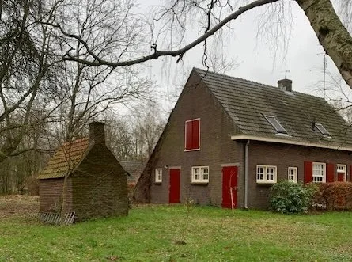

Stookhuisje op de plaat van de generator (koolweg 42)

De exacte locatie van het Horchgerät is nog zichtbaar als een kuil, net over de grens met Limburg.

Jan van Woezik10 december 2024

Bronnen:presentatie (ppt) van wijlen Ruud Wildekamp over de Nachtjagd.DeurnewikiMeijel 80 jaar bevrijd Medelo nr 16https://heemkundekringblariacum.nl/p/beeldbankhttps://www.festungswerke-cuxhaven.de/flakscheinwerfer https://www.milweb.net/webvert/a2769/91752 https://www.cdvandt.org/Horch_Ortung.pdf (Rechner Horchgerät)Https://www.festungswerke-cuxhaven.de/horchgeraetehttps://www.10x80.info (Nachtkijker)
