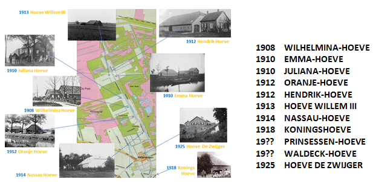

# wilhelminahoeve

> Bron: helenaveenvantoen.nl

### De KONINGSHOEVEN van HELENAVEEN

De 11 hofsteden van directeur Adrianus Bos (1906-1931)

In de eerste halve eeuw (vanaf 1854) had Helenaveen – zeg maar de Maatschappij Helenaveen, want ze voelde zich koning met een eigen rijk in Deurne – een forse groei en verandering ondergaan:- van onbewoonbaar moeras naar een nieuw dorp van Deurne met rond de 1.000 inwoners;- van strooien keet naar stenen woning;- van veengebied naar land- en tuinbouwgebied.En dat alles onder bescherming van het Koninklijk Huis.

Maar de kroon op het werk ontbrak nog: grote boerenbedrijven met echte hofsteden. De bedrijven moesten veel groter zijn dan de doorsnee boerenbedrijven van 5 hectare; de gebouwen groter dan de keuterboerderijtjes en qua uiterlijk een andere uitstraling dan de doorsnee langgevelboerderij in het Brabantse land. In 1906 stellen de aandeelhouders Adrianus Bos aan als directeur. Onder zijn leiding wordt het Koningshoevenplan met vallen en opstaan werkelijkheid.

Vanaf 1908 verrezen in de Brabantse Peel langs de Helenavaart en in het dorp op initiatief van de Mij Helenaveen 11 grote boerderijen, meestal van het type ‘kop-romp’, die mede beeldbepalend voor Helenaveen zijn.

Het is een misvatting dat de koningshoeven gebouwd zijn door het Fonds Koning Willem III. Het fonds heeft wel bijgedragen in de kosten van enkele hoeven. Vanwege de band via dit fonds met het koningshuis hebben de boerderijen de naam van leden van het koningshuis gekregen. Het zijn:

[HetHelenaveenvanToen|HvdL|20210611]

Hieronder vindt U informatie over:

De Wilhelmina hoeveDe Emma hoeve

De Julianahoeve
